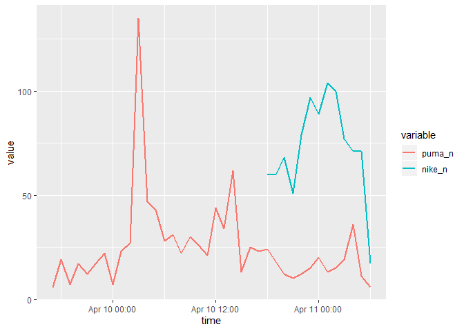
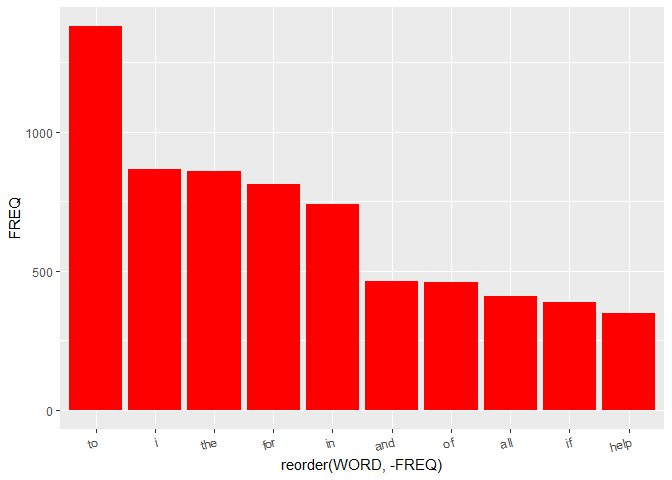
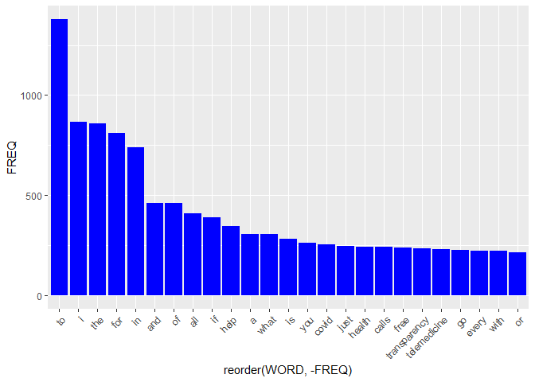
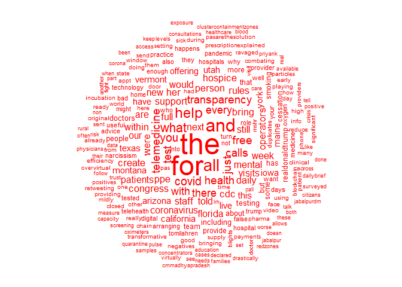
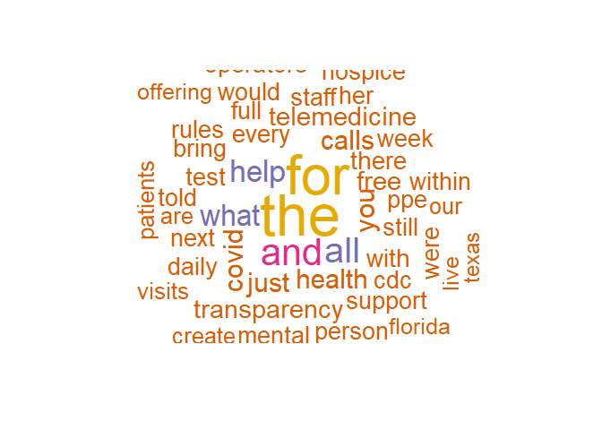
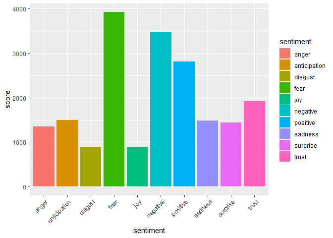
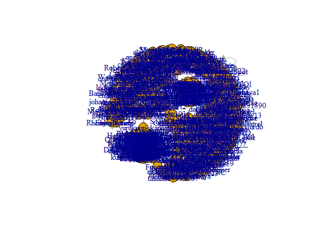
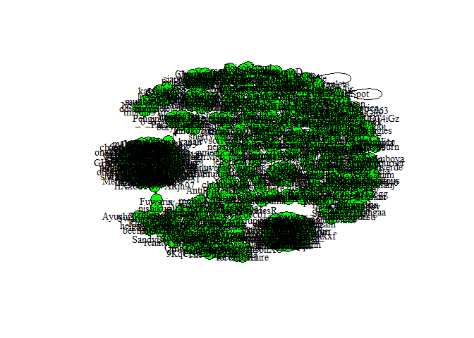

Social Media Data Analysis
================
Mburu
4/5/2020

## Power of twitter data

The volume and velocity of tweets posted on twitter every second is an
indicator of the power of twitter data. The enormous amount of
information available, from the tweet text and its metadata, gives great
scope for analyzing extracted tweets and deriving insights. Let’s
extract a 1% random sample of live tweets using stream\_tweets() for a
120 seconds window and save it in a data frame. The dimensions of the
data frame will give you insights about the number of live tweets
extracted and the number of columns that contain the actual tweeted text
and metadata on the tweets.

``` r
library(rtweet)
library(tidyverse)
library(data.table)
library(knitr)

api_key <- Sys.getenv("twit_key")
api_secret_key <- Sys.getenv("twit_secret")

token <- create_token(
    app = "Moses Mburu",
    consumer_key = api_key,
    consumer_secret = api_secret_key, set_renv = FALSE)

# Extract live tweets for 120 seconds window

tweets120s <- stream_tweets("", timeout = 5)


dim(tweets120s)
```

    ## [1] 176  90

## Search and extract tweets

Many functions are available in R to extract twitter data for analysis.
search\_tweets() is a powerful function from rtweet which is used to
extract tweets based on a search query. The function returns a maximum
of 18,000 tweets for each request posted. In this exercise, you will use
search\_tweets() to extract tweets on the Emmy Awards which are American
awards that recognize excellence in the television industry, by looking
for tweets containing the Emmy Awards hashtag. The library rtweet has
been pre-loaded for this exercise.

``` r
# Extract tweets on "#Emmyawards" and include retweets
twts_emmy <- search_tweets("#Emmyawards", 
                           n = 2000, 
                           include_rts = T, 
                           lang = "en")


# View output for the first 5 columns and 10 rows
head(twts_emmy[,1:5], 10) %>% kable
```

| user\_id                 | status\_id               | created\_at             | screen\_name    | text                                                                                                                                                                                                                                                                                                                                  |
| :----------------------- | :----------------------- | :---------------------- | :-------------- | :------------------------------------------------------------------------------------------------------------------------------------------------------------------------------------------------------------------------------------------------------------------------------------------------------------------------------------ |
| 22858605                 | 1248474717167607808      | 2020-04-10 04:55:42     | KBTokyo         | If this doesn’t happen it will be the biggest injustice ever\!\!They saved the world \#oscars \#grammys \#tonyawards \#emmyawards \#baftaawards \#espnawards \#celebrity \#coronavid19 \#injustice \#doctors \#nurses \#hospital \#workers \#humanity \#dotherightthing \#people \#themedia \#nbcnews \#cnn <https://t.co/Fn3FCrps1W> |
| 934259066                | 1248474259728379905      | 2020-04-10 04:53:53     | KarlBurrow      | If this doesn’t happen it will be the biggest injustice ever\!\! They saved the world \#oscars \#grammys \#tonyawards \#emmyawards \#baftaawards \#espnawards \#celebrity \#coronavid19 \#coronavid19 \#injustice \#doctors \#nurses \#hospital \#workers \#humanity \#dotherightthing \#people \#survivor <https://t.co/cUat2Y4AFS>  |
| 381780745                | 1248418664719601666      | 2020-04-10 01:12:58     | jwinkler724     | @HMonHBO “The Soup” episode needs \#emmyawards.                                                                                                                                                                                                                                                                                       |
| 2598031183               | 1248235557744005120      | 2020-04-09 13:05:22     | sutto15         | Let’s appreciate the rare talent of @SamHeughan in all the episodes \#OutlanderS5 so far and this one \#TheBalladofRogerMac is really the highlight\!                                                                                                                                                                                 |
| \#Outlander \#emmyawards |                          |                         |                 |                                                                                                                                                                                                                                                                                                                                       |
| \#ActingAtItsFinest      |                          |                         |                 |                                                                                                                                                                                                                                                                                                                                       |
| \#EmmyForSam             |                          |                         |                 |                                                                                                                                                                                                                                                                                                                                       |
| @ChrisFParnell           |                          |                         |                 |                                                                                                                                                                                                                                                                                                                                       |
| @Writer\_DG              |                          |                         |                 |                                                                                                                                                                                                                                                                                                                                       |
| @SPTV                    |                          |                         |                 |                                                                                                                                                                                                                                                                                                                                       |
| @Outlander\_STARZ        |                          |                         |                 |                                                                                                                                                                                                                                                                                                                                       |
| @TallShipProds <https:/> | /t.co/MMjsHp2UH3         |                         |                 |                                                                                                                                                                                                                                                                                                                                       |
| 1193964466314067968      | 1247655516152762372      | 2020-04-07 22:40:30     | GabrielFelix000 | \#JuliaGarner Julia Garner attends the 71st Emmy Awards at Microsoft Theater on September 22, 2019 in Los Angeles, California. \#Emmys \#Emmy2019 \#EmmyAwards \#EmmyTNT \#EmmysRedCarpet <https://t.co/hwB0bW0nBW>                                                                                                                   |
| 82459479                 | 1247173515549110274      | 2020-04-06 14:45:12     | VillageMemorial | Remembering \#actor \#mickeyrooney \#today who died \#April6 2014. 91 yrs in \#showbiz paired w                                                                                                                                                                                                                                       |
| \#legend \#judygarland o | n \#films under \#mgmstu | dios & made \#movie     | s w/ \#actors   |                                                                                                                                                                                                                                                                                                                                       |
| \#spencertracy, \#actres | ses \#elizabethtaylor,   | \#audreyhepburn in over | 300 films & \#  | silentfilms                                                                                                                                                                                                                                                                                                                           |
| \#hollywood \#emmyawards | <https://t.co/X01i19SL>  | Nk                      |                 |                                                                                                                                                                                                                                                                                                                                       |
| 1145554343409725440      | 1247061879123513344      | 2020-04-06 07:21:35     | brooke1mc       | when you find that the emmy’s have rules so dacre can’t be nominated until next year because of when st3 was released \#EmmyAwards \#DacreMontgomery <https://t.co/RaUtBNy4q8>                                                                                                                                                        |
| 797298875291799552       | 1247053489051705346      | 2020-04-06 06:48:15     | omahashiela     | And the hits just keep on coming. By this time next year the \#EmmyAwards (providing they happen at all…) will be beat out in the ratings by the re-boot of \#HowdyDoody\!                                                                                                                                                            |
| \*Starring: \#DanReed    |                          |                         |                 |                                                                                                                                                                                                                                                                                                                                       |

\#NotSorry 😂

Thanks to @MJJJusticePrjct for the graphic\! <https://t.co/cGyHHDjn0n>
<https://t.co/ptv4c1ZKeE>  
1058094860 1246631695593410562 2020-04-05 02:52:12 1fairmaiden How much
money goes to \#academyawards or \#emmyawards couldn’t that money go to
\#coronavirus and what do they pay for \#Security because \#nra  
1245080231431544832 1246483220058836996 2020-04-04 17:02:12 1978Panther
Actress Margaret Qualley attended the 71st \#EmmyAwards wearing a black
dress from the Fall-Winter 2019/20 \#CHANELHauteCouture collection with
\#CHANELMakeup and \#CHANELFineJewelry. <https://t.co/mBMJ3Lh6si>

## Search and extract timelines

Similar to search\_tweets(), get\_timeline() is another function in the
rtweet library that can be used to extract tweets. The get\_timeline()
function is different from search\_tweets(). It extracts tweets posted
by a given user to their timeline instead of searching based on a query.
The get\_timeline() function can extract upto 3200 tweets at a time. In
this exercise, you will extract tweets posted by Cristiano Ronaldo, a
very popular soccer player both on the field and on social media who has
the @Cristiano twitter handle. The library rtweet has been pre-loaded
for this exercise.

``` r
get_cris <- get_timeline("@Cristiano", n = 3200)

# View output for the first 5 columns and 10 rows
head(get_cris[,1:5], 10) %>% kable()
```

| user\_id       | status\_id              | created\_at              | screen\_name   | text                                                                                                                                                                                                                                                                      |
| :------------- | :---------------------- | :----------------------- | :------------- | :------------------------------------------------------------------------------------------------------------------------------------------------------------------------------------------------------------------------------------------------------------------------ |
| 155659213      | 1246418009758941185     | 2020-04-04 12:43:05      | Cristiano      | Stay home and keep stylish 💇🏽‍♂️👩‍❤️‍💋‍👨 \#stayhomestaysafe <https://t.co/SkPiUwzCxn>                                                                                                                                                                                     |
| 155659213      | 1245310749045653504     | 2020-04-01 11:23:13      | Cristiano      | Breathe in, breathe out.🧘‍♂️ Stay active🏃🏻‍♂️ \#stayhomesavelives <https://t.co/ElschZvXdQ>                                                                                                                                                                               |
| 155659213      | 1244611003863580672     | 2020-03-30 13:02:41      | Cristiano      | In this difficult moment for the whole world, let’s be thankful for the things that matter - our health, our family, our loved ones. Stay home and let’s help all the health workers out there fighting to save lives.🙏🏽❤️🌈 \#stayhomesavelives <https://t.co/lVEBu5vbqW> |
| 155659213      | 1241364225043415042     | 2020-03-21 14:01:09      | Cristiano      | If you ever dreamed of playing for millions around the world, now is your chance. Play inside, play for the world.                                                                                                                                                        |
| \#staysafe \#p | layinside \#playforthew | orld <https://t.co/Ie5i> | 9BjzEM         |                                                                                                                                                                                                                                                                           |
| 155659213      | 1241084839975059458     | 2020-03-20 19:30:58      | Cristiano      | Hi guys, just a little message and reminder of the steps we must all follow to protect ourselves and our loved ones. Please stay safe. \#stayhome \#staysafe <https://t.co/xvqXLLtj9R>                                                                                    |
| 155659213      | 1238497632345096192     | 2020-03-13 16:10:20      | Cristiano      | For information: <https://t.co/rbDpMTcs6s> <https://t.co/jWzDZX0GJK>                                                                                                                                                                                                      |
| 155659213      | 1236956939403374592     | 2020-03-09 10:08:10      | Cristiano      | So proud to reach 1000 official games in my career with a very important victory that put us on the top of the table again\!💪🏽                                                                                                                                            |
| Thank you to   | all my teammates, coa   | ches, my family &        | friends and to | my fans that helped me to reach this great achievement. <https://t.co/mLsLC8R3o8>                                                                                                                                                                                         |
| 155659213      | 1234915783949606917     | 2020-03-03 18:57:21      | Cristiano      | Thank you for all your messages of support for my mum. She is currently stable and recovering in hospital. Me and my family would like to thank the medical team looking after her, and kindly ask that we are all given some privacy at this time.                       |
| 155659213      | 1233495710621995014     | 2020-02-28 20:54:29      | Cristiano      | Stay focused on your goals 💪 <https://t.co/UNuGkAAUXm>                                                                                                                                                                                                                    |
| 155659213      | 1232351249409945604     | 2020-02-25 17:06:48      | Cristiano      | Always on my mind… see you tomorrow 💪\#UCL \#forzajuve <https://t.co/jXSbJoDCMP>                                                                                                                                                                                          |

## User interest and tweet counts

The metadata components of extracted twitter data can be analyzed to
derive insights. To identify twitter users who are interested in a
topic, you can look at users who tweet often on that topic. The insights
derived can be used to promote targeted products to interested users. In
this exercise, you will identify users who have tweeted often on the
topic “Artificial Intelligence”. Tweet data on “Artificial
Intelligence”, extracted using search\_tweets(), has been pre-loaded
as tweets\_ai. The library rtweet has been pre-loaded for this exercise.

``` r
tweets_ai<- search_tweets("Artificial Intelligence", 
                           n = 2000, 
                           include_rts = T, 
                           lang = "en")

# Create a table of users and tweet counts for the topic
sc_name <- table(tweets_ai$screen_name)

# Sort the table in descending order of tweet counts
sc_name_sort <- sort(sc_name, decreasing = T)

# View sorted table for top 10 users
head(sc_name_sort, 10) %>% table()
```

    ## .
    ## 15 16 19 20 23 26 35 55 
    ##  1  1  2  2  1  1  1  1

## Compare follower count

The follower count for a twitter account indicates the popularity of the
personality or a business entity and is a measure of influence in social
media. Knowing the follower counts helps digital marketers strategically
position ads on popular twitter accounts for increased visibility. In
this exercise, you will extract user data and compare followers count
for twitter accounts of four popular news sites: CNN, Fox News, NBC
News, and New York Times.

``` r
# Extract user data for the twitter accounts of 4 news sites
users <- lookup_users(c("nytimes", "CNN", "FoxNews", "NBCNews"))

# Create a data frame of screen names and follower counts
user_df <- users[,c("screen_name","followers_count")]

# Display and compare the follower counts for the 4 news sites
user_df %>% kable()
```

| screen\_name | followers\_count |
| :----------- | ---------------: |
| nytimes      |         46119133 |
| CNN          |         46972229 |
| FoxNews      |         18846325 |
| NBCNews      |          7461592 |

## Retweet counts

A retweet helps utilize existing content to build a following for your
brand. The number of times a twitter text is retweeted indicates what is
trending. The inputs gathered can be leveraged by promoting your brand
using the popular retweets. In this exercise, you will identify tweets
on “Artificial Intelligence” that have been retweeted the most. Tweets
on “Artificial Intelligence”, extracted using search\_tweets(), have
been saved as tweets\_ai. The rtweet and data.table libraries and the
dataset tweets\_ai have been pre-loaded.

``` r
# Create a data frame of tweet text and retweet count
rtwt <- tweets_ai[,c("text", "retweet_count")]
head(rtwt) %>% kable()
```

| text                                                                                                                                                                                                                                                                                                              | retweet\_count |
| :---------------------------------------------------------------------------------------------------------------------------------------------------------------------------------------------------------------------------------------------------------------------------------------------------------------- | -------------: |
| 5G at 60GHz can kill humans, birds, bees, plants from a lack of oxygen & decreases co2. 5G satellites & tower masts are all around the world to support an AI (artificial intelligence) society, drone surveillance 24/7, microchip ID2020, Orwellian society with no freedom \#Covfefe <https://t.co/lMeXxXH69Z> |             29 |
| In part one of \#Optiv’s blog, “Hackers vs. \#CISO’s: Whose Side is Artificial Intelligence On,” they examined how \#AI’s self-train and develop completely new strategies for tackling challenges and asked what this means for \#cybersecurity. <https://t.co/yGLTjqplWr> <https://t.co/zAKCD7Nz7i>             |              2 |
| Machine Learning: A quick guide to Artificial Intelligence, Neural Network and Cutting Edge Deep Learning Techniques for beginners <https://t.co/6j7rQ4vHjz>                                                                                                                                                      |              5 |
| According to Nasa Ancient Indian language Sanskrit is most suitable language to develop computer programming for their Artificial Intelligence program.                                                                                                                                                           |                |
| @vivekagnihotri <https://t.co/e258qYRXwF> 33                                                                                                                                                                                                                                                                      |                |
| Greater use of artificial intelligence in central banking will reduce costs, improve efficiency & help with crisis response, data collection & policy forecasting - but use of \#BankofEnglandBot also likely to increase \#SystemicRisk, @JonDanielsson @voxeu <https://t.co/9bHjvvngjB>                         |              2 |
| \+ i don’t know if yawl notice, but hanifa is utilizing artificial intelligence for a digital avatar as her model. she’s the first black women owned luxury fashion brand to integrate this kind of technology in her marketing. black people are supreme beings.                                                 |             84 |

``` r
# Sort data frame based on descending order of retweet counts
rtwt_sort <- arrange(rtwt, desc(retweet_count))

# Exclude rows with duplicate text from sorted data frame
rtwt_unique <- unique(rtwt_sort, by = "text")

# Print top 6 unique posts retweeted most number of times
rownames(rtwt_unique) <- NULL
head(rtwt_unique) %>% kable()
```

| text                                                                                               | retweet\_count |
| :------------------------------------------------------------------------------------------------- | -------------: |
| PEOPLE PROGRAMMED TO ATTACK TRUMP WITH ARTIFICIAL INTELLIGENCE, GOOGLE, SMART PHONES, SOCIAL MEDIA |                |

\*\*\*\*\*HUGE\*\*\*\*\* Article with Video

HELP ME MAKE VIRAL PLEASE \*\*\*\*\*\*RETWEET\*\*\*\*\*\* and Follow for
Updates

<https://t.co/1heDeGuozr>

@realDonaldTrump \#ArtificialInteligence \#5G 1662 Has artificial
intelligence discriminated against you getting a job? Our experts
explore more to make the recruitment process fair for all. 965 CBSE to
introduce 3 subjects - Design Thinking, Physical Activity Trainer and
Artificial Intelligence - for class 11 from 2020-21 session 833 See the
latest digital trends that global brands are implementing in 2020 — from
artificial intelligence to multi-cloud computing. 717 taegi au — in
which genius min yoongi has created the first-ever artificial
intelligence, project \#123095 or ‘t.a.e.h.y.u.n.g’.
<https://t.co/seWvHaogI8> 294 Med school prof exploring the latest in
artificial intelligence, optimal health, tech, genetics, consciousness,
longevity, and more. 283

## Filtering for original tweets

An original tweet is an original posting by a twitter user and is not a
retweet, quote, or reply. The “-filter” can be combined with a search
query to exclude retweets, quotes, and replies during tweet extraction.
In this exercise, you will extract tweets on “Superbowl” that are
original posts and not retweets, quotes, or replies. The libraries
rtweet and plyr have been pre-loaded for this exercise.

``` r
# Extract 100 original tweets on "Superbowl"
tweets_org <- search_tweets("Superbowl -filter:retweets -filter:quote -filter:replies", n = 100, token = token)

# Check for presence of replies
sum(!is.na(tweets_org$reply_to_screen_name))
```

    ## [1] 0

``` r
# Check for presence of quotes
sum(tweets_org$is_quote == TRUE)
```

    ## [1] 0

``` r
# Check for presence of retweets
sum(tweets_org$is_retweet == TRUE)
```

    ## [1] 0

## Filtering on tweet language

You can use the language filter with a search query to filter tweets
based on the language of the tweet.

The filter extracts tweets that have been classified by Twitter as being
of a particular language.

Can you extract tweets posted in French on the topic “Apple iphone”?

The library rtweet has been pre-loaded for this exercise.

``` r
# Extract tweets on "Apple iphone" in French
tweets_french <- search_tweets("Apple iphone", lang = "fr")

# View the tweets
head(tweets_french$text)
```

    ## [1] "#CeJourLà Le 10 avril 1848,  il y a 172 ans, naissait la féministe Hubertine Auclert. Sur  #UnTexteUneFemme, découvrez un texte dans lequel elle présente son combat pour l’émancipation féminine.\n📱sur iPhone 👉 https://t.co/dGLORFRz9b\n📱 sur Android 👉 https://t.co/ZbjG8qd24d https://t.co/xg8tFztHj7"          
    ## [2] "#CeJourLà Le 10 avril 1848,  il y a 172 ans, naissait la féministe Hubertine Auclert. Sur  #UnTexteUneFemme, découvrez un texte dans lequel elle présente son combat pour l’émancipation féminine.\n📱sur iPhone 👉 https://t.co/dGLORFRz9b\n📱 sur Android 👉 https://t.co/ZbjG8qd24d https://t.co/xg8tFztHj7"          
    ## [3] "#CeJourLà Le 10 avril 1848,  il y a 172 ans, naissait la féministe Hubertine Auclert. Sur  #UnTexteUneFemme, découvrez un texte dans lequel elle présente son combat pour l’émancipation féminine.\n📱sur iPhone 👉 https://t.co/dGLORFRz9b\n📱 sur Android 👉 https://t.co/ZbjG8qd24d https://t.co/xg8tFztHj7"          
    ## [4] "@sweet_an_sexy26 @ScoutLaroo Apple iPhone portrait mode."                                                                                                                                                                                                                                                            
    ## [5] "\"Je préfère à prendre les Live Photos sur iPhone\" \"En 2019, j'ai pris le plus des photos en Thaïlande\"... mettez à jour AnyTrans pour iOS vers 8.5.1 pour trouver votre histoire de photos sur iPhone. Maintenant partagez-la avec @imobie_france #photos #iphone #anytrans #ipad #apple https://t.co/gfa5cOA196"
    ## [6] "Et détester TouchId, en portant des gants \U0001f973\n\nJ’attends tellement qu’Apple utilisent le système similaire au déverrouillage de  la Watch.\n\nL’iPhone pourrait vérifier que la montre  est à moins d’un mètre pour autoriser Unlock.\n\nPeut être avec UWB sur Watch 🤞 https://t.co/hlu2Ykkwbb"

``` r
# View the tweet metadata showing the language
head(tweets_french$lang)
```

    ## [1] "fr" "fr" "fr" "fr" "fr" "fr"

## Filter based on tweet popularity

Popular tweets are tweets that are retweeted and favorited several
times.

They are useful in identifying current trends. A brand can promote its
merchandise and build brand loyalty by identifying popular tweets and
retweeting them. In this exercise, you will extract tweets on “Chelsea”
that have been retweeted a minimum of 100 times and also favorited at
least by 100 users.

The library rtweet has been pre-loaded for this exercise.

``` r
# Extract tweets with a minimum of 100 retweets and 100 favorites
tweets_pop <- search_tweets("Chelsea min_faves:100 AND min_retweets:100")

# Create a data frame to check retweet and favorite counts
counts <- tweets_pop[, c("retweet_count", "favorite_count")]
head(counts)
```

    ## # A tibble: 6 x 2
    ##   retweet_count favorite_count
    ##           <int>          <int>
    ## 1           106            121
    ## 2           173            193
    ## 3           202            337
    ## 4           444            973
    ## 5           251            535
    ## 6           321            840

``` r
# View the tweets
head(tweets_pop$text)
```

    ## [1] "The only challenge I want to see now 😋 https://t.co/AfaDFKayC9"                                                                                                                                                                                                                           
    ## [2] "No One Wants To Talk About The Issue Of Rent And Landlords, I Know @KagutaMuseveni Follows This Page. We Need To Send A Message To Him Tonight, We Need 1k Retweets Of This Tweet To Ensure He Gets The Message: Landlords Should Review Rent For All Ugandans 🇺🇬 https://t.co/6zOHqfDXnG"
    ## [3] "When you lie to your wife that you are going to a business meeting in Dubai the you see her in Kampala holding hands with her ex but you can't approach them because you are in Dubai. https://t.co/1qaqI3h90A"                                                                           
    ## [4] "Am taking you out and you are asking me if i have a girlfriend. Have you ever seen someone going to buy a new pair of shoes barefooted?"                                                                                                                                                  
    ## [5] "My Ex Posted A Photo Of Her In A Range Rover Sport. Please Do You Know How To Photoshop A Photo Of Someone In A Private Jet? \nI must show her pepper."                                                                                                                                   
    ## [6] "Finding A Caring Wife Is Like Finding A Dinosaur In 21st Century 😂"

## Extract user information

Analyzing twitter user data provides vital information which can be used
to plan relevant promotional strategies.

User information contains data on the number of followers and friends of
the twitter user.

The user information may have multiple instances of the same user as the
user might have tweeted multiple times on a given subject. You need to
take the mean values of the follower and friend counts in order to
consider only one instance. In this exercise, you will extract the
number of friends and followers of users who tweet on \#skincare or
\#cosmetics. Tweets on \#skincare or \#cosmetics, extracted using
search\_tweets(), have been pre-loaded as tweet\_cos. The libraries
rtweet and dplyr have also been pre-loaded.

``` r
tweet_cos <- search_tweets("#cosmetics OR #skincare")

# Extract user information of people who have tweeted on the topic
user_cos <- users_data(tweet_cos)

# View few rows of user data
head(user_cos) %>% kable()
```

| user\_id                | screen\_name        | name                        | location        | description                                                                                | url                       | protected    | followers\_count |   friends\_count |   listed\_count | statuses\_count | favourites\_count | account\_created\_at    | verified    | profile\_url                | profile\_expanded\_url               | account\_lang | profile\_banner\_url                                                   | profile\_background\_url                           | profile\_image\_url                                                             |
| :---------------------- | :------------------ | :-------------------------- | :-------------- | :----------------------------------------------------------------------------------------- | :------------------------ | :----------- | ---------------: | ---------------: | --------------: | --------------: | ----------------: | :---------------------- | :---------- | :-------------------------- | :----------------------------------- | :------------ | :--------------------------------------------------------------------- | :------------------------------------------------- | :------------------------------------------------------------------------------ |
| 19014739                | pirotek             | Pirotek \#restezchezvous    | Nice            | Copywriter. Author. Content manager. Guitarist somewhere. my tweets are located on Uranus. | <https://t.co/KtrceLPnj7> | FALSE        |              554 |              742 |              37 |            5876 |              2675 | 2009-01-15 07:52:17     | FALSE       | <https://t.co/KtrceLPnj7>   | <http://www.voxcracy.com>            | NA            | <https://pbs.twimg.com/profile_banners/19014739/1548785072>            | <http://abs.twimg.com/images/themes/theme9/bg.gif> | <http://pbs.twimg.com/profile_images/1090309728356495361/Hm-94KLx_normal.jpg>   |
| 1223501992670089216     | Sidgupt78179472     | Sid gupta                   |                 |                                                                                            | NA                        | FALSE        |                4 |              211 |               0 |             875 |               878 | 2020-02-01 07:03:09     | FALSE       | NA                          | NA                                   | NA            | NA                                                                     | NA                                                 | <http://abs.twimg.com/sticky/default_profile_images/default_profile_normal.png> |
| 1680599503              | Justtextiles        | Just Wool Textiles          | United Kingdom  | Artisan Handweaver using gorgeously soft British (non-itchy) high-grade Wool               | <https://t.co/7HyhxZvfVU> | FALSE        |             7036 |             7489 |             448 |           45121 |             10373 | 2013-08-18 12:07:54     | FALSE       | <https://t.co/7HyhxZvfVU>   | <http://www.JustWoolTextiles.co.uk>  | NA            | <https://pbs.twimg.com/profile_banners/1680599503/1536250450>          | <http://abs.twimg.com/images/themes/theme1/bg.png> | <http://pbs.twimg.com/profile_images/1205812674921222144/U39zFbi7_normal.jpg>   |
| 1195399065883828224     | QBbyLorionna        | QueenBeautybyLorionna 👸🏾    | Flushing, MI    | Hey👋🏽Beauties 💅🏼 Welcome🤗 Click the link below to shop 🛍 COSMETICS✨👁🎨💄🧴                    | <https://t.co/KsxwaaCTgp> | FALSE        |               16 |                8 |               1 |             305 |               147 | 2019-11-15 17:52:13     | FALSE       | <https://t.co/KsxwaaCTgp>   | <https://queenbeautybylorionna.com/> | NA            | <https://pbs.twimg.com/profile_banners/1195399065883828224/1573840806> | NA                                                 | <http://pbs.twimg.com/profile_images/1195399387498856455/5iPueuZL_normal.jpg>   |
| 1193271563614871554     | tropicnickyb        | Nicola B                    |                 | 💚 Troipc Skincare Amasador 💚                                                               |                           |              |                  |                  |                 |                 |                   |                         |             |                             |                                      |               |                                                                        |                                                    |                                                                                 |
| Lover of skincare       |                     |                             |                 |                                                                                            |                           |              |                  |                  |                 |                 |                   |                         |             |                             |                                      |               |                                                                        |                                                    |                                                                                 |
| \#greenskincare \#cruel | tyfree \#greenbeaut | yrevolution <https://t.co/> | pfmABsJxQQ FALS | E 13 19 0 109 20 2019-11-                                                                  | 09 20:58:14 FALSE h       | ttps://t.co/ | pfmABsJxQQ http: | //www.tropicskin | care.com/nicola |       blight NA |    <https://pbs>. | twimg.com/profile\_bann | ers/1193271 | 563614871554/1582270401     | NA                                   | <http://pb>   | s.twimg.com/profile\_images/1196085358359957504/QiliRPt5\_normal.jpg   |                                                    |                                                                                 |
| 1059767200678998017     | am\_yy2002          | แอม’วาย                     |                 | เรื่องครีมสกินแคร์ไว้ใจแอม❤️😍✌️                                                            |                           |              |                  |                  |                 |                 |                   |                         |             |                             |                                      |               |                                                                        |                                                    |                                                                                 |
| อยู่กับแอมไม่มีวันได้ข  | องราคาเต็ม          |                             |                 | NA FALSE 39 104 0 102                                                                      | 22 741 201                | 8-11-06 11:1 |       9:24 FALSE |               NA |              NA |                 |                   | NA htt                  | ps://pbs.tw | img.com/profile\_banners/10 | 59767200678998017/1544938085 NA      |               | <http://pbs.twimg.com/profile_images/1073930948662>                    | 554624/nDxIXzO6\_normal.jpg                        |                                                                                 |

``` r
# Aggregate screen name, follower and friend counts
counts_df <- user_cos %>%
    group_by(screen_name) %>%
    summarise(follower = mean(followers_count),
              friend = mean(friends_count))

# View the output
head(counts_df) %>% kable()
```

| screen\_name    | follower | friend |
| :-------------- | -------: | -----: |
| 21Klick         |       70 |     80 |
| 365DaysofBaking |     5168 |   2348 |
| alokkumarsonu88 |      344 |   5001 |
| am\_yy2002      |       39 |    104 |
| anitjaiswal09   |     1531 |   4894 |
| antwitish       |       85 |    142 |

‘Explore users based on the golden ratio The ratio of the number of
followers to the number of friends a user has is called the golden
ratio. This ratio is a useful metric for marketers to strategize
promotions. In this exercise, you will calculate the golden ratio for
the aggregated data frame counts\_df that was created in the last step
of the previous exercise. The data frame counts\_df and library dplyr
have been pre-loaded for this exercise’

``` r
# Calculate and store the golden ratio
counts_df$ratio <- counts_df$follower/counts_df$friend

# Sort the data frame in decreasing order of follower count
counts_sort <- arrange(counts_df, desc(follower))

# View the first few rows
head(counts_sort) %>% kable()
```

| screen\_name    | follower | friend |      ratio |
| :-------------- | -------: | -----: | ---------: |
| MomsWhoSave     |   120600 |  16668 |   7.235421 |
| SpaceshipsLB    |   110360 | 105676 |   1.044324 |
| realadvicegal   |    75263 |  57115 |   1.317745 |
| AskChefDennis   |    72704 |  31255 |   2.326156 |
| theshonet       |    48860 |     82 | 595.853659 |
| BoulderLocavore |    37759 |  15083 |   2.503414 |

``` r
# Select rows where the follower count is greater than 50000
counts_sort[counts_sort$follower >50000,] %>% kable()
```

| screen\_name  | follower | friend |    ratio |
| :------------ | -------: | -----: | -------: |
| MomsWhoSave   |   120600 |  16668 | 7.235421 |
| SpaceshipsLB  |   110360 | 105676 | 1.044324 |
| realadvicegal |    75263 |  57115 | 1.317745 |
| AskChefDennis |    72704 |  31255 | 2.326156 |

``` r
# Select rows where the follower count is less than 1000
counts_sort[counts_sort$follower <1000,] %>% kable()
```

| screen\_name      | follower | friend |       ratio |
| :---------------- | -------: | -----: | ----------: |
| ncbeauty\_k       |      914 |     20 |  45.7000000 |
| shakebiz          |      811 |    753 |   1.0770252 |
| tillytilly2       |      728 |   4847 |   0.1501960 |
| beanHappening     |      615 |    933 |   0.6591640 |
| RichieGreen238    |      588 |    420 |   1.4000000 |
| YourTrueReality   |      557 |    339 |   1.6430678 |
| pirotek           |      554 |    742 |   0.7466307 |
| ChemLinked        |      522 |    158 |   3.3037975 |
| B\_H\_Aesthetics  |      459 |    434 |   1.0576037 |
| women\_world\_net |      455 |   2484 |   0.1831723 |
| LiveWithMarina    |      430 |     77 |   5.5844156 |
| DaytzMichelle     |      417 |    852 |   0.4894366 |
| Narende19751144   |      405 |     52 |   7.7884615 |
| alokkumarsonu88   |      344 |   5001 |   0.0687862 |
| GYCouponCodes     |      326 |   1222 |   0.2667758 |
| Beauty\_Tips\_FB  |      305 |     42 |   7.2619048 |
| BeYouPlusApp      |      270 |    246 |   1.0975610 |
| thevipulraj       |      253 |     35 |   7.2285714 |
| Middlelifeisbe1   |      245 |    724 |   0.3383978 |
| happyma80502362   |      237 |    906 |   0.2615894 |
| i\_am\_caffeine   |      233 |      2 | 116.5000000 |
| KarimeRomo3       |      202 |    273 |   0.7399267 |
| waidhira          |      188 |    948 |   0.1983122 |
| Delhilasrclinic   |      135 |    538 |   0.2509294 |
| Ayebratz1         |      124 |    199 |   0.6231156 |
| Origaniskincare   |      108 |     41 |   2.6341463 |
| viki\_jaelulu     |      102 |     70 |   1.4571429 |
| antwitish         |       85 |    142 |   0.5985915 |
| 21Klick           |       70 |     80 |   0.8750000 |
| TunsiMo           |       48 |    187 |   0.2566845 |
| YolandaShi5       |       44 |    634 |   0.0694006 |
| pondok\_bip       |       41 |    157 |   0.2611465 |
| PARISAskinLASER   |       40 |     24 |   1.6666667 |
| am\_yy2002        |       39 |    104 |   0.3750000 |
| CosmeticsKary     |       38 |    102 |   0.3725490 |
| Caralamong        |       29 |    610 |   0.0475410 |
| kuya\_raf         |       29 |    194 |   0.1494845 |
| QBbyLorionna      |       16 |      8 |   2.0000000 |
| tropicnickyb      |       13 |     19 |   0.6842105 |
| SkincareAbout     |       11 |     87 |   0.1264368 |
| DermaShine1       |        6 |      1 |   6.0000000 |
| forcean\_tw       |        6 |     65 |   0.0923077 |
| Sidgupt78179472   |        4 |    211 |   0.0189573 |
| AvilaApapa        |        2 |      1 |   2.0000000 |
| FladerCosme       |        2 |      2 |   1.0000000 |
| promkcp           |        1 |      3 |   0.3333333 |
| Creativ84413852   |        0 |      8 |   0.0000000 |
| edooojel          |        0 |      5 |   0.0000000 |
| MagicSkinRepai2   |        0 |     10 |   0.0000000 |
| omiecosmetics     |        0 |      6 |   0.0000000 |
| skinosclinic      |        0 |      0 |         NaN |
| TapariaRoofing    |        0 |      3 |   0.0000000 |

## Subscribers to twitter lists

A twitter list is a curated group of twitter accounts.

Twitter users subscribe to lists that interest them. Collecting user
information from twitter lists could help brands promote products to
interested customers. In this exercise, you will extract lists of the
twitter account of “NBA”, the popular basketball league National
Basketball Association. For one of the lists, you will extract the
subscribed users and the user information for some of these users. The
rtweet library has been pre-loaded for this exercise.’

``` r
# Extract all the lists "NBA" subscribes to and view the first 4 columns
lst_NBA <- lists_users("NBA")
lst_NBA[,1:4] %>% kable()
```

| list\_id            | name               | uri                           | subscriber\_count |
| :------------------ | :----------------- | :---------------------------- | ----------------: |
| 1049508609636200448 | NBA Playmakers     | /NBA/lists/nba-playmakers     |                17 |
| 89151949            | NBA GLOBAL         | /NBA/lists/nba-global         |               173 |
| 37099691            | Turner             | /NBA/lists/turner             |               265 |
| 37099625            | ESPN               | /NBA/lists/espn               |               591 |
| 18013707            | NBA G League teams | /NBA/lists/nba-g-league-teams |               185 |
| 18013538            | WNBA Teams         | /NBA/lists/wnba-teams         |               204 |
| 17852612            | Players            | /NBA/lists/players            |                15 |
| 3739513             | leagueaccounts     | /NBA/lists/leagueaccounts     |               443 |
| 3738526             | NBAteams           | /NBA/lists/nbateams           |              3211 |

## Trends by country name

Location-specific trends identify popular topics trending in a specific
location. You can extract trends at the country level or city level. It
is more meaningful to extract trends around a specific region, in order
to focus on twitter audience in that region for targeted marketing of a
brand. Can you extract topics trending in Canada and view the trends?
The library rtweet has been pre-loaded for this exercise.

``` r
# Get topics trending in Canada
gt_country <- get_trends("Canada")


# View the first 6 columns
head(gt_country[,1:6]) %>% kable()
```

| trend                 | url                                                  | promoted\_content | query                  | tweet\_volume | place  |
| :-------------------- | :--------------------------------------------------- | :---------------- | :--------------------- | ------------: | :----- |
| \#OneDirection2020    | <http://twitter.com/search?q=%23OneDirection2020>    | NA                | %23OneDirection2020    |        404215 | Canada |
| \#FF7R                | <http://twitter.com/search?q=%23FF7R>                | NA                | %23FF7R                |        184011 | Canada |
| Tory Lanez            | <http://twitter.com/search?q=%22Tory+Lanez%22>       | NA                | %22Tory+Lanez%22       |         99778 | Canada |
| \#finalfantasy7remake | <http://twitter.com/search?q=%23finalfantasy7remake> | NA                | %23finalfantasy7remake |            NA | Canada |
| \#HTGAWM              | <http://twitter.com/search?q=%23HTGAWM>              | NA                | %23HTGAWM              |         31772 | Canada |
| \#GreysAnatomy        | <http://twitter.com/search?q=%23GreysAnatomy>        | NA                | %23GreysAnatomy        |         31182 | Canada |

## Trends by city and most tweeted trends

It is meaningful to extract trends around a specific region to focus on
twitter audience in that region. Trending topics in a city provide a
chance to promote region-specific events or products. In this exercise,
you will extract topics that are trending in London and also look at the
most tweeted trends. The libraries rtweet and dplyr have been pre-loaded
for this exercise.’

``` r
# Get topics trending in London
gt_city <- get_trends("London")

# View the first 6 columns
head(gt_city[,1:6]) %>% kable()
```

| trend                 | url                                                  | promoted\_content | query                  | tweet\_volume | place  |
| :-------------------- | :--------------------------------------------------- | :---------------- | :--------------------- | ------------: | :----- |
| Brilliant             | <http://twitter.com/search?q=Brilliant>              | NA                | Brilliant              |        148493 | London |
| \#GoodFriday          | <http://twitter.com/search?q=%23GoodFriday>          | NA                | %23GoodFriday          |         45025 | London |
| \#OneDirection2020    | <http://twitter.com/search?q=%23OneDirection2020>    | NA                | %23OneDirection2020    |        404215 | London |
| \#StayHomeSaveLifes   | <http://twitter.com/search?q=%23StayHomeSaveLifes>   | NA                | %23StayHomeSaveLifes   |            NA | London |
| Jenrick               | <http://twitter.com/search?q=Jenrick>                | NA                | Jenrick                |            NA | London |
| \#finalfantasy7remake | <http://twitter.com/search?q=%23finalfantasy7remake> | NA                | %23finalfantasy7remake |            NA | London |

``` r
# Aggregate the trends and tweet volumes
trend_df <- gt_city %>%
    group_by(trend) %>%
    summarise(tweet_vol = mean(tweet_volume))

# Sort data frame on descending order of tweet volumes and print header
trend_df_sort <- arrange(trend_df, desc(tweet_vol))
head(trend_df_sort,10) %>% kable()
```

| trend              | tweet\_vol |
| :----------------- | ---------: |
| Biden              |     952679 |
| Bernie             |     878383 |
| \#BANGBANGCON      |     564152 |
| \#COVIDー19         |     551306 |
| wonho              |     463677 |
| Easter             |     416052 |
| \#OneDirection2020 |     404215 |
| \#FF7R             |     184011 |
| Brilliant          |     148493 |
| \#thursdaythoughts |     105022 |

## Create time series objects

A time series object contains the aggregated frequency of tweets over a
specified time interval. Creating time series objects is the first step
before visualizing tweet frequencies for comparison. In this exercise,
you will be creating time series objects for the competing sportswear
brands Puma and Nike. Tweets extracted using search\_tweets() for
“\#puma” and “\#nike” have been pre-loaded for you as puma\_st and
nike\_st.

``` r
# Create a time series object for Puma at hourly intervals

puma_st <- search_tweets("#puma", n = 1000)
puma_ts <- ts_data(puma_st, by ='hours')

# Rename the two columns in the time series object
names(puma_ts) <- c("time", "puma_n")

# View the output
head(puma_ts) %>% kable()
```

| time                | puma\_n |
| :------------------ | ------: |
| 2020-04-09 03:00:00 |      14 |
| 2020-04-09 04:00:00 |      37 |
| 2020-04-09 05:00:00 |      24 |
| 2020-04-09 06:00:00 |      57 |
| 2020-04-09 07:00:00 |      25 |
| 2020-04-09 08:00:00 |      51 |

``` r
# Create a time series object for Nike at hourly intervals
nike_st <- search_tweets("#nike",  n = 1000)
nike_ts <- ts_data(nike_st, by ='hours')

# Rename the two columns in the time series object
names(nike_ts) <- c("time", "nike_n")

# View the output
head(nike_ts) %>% kable()
```

| time                | nike\_n |
| :------------------ | ------: |
| 2020-04-09 20:00:00 |      52 |
| 2020-04-09 21:00:00 |      61 |
| 2020-04-09 22:00:00 |      78 |
| 2020-04-09 23:00:00 |      81 |
| 2020-04-10 00:00:00 |      96 |
| 2020-04-10 01:00:00 |      82 |

## Compare tweet frequencies for two brands

The volume of tweets posted for a product is a strong indicator of its
brand salience. Let’s compare brand salience for two competing brands,
Puma and Nike. In the previous exercise, you had created time series
objects for tweets on Puma and Nike. You will merge the time series
objects and create time series plots to compare the frequency of tweets.
The time series objects for Puma and Nike have been pre-loaded as
puma\_ts and nike\_ts respectively. The libraries rtweet, reshape, and
ggplot2 have also been pre-

``` r
# Merge the two time series objects and retain "time" column
merged_df <- merge(puma_ts, nike_ts, by = "time", all = TRUE)

head(merged_df) %>% head()
```

    ##                  time puma_n nike_n
    ## 1 2020-04-09 03:00:00     14     NA
    ## 2 2020-04-09 04:00:00     37     NA
    ## 3 2020-04-09 05:00:00     24     NA
    ## 4 2020-04-09 06:00:00     57     NA
    ## 5 2020-04-09 07:00:00     25     NA
    ## 6 2020-04-09 08:00:00     51     NA

``` r
# Stack the tweet frequency columns
melt_df <- melt(merged_df, na.rm = TRUE, id.vars = "time")

# View the output
head(melt_df) %>% head()
```

    ##                  time variable value
    ## 1 2020-04-09 03:00:00   puma_n    14
    ## 2 2020-04-09 04:00:00   puma_n    37
    ## 3 2020-04-09 05:00:00   puma_n    24
    ## 4 2020-04-09 06:00:00   puma_n    57
    ## 5 2020-04-09 07:00:00   puma_n    25
    ## 6 2020-04-09 08:00:00   puma_n    51

``` r
# Plot frequency of tweets on Puma and Nike
ggplot(data = melt_df, aes(x = time, y = value, col = variable))+
    geom_line(lwd = 0.8)
```

<!-- -->

## Remove URLs and characters other than letters

Tweet text posted by twitter users is unstructured, noisy, and raw. It
contains emoticons, URLs, and numbers. This redundant information has to
be cleaned before analysis in order to yield reliable results. In this
exercise, you will remove URLs and replace characters other than letters
with spaces. The tweet data frame twt\_telmed, with 1000 extracted
tweets on “telemedicine”, has been pre-loaded for this exercise. The
library qdapRegex has been pre-loaded for this exercise.’

``` r
library(qdapRegex)
twt_telmed <- search_tweets("telemedicine",  n = 1000)

twt_txt <- twt_telmed$text
head(twt_txt)
```

    ## [1] "President Dr. Arif Alvi @ArifAlvi speaking at the launching of Telemedicine service at University of Health Sciences, Lahore\n\nFull speech : https://t.co/E2GBb9hv4V https://t.co/NGlizzaWqZ"                                                                                                                     
    ## [2] "3 Telehealth Lessons Learned from COVID-19 Pandemic - Telemedicine - HIT Consultant https://t.co/xY4OVWtr6x https://t.co/tnLPn7M5QX"                                                                                                                                                                               
    ## [3] "The 4Ms Framework https://t.co/0SEMIwOm23 A simple way to personalize #telemedicine and make it more supportive of older patients. @Lm_solberg  #AgeFriendly #COVID19 https://t.co/kn0rb0Ieii"                                                                                                                     
    ## [4] "The Rise of #Telemedicine With @HealApp + #Disney+ Hits 50 Million Subscribers | Digital Trends Live 4.9.20 #DTLive #LiveNews #StreamingNews https://t.co/7VME1lGn09"                                                                                                                                              
    ## [5] "Emerging technologies such as telemedicine, AI, big data and the IoT are bringing more business value to the healthcare sector. We invite you to explore our dedicated infographic: Digital Enablement in Healthcare. https://t.co/XQCwBwCD3r\n\n#DigitalHealthcare #DigitalTransformation https://t.co/DLZJjljxiP"
    ## [6] "The Rise of #Telemedicine With @HealApp + #Disney+ Hits 50 Million Subscribers | Digital Trends Live 4.9.20 #DTLive #LiveNews #StreamingNews https://t.co/7VME1lGn09"

``` r
# Remove URLs from the tweet text and view the output
twt_txt_url <- rm_twitter_url(twt_txt)
head(twt_txt_url)
```

    ## [1] "President Dr. Arif Alvi @ArifAlvi speaking at the launching of Telemedicine service at University of Health Sciences, Lahore Full speech :"                                                                                                  
    ## [2] "3 Telehealth Lessons Learned from COVID-19 Pandemic - Telemedicine - HIT Consultant"                                                                                                                                                         
    ## [3] "The 4Ms Framework A simple way to personalize #telemedicine and make it more supportive of older patients. @Lm_solberg #AgeFriendly #COVID19"                                                                                                
    ## [4] "The Rise of #Telemedicine With @HealApp + #Disney+ Hits 50 Million Subscribers | Digital Trends Live 4.9.20 #DTLive #LiveNews #StreamingNews"                                                                                                
    ## [5] "Emerging technologies such as telemedicine, AI, big data and the IoT are bringing more business value to the healthcare sector. We invite you to explore our dedicated infographic: Digital Enablement in Healthcare. #DigitalTransformation"
    ## [6] "The Rise of #Telemedicine With @HealApp + #Disney+ Hits 50 Million Subscribers | Digital Trends Live 4.9.20 #DTLive #LiveNews #StreamingNews"

``` r
# Replace special characters, punctuation, & numbers with spaces
twt_txt_chrs  <- gsub("[^A-Za-z]"," " ,twt_txt_url)

# View text after replacing special characters, punctuation, & numbers
head(twt_txt_chrs)
```

    ## [1] "President Dr  Arif Alvi  ArifAlvi speaking at the launching of Telemedicine service at University of Health Sciences  Lahore Full speech  "                                                                                                  
    ## [2] "  Telehealth Lessons Learned from COVID    Pandemic   Telemedicine   HIT Consultant"                                                                                                                                                         
    ## [3] "The  Ms Framework A simple way to personalize  telemedicine and make it more supportive of older patients   Lm solberg  AgeFriendly  COVID  "                                                                                                
    ## [4] "The Rise of  Telemedicine With  HealApp    Disney  Hits    Million Subscribers   Digital Trends Live         DTLive  LiveNews  StreamingNews"                                                                                                
    ## [5] "Emerging technologies such as telemedicine  AI  big data and the IoT are bringing more business value to the healthcare sector  We invite you to explore our dedicated infographic  Digital Enablement in Healthcare   DigitalTransformation"
    ## [6] "The Rise of  Telemedicine With  HealApp    Disney  Hits    Million Subscribers   Digital Trends Live         DTLive  LiveNews  StreamingNews"

## Build a corpus and convert to lowercase

A corpus is a list of text documents. You have to convert the tweet text
into a corpus to facilitate subsequent steps in text processing. When
analyzing text, you want to ensure that a word is not counted as two
different words because the case is different in the two instances.
Hence, you need to convert text to lowercase. In this exercise, you will
create a text corpus and convert all characters to lower case. The
cleaned text output from the previous exercise has been pre-loaded as
twts\_gsub. The library tm has been pre-loaded for this exercise.

``` r
twt_gsub <- twt_txt_chrs
library(tm)

# Convert text in "twt_gsub" dataset to a text corpus and view output
twt_corpus <- twt_gsub %>% 
    VectorSource() %>% 
    Corpus() 
head(twt_corpus$content)
```

    ## [1] "President Dr  Arif Alvi  ArifAlvi speaking at the launching of Telemedicine service at University of Health Sciences  Lahore Full speech  "                                                                                                  
    ## [2] "  Telehealth Lessons Learned from COVID    Pandemic   Telemedicine   HIT Consultant"                                                                                                                                                         
    ## [3] "The  Ms Framework A simple way to personalize  telemedicine and make it more supportive of older patients   Lm solberg  AgeFriendly  COVID  "                                                                                                
    ## [4] "The Rise of  Telemedicine With  HealApp    Disney  Hits    Million Subscribers   Digital Trends Live         DTLive  LiveNews  StreamingNews"                                                                                                
    ## [5] "Emerging technologies such as telemedicine  AI  big data and the IoT are bringing more business value to the healthcare sector  We invite you to explore our dedicated infographic  Digital Enablement in Healthcare   DigitalTransformation"
    ## [6] "The Rise of  Telemedicine With  HealApp    Disney  Hits    Million Subscribers   Digital Trends Live         DTLive  LiveNews  StreamingNews"

``` r
# Convert the corpus to lowercase
twt_corpus_lwr <- tm_map(twt_corpus, tolower) 

# View the corpus after converting to lowercase
head(twt_corpus_lwr$content)
```

    ## [1] "president dr  arif alvi  arifalvi speaking at the launching of telemedicine service at university of health sciences  lahore full speech  "                                                                                                  
    ## [2] "  telehealth lessons learned from covid    pandemic   telemedicine   hit consultant"                                                                                                                                                         
    ## [3] "the  ms framework a simple way to personalize  telemedicine and make it more supportive of older patients   lm solberg  agefriendly  covid  "                                                                                                
    ## [4] "the rise of  telemedicine with  healapp    disney  hits    million subscribers   digital trends live         dtlive  livenews  streamingnews"                                                                                                
    ## [5] "emerging technologies such as telemedicine  ai  big data and the iot are bringing more business value to the healthcare sector  we invite you to explore our dedicated infographic  digital enablement in healthcare   digitaltransformation"
    ## [6] "the rise of  telemedicine with  healapp    disney  hits    million subscribers   digital trends live         dtlive  livenews  streamingnews"

## Remove stop words and additional spaces

The text corpus usually has many common words like a, an, the, of, and
but. These are called stop words. Stop words are usually removed during
text processing so one can focus on the important words in the corpus to
derive insights. Also, the additional spaces created during the removal
of special characters, punctuation, numbers, and stop words need to be
removed from the corpus. The corpus that you created in the last
exercise has been pre-loaded as twt\_corpus\_lwr. The library tm has
been pre-loaded for this exercise.

``` r
# Remove English stop words from the corpus and view the corpus
twt_corpus_stpwd <- tm_map(twt_corpus_lwr, removeWords, stopwords("english"))
head(twt_corpus_stpwd$content)
```

    ## [1] "president dr  arif alvi  arifalvi speaking   launching  telemedicine service  university  health sciences  lahore full speech  "                                                                         
    ## [2] "  telehealth lessons learned  covid    pandemic   telemedicine   hit consultant"                                                                                                                         
    ## [3] "  ms framework  simple way  personalize  telemedicine  make   supportive  older patients   lm solberg  agefriendly  covid  "                                                                             
    ## [4] " rise   telemedicine   healapp    disney  hits    million subscribers   digital trends live         dtlive  livenews  streamingnews"                                                                     
    ## [5] "emerging technologies   telemedicine  ai  big data   iot  bringing  business value   healthcare sector   invite   explore  dedicated infographic  digital enablement  healthcare   digitaltransformation"
    ## [6] " rise   telemedicine   healapp    disney  hits    million subscribers   digital trends live         dtlive  livenews  streamingnews"

``` r
# Remove additional spaces from the corpus
twt_corpus_final <- tm_map(twt_corpus_stpwd, stripWhitespace)

# View the text corpus after removing spaces
head(twt_corpus_final$content)
```

    ## [1] "president dr arif alvi arifalvi speaking launching telemedicine service university health sciences lahore full speech "                                                               
    ## [2] " telehealth lessons learned covid pandemic telemedicine hit consultant"                                                                                                               
    ## [3] " ms framework simple way personalize telemedicine make supportive older patients lm solberg agefriendly covid "                                                                       
    ## [4] " rise telemedicine healapp disney hits million subscribers digital trends live dtlive livenews streamingnews"                                                                         
    ## [5] "emerging technologies telemedicine ai big data iot bringing business value healthcare sector invite explore dedicated infographic digital enablement healthcare digitaltransformation"
    ## [6] " rise telemedicine healapp disney hits million subscribers digital trends live dtlive livenews streamingnews"

## Removing custom stop words

Popular terms in a text corpus can be visualized using bar plots or word
clouds. However, it is important to remove custom stop words present in
the corpus first before using the visualization tools. In this exercise,
you will check the term frequencies and remove custom stop words from
the text corpus that you had created for “telemedicine”. The text corpus
has been pre-loaded as twt\_corpus. The libraries qdap and tm have been
pre-loaded for this exercise.

``` r
library(qdap)

termfreq  <-  freq_terms(twt_corpus, 60)
termfreq
```

    ##    WORD         FREQ
    ## 1  telemedicine 1016
    ## 2  to            978
    ## 3  the           930
    ## 4  a             550
    ## 5  of            507
    ## 6  and           490
    ## 7  in            489
    ## 8  for           428
    ## 9  is            398
    ## 10 are           314
    ## 11 this          295
    ## 12 covid         287
    ## 13 s             264
    ## 14 on            254
    ## 15 our           248
    ## 16 it            210
    ## 17 t             207
    ## 18 i             202
    ## 19 that          196
    ## 20 with          171
    ## 21 you           170
    ## 22 at            161
    ## 23 has           158
    ## 24 amp           146
    ## 25 they          144
    ## 26 as            143
    ## 27 have          138
    ## 28 doctor        135
    ## 29 now           135
    ## 30 we            130
    ## 31 healthcare    129
    ## 32 ppe           129
    ## 33 all           123
    ## 34 us            123
    ## 35 care          122
    ## 36 patients      122
    ## 37 gotten        121
    ## 38 so            117
    ## 39 let           115
    ## 40 health        113
    ## 41 but           110
    ## 42 way           110
    ## 43 need          109
    ## 44 out           109
    ## 45 what          105
    ## 46 by            103
    ## 47 practice      102
    ## 48 can           101
    ## 49 coronavirus   101
    ## 50 services       99
    ## 51 through        98
    ## 52 doctors        94
    ## 53 don            93
    ## 54 my             93
    ## 55 from           92
    ## 56 one            92
    ## 57 states         90
    ## 58 available      88
    ## 59 be             88
    ## 60 telehealth     87

``` r
# Create a vector of custom stop words
custom_stopwds <- c("telemedicine", " s", "amp", "can", "new", "medical", 
                    "will", "via", "way",  "today", "come", "t", "ways", 
                    "say", "ai", "get", "now")

# Remove custom stop words and create a refined corpus
corp_refined <- tm_map(twt_corpus,removeWords, custom_stopwds) 

# Extract term frequencies for the top 20 words
termfreq_clean <- freq_terms(corp_refined, 20)
termfreq_clean
```

    ##    WORD         FREQ
    ## 1  to            978
    ## 2  the           930
    ## 3  a             550
    ## 4  of            507
    ## 5  and           490
    ## 6  in            489
    ## 7  for           428
    ## 8  is            398
    ## 9  are           314
    ## 10 this          295
    ## 11 covid         287
    ## 12 telemedicine  283
    ## 13 on            254
    ## 14 our           248
    ## 15 it            210
    ## 16 i             202
    ## 17 that          196
    ## 18 with          171
    ## 19 you           170
    ## 20 at            161

## Visualize popular terms with bar plots

Bar plot is a simple yet popular tool used in data visualization. It
quickly helps summarize categories and their values in a visual form. In
this exercise, you will create bar plots for the popular terms appearing
in a text corpus. The refined text corpus that you created for
“telemedicine” has been pre-loaded as corp\_refined. The libraries
qdap and ggplot2 have been pre-loaded for this exercise.’

``` r
# Extract term frequencies for the top 10 words
termfreq_10w <- freq_terms(corp_refined, 10)
termfreq_10w
```

    ##    WORD FREQ
    ## 1  to    978
    ## 2  the   930
    ## 3  a     550
    ## 4  of    507
    ## 5  and   490
    ## 6  in    489
    ## 7  for   428
    ## 8  is    398
    ## 9  are   314
    ## 10 this  295

``` r
# Identify terms with more than 60 counts from the top 10 list
term60 <- subset(termfreq_10w, FREQ > 60)

# Create a bar plot using terms with more than 60 counts
ggplot(term60, aes(x = reorder(WORD, -FREQ), y = FREQ)) + 
    geom_bar(stat = "identity", fill = "red") + 
    theme(axis.text.x = element_text(angle = 15, hjust = 1))
```

<!-- -->

``` r
# Extract term frequencies for the top 25 words
termfreq_25w <- freq_terms(corp_refined, 25)
termfreq_25w
```

    ##    WORD         FREQ
    ## 1  to            978
    ## 2  the           930
    ## 3  a             550
    ## 4  of            507
    ## 5  and           490
    ## 6  in            489
    ## 7  for           428
    ## 8  is            398
    ## 9  are           314
    ## 10 this          295
    ## 11 covid         287
    ## 12 telemedicine  283
    ## 13 on            254
    ## 14 our           248
    ## 15 it            210
    ## 16 i             202
    ## 17 that          196
    ## 18 with          171
    ## 19 you           170
    ## 20 at            161
    ## 21 has           158
    ## 22 they          144
    ## 23 as            143
    ## 24 have          138
    ## 25 doctor        135

``` r
# Identify terms with more than 50 counts from the top 25 list
term50 <- subset(termfreq_25w, FREQ > 50)
term50
```

    ##    WORD         FREQ
    ## 1  to            978
    ## 2  the           930
    ## 3  a             550
    ## 4  of            507
    ## 5  and           490
    ## 6  in            489
    ## 7  for           428
    ## 8  is            398
    ## 9  are           314
    ## 10 this          295
    ## 11 covid         287
    ## 12 telemedicine  283
    ## 13 on            254
    ## 14 our           248
    ## 15 it            210
    ## 16 i             202
    ## 17 that          196
    ## 18 with          171
    ## 19 you           170
    ## 20 at            161
    ## 21 has           158
    ## 22 they          144
    ## 23 as            143
    ## 24 have          138
    ## 25 doctor        135

``` r
# Create a bar plot using terms with more than 50 counts
ggplot(term50, aes(x = reorder(WORD, -FREQ), y = FREQ)) +
    geom_bar(stat = "identity", fill = "blue") + 
    theme(axis.text.x = element_text(angle = 45, hjust = 1))
```

<!-- -->

## Word clouds for visualization

A word cloud is an image made up of words in which the size of each word
indicates its frequency. It is an effective promotional image for
marketing campaigns. In this exercise, you will create word clouds using
the words in a text corpus. The refined text corpus that you created for
“telemedicine” has been pre-loaded as corp\_refined. The libraries
wordcloud and RColorBrewer have been pre-loaded for this exercise.

``` r
library(wordcloud)
# Create a word cloud in red with min frequency of 20
wordcloud(corp_refined, min.freq = 20, colors = "red", 
          scale = c(3,0.5),random.order = FALSE)
```

<!-- -->

``` r
# Create word cloud with 6 colors and max 50 words
wordcloud(corp_refined, max.words = 50, 
          colors = brewer.pal(6, "Dark2"), 
          scale=c(4,1), random.order = FALSE)
```

<!-- -->

## Create a document term matrix

The document term matrix or DTM is a matrix representation of a corpus.
Creating the DTM from the text corpus is the first step towards building
a topic model. Can you create a DTM from the pre-loaded corpus on
“Climate change” called corpus\_climate? The library tm has been
pre-loaded for this exercise.’

``` r
# Create a document term matrix (DTM) from the pre-loaded corpus
climate_change_twts  <- search_tweets("Climate change", n = 2000)
# Remove URLs from the tweet text and view the output
twt_txt_clim <- rm_twitter_url(climate_change_twts$text)
head(twt_txt_clim )
```

    ## [1] "But Ottawa had plenty of money for climate change funds including $5.6 million it gave the same Canadian Public Health Agency to push climate change. This is an outrage. Media should be picking up on this rather than report the insane calls by talking heads to end fossil fuels"
    ## [2] "@MB_MJones @sadforcanadians @Robert14360703 @wesley_davidson @SquirlyGirll @althiaraj @CPC_HQ A Chinese live animal market is not related to climate change or habitat loss."                                                                                                         
    ## [3] "The Pope is nuts. Time to focus on real science. The Earth is in an ice age called the Pleistocene. It is not over despite the fake “Anthropocene” invention. We need fire to survive in the temperate zones. Like Rome. Get real."                                                   
    ## [4] "By nature 's sign we mean the changes heppening in the world like climate change, tsunami, earthquake, flood, drought etc. All these changes are indications that entire human race will have to suffer loss due tempering with nature. #YouCanBeatCorona"                            
    ## [5] ""                                                                                                                                                                                                                                                                                     
    ## [6] "The Pope is nuts. Time to focus on real science. The Earth is in an ice age called the Pleistocene. It is not over despite the fake “Anthropocene” invention. We need fire to survive in the temperate zones. Like Rome. Get real."

``` r
# Replace special characters, punctuation, & numbers with spaces
twt_txt_clim  <- gsub("[^A-Za-z]"," " ,twt_txt_clim)

# View text after replacing special characters, punctuation, & numbers
head(twt_txt_clim)
```

    ## [1] "But Ottawa had plenty of money for climate change funds including      million it gave the same Canadian Public Health Agency to push climate change  This is an outrage  Media should be picking up on this rather than report the insane calls by talking heads to end fossil fuels"
    ## [2] " MB MJones  sadforcanadians  Robert          wesley davidson  SquirlyGirll  althiaraj  CPC HQ A Chinese live animal market is not related to climate change or habitat loss "                                                                                                         
    ## [3] "The Pope is nuts  Time to focus on real science  The Earth is in an ice age called the Pleistocene  It is not over despite the fake  Anthropocene  invention  We need fire to survive in the temperate zones  Like Rome  Get real "                                                   
    ## [4] "By nature  s sign we mean the changes heppening in the world like climate change  tsunami  earthquake  flood  drought etc  All these changes are indications that entire human race will have to suffer loss due tempering with nature   YouCanBeatCorona"                            
    ## [5] ""                                                                                                                                                                                                                                                                                     
    ## [6] "The Pope is nuts  Time to focus on real science  The Earth is in an ice age called the Pleistocene  It is not over despite the fake  Anthropocene  invention  We need fire to survive in the temperate zones  Like Rome  Get real "

``` r
corpus_climate <-twt_txt_clim %>% 
    VectorSource() %>% 
    Corpus() 

# Convert the corpus to lowercase
corpus_climate <- tm_map(corpus_climate, tolower) 
corpus_climate<- tm_map(corpus_climate, removeWords, stopwords("english"))
dtm_climate <- DocumentTermMatrix(corpus_climate)
dtm_climate
```

    ## <<DocumentTermMatrix (documents: 2000, terms: 5473)>>
    ## Non-/sparse entries: 37061/10908939
    ## Sparsity           : 100%
    ## Maximal term length: 26
    ## Weighting          : term frequency (tf)

``` r
# Find the sum of word counts in each document
rowTotals <- apply(dtm_climate, 1, sum)
head(rowTotals)
```

    ##  1  2  3  4  5  6 
    ## 28 17 24 26  0 24

``` r
# Select rows with a row total greater than zero
dtm_climate_new <- dtm_climate[rowTotals > 0, ]
dtm_climate_new
```

    ## <<DocumentTermMatrix (documents: 1993, terms: 5473)>>
    ## Non-/sparse entries: 37061/10870628
    ## Sparsity           : 100%
    ## Maximal term length: 26
    ## Weighting          : term frequency (tf)

## Create a topic model

Topic modeling is the task of automatically discovering topics from a
vast amount of text. You can create topic models from the tweet text to
quickly summarize the vast information available into distinct topics
and gain insights. In this exercise, you will extract distinct topics
from tweets on “Climate change”. The DTM of tweets on “Climate change”
has been pre-loaded as dtm\_climate\_new. The library topicmodels has
been pre-loaded for this exercise.

``` r
library(topicmodels)
# Create a topic model with 5 topics
topicmodl_5 <- LDA(dtm_climate_new, k = 5)

# Select and view the top 10 terms in the topic model
top_10terms <- terms(topicmodl_5,10)
top_10terms 
```

    ##       Topic 1   Topic 2   Topic 3      Topic 4       Topic 5  
    ##  [1,] "real"    "climate" "change"     "climate"     "climate"
    ##  [2,] "fire"    "change"  "climate"    "change"      "change" 
    ##  [3,] "earth"   "will"    "amp"        "amp"         "global" 
    ##  [4,] "time"    "now"     "people"     "pope"        "will"   
    ##  [5,] "need"    "nature"  "scientific" "response"    "covid"  
    ##  [6,] "science" "can"     "believe"    "nature"      "world"  
    ##  [7,] "called"  "time"    "hell"       "says"        "just"   
    ##  [8,] "get"     "like"    "years"      "pandemic"    "amp"    
    ##  [9,] "ice"     "amp"     "media"      "environment" "people" 
    ## [10,] "like"    "changes" "way"        "francis"     "biden"

``` r
# Create a topic model with 4 topics
topicmodl_4 <- LDA(dtm_climate_new, k = 4)

# Select and view the top 6 terms in the topic model
top_6terms <- terms(topicmodl_4, 6)
top_6terms 
```

    ##      Topic 1   Topic 2    Topic 3   Topic 4
    ## [1,] "climate" "climate"  "climate" "real" 
    ## [2,] "change"  "change"   "change"  "earth"
    ## [3,] "amp"     "nature"   "amp"     "pope" 
    ## [4,] "years"   "will"     "trump"   "like" 
    ## [5,] "now"     "pandemic" "biden"   "time" 
    ## [6,] "way"     "global"   "don"     "get"

## Extract sentiment scores

Sentiment analysis is useful in social media monitoring since it gives
an overview of people’s sentiments. Climate change is a widely discussed
topic for which the perceptions range from being a severe threat to
nothing but a hoax. In this exercise, you will perform sentiment
analysis and extract the sentiment scores for tweets on Climate change.
You will use those sentiment scores in the next exercise to plot and
analyze how the collective sentiment varies among people. Tweets on
Climate change, extracted using search\_tweets(), have been pre-loaded
as tweets\_cc. The library syuzhet has been pre-loaded for this
exercise.

``` r
library(syuzhet)
tweets_cc <- climate_change_twts
# Perform sentiment analysis for tweets on `Climate change` 
sa.value <- get_nrc_sentiment(tweets_cc$text)

# View the sentiment scores
head(sa.value, 10)
```

    ##    anger anticipation disgust fear joy sadness surprise trust negative positive
    ## 1      3            3       1    2   1       0        1     2        3        3
    ## 2      1            0       0    2   0       1        0     1        1        1
    ## 3      0            1       0    1   0       0        0     2        1        4
    ## 4      2            0       0    4   0       2        1     0        4        0
    ## 5      0            0       0    0   0       0        0     0        0        0
    ## 6      0            1       0    1   0       0        0     2        1        4
    ## 7      0            0       0    1   0       0        0     0        0        0
    ## 8      1            1       0    1   1       0        1     2        0        2
    ## 9      3            1       1    3   0       1        0     3        2        3
    ## 10     0            1       0    1   0       0        0     0        1        0

## Perform sentiment analysis

You have extracted the sentiment scores for tweets on “Climate change”
in the previous exercise. Can you plot and analyze the most prevalent
sentiments among people and see how the collective sentiment varies? The
data frame with the extracted sentiment scores has been pre-loaded as
sa.value. The library ggplot2 has been pre-loaded for this exercise.

``` r
# Calculate sum of sentiment scores
score <- colSums(sa.value[,])

# Convert the sum of scores to a data frame
score_df <- data.frame(score)

# Convert row names into 'sentiment' column and combine with sentiment scores
score_df2 <- cbind(sentiment = row.names(score_df),  
                   score_df, row.names = NULL)
print(score_df2)
```

    ##       sentiment score
    ## 1         anger  1242
    ## 2  anticipation  1397
    ## 3       disgust   774
    ## 4          fear  3253
    ## 5           joy   792
    ## 6       sadness  1466
    ## 7      surprise   737
    ## 8         trust  1940
    ## 9      negative  3053
    ## 10     positive  3548

``` r
# Plot the sentiment scores
ggplot(data = score_df2, aes(x = sentiment, y = score, fill = sentiment)) +
    geom_bar(stat = "identity") +
    theme(axis.text.x = element_text(angle = 45, hjust = 1))
```

<!-- -->

## Preparing data for a retweet network

A retweet network is a network of twitter users who retweet tweets
posted by other users. People who retweet on travel can be potential
players for broadcasting messages of a travel portal. In this exercise,
you will prepare the tweet data on \#travel for creating a retweet
network. The tweet data frame has been pre-loaded as twts\_travel.’

``` r
# Extract source vertex and target vertex from the tweet data frame
twts_trvl <- search_tweets("travel", n = 2000)
rtwt_df <- twts_trvl[, c("screen_name" , "retweet_screen_name" )]

# View the data frame
head(rtwt_df)
```

    ## # A tibble: 6 x 2
    ##   screen_name     retweet_screen_name
    ##   <chr>           <chr>              
    ## 1 akiii10403      mdpr_travel        
    ## 2 travel_japanese <NA>               
    ## 3 xxfaxb          <NA>               
    ## 4 Roman80163499   <NA>               
    ## 5 Roman80163499   <NA>               
    ## 6 aptechvisa1     <NA>

``` r
# Remove rows with missing values
rtwt_df_new <- rtwt_df[complete.cases(rtwt_df), ]

# Create a matrix
rtwt_matrx <- as.matrix(rtwt_df_new)
head(rtwt_matrx)
```

    ##      screen_name       retweet_screen_name
    ## [1,] "akiii10403"      "mdpr_travel"      
    ## [2,] "foxtrot_abbey"   "republic"         
    ## [3,] "Ness_boo_"       "CBSLA"            
    ## [4,] "hariom_2988"     "OpIndia_com"      
    ## [5,] "HanumantChitnis" "nawabmalikncp"    
    ## [6,] "HanumantChitnis" "amitjoshitrek"

## Create a retweet network

The core step in network analysis is to create a network object like a
retweet network as it helps analyze the inter-relationships between the
nodes. Understanding the position of potential customers on a retweet
network allows a brand to identify key players who are likely to retweet
posts to spread brand messaging. Can you create a retweet network on
\#travel using the matrix saved in the previous exercise? The matrix
rtwt\_matrx and the library igraph have been pre-loaded for this
exercise

``` r
library(igraph)
# Convert the matrix to a retweet network
nw_rtweet <- graph_from_edgelist(el = rtwt_matrx, directed = TRUE)

# View the retweet network
print.igraph(nw_rtweet)
```

    ## IGRAPH 0dd1250 DN-- 1654 1255 -- 
    ## + attr: name (v/c)
    ## + edges from 0dd1250 (vertex names):
    ##  [1] akiii10403     ->mdpr_travel     foxtrot_abbey  ->republic       
    ##  [3] Ness_boo_      ->CBSLA           hariom_2988    ->OpIndia_com    
    ##  [5] HanumantChitnis->nawabmalikncp   HanumantChitnis->amitjoshitrek  
    ##  [7] caatudeetu     ->smilinglaura    Indianrider08  ->sardesairajdeep
    ##  [9] amibhat        ->manjulika5      aezztte        ->hrhprincedumbfx
    ## [11] Louise_katz    ->Manupurself     CRTM63         ->DrJohnEastman  
    ## [13] o_clast        ->CNN             microcosmos_mn ->zWRnMw2wE9Nu05U
    ## [15] Firingzeal     ->RaveenKr        _mone0127_     ->mdpr_travel    
    ## + ... omitted several edges

## Calculate out-degree scores

In a retweet network, the out-degree of a user indicates the number of
times the user retweets posts. Users with high out-degree scores are key
players who can be used as a medium to retweet promotional posts. Can
you identify users who can be used as a medium to retweet promotional
posts for a travel portal? The retweet network on \#travel has been
pre-loaded as nw\_rtweet. The library igraph has been pre-loaded for
this exercise.

``` r
#out degree users who retweeted most
# Calculate out-degree scores from the retweet network
out_degree <- degree(nw_rtweet, mode = c("out"))

# Sort the out-degree scores in decreasing order
out_degree_sort <- sort(out_degree, decreasing = T)

# View users with the top 10 out-degree scores
out_degree_sort[1:10]
```

    ##      IoW_Sparky  Bst_hoteldeals     ImMeerutiya    JeanPinelli1  amit_shuklamit 
    ##               5               4               3               3               3 
    ##  L_Moretti_Foto HanumantChitnis     lorraindeer       Sallu0908  mazenalasaleh8 
    ##               3               2               2               2               2

``` r
#
```

## Compute the in-degree scores

In a retweet network, the in-degree of a user indicates the number of
times the user’s posts are retweeted. Users with high in-degrees are
influential as their tweets are retweeted many times. In this exercise,
you will identify users who can be used to initiate branding messages of
a travel portal. The retweet network on \#travel has been pre-loaded as
nw\_rtweet. The library igraph has been pre-loaded for this exercise.

``` r
# Compute the in-degree scores from the retweet network
in_degree <- degree(nw_rtweet, mode = c("in"))

# Sort the in-degree scores in decreasing order
in_degree_sort <- sort(in_degree, decreasing = T)

# View users with the top 10 in-degree scores
in_degree_sort[1:10]
```

    ## sardesairajdeep             CNN    MeghaSPrasad            Fact sunandavashisht 
    ##              56              56              48              35              31 
    ##       ShivAroor    DineshDSouza             ANI   DrMercyHealth        RaveenKr 
    ##              30              30              25              21              18

## Calculate the betweenness scores

Betweenness centrality represents the degree to which nodes stand
between each other. In a retweet network, a user with a high betweenness
centrality score would have more control over the network because more
information will pass through the user. Can you identify users who are
central to people who retweet the most and those whose tweets are
retweeted frequently? The retweet network on \#travel has been
pre-loaded as nw\_rtweet. The library igraph has been pre-loaded for
this exercise.

``` r
# Calculate the betweenness scores from the retweet network
betwn_nw <- betweenness(nw_rtweet, directed = T)

# Sort betweenness scores in decreasing order and round the values
betwn_nw_sort <- betwn_nw %>%
    sort(decreasing = T) %>%
    round()

# View users with the top 10 betweenness scores 
betwn_nw_sort[1:10]
```

    ##     choga_don  AirportWatch    akiii10403   mdpr_travel foxtrot_abbey 
    ##             1             1             0             0             0 
    ##      republic     Ness_boo_         CBSLA   hariom_2988   OpIndia_com 
    ##             0             0             0             0             0

## Create a network plot with attributes

Visualization of twitter networks helps understand complex networks in
an easier and appealing way. You can format a plot to enhance the
readability and improve its visual appeal. In this exercise, you will
visualize a retweet network on \#travel. The retweet network has been
pre-loaded as nw\_rtweet. The library igraph has been pre-loaded for
this exercise.

``` r
# Create a basic network plot
plot.igraph(nw_rtweet)
```

<!-- -->

``` r
# Create a network plot with formatting attributes
set.seed(1234)
plot(nw_rtweet, asp = 9/12, 
     vertex.size = 10,
     vertex.color = "green", 
     edge.arrow.size = 0.5,
     edge.color = "black",
     vertex.label.cex = 0.9,
     vertex.label.color = "black")
```

<!-- -->

## Network plot based on centrality measure

It will be more meaningful if the vertex size in the plot is
proportional to the number of times the user retweets. In this exercise,
you will add attributes such that the vertex size is indicative of the
number of times the user retweets. The retweet network has been
pre-loaded as nw\_rtweet. The library igraph has been pre-loaded for
this exercise.

# Amplify the out-degree values

vert\_size \<- (deg\_out \* 3) + 5

# Set vertex size to amplified out-degree values

set.seed(1234) plot(nw\_rtweet, asp = 10/11, vertex.size = vert\_size,
vertex.color = “lightblue”, edge.arrow.size = 0.5, edge.color = “grey”,
vertex.label.cex = 0.8, vertex.label.color = “black”)

‘Follower count to enhance the network plot The users who retweet most
will add more value if they have a high follower count as their retweets
will reach a wider audience. In a network plot, the combination of
vertex size indicating the number of retweets by a user and vertex color
indicating a high follower count provides clear insights on the most
influential users who can promote a brand. In this exercise, you will
create a plot showing the most influential users. The retweet network
nw\_rtweet, the dataset followers with the follower count, and
vert\_size created in the last exercise have all been pre-loaded. The
library igraph has been pre-loaded for this exercise.’

# Create a column and categorize follower counts above and below 500

followers\(follow <- ifelse(followers\)followers\_count \> 500, “1”,
“0”) head(followers)

# Assign the new column as vertex attribute to the retweet network

V(nw\_rtweet)\(followers <- followers\)follow vertex\_attr(nw\_rtweet)

# Set the vertex colors based on follower count and create a plot

sub\_color \<- c(“lightgreen”, “tomato”) plot(nw\_rtweet, asp = 9/12,
vertex.size = vert\_size, edge.arrow.size = 0.5, vertex.label.cex = 0.8,
vertex.color = sub\_color\[as.factor(vertex\_attr(nw\_rtweet,
“followers”))\], vertex.label.color = “black”, vertex.frame.color =
“grey”)

‘Extract geolocation coordinates Analyzing the geolocation of tweets
helps influence customers with targeted marketing. The first step in
analyzing geolocation data using maps is to extract the available
geolocation coordinates. Veganism is a widely promoted topic. It is the
practice of abstaining from the use of animal products and its followers
are known as “vegans”. In this exercise, you will extract the
geolocation coordinates from tweets on “\#vegan”. The library rtweet has
been pre-loaded for this exercise.’

# Extract 18000 tweets on \#vegan

vegan \<- search\_tweets(“\#vegan”, n = 18000)

# Extract geo-coordinates data to append as new columns

vegan\_coord \<- lat\_lng(vegan)

# View the columns with geo-coordinates for first 20 tweets

head(vegan\_coord\[c(“lat”,“lng”)\], 20)

’Twitter data on the map It will be interesting to visualize tweets on
“\#vegan” on the map to see regions from where they are tweeted the
most. A brand promoting vegan products can target people in these
regions for their marketing. Remember not all tweets will have the
geolocation data as this is an optional input for the users. The
geolocation coordinates that you had extracted in the last exercise has
been pre-loaded as vegan\_coord.

The library maps has also been pre-loaded for this exercise.’ \# Omit
rows with missing geo-coordinates in the data frame vegan\_geo \<-
na.omit(vegan\_coord\[,c(“lat”, “lng”)\])

# View the output

head(vegan\_geo)

# Plot longitude and latitude values of tweets on the US state map

map(database = “state”, fill = TRUE, col = “light yellow”)
with(vegan\_geo, points(lng, lat, pch = 20, cex = 1, col = ‘blue’))

# Plot longitude and latitude values of tweets on the world map

map(database = “world”, fill = TRUE, col = “light yellow”)
with(vegan\_geo, points(lng, lat, pch = 20, cex = 1, col = ‘blue’))
