Cluster Analysis in R
================
Mburu
3/26/2020

## When to cluster?

In which of these scenarios would clustering methods likely be
appropriate?

1)  Using consumer behavior data to identify distinct segments within a
    market.

2)  Predicting whether a given user will click on an ad.

3)  Identifying distinct groups of stocks that follow similar trading
    patterns.

4)  Modeling & predicting GDP growth.

<!-- end list -->

  - 1 & 3

## Calculate & plot the distance between two players

You’ve obtained the coordinates relative to the center of the field for
two players in a soccer match and would like to calculate the distance
between them. In this exercise you will plot the positions of the 2
players and manually calculate the distance between them by using the
Euclidean distance formula distance = 1 - similarity

``` r
library(tidyverse)
library(knitr)
two_players <- data.frame(x = c(5, 15), y = c(4, 10))
# Plot the positions of the players
ggplot(two_players, aes(x = x, y = y)) + 
  geom_point() +
  # Assuming a 40x60 field
  lims(x = c(-30,30), y = c(-20, 20))
```

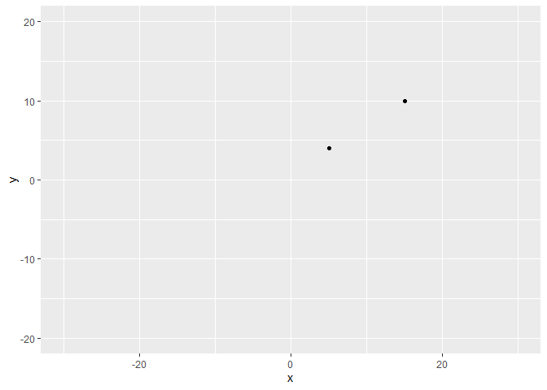<!-- -->

``` r
# Split the players data frame into two observations
player1 <- two_players[1, ]
player2 <- two_players[2, ]

# Calculate and print their distance using the Euclidean Distance formula
player_distance <- sqrt( (player1$x - player2$x)^2 + (player1$y - player2$y)^2 )
player_distance
```

    ## [1] 11.6619

## Using the dist() function

Using the Euclidean formula manually may be practical for 2 observations
but can get more complicated rather quickly when measuring the distance
between many observations.

The dist() function simplifies this process by calculating distances
between our observations (rows) using their features (columns). In this
case the observations are the player positions and the dimensions are
their x and y coordinates. Note: The default distance calculation for
the dist() function is Euclidean distance

``` r
three_players <- data.frame(x = c(5, 15, 0), y = c(4, 10, 20))

# Calculate the Distance Between two_players
dist_two_players <- dist(two_players)
dist_two_players %>% as.matrix() %>%kable()
```

|       1 |       2 |
| ------: | ------: |
|  0.0000 | 11.6619 |
| 11.6619 |  0.0000 |

``` r
# Calculate the Distance Between three_players
dist_three_players <- dist(three_players)
dist_three_players %>% as.matrix() %>% kable()
```

|        1 |        2 |        3 |
| -------: | -------: | -------: |
|  0.00000 | 11.66190 | 16.76305 |
| 11.66190 |  0.00000 | 18.02776 |
| 16.76305 | 18.02776 |  0.00000 |

## Who are the closest players?

You are given the data frame containing the positions of 4 players on a
soccer field. This data is preloaded as four\_players in your
environment and is displayed below.

``` r
four_players <- data.frame(x = c(5, 15, 0, -5), y = c(4, 10, 20, 5))


dist_four_players <- dist(four_players)
dist_four_players %>% as.matrix() %>% kable()
```

|        1 |        2 |        3 |        4 |
| -------: | -------: | -------: | -------: |
|  0.00000 | 11.66190 | 16.76305 | 10.04988 |
| 11.66190 |  0.00000 | 18.02776 | 20.61553 |
| 16.76305 | 18.02776 |  0.00000 | 15.81139 |
| 10.04988 | 20.61553 | 15.81139 |  0.00000 |

Effects of scale You have learned that when a variable is on a larger
scale than other variables in your data it may disproportionately
influence the resulting distance calculated between your observations.
Lets see this in action by observing a sample of data from the trees
data set. You will leverage the scale() function which by default
centers & scales our column features. Our variables are the following:
Girth - tree diameter in inches Height - tree height in inches

``` r
trees <- read.csv("trees.csv")
three_trees <- data.frame(Girth = c(8.3, 8.6, 10.5),
                          Height = c(840, 780, 864))

# Calculate distance for three_trees 
dist_trees <- dist(three_trees)

# Scale three trees & calculate the distance  
scaled_three_trees <- scale(three_trees)
dist_scaled_trees <- dist(scaled_three_trees)

# Output the results of both Matrices
print('Without Scaling')
```

    ## [1] "Without Scaling"

``` r
dist_trees  %>% as.matrix() %>% kable()
```

|        1 |        2 |        3 |
| -------: | -------: | -------: |
|  0.00000 | 60.00075 | 24.10062 |
| 60.00075 |  0.00000 | 84.02149 |
| 24.10062 | 84.02149 |  0.00000 |

``` r
print('With Scaling')
```

    ## [1] "With Scaling"

``` r
dist_scaled_trees  %>% as.matrix() %>% kable()
```

|        1 |        2 |        3 |
| -------: | -------: | -------: |
| 0.000000 | 1.409365 | 1.925658 |
| 1.409365 | 0.000000 | 2.511081 |
| 1.925658 | 2.511081 | 0.000000 |

## Calculating distance between categorical variables

In this exercise you will explore how to calculate binary (Jaccard)
distances. In order to calculate distances we will first have to dummify
our categories using the dummy.data.frame() from the library dummies

You will use a small collection of survey observations stored in the
data frame job\_survey with the following columns:

job\_satisfaction Possible options: “Hi”, “Mid”, “Low” is\_happy
Possible options: “Yes”, “No”

``` r
library(dummies)
job_survey <- read.csv("job_survey.csv")

# Dummify the Survey Data
dummy_survey <- dummy.data.frame(job_survey)

# Calculate the Distance
dist_survey <- dist(dummy_survey, method = "binary")

# Print the Original Data
job_survey %>% kable()
```

| job\_satisfaction | is\_happy |
| :---------------- | :-------- |
| Low               | No        |
| Low               | No        |
| Hi                | Yes       |
| Low               | No        |
| Mid               | No        |

``` r
# Print the Distance Matrix
dist_survey %>% as.matrix() %>% kable()
```

|         1 |         2 | 3 |         4 |         5 |
| --------: | --------: | -: | --------: | --------: |
| 0.0000000 | 0.0000000 | 1 | 0.0000000 | 0.6666667 |
| 0.0000000 | 0.0000000 | 1 | 0.0000000 | 0.6666667 |
| 1.0000000 | 1.0000000 | 0 | 1.0000000 | 1.0000000 |
| 0.0000000 | 0.0000000 | 1 | 0.0000000 | 0.6666667 |
| 0.6666667 | 0.6666667 | 1 | 0.6666667 | 0.0000000 |

## Calculating linkage

Let us revisit the example with three players on a field. The distance
matrix between these three players is shown below and is available as
the variable dist\_players.

From this we can tell that the first group that forms is between players
1 & 2, since they are the closest to one another with a Euclidean
distance value of 11.

Now you want to apply the three linkage methods you have learned to
determine what the distance of this group is to player 3.

``` r
dist_players <- dist(three_players)
# Extract the pair distances
distance_1_2 <- dist_players[1]
distance_1_3 <- dist_players[2]
distance_2_3 <- dist_players[3]

# Calculate the complete distance between group 1-2 and 3
complete <- max(c(distance_2_3, distance_1_3))
complete
```

    ## [1] 18.02776

``` r
# Calculate the single distance between group 1-2 and 3
single <- min(c(distance_2_3, distance_1_3))
single
```

    ## [1] 16.76305

``` r
# Calculate the average distance between group 1-2 and 3
average <- mean(c(distance_2_3, distance_1_3))
average
```

    ## [1] 17.39541

Assign cluster membership In this exercise you will leverage the
hclust() function to calculate the iterative linkage steps and you will
use the cutree() function to extract the cluster assignments for the
desired number (k) of clusters. You are given the positions of 12
players at the start of a 6v6 soccer match. This is stored in the lineup
data frame.

You know that this match has two teams (k = 2), let’s use the clustering
methods you learned to assign which team each player belongs in based on
their position.

Notes: The linkage method can be passed via the method parameter:
hclust(distance\_matrix, method = “complete”) Remember that in soccer
opposing teams start on their half of the field. Because these positions
are measured using the same scale we do not need to re-scale our data.

``` r
lineup <- readRDS("lineup.rds")

# Calculate the Distance
dist_players <- dist(lineup)

# Perform the hierarchical clustering using the complete linkage
hc_players <- hclust(dist_players, method = "complete")

# Calculate the assignment vector with a k of 2
clusters_k2 <- cutree(hc_players, k = 2)

# Create a new data frame storing these results
lineup_k2_complete <- mutate(lineup, cluster = clusters_k2)
```

## Exploring the clusters

Because clustering analysis is always in part qualitative, it is
incredibly important to have the necessary tools to explore the results
of the clustering. In this exercise you will explore that data frame you
created in the previous exercise lineup\_k2\_complete.

Reminder: The lineup\_k2\_complete data frame contains the x & y
positions of 12 players at the start of a 6v6 soccer game to which you
have added clustering assignments based on the following parameters:

Distance: Euclidean Number of Clusters (k): 2 Linkage Method: Complete

``` r
# Count the cluster assignments
count(lineup_k2_complete, cluster) %>% kable()
```

| cluster | n |
| ------: | -: |
|       1 | 6 |
|       2 | 6 |

``` r
# Plot the positions of the players and color them using their cluster
ggplot(lineup_k2_complete, aes(x = x,
                               y = y, 
                               color = factor(cluster))) +
  geom_point()
```

<!-- -->

  - Dedogram the distance between two clusters is the height between
    them

## Comparing average, single & complete linkage

You are now ready to analyze the clustering results of the lineup
dataset using the dendrogram plot. This will give you a new perspective
on the effect the decision of the linkage method has on your resulting
cluster analysis.

``` r
# Prepare the Distance Matrix
dist_players <- dist(lineup)

# Generate hclust for complete, single & average linkage methods
hc_complete <- hclust(dist_players, method = "complete")
hc_single <- hclust(dist_players, method = "single")
hc_average <- hclust(dist_players, method = "average")

# Plot & Label the 3 Dendrograms Side-by-Side
# Hint: To see these Side-by-Side run the 4 lines together as one command
par(mfrow = c(1,3))
plot(hc_complete, main = 'Complete Linkage')
plot(hc_single, main = 'Single Linkage')
plot(hc_average, main = 'Average Linkage')
```

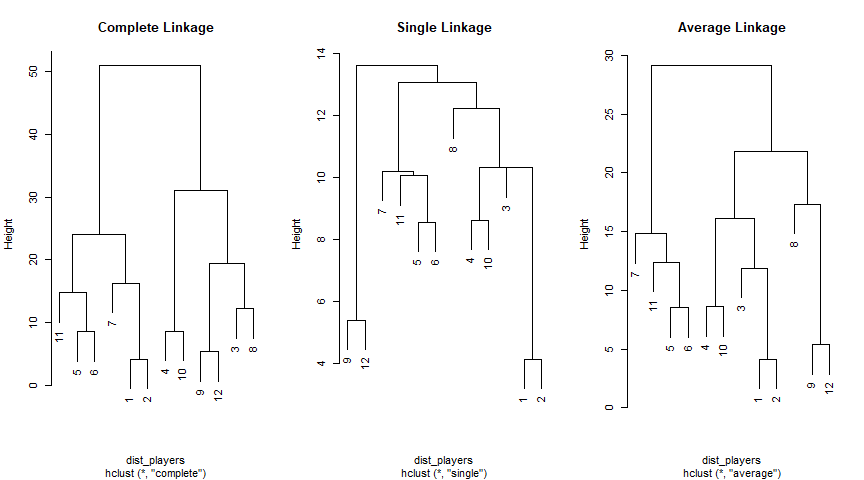<!-- -->

Height of the tree An advantage of working with a clustering method like
hierarchical clustering is that you can describe the relationships
between your observations based on both the distance metric and the
linkage metric selected (the combination of which defines the height of
the tree).

Based on the code below what can you concretely say about the height of
a branch in the resulting dendrogram?

dist\_players \<- dist(lineup, method = ‘euclidean’) hc\_players \<-
hclust(dist\_players, method = ‘single’) plot(hc\_players)

All of the observations linked by this branch must have:

  - Exactly\! Based on this code we can concretely say that for a given
    branch on a tree all members that are a part of that branch must
    have a minimum Euclidean distance amongst one another equal to or
    less than the height of that branch. In the next section you will
    see how this description can be put into action to generate clusters
    that can be described using the same logic.

## Clusters based on height

In previous exercises you have grouped your observations into clusters
using a pre-defined number of clusters (k). In this exercise you will
leverage the visual representation of the dendrogram in order to group
your observations into clusters using a maximum height (h), below which
clusters form.

You will work the color\_branches() function from the dendextend library
in order to visually inspect the clusters that form at any height along
the dendrogram.

The hc\_players has been carried over from your previous work with the
soccer line-up data.

``` r
library(dendextend)

dist_players <- dist(lineup, method = 'euclidean')
hc_players <- hclust(dist_players, method = "complete")

# Create a dendrogram object from the hclust variable
dend_players <- as.dendrogram(hc_players)

# Plot the dendrogram
plot(dend_players)
```

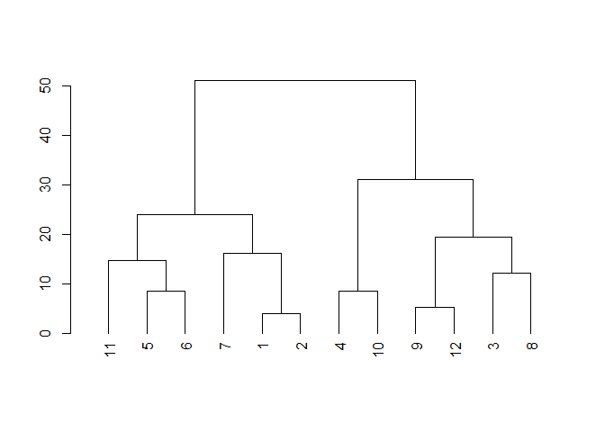<!-- -->

``` r
# Color branches by cluster formed from the cut at a height of 20 & plot
dend_20 <- color_branches(dend_players, h = 20)

# Plot the dendrogram with clusters colored below height 20
plot(dend_20)
```

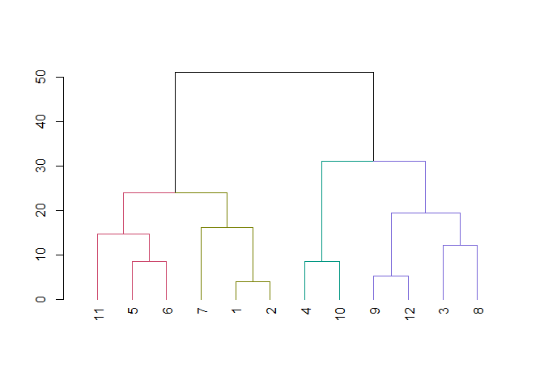<!-- -->

``` r
# Color branches by cluster formed from the cut at a height of 40 & plot
dend_40 <- color_branches(dend_players, h = 40)

# Plot the dendrogram with clusters colored below height 40

plot(dend_40)
```

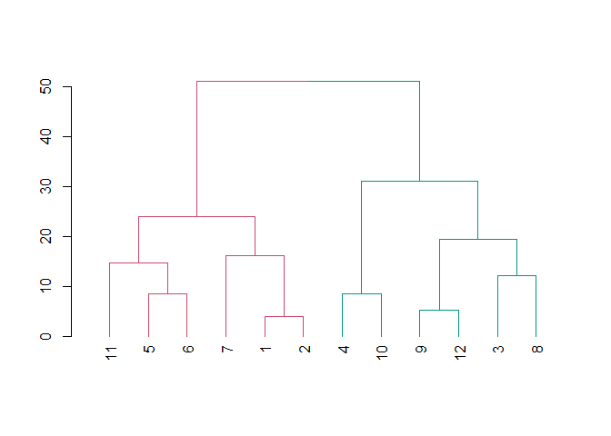<!-- -->

``` r
detach("package:dendextend", unload=TRUE)
```

## Exploring the branches cut from the tree

The cutree() function you used in exercises 5 & 6 can also be used to
cut a tree at a given height by using the h parameter. Take a moment to
explore the clusters you have generated from the previous exercises
based on the heights 20 & 40.



``` r
dist_players <- dist(lineup, method = 'euclidean')
hc_players <- hclust(dist_players, method = "complete")

# Calculate the assignment vector with a h of 20
clusters_h20 <- cutree(hc_players, h = 20)

# Create a new data frame storing these results
lineup_h20_complete <- mutate(lineup, cluster = clusters_h20)

# Calculate the assignment vector with a h of 40
clusters_h40 <- cutree(hc_players, h = 40)

# Create a new data frame storing these results
lineup_h40_complete <- mutate(lineup, cluster = clusters_h40)

# Plot the positions of the players and color them using their cluster for height = 20
ggplot(lineup_h20_complete, 
       aes(x = x, y = y, color = factor(cluster))) +
  geom_point()
```

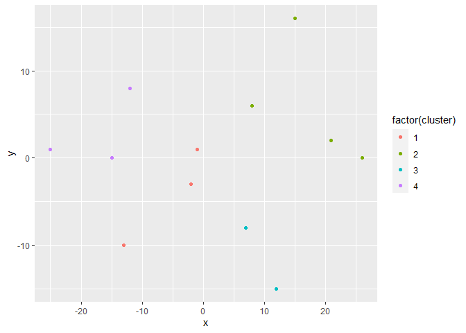<!-- -->

``` r
# Plot the positions of the players and color them using their cluster for height = 40

ggplot(lineup_h40_complete,
       aes(x = x, y = y, color = factor(cluster))) +
  geom_point()
```

<!-- -->

## What do we know about our clusters?

Based on the code below, what can you concretely say about the
relationships of the members within each cluster? dist\_players \<-
dist(lineup, method = ‘euclidean’) hc\_players \<- hclust(dist\_players,
method = ‘complete’) clusters \<- cutree(hc\_players, h = 40)

Every member belonging to a cluster must have:

  - The height of any branch is determined by the linkage and distanc e
    decisions (in this case complete linkage and Euclidean distance).
    While the members of the clusters that form below a desired height
    have a maximum linkage+distance amongst themselves that is less than
    the desired height.

## Segment wholesale customers

You’re now ready to use hierarchical clustering to perform market
segmentation (i.e. use consumer characteristics to group them into
subgroups). In this exercise you are provided with the amount spent by
45 different clients of a wholesale distributor for the food categories
of Milk, Grocery & Frozen. This is stored in the data frame
customers\_spend. Assign these clients into meaningful clusters. Note:
For this exercise you can assume that because the data is all of the
same type (amount spent) and you will not need to scale it.

``` r
customers_spend <- readRDS("ws_customers.rds")
# Calculate Euclidean distance between customers
dist_customers <- dist(customers_spend)

# Generate a complete linkage analysis 
hc_customers <- hclust(dist_customers, method = "complete")

# Plot the dendrogram

plot(hc_customers )
```

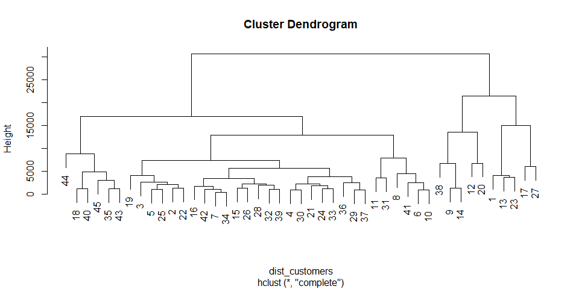<!-- -->

``` r
# Create a cluster assignment vector at h = 15000
clust_customers <- cutree(hc_customers , h = 15000)

# Generate the segmented customers data frame
segment_customers <- mutate(customers_spend, 
                            cluster = clust_customers)
```

## Explore wholesale customer clusters

Continuing your work on the wholesale dataset you are now ready to
analyze the characteristics of these clusters.

Since you are working with more than 2 dimensions it would be
challenging to visualize a scatter plot of the clusters, instead you
will rely on summary statistics to explore these clusters. In this
exercise you will analyze the mean amount spent in each cluster for all
three categories.

``` r
library(dendextend)
dist_customers <- dist(customers_spend)
hc_customers <- hclust(dist_customers)
clust_customers <- cutree(hc_customers, h = 15000)
segment_customers <- mutate(customers_spend, cluster = clust_customers)

# Count the number of customers that fall into each cluster
count(segment_customers , cluster)
```

    ## # A tibble: 4 x 2
    ##   cluster     n
    ##     <int> <int>
    ## 1       1     5
    ## 2       2    29
    ## 3       3     5
    ## 4       4     6

``` r
# Color the dendrogram based on the height cutoff
dend_customers <- as.dendrogram(hc_customers)
dend_colored <- color_branches(dend_customers, h = 15000)

# Plot the colored dendrogram

plot(dend_colored)
```

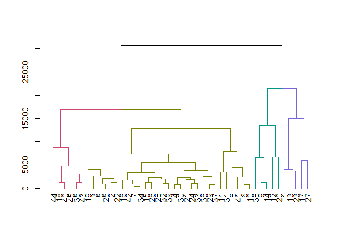<!-- -->

``` r
# Calculate the mean for each category
segment_customers %>% 
  group_by(cluster) %>% 
  summarise_all(list(mean)) %>%
    kable()
```

| cluster |      Milk |   Grocery |    Frozen |
| ------: | --------: | --------: | --------: |
|       1 | 16950.000 | 12891.400 |   991.200 |
|       2 |  2512.828 |  5228.931 |  1795.517 |
|       3 | 10452.200 | 22550.600 |  1354.800 |
|       4 |  1249.500 |  3916.833 | 10888.667 |

``` r
detach("package:dendextend", unload=TRUE)
```

## Interpreting the wholesale customer clusters

What observations can we make about our segments based on their average
spending in each category?

Customers in cluster 1 spent more money on Milk than any other cluster.

Customers in cluster 3 spent more money on Grocery than any other
cluster.

Customers in cluster 4 spent more money on Frozen goods than any other
cluster.

The majority of customers fell into cluster 2 and did not show any
excessive spending in any category.

All of the above.

  - All 4 statements are reasonable, but whether they are meaningful
    depends heavily on the business context of the clustering.

## K-means on a soccer field

In the previous chapter you used the lineup dataset to learn about
hierarchical clustering, in this chapter you will use the same data to
learn about k-means clustering. As a reminder, the lineup data frame
contains the positions of 12 players at the start of a 6v6 soccer match.

Just like before, you know that this match has two teams on the field so
you can perform a k-means analysis using k = 2 in order to determine
which player belongs to which team. Note that in the kmeans() function k
is specified using the centers parameter.

``` r
# Build a kmeans model
model_km2 <- kmeans(lineup, centers = 2)

# Extract the cluster assignment vector from the kmeans model
clust_km2 <- model_km2$cluster

# Create a new data frame appending the cluster assignment
lineup_km2 <- mutate(lineup, 
                     cluster = clust_km2)

# Plot the positions of the players and color them using their cluster
ggplot(lineup_km2, 
       aes(x = x, y = y,
           color = factor(cluster))) +
  geom_point()
```

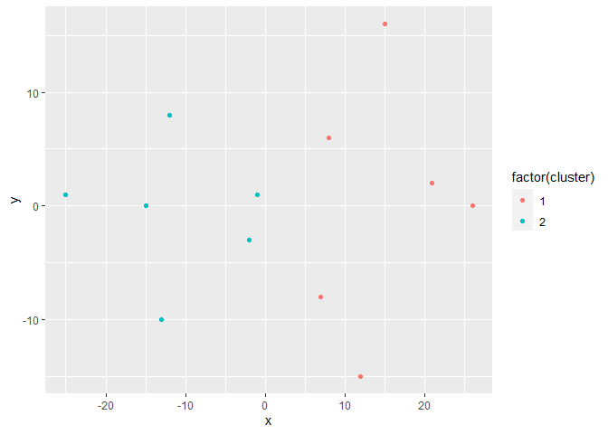<!-- -->

## K-means on a soccer field (part 2)

In the previous exercise you successfully used the k-means algorithm to
cluster the two teams from the lineup data frame. This time, let’s
explore what happens when you use a k of 3. You will see that the
algorithm will still run, but does it actually make sense in this
context…

``` r
# Build a kmeans model
model_km3 <- kmeans(lineup, centers = 3)

# Extract the cluster assignment vector from the kmeans model
clust_km3 <- model_km3$cluster

# Create a new data frame appending the cluster assignment
lineup_km3 <- mutate(lineup, 
                     cluster = clust_km3)

# Plot the positions of the players and color them using their cluster
ggplot(lineup_km3, 
       aes(x = x, y = y,
           color = factor(cluster))) +
  geom_point()
```

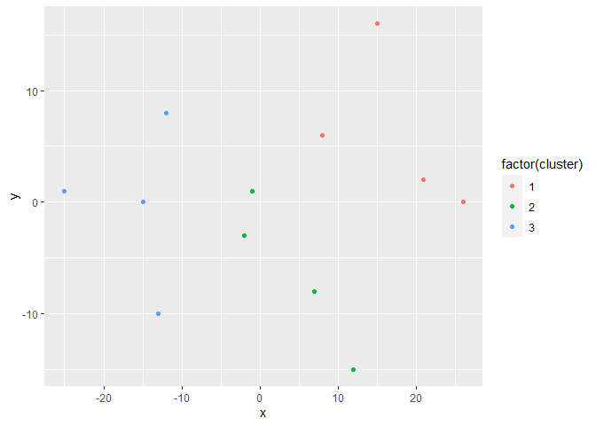<!-- -->

``` r
# Build a kmeans model
model_km3 <- kmeans(lineup, centers = 3)

# Extract the cluster assignment vector from the kmeans model
clust_km3 <- model_km3$cluster

# Create a new data frame appending the cluster assignment
lineup_km3 <- mutate(lineup, 
                     cluster = clust_km3)

# Plot the positions of the players and color them using their cluster
ggplot(lineup_km3, 
       aes(x = x, y = y,
           color = factor(cluster))) +
  geom_point()
```

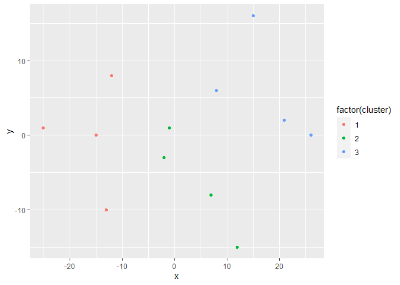<!-- -->

## Many K’s many models

While the lineup dataset clearly has a known value of k, often times the
optimal number of clusters isn’t known and must be estimated.

In this exercise you will leverage map\_dbl() from the purrr library to
run k-means using values of k ranging from 1 to 10 and extract the total
within-cluster sum of squares metric from each one. This will be the
first step towards visualizing the elbow plot.

``` r
# Use map_dbl to run many models with varying value of k (centers)
tot_withinss <- map_dbl(1:10,  function(k){
  model <- kmeans(x = lineup, centers = k)
  model$tot.withinss
})

# Generate a data frame containing both k and tot_withinss
elbow_df <- data.frame(
  k = 1:10 ,
  tot_withinss = tot_withinss
)
```

## Elbow (Scree) plot

In the previous exercises you have calculated the total within-cluster
sum of squares for values of k ranging from 1 to 10. You can visualize
this relationship using a line plot to create what is known as an elbow
plot (or scree plot).

When looking at an elbow plot you want to see a sharp decline from one k
to another followed by a more gradual decrease in slope. The last value
of k before the slope of the plot levels off suggests a “good” value of
k.

``` r
# Plot the elbow plot
ggplot(elbow_df, 
       aes(x = k, y = tot_withinss)) +
  geom_line() +
  scale_x_continuous(breaks = 1:10)
```

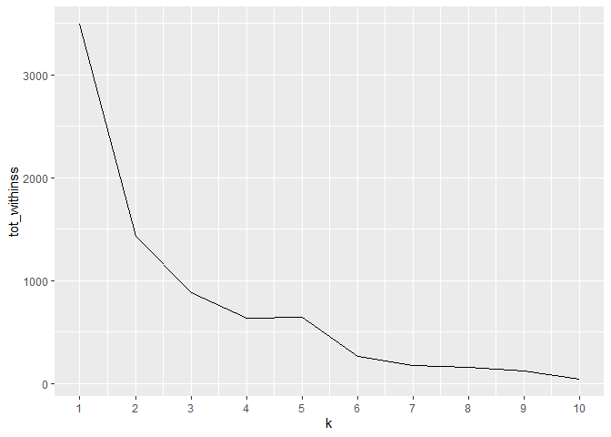<!-- -->

## Interpreting the elbow plot

Based on the elbow plot you generated in the previous exercise for the
lineup data

  - you can see that there is a sharp change in the slope of this line
    that makes an "elbow" shape. Furthermore, this is supported by the
    prior knowledge that there are two teams in this data and a k of 2
    is desired.

## Silhouette analysis

Silhouette analysis allows you to calculate how similar each
observations is with the cluster it is assigned relative to other
clusters. This metric (silhouette width) ranges from -1 to 1 for each
observation in your data and can be interpreted as follows:

  - Values close to 1 suggest that the observation is well matched to
    the assigned cluster
  - Values close to 0 suggest that the observation is borderline matched
    between two clusters
  - Values close to -1 suggest that the observations may be assigned to
    the wrong cluster

In this exercise you will leverage the pam() and the silhouette()
functions from the cluster library to perform silhouette analysis to
compare the results of models with a k of 2 and a k of 3. You’ll
continue working with the lineup dataset.

Pay close attention to the silhouette plot, does each observation
clearly belong to its assigned cluster for k = 3?

``` r
library(cluster)

# Generate a k-means model using the pam() function with a k = 2
pam_k2 <- pam(lineup, k = 2)

# Plot the silhouette visual for the pam_k2 model
plot(silhouette(pam_k2))
```

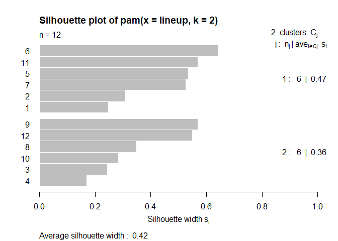<!-- -->

``` r
# Generate a k-means model using the pam() function with a k = 3
pam_k3 <- pam(lineup, k = 3)

# Plot the silhouette visual for the pam_k3 model

plot(silhouette(pam_k3))
```

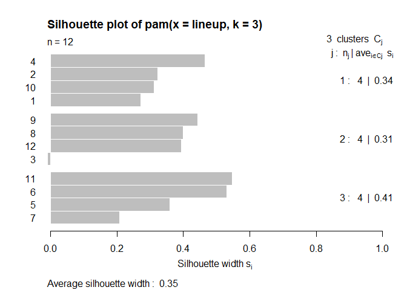<!-- -->

## Revisiting wholesale data: “Best” k

At the end of Chapter 2 you explored wholesale distributor data
customers\_spend using hierarchical clustering. This time you will
analyze this data using the k-means clustering tools covered in this
chapter. The first step will be to determine the “best” value of k using
average silhouette width. A refresher about the data: it contains
records of the amount spent by 45 different clients of a wholesale
distributor for the food categories of Milk, Grocery & Frozen. This is
stored in the data frame customers\_spend. For this exercise you can
assume that because the data is all of the same type (amount spent) and
you will not need to scale it.

``` r
# Use map_dbl to run many models with varying value of k
sil_width <- map_dbl(2:10,  function(k){
  model <- pam(x =customers_spend , k = k)
  model$silinfo$avg.width
})

# Generate a data frame containing both k and sil_width
sil_df <- data.frame(
  k = 2:10,
  sil_width = sil_width
)

# Plot the relationship between k and sil_width
ggplot(sil_df,
       aes(x = k, y = sil_width)) +
  geom_line() +
  scale_x_continuous(breaks = 2:10)
```

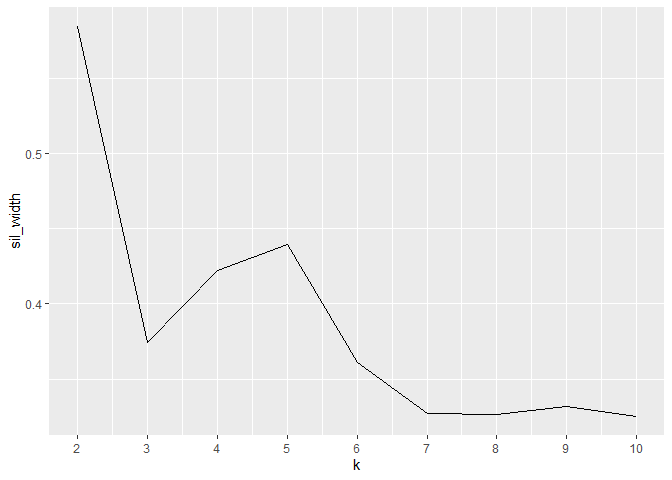<!-- -->

## Revisiting wholesale data: Exploration

From the previous analysis you have found that k = 2 has the highest
average silhouette width. In this exercise you will continue to analyze
the wholesale customer data by building and exploring a kmeans model
with 2 clusters.

``` r
set.seed(42)

# Build a k-means model for the customers_spend with a k of 2
model_customers <- kmeans(customers_spend, centers = 2)

# Extract the vector of cluster assignments from the model
clust_customers <- model_customers$cluster

# Build the segment_customers data frame
segment_customers <- mutate(customers_spend, cluster = clust_customers)

# Calculate the size of each cluster
count(segment_customers, cluster)%>%
    kable()
```

| cluster |  n |
| ------: | -: |
|       1 | 35 |
|       2 | 10 |

``` r
# Calculate the mean for each category
segment_customers %>% 
  group_by(cluster) %>% 
  summarise_all(list(mean)) %>%
    kable()
```

| cluster |      Milk | Grocery |   Frozen |
| ------: | --------: | ------: | -------: |
|       1 |  2296.257 |    5004 | 3354.343 |
|       2 | 13701.100 |   17721 | 1173.000 |

  - It seems that in this case cluster 1 consists of individuals who
    proportionally spend more on Frozen food while cluster 2 customers
    spent more on Milk and Grocery. Did you notice that when you
    explored this data using hierarchical clustering, the method
    resulted in 4 clusters while using k-means got you 2. Both of these
    results are valid, but which one is appropriate for this would
    require more subject matter expertise. Before you proceed with the
    next chapter, remember that: Generating clusters is a science, but
    interpreting them is an art.

## Initial exploration of the data

You are presented with data from the Occupational Employment Statistics
(OES) program which produces employment and wage estimates annually.
This data contains the yearly average income from 2001 to 2016 for 22
occupation groups. You would like to use this data to identify clusters
of occupations that maintained similar income trends.

The data is stored in your environment as the data.matrix oes. Before
you begin to cluster this data you should determine whether any
pre-processing steps (such as scaling and imputation) are necessary.
Leverage the functions head() and summary() to explore the oes data in
order to determine which of the pre-processing steps below are
necessary:

  - There are no missing values, no categorical and the features are on
    the same scale. Now you’re ready to cluster this data\!

## Hierarchical clustering: Occupation trees

In the previous exercise you have learned that the oes data is ready for
hierarchical clustering without any preprocessing steps necessary. In
this exercise you will take the necessary steps to build a dendrogram of
occupations based on their yearly average salaries and propose clusters
using a height of 100,000.

``` r
 oes <- readRDS("oes.rds")

library(dendextend)
# Calculate Euclidean distance between the occupations
dist_oes <- dist(oes,  method = "euclidean")

# Generate an average linkage analysis 
hc_oes <- hclust(dist_oes, method = "average")

# Create a dendrogram object from the hclust variable
dend_oes <- as.dendrogram(hc_oes)

# Plot the dendrogram
plot(dend_oes)
```

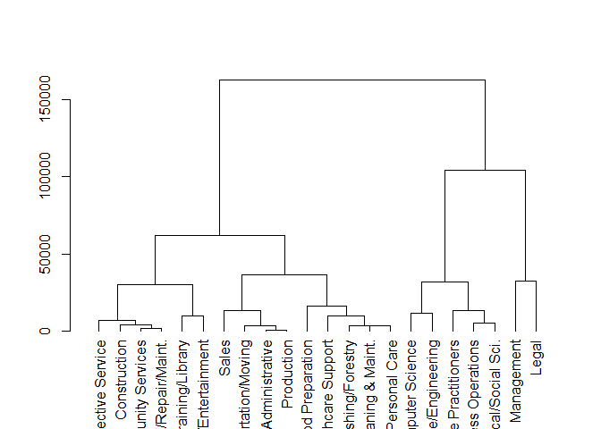<!-- -->

``` r
# Color branches by cluster formed from the cut at a height of 100000
dend_colored <- color_branches(dend_oes, h = 100000)

# Plot the colored dendrogram
plot(dend_colored)
```

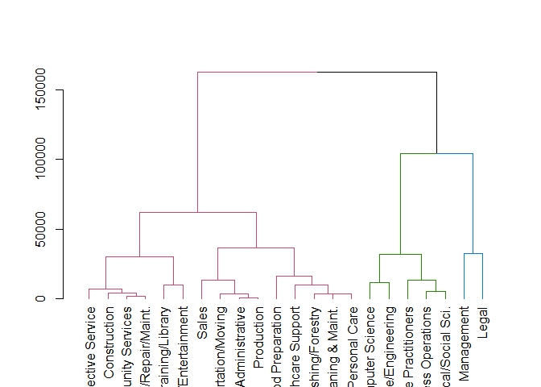<!-- -->

``` r
detach("package:dendextend", unload=TRUE)
```

  - Based on the dendrogram it may be reasonable to start with the three
    clusters formed at a height of 100,000. The members of these
    clusters appear to be tightly grouped but different from one
    another. Let’s continue this exploration.

## Hierarchical clustering: Preparing for exploration

You have now created a potential clustering for the oes data, before you
can explore these clusters with ggplot2 you will need to process the oes
data matrix into a tidy data frame with each occupation assigned its
cluster.

``` r
dist_oes <- dist(oes, method = 'euclidean')
hc_oes <- hclust(dist_oes, method = 'average')

library(tibble)
library(tidyr)

# Use rownames_to_column to move the rownames into a column of the data frame
df_oes <- rownames_to_column(as.data.frame(oes), var = 'occupation')

# Create a cluster assignment vector at h = 100,000
cut_oes <- cutree(hc_oes, h = 100000)

# Generate the segmented the oes data frame
clust_oes <- mutate(df_oes, cluster = cut_oes)

head(clust_oes) %>%
    kable()
```

| occupation                |  2001 |  2002 |  2003 |  2004 |  2005 |  2006 |  2007 |   2008 |   2010 |   2011 |   2012 |   2013 |   2014 |   2015 |   2016 | cluster |
| :------------------------ | ----: | ----: | ----: | ----: | ----: | ----: | ----: | -----: | -----: | -----: | -----: | -----: | -----: | -----: | -----: | ------: |
| Management                | 70800 | 78870 | 83400 | 87090 | 88450 | 91930 | 96150 | 100310 | 105440 | 107410 | 108570 | 110550 | 112490 | 115020 | 118020 |       1 |
| Business Operations       | 50580 | 53350 | 56000 | 57120 | 57930 | 60000 | 62410 |  64720 |  67690 |  68740 |  69550 |  71020 |  72410 |  73800 |  75070 |       2 |
| Computer Science          | 60350 | 61630 | 64150 | 66370 | 67100 | 69240 | 72190 |  74500 |  77230 |  78730 |  80180 |  82010 |  83970 |  86170 |  87880 |       2 |
| Architecture/Engineering  | 56330 | 58020 | 60390 | 63060 | 63910 | 66190 | 68880 |  71430 |  75550 |  77120 |  79000 |  80100 |  81520 |  82980 |  84300 |       2 |
| Life/Physical/Social Sci. | 49710 | 52380 | 54930 | 57550 | 58030 | 59660 | 62020 |  64280 |  66390 |  67470 |  68360 |  69400 |  70070 |  71220 |  72930 |       2 |
| Community Services        | 34190 | 34630 | 35800 | 37050 | 37530 | 39000 | 40540 |  41790 |  43180 |  43830 |  44240 |  44710 |  45310 |  46160 |  47200 |       3 |

``` r
# Create a tidy data frame by gathering the year and values into two columns
gathered_oes <- gather(data = clust_oes, 
                       key = year, 
                       value = mean_salary, 
                       -occupation, -cluster)

head(gathered_oes) %>%
    kable()
```

| occupation                | cluster | year | mean\_salary |
| :------------------------ | ------: | :--- | -----------: |
| Management                |       1 | 2001 |        70800 |
| Business Operations       |       2 | 2001 |        50580 |
| Computer Science          |       2 | 2001 |        60350 |
| Architecture/Engineering  |       2 | 2001 |        56330 |
| Life/Physical/Social Sci. |       2 | 2001 |        49710 |
| Community Services        |       3 | 2001 |        34190 |

## Hierarchical clustering: Plotting occupational clusters

You have succesfully created all the parts necessary to explore the
results of this hierarchical clustering work. In this exercise you will
leverage the named assignment vector cut\_oes and the tidy data frame
gathered\_oes to analyze the resulting clusters.

``` r
# View the clustering assignments by sorting the cluster assignment vector
sort(cut_oes )
```

    ##                 Management                      Legal 
    ##                          1                          1 
    ##        Business Operations           Computer Science 
    ##                          2                          2 
    ##   Architecture/Engineering  Life/Physical/Social Sci. 
    ##                          2                          2 
    ##   Healthcare Practitioners         Community Services 
    ##                          2                          3 
    ## Education/Training/Library  Arts/Design/Entertainment 
    ##                          3                          3 
    ##         Healthcare Support         Protective Service 
    ##                          3                          3 
    ##           Food Preparation  Grounds Cleaning & Maint. 
    ##                          3                          3 
    ##              Personal Care                      Sales 
    ##                          3                          3 
    ##      Office Administrative   Farming/Fishing/Forestry 
    ##                          3                          3 
    ##               Construction Installation/Repair/Maint. 
    ##                          3                          3 
    ##                 Production      Transportation/Moving 
    ##                          3                          3

``` r
# Plot the relationship between mean_salary and year and color the lines by the assigned cluster
ggplot(gathered_oes, 
       aes(x = year, 
           y = mean_salary,
           color = factor(cluster))) + 
    geom_line(aes(group = occupation))
```

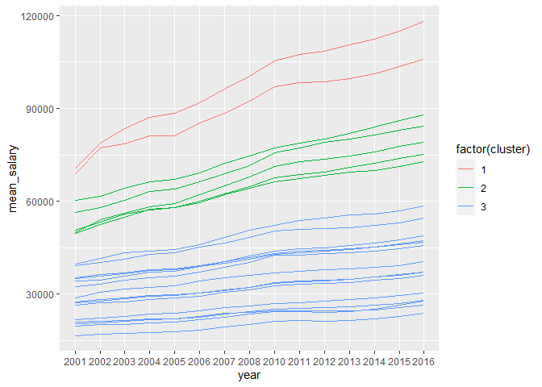<!-- -->

  - From this work it looks like both Management & Legal professions
    (cluster 1) experienced the most rapid growth in these 15 years.
    Let’s see what we can get by exploring this data using k-means

  - K-means: Elbow analysis In the previous exercises you used the
    dendrogram to propose a clustering that generated 3 trees. In this
    exercise you will leverage the k-means elbow plot to propose the
    “best” number of clusters.

<!-- end list -->

``` r
# Use map_dbl to run many models with varying value of k (centers)
tot_withinss <- map_dbl(1:10,  function(k){
  model <- kmeans(x = oes, centers = k)
  model$tot.withinss
})

# Generate a data frame containing both k and tot_withinss
elbow_df <- data.frame(
  k = 1:10,
  tot_withinss = tot_withinss
)

# Plot the elbow plot
ggplot(elbow_df, aes(x = k, y = tot_withinss)) +
  geom_line() +
  scale_x_continuous(breaks = 1:10)
```

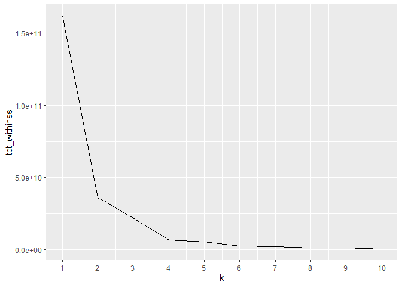<!-- -->

  - So the elbow analysis proposes a different value of k, in the next
    section let’s see what we can learn from Silhouette Width Analysis.

## K-means: Average Silhouette Widths

So hierarchical clustering resulting in 3 clusters and the elbow method
suggests 2. In this exercise use average silhouette widths to explore
what the “best” value of k should be.

``` r
# Use map_dbl to run many models with varying value of k
sil_width <- map_dbl(2:10,  function(k){
  model <- pam(oes, k = k)
  model$silinfo$avg.width
})

# Generate a data frame containing both k and sil_width
sil_df <- data.frame(
  k = 2:10,
  sil_width = sil_width
)

# Plot the relationship between k and sil_width
ggplot(sil_df, aes(x = k, y = sil_width)) +
  geom_line() +
  scale_x_continuous(breaks = 2:10)
```

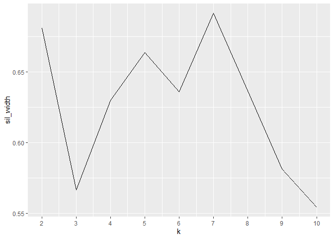<!-- -->

  - It seems that this analysis results in another value of k, this time
    7 is the top contender (although 2 comes very close).

## The “best” number of clusters

You ran three different methods for finding the optimal number of
clusters and their assignments and you arrived with three different
answers. Below you will find a comparison between the 3 clustering
results (via coloring of the occupations based on the clusters to which
they belong).

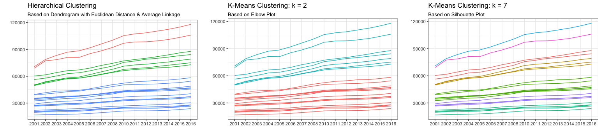

  - What can you say about the “best” way to cluster this data?

  - The clusters generated by the hierarchical clustering all have
    members with a Euclidean distance amongst one another less than
    100,000 and hence is the best clustering method.

  - The clusters generated using k-means with a k = 2 was identified
    using elbow analysis and hence is the best way to cluster this data.

  - The clusters generated using k-means with a k = 7 has the largest
    Average Silhouette Widths among the cluster and hence is the best
    way to cluster this data.

  - All 3 statements are correct but there is no quantitative way to
    determine which of these clustering approaches is the right one
    without further exploration. You are done with the course\! If you
    enjoyed the material, feel free to send Dmitriy a thank you via
    Twitter. He’ll appreciate it.
