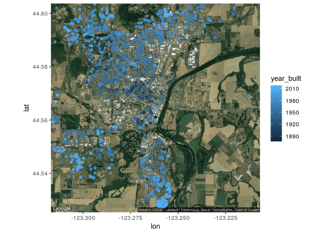
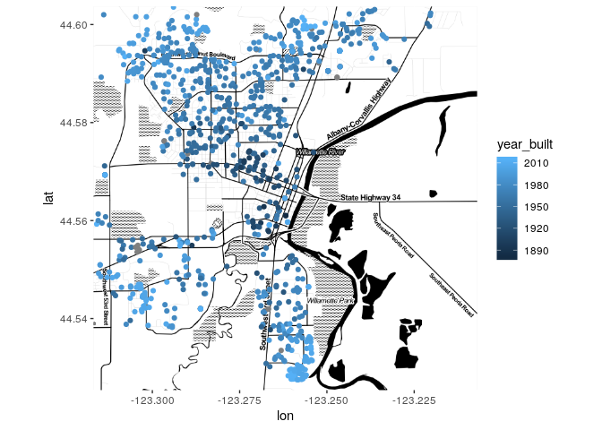
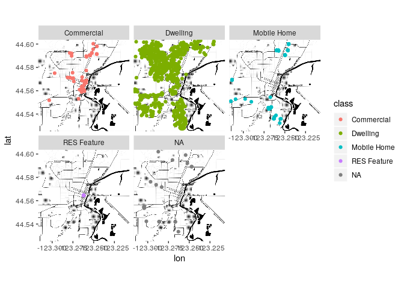
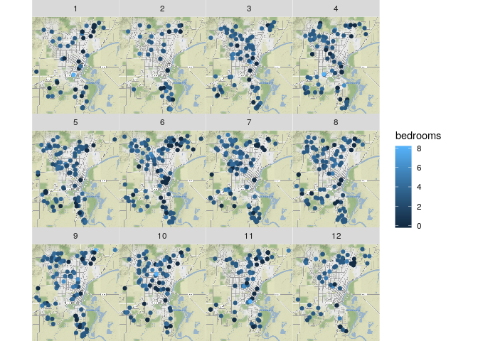
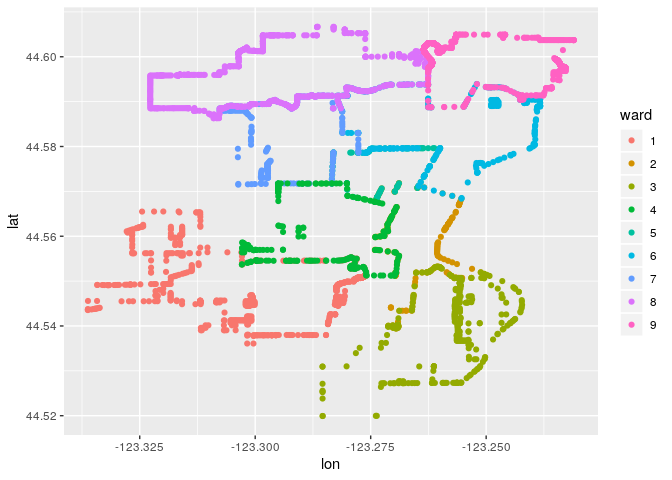
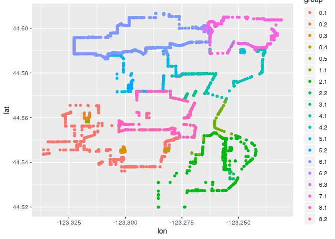
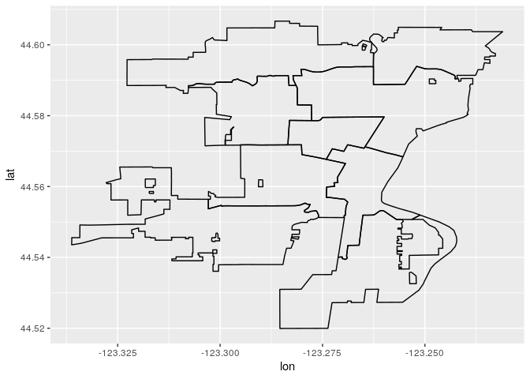
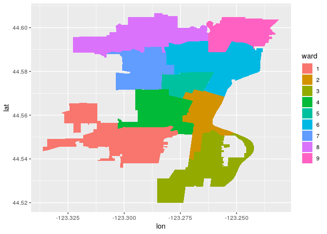
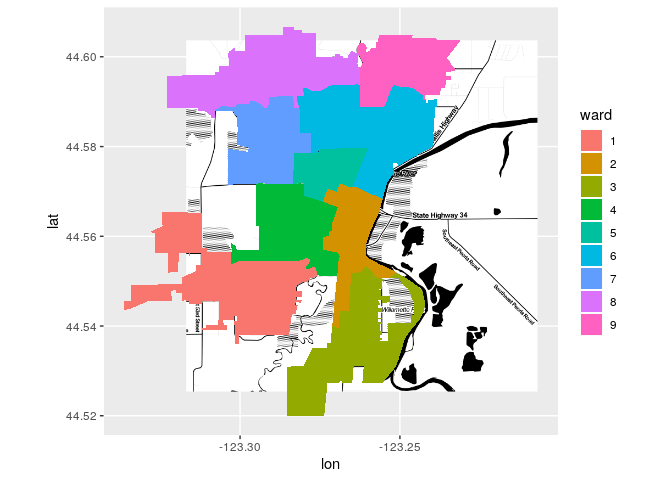
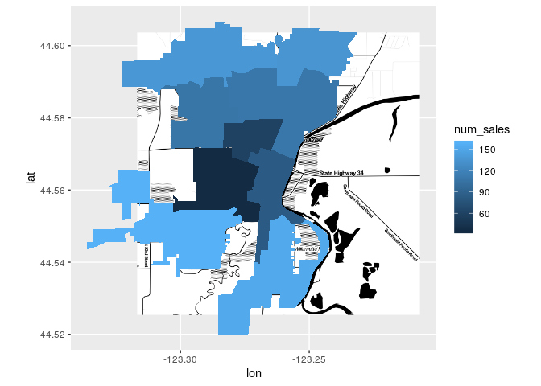

Basic mapping with ggplot2 and ggmap
================
Mburu
2/18/2020

## 

``` r
library(ggmap)
library(tidyverse)
library(knitr)

corvallis <- c(lon = -123.2620, lat = 44.5646)
# 
# # Add a maptype argument to get a satellite map
google_key <- Sys.getenv("key")
register_google(google_key)

corvallis_map_sat <- get_map(corvallis, zoom = 13, maptype = "satellite")
```

## 

<!-- -->

``` r
# Add source and maptype to get toner map from Stamen Maps
corvallis_map_bw <- get_map(corvallis, zoom = 13, 
                            maptype = "toner", source ="stamen")

# Edit to display toner map
ggmap(corvallis_map_bw) +
    geom_point(aes(lon, lat, color = year_built), data = sales)
```

<!-- -->

``` r
# Use base_layer argument to ggmap() to specify data and x, y mappings
ggmap(corvallis_map_bw,
      base_layer = ggplot(data = sales, aes(lon, lat )))+
    geom_point(aes(color = class))+ facet_wrap(~class)
```

<!-- -->

``` r
qmplot(lon, lat, data = sales, 
       geom = "point", color = bedrooms) +
    facet_wrap(~ month)
```

<!-- -->

``` r
ward_sales <- readRDS("01_corv_wards.rds")
head(ward_sales) %>% kable()
```

| ward |        lon |      lat | group | order | num\_sales | avg\_price | avg\_finished\_squarefeet |
| :--- | ---------: | -------: | :---- | ----: | ---------: | ---------: | ------------------------: |
| 1    | \-123.3128 | 44.56531 | 0.1   |     1 |        159 |   311626.9 |                  1609.226 |
| 1    | \-123.3122 | 44.56531 | 0.1   |     2 |        159 |   311626.9 |                  1609.226 |
| 1    | \-123.3121 | 44.56531 | 0.1   |     3 |        159 |   311626.9 |                  1609.226 |
| 1    | \-123.3119 | 44.56531 | 0.1   |     4 |        159 |   311626.9 |                  1609.226 |
| 1    | \-123.3119 | 44.56485 | 0.1   |     5 |        159 |   311626.9 |                  1609.226 |
| 1    | \-123.3119 | 44.56430 | 0.1   |     6 |        159 |   311626.9 |                  1609.226 |

``` r
ggplot(ward_sales, aes(lon, lat)) +
    geom_point(aes(color = ward))
```

<!-- -->

``` r
# Add a point layer with color mapped to group
ggplot(ward_sales, aes(lon, lat)) +
    geom_point(aes(color = group))
```

<!-- -->

``` r
ggplot(ward_sales, aes(lon, lat)) +
    geom_path(aes(group = group))
```

<!-- -->

``` r
# Add a polygon layer with fill mapped to ward, and group to group
ggplot(ward_sales, aes(lon, lat))+
    geom_polygon(aes(fill = ward, group = group))
```

<!-- -->

``` r
# Fix the polygon cropping
ggmap(corvallis_map_bw, extent = "normal", maprange = FALSE,
      base_layer = ggplot(ward_sales, aes(lon, lat))) +
    geom_polygon(aes(group = group, fill = ward))
```

<!-- -->

``` r
# Repeat, but map fill to num_sales
ggmap(corvallis_map_bw, 
      base_layer = ggplot(ward_sales, aes(lon, lat)),
      extent = "normal", maprange = FALSE) +
    geom_polygon(aes(group = group, fill = num_sales))
```

<!-- -->
