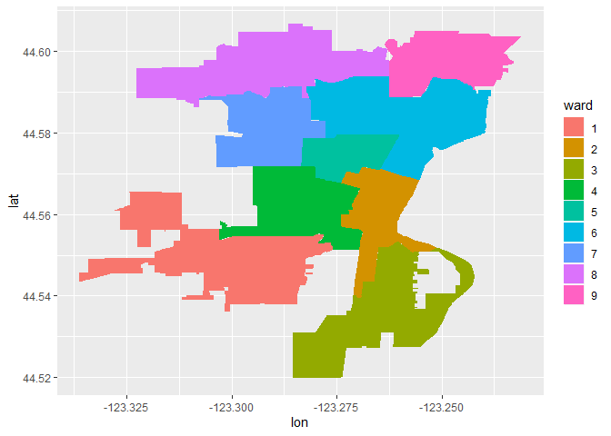

Visualizing Geospatial Data in R
================
Mburu
2/18/2020

## 

``` r
library(ggmap)
library(tidyverse)
library(knitr)

corvallis <- c(lon = -123.2620, lat = 44.5646)
# 
# # Add a maptype argument to get a satellite map
readRenviron("~/.Renviron")
google_key <- Sys.getenv("GGMAP_GOOGLE_API_KEY")
register_google(google_key)

corvallis_map_sat <- get_map(corvallis, zoom = 13, maptype = "satellite")
```

## 

``` r
sales <- readRDS("01_corv_sales.rds")
# Edit to display satellite map
ggmap(corvallis_map_sat) +
    geom_point(aes(lon, lat, color = year_built), data = sales)
```

<!-- -->

``` r
# Add source and maptype to get toner map from Stamen Maps
corvallis_map_bw <- get_map(corvallis, zoom = 13, 
                            maptype = "toner", source ="stamen")

# Edit to display toner map
ggmap(corvallis_map_bw) +
    geom_point(aes(lon, lat, color = year_built), data = sales)
```

<!-- -->

``` r
# Use base_layer argument to ggmap() to specify data and x, y mappings
ggmap(corvallis_map_bw,
      base_layer = ggplot(data = sales, aes(lon, lat )))+
    geom_point(aes(color = class))+ facet_wrap(~class)
```

<!-- -->

``` r
qmplot(lon, lat, data = sales, 
       geom = "point", color = bedrooms) +
    facet_wrap(~ month)
```

<!-- -->

``` r
ward_sales <- readRDS("01_corv_wards.rds")
head(ward_sales) %>% kable()
```

| ward |        lon |      lat | group | order | num\_sales | avg\_price | avg\_finished\_squarefeet |
| :--- | ---------: | -------: | :---- | ----: | ---------: | ---------: | ------------------------: |
| 1    | \-123.3128 | 44.56531 | 0.1   |     1 |        159 |   311626.9 |                  1609.226 |
| 1    | \-123.3122 | 44.56531 | 0.1   |     2 |        159 |   311626.9 |                  1609.226 |
| 1    | \-123.3121 | 44.56531 | 0.1   |     3 |        159 |   311626.9 |                  1609.226 |
| 1    | \-123.3119 | 44.56531 | 0.1   |     4 |        159 |   311626.9 |                  1609.226 |
| 1    | \-123.3119 | 44.56485 | 0.1   |     5 |        159 |   311626.9 |                  1609.226 |
| 1    | \-123.3119 | 44.56430 | 0.1   |     6 |        159 |   311626.9 |                  1609.226 |

``` r
ggplot(ward_sales, aes(lon, lat)) +
    geom_point(aes(color = ward))
```

<!-- -->

``` r
# Add a point layer with color mapped to group
ggplot(ward_sales, aes(lon, lat)) +
    geom_point(aes(color = group))
```

<!-- -->

``` r
ggplot(ward_sales, aes(lon, lat)) +
    geom_path(aes(group = group))
```

<!-- -->

``` r
# Add a polygon layer with fill mapped to ward, and group to group
ggplot(ward_sales, aes(lon, lat))+
    geom_polygon(aes(fill = ward, group = group))
```

<!-- -->

``` r
# Fix the polygon cropping
ggmap(corvallis_map_bw, extent = "normal", maprange = FALSE,
      base_layer = ggplot(ward_sales, aes(lon, lat))) +
    geom_polygon(aes(group = group, fill = ward))
```

<!-- -->

``` r
# Repeat, but map fill to num_sales
ggmap(corvallis_map_bw, 
      base_layer = ggplot(ward_sales, aes(lon, lat)),
      extent = "normal", maprange = FALSE) +
    geom_polygon(aes(group = group, fill = num_sales))
```

<!-- -->

## 

``` r
library(tidyverse)
library(sp)
library(sf)
```

## Including Plots

You can also embed plots, for example:

``` r
countries_spdf <- readRDS("02_countries_spdf.rds")
summary(countries_spdf)
```

    ## Object of class SpatialPolygonsDataFrame
    ## Coordinates:
    ##         min       max
    ## x -180.0000 180.00000
    ## y  -89.9999  83.64513
    ## Is projected: FALSE 
    ## proj4string :
    ## [+proj=longlat +datum=WGS84 +no_defs +ellps=WGS84 +towgs84=0,0,0]
    ## Data attributes:
    ##      name              iso_a3            population       
    ##  Length:177         Length:177         Min.   :1.400e+02  
    ##  Class :character   Class :character   1st Qu.:3.481e+06  
    ##  Mode  :character   Mode  :character   Median :9.048e+06  
    ##                                        Mean   :3.849e+07  
    ##                                        3rd Qu.:2.616e+07  
    ##                                        Max.   :1.339e+09  
    ##                                        NA's   :1          
    ##       gdp              region           subregion        
    ##  Min.   :      16   Length:177         Length:177        
    ##  1st Qu.:   13198   Class :character   Class :character  
    ##  Median :   43450   Mode  :character   Mode  :character  
    ##  Mean   :  395513                                        
    ##  3rd Qu.:  235100                                        
    ##  Max.   :15094000                                        
    ##  NA's   :1

``` r
# Call str() with max.level = 2 on countries_spdf
str(countries_spdf, max.level = 2)
```

    ## Formal class 'SpatialPolygonsDataFrame' [package "sp"] with 5 slots
    ##   ..@ data       :'data.frame':  177 obs. of  6 variables:
    ##   ..@ polygons   :List of 177
    ##   ..@ plotOrder  : int [1:177] 7 136 28 169 31 23 9 66 84 5 ...
    ##   ..@ bbox       : num [1:2, 1:2] -180 -90 180 83.6
    ##   .. ..- attr(*, "dimnames")=List of 2
    ##   ..@ proj4string:Formal class 'CRS' [package "sp"] with 1 slot

``` r
# Plot countries_spdf
plot(countries_spdf)
```

<!-- -->

``` r
one <- countries_spdf@polygons[[169]]
```

``` r
# str() with max.level = 2, on the Polygons slot of one
str(one@Polygons, max.level = 2)
```

    ## List of 10
    ##  $ :Formal class 'Polygon' [package "sp"] with 5 slots
    ##  $ :Formal class 'Polygon' [package "sp"] with 5 slots
    ##  $ :Formal class 'Polygon' [package "sp"] with 5 slots
    ##  $ :Formal class 'Polygon' [package "sp"] with 5 slots
    ##  $ :Formal class 'Polygon' [package "sp"] with 5 slots
    ##  $ :Formal class 'Polygon' [package "sp"] with 5 slots
    ##  $ :Formal class 'Polygon' [package "sp"] with 5 slots
    ##  $ :Formal class 'Polygon' [package "sp"] with 5 slots
    ##  $ :Formal class 'Polygon' [package "sp"] with 5 slots
    ##  $ :Formal class 'Polygon' [package "sp"] with 5 slots

``` r
str(one@Polygons[[6]], max.level = 2)
```

    ## Formal class 'Polygon' [package "sp"] with 5 slots
    ##   ..@ labpt  : num [1:2] -99.1 39.5
    ##   ..@ area   : num 840
    ##   ..@ hole   : logi FALSE
    ##   ..@ ringDir: int 1
    ##   ..@ coords : num [1:233, 1:2] -94.8 -94.6 -94.3 -93.6 -92.6 ...
    ##   .. ..- attr(*, "dimnames")=List of 2

``` r
# Call plot on the coords slot of 6th element of one@Polygons
```

``` r
# Call plot on the coords slot of 6th element of one@Polygons

plot(one@Polygons[[6]]@coords)
```

<!-- -->

``` r
one <- countries_spdf@polygons[[169]]

# str() with max.level = 2, on the Polygons slot of one
str(one@Polygons, max.level = 2)
```

    ## List of 10
    ##  $ :Formal class 'Polygon' [package "sp"] with 5 slots
    ##  $ :Formal class 'Polygon' [package "sp"] with 5 slots
    ##  $ :Formal class 'Polygon' [package "sp"] with 5 slots
    ##  $ :Formal class 'Polygon' [package "sp"] with 5 slots
    ##  $ :Formal class 'Polygon' [package "sp"] with 5 slots
    ##  $ :Formal class 'Polygon' [package "sp"] with 5 slots
    ##  $ :Formal class 'Polygon' [package "sp"] with 5 slots
    ##  $ :Formal class 'Polygon' [package "sp"] with 5 slots
    ##  $ :Formal class 'Polygon' [package "sp"] with 5 slots
    ##  $ :Formal class 'Polygon' [package "sp"] with 5 slots

``` r
# str() with max.level = 2, on the 6th element of the one@Polygons

str(one@Polygons[[6]], max.level = 2)
```

    ## Formal class 'Polygon' [package "sp"] with 5 slots
    ##   ..@ labpt  : num [1:2] -99.1 39.5
    ##   ..@ area   : num 840
    ##   ..@ hole   : logi FALSE
    ##   ..@ ringDir: int 1
    ##   ..@ coords : num [1:233, 1:2] -94.8 -94.6 -94.3 -93.6 -92.6 ...
    ##   .. ..- attr(*, "dimnames")=List of 2

``` r
# Call plot on the coords slot of 6th element of one@Polygons
```

``` r
plot(one@Polygons[[6]]@coords)
```

<!-- -->

``` r
# Subset the 169th object of countries_spdf: usa
usa <- countries_spdf[169,]

# Look at summary() of usa

summary(usa)
```

    ## Object of class SpatialPolygonsDataFrame
    ## Coordinates:
    ##          min       max
    ## x -171.79111 -66.96466
    ## y   18.91619  71.35776
    ## Is projected: FALSE 
    ## proj4string :
    ## [+proj=longlat +datum=WGS84 +no_defs +ellps=WGS84 +towgs84=0,0,0]
    ## Data attributes:
    ##      name              iso_a3            population      
    ##  Length:1           Length:1           Min.   :3.14e+08  
    ##  Class :character   Class :character   1st Qu.:3.14e+08  
    ##  Mode  :character   Mode  :character   Median :3.14e+08  
    ##                                        Mean   :3.14e+08  
    ##                                        3rd Qu.:3.14e+08  
    ##                                        Max.   :3.14e+08  
    ##       gdp              region           subregion        
    ##  Min.   :15094000   Length:1           Length:1          
    ##  1st Qu.:15094000   Class :character   Class :character  
    ##  Median :15094000   Mode  :character   Mode  :character  
    ##  Mean   :15094000                                        
    ##  3rd Qu.:15094000                                        
    ##  Max.   :15094000

``` r
# Look at str() of usa

str(usa)
```

    ## Formal class 'SpatialPolygonsDataFrame' [package "sp"] with 5 slots
    ##   ..@ data       :'data.frame':  1 obs. of  6 variables:
    ##   .. ..$ name      : chr "United States"
    ##   .. ..$ iso_a3    : chr "USA"
    ##   .. ..$ population: num 3.14e+08
    ##   .. ..$ gdp       : num 15094000
    ##   .. ..$ region    : chr "Americas"
    ##   .. ..$ subregion : chr "Northern America"
    ##   ..@ polygons   :List of 1
    ##   .. ..$ :Formal class 'Polygons' [package "sp"] with 5 slots
    ##   .. .. .. ..@ Polygons :List of 10
    ##   .. .. .. .. ..$ :Formal class 'Polygon' [package "sp"] with 5 slots
    ##   .. .. .. .. .. .. ..@ labpt  : num [1:2] -155.5 19.6
    ##   .. .. .. .. .. .. ..@ area   : num 0.964
    ##   .. .. .. .. .. .. ..@ hole   : logi FALSE
    ##   .. .. .. .. .. .. ..@ ringDir: int 1
    ##   .. .. .. .. .. .. ..@ coords : num [1:17, 1:2] -156 -156 -156 -156 -156 ...
    ##   .. .. .. .. .. .. .. ..- attr(*, "dimnames")=List of 2
    ##   .. .. .. .. .. .. .. .. ..$ : NULL
    ##   .. .. .. .. .. .. .. .. ..$ : chr [1:2] "x" "y"
    ##   .. .. .. .. ..$ :Formal class 'Polygon' [package "sp"] with 5 slots
    ##   .. .. .. .. .. .. ..@ labpt  : num [1:2] -156.4 20.8
    ##   .. .. .. .. .. .. ..@ area   : num 0.176
    ##   .. .. .. .. .. .. ..@ hole   : logi FALSE
    ##   .. .. .. .. .. .. ..@ ringDir: int 1
    ##   .. .. .. .. .. .. ..@ coords : num [1:9, 1:2] -156 -156 -157 -157 -157 ...
    ##   .. .. .. .. .. .. .. ..- attr(*, "dimnames")=List of 2
    ##   .. .. .. .. .. .. .. .. ..$ : NULL
    ##   .. .. .. .. .. .. .. .. ..$ : chr [1:2] "x" "y"
    ##   .. .. .. .. ..$ :Formal class 'Polygon' [package "sp"] with 5 slots
    ##   .. .. .. .. .. .. ..@ labpt  : num [1:2] -157 21.1
    ##   .. .. .. .. .. .. ..@ area   : num 0.061
    ##   .. .. .. .. .. .. ..@ hole   : logi FALSE
    ##   .. .. .. .. .. .. ..@ ringDir: int 1
    ##   .. .. .. .. .. .. ..@ coords : num [1:5, 1:2] -157 -157 -157 -157 -157 ...
    ##   .. .. .. .. .. .. .. ..- attr(*, "dimnames")=List of 2
    ##   .. .. .. .. .. .. .. .. ..$ : NULL
    ##   .. .. .. .. .. .. .. .. ..$ : chr [1:2] "x" "y"
    ##   .. .. .. .. ..$ :Formal class 'Polygon' [package "sp"] with 5 slots
    ##   .. .. .. .. .. .. ..@ labpt  : num [1:2] -158 21.5
    ##   .. .. .. .. .. .. ..@ area   : num 0.158
    ##   .. .. .. .. .. .. ..@ hole   : logi FALSE
    ##   .. .. .. .. .. .. ..@ ringDir: int 1
    ##   .. .. .. .. .. .. ..@ coords : num [1:9, 1:2] -158 -158 -158 -158 -158 ...
    ##   .. .. .. .. .. .. .. ..- attr(*, "dimnames")=List of 2
    ##   .. .. .. .. .. .. .. .. ..$ : NULL
    ##   .. .. .. .. .. .. .. .. ..$ : chr [1:2] "x" "y"
    ##   .. .. .. .. ..$ :Formal class 'Polygon' [package "sp"] with 5 slots
    ##   .. .. .. .. .. .. ..@ labpt  : num [1:2] -159.5 22.1
    ##   .. .. .. .. .. .. ..@ area   : num 0.105
    ##   .. .. .. .. .. .. ..@ hole   : logi FALSE
    ##   .. .. .. .. .. .. ..@ ringDir: int 1
    ##   .. .. .. .. .. .. ..@ coords : num [1:7, 1:2] -159 -159 -160 -160 -160 ...
    ##   .. .. .. .. .. .. .. ..- attr(*, "dimnames")=List of 2
    ##   .. .. .. .. .. .. .. .. ..$ : NULL
    ##   .. .. .. .. .. .. .. .. ..$ : chr [1:2] "x" "y"
    ##   .. .. .. .. ..$ :Formal class 'Polygon' [package "sp"] with 5 slots
    ##   .. .. .. .. .. .. ..@ labpt  : num [1:2] -99.1 39.5
    ##   .. .. .. .. .. .. ..@ area   : num 840
    ##   .. .. .. .. .. .. ..@ hole   : logi FALSE
    ##   .. .. .. .. .. .. ..@ ringDir: int 1
    ##   .. .. .. .. .. .. ..@ coords : num [1:233, 1:2] -94.8 -94.6 -94.3 -93.6 -92.6 ...
    ##   .. .. .. .. .. .. .. ..- attr(*, "dimnames")=List of 2
    ##   .. .. .. .. .. .. .. .. ..$ : NULL
    ##   .. .. .. .. .. .. .. .. ..$ : chr [1:2] "x" "y"
    ##   .. .. .. .. ..$ :Formal class 'Polygon' [package "sp"] with 5 slots
    ##   .. .. .. .. .. .. ..@ labpt  : num [1:2] -153.5 57.4
    ##   .. .. .. .. .. .. ..@ area   : num 1.8
    ##   .. .. .. .. .. .. ..@ hole   : logi FALSE
    ##   .. .. .. .. .. .. ..@ ringDir: int 1
    ##   .. .. .. .. .. .. ..@ coords : num [1:9, 1:2] -153 -154 -155 -155 -154 ...
    ##   .. .. .. .. .. .. .. ..- attr(*, "dimnames")=List of 2
    ##   .. .. .. .. .. .. .. .. ..$ : NULL
    ##   .. .. .. .. .. .. .. .. ..$ : chr [1:2] "x" "y"
    ##   .. .. .. .. ..$ :Formal class 'Polygon' [package "sp"] with 5 slots
    ##   .. .. .. .. .. .. ..@ labpt  : num [1:2] -166.4 60.1
    ##   .. .. .. .. .. .. ..@ area   : num 0.729
    ##   .. .. .. .. .. .. ..@ hole   : logi FALSE
    ##   .. .. .. .. .. .. ..@ ringDir: int 1
    ##   .. .. .. .. .. .. ..@ coords : num [1:7, 1:2] -166 -166 -167 -167 -166 ...
    ##   .. .. .. .. .. .. .. ..- attr(*, "dimnames")=List of 2
    ##   .. .. .. .. .. .. .. .. ..$ : NULL
    ##   .. .. .. .. .. .. .. .. ..$ : chr [1:2] "x" "y"
    ##   .. .. .. .. ..$ :Formal class 'Polygon' [package "sp"] with 5 slots
    ##   .. .. .. .. .. .. ..@ labpt  : num [1:2] -170.3 63.4
    ##   .. .. .. .. .. .. ..@ area   : num 1.03
    ##   .. .. .. .. .. .. ..@ hole   : logi FALSE
    ##   .. .. .. .. .. .. ..@ ringDir: int 1
    ##   .. .. .. .. .. .. ..@ coords : num [1:12, 1:2] -172 -171 -170 -170 -169 ...
    ##   .. .. .. .. .. .. .. ..- attr(*, "dimnames")=List of 2
    ##   .. .. .. .. .. .. .. .. ..$ : NULL
    ##   .. .. .. .. .. .. .. .. ..$ : chr [1:2] "x" "y"
    ##   .. .. .. .. ..$ :Formal class 'Polygon' [package "sp"] with 5 slots
    ##   .. .. .. .. .. .. ..@ labpt  : num [1:2] -152.7 64.4
    ##   .. .. .. .. .. .. ..@ area   : num 277
    ##   .. .. .. .. .. .. ..@ hole   : logi FALSE
    ##   .. .. .. .. .. .. ..@ ringDir: int 1
    ##   .. .. .. .. .. .. ..@ coords : num [1:136, 1:2] -155 -154 -154 -152 -152 ...
    ##   .. .. .. .. .. .. .. ..- attr(*, "dimnames")=List of 2
    ##   .. .. .. .. .. .. .. .. ..$ : NULL
    ##   .. .. .. .. .. .. .. .. ..$ : chr [1:2] "x" "y"
    ##   .. .. .. ..@ plotOrder: int [1:10] 6 10 7 9 1 8 2 4 5 3
    ##   .. .. .. ..@ labpt    : num [1:2] -99.1 39.5
    ##   .. .. .. ..@ ID       : chr "168"
    ##   .. .. .. ..@ area     : num 1122
    ##   ..@ plotOrder  : int 1
    ##   ..@ bbox       : num [1:2, 1:2] -171.8 18.9 -67 71.4
    ##   .. ..- attr(*, "dimnames")=List of 2
    ##   .. .. ..$ : chr [1:2] "x" "y"
    ##   .. .. ..$ : chr [1:2] "min" "max"
    ##   ..@ proj4string:Formal class 'CRS' [package "sp"] with 1 slot
    ##   .. .. ..@ projargs: chr "+proj=longlat +datum=WGS84 +no_defs +ellps=WGS84 +towgs84=0,0,0"

``` r
# Call plot() on usa
plot(usa)
```

<!-- -->

``` r
# Call head() and str() on the data slot of countries_spdf

head(countries_spdf@data)
```

    ##                   name iso_a3 population    gdp   region       subregion
    ## 0          Afghanistan    AFG   28400000  22270     Asia   Southern Asia
    ## 1               Angola    AGO   12799293 110300   Africa   Middle Africa
    ## 2              Albania    ALB    3639453  21810   Europe Southern Europe
    ## 3 United Arab Emirates    ARE    4798491 184300     Asia    Western Asia
    ## 4            Argentina    ARG   40913584 573900 Americas   South America
    ## 5              Armenia    ARM    2967004  18770     Asia    Western Asia

``` r
# Pull out the name column using $
```

``` r
str(countries_spdf@data)
```

    ## 'data.frame':    177 obs. of  6 variables:
    ##  $ name      : chr  "Afghanistan" "Angola" "Albania" "United Arab Emirates" ...
    ##  $ iso_a3    : chr  "AFG" "AGO" "ALB" "ARE" ...
    ##  $ population: num  28400000 12799293 3639453 4798491 40913584 ...
    ##  $ gdp       : num  22270 110300 21810 184300 573900 ...
    ##  $ region    : chr  "Asia" "Africa" "Europe" "Asia" ...
    ##  $ subregion : chr  "Southern Asia" "Middle Africa" "Southern Europe" "Western Asia" ...

``` r
countries_spdf$name
```

    ##   [1] "Afghanistan"            "Angola"                
    ##   [3] "Albania"                "United Arab Emirates"  
    ##   [5] "Argentina"              "Armenia"               
    ##   [7] "Antarctica"             "Fr. S. Antarctic Lands"
    ##   [9] "Australia"              "Austria"               
    ##  [11] "Azerbaijan"             "Burundi"               
    ##  [13] "Belgium"                "Benin"                 
    ##  [15] "Burkina Faso"           "Bangladesh"            
    ##  [17] "Bulgaria"               "Bahamas"               
    ##  [19] "Bosnia and Herz."       "Belarus"               
    ##  [21] "Belize"                 "Bolivia"               
    ##  [23] "Brazil"                 "Brunei"                
    ##  [25] "Bhutan"                 "Botswana"              
    ##  [27] "Central African Rep."   "Canada"                
    ##  [29] "Switzerland"            "Chile"                 
    ##  [31] "China"                  "Cte d'Ivoire"          
    ##  [33] "Cameroon"               "Dem. Rep. Congo"       
    ##  [35] "Congo"                  "Colombia"              
    ##  [37] "Costa Rica"             "Cuba"                  
    ##  [39] "N. Cyprus"              "Cyprus"                
    ##  [41] "Czech Rep."             "Germany"               
    ##  [43] "Djibouti"               "Denmark"               
    ##  [45] "Dominican Rep."         "Algeria"               
    ##  [47] "Ecuador"                "Egypt"                 
    ##  [49] "Eritrea"                "Spain"                 
    ##  [51] "Estonia"                "Ethiopia"              
    ##  [53] "Finland"                "Fiji"                  
    ##  [55] "Falkland Is."           "France"                
    ##  [57] "Gabon"                  "United Kingdom"        
    ##  [59] "Georgia"                "Ghana"                 
    ##  [61] "Guinea"                 "Gambia"                
    ##  [63] "Guinea-Bissau"          "Eq. Guinea"            
    ##  [65] "Greece"                 "Greenland"             
    ##  [67] "Guatemala"              "Guyana"                
    ##  [69] "Honduras"               "Croatia"               
    ##  [71] "Haiti"                  "Hungary"               
    ##  [73] "Indonesia"              "India"                 
    ##  [75] "Ireland"                "Iran"                  
    ##  [77] "Iraq"                   "Iceland"               
    ##  [79] "Israel"                 "Italy"                 
    ##  [81] "Jamaica"                "Jordan"                
    ##  [83] "Japan"                  "Kazakhstan"            
    ##  [85] "Kenya"                  "Kyrgyzstan"            
    ##  [87] "Cambodia"               "Korea"                 
    ##  [89] "Kosovo"                 "Kuwait"                
    ##  [91] "Lao PDR"                "Lebanon"               
    ##  [93] "Liberia"                "Libya"                 
    ##  [95] "Sri Lanka"              "Lesotho"               
    ##  [97] "Lithuania"              "Luxembourg"            
    ##  [99] "Latvia"                 "Morocco"               
    ## [101] "Moldova"                "Madagascar"            
    ## [103] "Mexico"                 "Macedonia"             
    ## [105] "Mali"                   "Myanmar"               
    ## [107] "Montenegro"             "Mongolia"              
    ## [109] "Mozambique"             "Mauritania"            
    ## [111] "Malawi"                 "Malaysia"              
    ## [113] "Namibia"                "New Caledonia"         
    ## [115] "Niger"                  "Nigeria"               
    ## [117] "Nicaragua"              "Netherlands"           
    ## [119] "Norway"                 "Nepal"                 
    ## [121] "New Zealand"            "Oman"                  
    ## [123] "Pakistan"               "Panama"                
    ## [125] "Peru"                   "Philippines"           
    ## [127] "Papua New Guinea"       "Poland"                
    ## [129] "Puerto Rico"            "Dem. Rep. Korea"       
    ## [131] "Portugal"               "Paraguay"              
    ## [133] "Palestine"              "Qatar"                 
    ## [135] "Romania"                "Russia"                
    ## [137] "Rwanda"                 "W. Sahara"             
    ## [139] "Saudi Arabia"           "Sudan"                 
    ## [141] "S. Sudan"               "Senegal"               
    ## [143] "Solomon Is."            "Sierra Leone"          
    ## [145] "El Salvador"            "Somaliland"            
    ## [147] "Somalia"                "Serbia"                
    ## [149] "Suriname"               "Slovakia"              
    ## [151] "Slovenia"               "Sweden"                
    ## [153] "Swaziland"              "Syria"                 
    ## [155] "Chad"                   "Togo"                  
    ## [157] "Thailand"               "Tajikistan"            
    ## [159] "Turkmenistan"           "Timor-Leste"           
    ## [161] "Trinidad and Tobago"    "Tunisia"               
    ## [163] "Turkey"                 "Taiwan"                
    ## [165] "Tanzania"               "Uganda"                
    ## [167] "Ukraine"                "Uruguay"               
    ## [169] "United States"          "Uzbekistan"            
    ## [171] "Venezuela"              "Vietnam"               
    ## [173] "Vanuatu"                "Yemen"                 
    ## [175] "South Africa"           "Zambia"                
    ## [177] "Zimbabwe"

``` r
# Pull out the subregion column using [[
countries_spdf[['subregion']]
```

    ##   [1] "Southern Asia"             "Middle Africa"            
    ##   [3] "Southern Europe"           "Western Asia"             
    ##   [5] "South America"             "Western Asia"             
    ##   [7] "Antarctica"                "Seven seas (open ocean)"  
    ##   [9] "Australia and New Zealand" "Western Europe"           
    ##  [11] "Western Asia"              "Eastern Africa"           
    ##  [13] "Western Europe"            "Western Africa"           
    ##  [15] "Western Africa"            "Southern Asia"            
    ##  [17] "Eastern Europe"            "Caribbean"                
    ##  [19] "Southern Europe"           "Eastern Europe"           
    ##  [21] "Central America"           "South America"            
    ##  [23] "South America"             "South-Eastern Asia"       
    ##  [25] "Southern Asia"             "Southern Africa"          
    ##  [27] "Middle Africa"             "Northern America"         
    ##  [29] "Western Europe"            "South America"            
    ##  [31] "Eastern Asia"              "Western Africa"           
    ##  [33] "Middle Africa"             "Middle Africa"            
    ##  [35] "Middle Africa"             "South America"            
    ##  [37] "Central America"           "Caribbean"                
    ##  [39] "Western Asia"              "Western Asia"             
    ##  [41] "Eastern Europe"            "Western Europe"           
    ##  [43] "Eastern Africa"            "Northern Europe"          
    ##  [45] "Caribbean"                 "Northern Africa"          
    ##  [47] "South America"             "Northern Africa"          
    ##  [49] "Eastern Africa"            "Southern Europe"          
    ##  [51] "Northern Europe"           "Eastern Africa"           
    ##  [53] "Northern Europe"           "Melanesia"                
    ##  [55] "South America"             "Western Europe"           
    ##  [57] "Middle Africa"             "Northern Europe"          
    ##  [59] "Western Asia"              "Western Africa"           
    ##  [61] "Western Africa"            "Western Africa"           
    ##  [63] "Western Africa"            "Middle Africa"            
    ##  [65] "Southern Europe"           "Northern America"         
    ##  [67] "Central America"           "South America"            
    ##  [69] "Central America"           "Southern Europe"          
    ##  [71] "Caribbean"                 "Eastern Europe"           
    ##  [73] "South-Eastern Asia"        "Southern Asia"            
    ##  [75] "Northern Europe"           "Southern Asia"            
    ##  [77] "Western Asia"              "Northern Europe"          
    ##  [79] "Western Asia"              "Southern Europe"          
    ##  [81] "Caribbean"                 "Western Asia"             
    ##  [83] "Eastern Asia"              "Central Asia"             
    ##  [85] "Eastern Africa"            "Central Asia"             
    ##  [87] "South-Eastern Asia"        "Eastern Asia"             
    ##  [89] "Southern Europe"           "Western Asia"             
    ##  [91] "South-Eastern Asia"        "Western Asia"             
    ##  [93] "Western Africa"            "Northern Africa"          
    ##  [95] "Southern Asia"             "Southern Africa"          
    ##  [97] "Northern Europe"           "Western Europe"           
    ##  [99] "Northern Europe"           "Northern Africa"          
    ## [101] "Eastern Europe"            "Eastern Africa"           
    ## [103] "Central America"           "Southern Europe"          
    ## [105] "Western Africa"            "South-Eastern Asia"       
    ## [107] "Southern Europe"           "Eastern Asia"             
    ## [109] "Eastern Africa"            "Western Africa"           
    ## [111] "Eastern Africa"            "South-Eastern Asia"       
    ## [113] "Southern Africa"           "Melanesia"                
    ## [115] "Western Africa"            "Western Africa"           
    ## [117] "Central America"           "Western Europe"           
    ## [119] "Northern Europe"           "Southern Asia"            
    ## [121] "Australia and New Zealand" "Western Asia"             
    ## [123] "Southern Asia"             "Central America"          
    ## [125] "South America"             "South-Eastern Asia"       
    ## [127] "Melanesia"                 "Eastern Europe"           
    ## [129] "Caribbean"                 "Eastern Asia"             
    ## [131] "Southern Europe"           "South America"            
    ## [133] "Western Asia"              "Western Asia"             
    ## [135] "Eastern Europe"            "Eastern Europe"           
    ## [137] "Eastern Africa"            "Northern Africa"          
    ## [139] "Western Asia"              "Northern Africa"          
    ## [141] "Eastern Africa"            "Western Africa"           
    ## [143] "Melanesia"                 "Western Africa"           
    ## [145] "Central America"           "Eastern Africa"           
    ## [147] "Eastern Africa"            "Southern Europe"          
    ## [149] "South America"             "Eastern Europe"           
    ## [151] "Southern Europe"           "Northern Europe"          
    ## [153] "Southern Africa"           "Western Asia"             
    ## [155] "Middle Africa"             "Western Africa"           
    ## [157] "South-Eastern Asia"        "Central Asia"             
    ## [159] "Central Asia"              "South-Eastern Asia"       
    ## [161] "Caribbean"                 "Northern Africa"          
    ## [163] "Western Asia"              "Eastern Asia"             
    ## [165] "Eastern Africa"            "Eastern Africa"           
    ## [167] "Eastern Europe"            "South America"            
    ## [169] "Northern America"          "Central Asia"             
    ## [171] "South America"             "South-Eastern Asia"       
    ## [173] "Melanesia"                 "Western Asia"             
    ## [175] "Southern Africa"           "Eastern Africa"           
    ## [177] "Eastern Africa"

``` r
# Create logical vector: is_nz

is_nz <- countries_spdf$name == "New Zealand"
# Subset countries_spdf using is_nz: nz
nz <- countries_spdf[is_nz, ]

# Plot nz
plot(nz)
```

<!-- -->

``` r
library(tmap)

# Use qtm() to create a choropleth map of gdp

qtm(shp = countries_spdf, fill = "gdp")
```

<!-- -->

``` r
# Add style argument to the tm_fill() call
# Add a tm_borders() layer 
tm_shape(countries_spdf) +
  tm_fill(col = "population") +
  tm_borders(col = "burlywood4")
```

<!-- -->

``` r
# New plot, with tm_bubbles() instead of tm_fill()

tm_shape(countries_spdf) +
  tm_bubbles(size = "population") +
  tm_borders(col = "burlywood4")
```

<!-- -->

``` r
# Switch to a Hobo–Dyer projection
tm_shape(countries_spdf, projection = "hd") +
  tm_grid(n.x = 11, n.y = 11) +
  tm_fill(col = "population", style = "quantile")  +
  tm_borders(col = "burlywood4") 
```

<!-- -->
