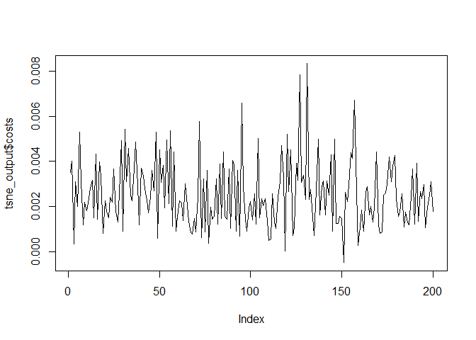

Introduction to advanced dimensionality reduction
================
Mburu
4/8/2020

## Exploring MNIST dataset

You will use the MNIST dataset in several exercises through the course.
Let’s do some data exploration to gain a better understanding. Remember
that the MNIST dataset contains a set of records that represent
handwritten digits using 28x28 features, which are stored into a
784-dimensional vector.

mnistInput  Each record of the MNIST
dataset corresponds to a handwritten digit and each feature represents
one pixel of the digit image. In this exercise, a sample of 200 records
of the MNIST dataset named mnist\_sample is loaded for you.

``` r
load("mnist-sample-200.RData")
# Have a look at the MNIST dataset names
#names(mnist_sample)

# Show the first records
#str(mnist_sample)

# Labels of the first 6 digits
head(mnist_sample$label)
```

    ## [1] 5 0 7 0 9 3

## Digits features

Let’s continue exploring the dataset. Firstly, it would be helpful to
know how many different digits are present by computing a histogram of
the labels. Next, the basic statistics (min, mean, median, maximum) of
the features for all digits can be calculated. Finally, you will compute
the basic statistics for only those digits with label 0. The MNIST
sample data is loaded for you as mnist\_sample.

``` r
# Plot the histogram of the digit labels
hist(mnist_sample$label)
```

<!-- -->

``` r
# Compute the basic statistics of all records
#summary(mnist_sample)

# Compute the basic statistics of digits with label 0
#summary(mnist_sample[, mnist_sample$label == 0])
```

## Euclidean distance

Euclidean distance is the basis of many measures of similarity and is
the most important distance metric. You can compute the Euclidean
distance in R using the dist() function. In this exercise, you will
compute the Euclidean distance between the first 10 records of the MNIST
sample data.

The mnist\_sample object is loaded for you.

``` r
# Show the labels of the first 10 records
mnist_sample$label[1:10]
```

    ##  [1] 5 0 7 0 9 3 4 1 2 6

``` r
# Compute the Euclidean distance of the first 10 records
distances <- dist(mnist_sample[1:10, -1])

# Show the distances values
distances
```

    ##           1        2        3        4        5        6        7        8
    ## 2  2185.551                                                               
    ## 3  2656.407 2869.979                                                      
    ## 4  2547.027 2341.249 2936.772                                             
    ## 5  2406.509 2959.108 1976.406 2870.928                                    
    ## 6  2343.982 2759.681 2452.568 2739.470 2125.723                           
    ## 7  2464.388 2784.158 2573.667 2870.918 2174.322 2653.703                  
    ## 8  2149.872 2668.903 1999.892 2585.980 2067.044 2273.248 2407.962         
    ## 9  2959.129 3209.677 2935.262 3413.821 2870.746 3114.508 2980.663 2833.447
    ## 10 2728.657 3009.771 2574.752 2832.521 2395.589 2655.864 2464.301 2550.126
    ##           9
    ## 2          
    ## 3          
    ## 4          
    ## 5          
    ## 6          
    ## 7          
    ## 8          
    ## 9          
    ## 10 2695.166

``` r
# Plot the numeric matrix of the distances in a heatmap
heatmap(as.matrix(distances), 
        Rowv = NA, symm = TRUE, 
        labRow = mnist_sample$label[1:10], 
        labCol = mnist_sample$label[1:10])
```

<!-- -->

## Minkowsky distance

There are other well-known distance metrics besides the Euclidean
distance, like the Minkowski distance. This metric can be considered a
generalisation of both the Euclidean and Manhattan distance. In R, you
can calculate the Minkowsky distance of order p by using dist(…, method
= “minkowski”, p).

The MNIST sample data is loaded for you as mnist\_sample

``` r
# Minkowski distance or order 3
distances_3 <- dist(mnist_sample[1:10, -1], method = "minkowski", p = 3)

distances_3 
```

    ##            1         2         3         4         5         6         7
    ## 2  1002.6468                                                            
    ## 3  1169.6470 1228.8295                                                  
    ## 4  1127.4919 1044.9182 1249.6133                                        
    ## 5  1091.3114 1260.3549  941.1654 1231.7432                              
    ## 6  1063.7026 1194.1212 1104.2581 1189.9558  996.2687                    
    ## 7  1098.4279 1198.8891 1131.4498 1227.7888 1005.7588 1165.4475          
    ## 8  1006.9070 1169.4720  950.6812 1143.3503  980.6450 1056.1814 1083.2255
    ## 9  1270.0240 1337.2068 1257.4052 1401.2461 1248.0777 1319.2768 1271.7095
    ## 10 1186.9620 1268.1539 1134.0371 1219.1388 1084.5416 1166.9129 1096.3586
    ##            8         9
    ## 2                     
    ## 3                     
    ## 4                     
    ## 5                     
    ## 6                     
    ## 7                     
    ## 8                     
    ## 9  1236.9178          
    ## 10 1133.2929 1180.7970

``` r
heatmap(as.matrix(distances_3 ), 
        Rowv = NA, symm = TRUE, 
        labRow = mnist_sample$label[1:10], 
        labCol = mnist_sample$label[1:10])
```

<!-- -->

``` r
# Minkowski distance of order 2
distances_2 <- dist(mnist_sample[1:10, -1], method = "minkowski", p = 2)
distances_2
```

    ##           1        2        3        4        5        6        7        8
    ## 2  2185.551                                                               
    ## 3  2656.407 2869.979                                                      
    ## 4  2547.027 2341.249 2936.772                                             
    ## 5  2406.509 2959.108 1976.406 2870.928                                    
    ## 6  2343.982 2759.681 2452.568 2739.470 2125.723                           
    ## 7  2464.388 2784.158 2573.667 2870.918 2174.322 2653.703                  
    ## 8  2149.872 2668.903 1999.892 2585.980 2067.044 2273.248 2407.962         
    ## 9  2959.129 3209.677 2935.262 3413.821 2870.746 3114.508 2980.663 2833.447
    ## 10 2728.657 3009.771 2574.752 2832.521 2395.589 2655.864 2464.301 2550.126
    ##           9
    ## 2          
    ## 3          
    ## 4          
    ## 5          
    ## 6          
    ## 7          
    ## 8          
    ## 9          
    ## 10 2695.166

``` r
heatmap(as.matrix(distances_2), 
        Rowv = NA, symm = TRUE, 
        labRow = mnist_sample$label[1:10], 
        labCol = mnist_sample$label[1:10])
```

<!-- -->

  - Very Good\! As you can see, when using Minkowski distance of order 2
    the most similar digits are in positions 3 and 5 of the heatmap grid
    which corresponds to digits 7 and 9.

## KL divergence

There are more distance metrics that can be used to compute how similar
two feature vectors are. For instance, the philentropy package has the
function distance(), which implements 46 different distance metrics. For
more information, use ?distance in the console. In this exercise, you
will compute the KL divergence and check if the results differ from the
previous metrics. Since the KL divergence is a measure of the difference
between probability distributions you need to rescale the input data by
dividing each input feature by the total pixel intensities of that
digit. The philentropy package and mnist\_sample data have been loaded.

``` r
library(philentropy)
library(tidyverse)
# Get the first 10 records
mnist_10 <- mnist_sample[1:10, -1]

# Add 1 to avoid NaN when rescaling
mnist_10_prep <- mnist_10 + 1 

# Compute the sums per row
sums <- rowSums(mnist_10_prep)

# Compute KL divergence
distances <- distance(mnist_10_prep/sums, method = "kullback-leibler")
heatmap(as.matrix(distances), 
        Rowv = NA, symm = TRUE, 
        labRow = mnist_sample$label[1:10], 
        labCol = mnist_sample$label[1:10])
```

<!-- -->

## Generating PCA from MNIST sample

You are going to compute a PCA with the previous mnist\_sample dataset.
The goal is to have a good representation of each digit in a lower
dimensional space. PCA will give you a set of variables, named principal
components, that are a linear combination of the input variables. These
principal components are ordered in terms of the variance they capture
from the original data. So, if you plot the first two principal
components you can see the digits in a 2-dimensional space. A sample of
200 records of the MNIST dataset named mnist\_sample is loaded for you.

``` r
# Get the principal components from PCA
pca_output <- prcomp(mnist_sample[, -1])

# Observe a summary of the output
#summary(pca_output)

# Store the first two coordinates and the label in a data frame
pca_plot <- data.frame(pca_x = pca_output$x[, "PC1"], pca_y = pca_output$x[, "PC2"], 
                       label = as.factor(mnist_sample$label))

# Plot the first two principal components using the true labels as color and shape
ggplot(pca_plot, aes(x = pca_x, y = pca_y, color = label)) + 
    ggtitle("PCA of MNIST sample") + 
    geom_text(aes(label = label)) + 
    theme(legend.position = "none")
```

<!-- -->

## t-SNE output from MNIST sample

You have seen that PCA has some limitations in correctly classifying
digits, mainly due to its linear nature. In this exercise, you are going
to use the output from the t-SNE algorithm on the MNIST sample data,
named tsne\_output and visualize the obtained results. In the next
chapter, you will focus on the t-SNE algorithm and learn more about how
to use it\! The MNIST sample dataset mnist\_sample as well as the
tsne\_output are available in your workspace.

``` r
# Explore the tsne_output structure
library(Rtsne)
library(tidyverse)
tsne_output <- Rtsne(mnist_sample[, -1])
#str(tsne_output)

# Have a look at the first records from the t-SNE output
#head(tsne_output)

# Store the first two coordinates and the label in a data.frame
tsne_plot <- data.frame(tsne_x = tsne_output$Y[, 1], tsne_y = tsne_output$Y[, 2], 
                        label = as.factor(mnist_sample$label))

# Plot the t-SNE embedding using the true labels as color and shape
ggplot(tsne_plot, aes(x =tsne_x, y = tsne_y, color = label)) + 
    ggtitle("T-Sne output") + 
    geom_text(aes(label = label)) + 
    theme(legend.position = "none")
```

<!-- -->

## Computing t-SNE

As we have seen, the t-SNE embedding can be computed in R using the
Rtsne() function from the Rtsne package in CRAN. Performing a PCA is a
common step before running the t-SNE algorithm, but we can skip this
step by setting the parameter PCA to FALSE. The dimensionality of the
embedding generated by t-SNE can be indicated with the dims parameter.
In this exercise, we will generate a three-dimensional embedding from
the mnist\_sample dataset without doing the PCA step and then, we will
plot the first two dimensions. The MNIST sample dataset mnist\_sample,
as well as the Rtsne and ggplot2 packages, are already loaded.

``` r
# Compute t-SNE without doing the PCA step
tsne_output <- Rtsne(mnist_sample[,-1], PCA = FALSE, dim = 3)

# Show the obtained embedding coordinates
head(tsne_output$Y)
```

    ##            [,1]       [,2]       [,3]
    ## [1,]  -1.460472 -6.1932623   7.038605
    ## [2,] -12.492553 -8.3123051   3.345346
    ## [3,]   7.093120 -3.6227667  -2.981240
    ## [4,]  -5.784838 11.7814389 -10.603385
    ## [5,]   6.754073 -0.6516148  -1.526199
    ## [6,]   5.019982 -8.8913906   5.947056

``` r
# Store the first two coordinates and plot them 
tsne_plot <- data.frame(tsne_x = tsne_output$Y[, 1], tsne_y = tsne_output$Y[, 2], 
                        digit = as.factor(mnist_sample$label))

# Plot the coordinates
ggplot(tsne_plot, aes(x = tsne_x, y = tsne_y, color = digit)) + 
    ggtitle("t-SNE of MNIST sample") + 
    geom_text(aes(label = digit)) + 
    theme(legend.position = "none")
```

<!-- -->

## Understanding t-SNE output

The most important t-SNE output are those related to the K-L divergence
of the points in the original high dimensions and in the new lower
dimensional space. Remember that the goal of t-SNE is to minimize the
K-L divergence between the original space and the new one. In the
returned object, the itercosts structure indicates the total cost from
the K-L divergence of all the objects in each 50th iteration and the
cost structure indicates the K-L divergence of each record in the final
iteration. The Rtsne package and the tsne\_output object have been
loaded for you.

``` r
# Inspect the output object's structure
str(tsne_output)
```

    ## List of 14
    ##  $ N                  : int 200
    ##  $ Y                  : num [1:200, 1:3] -1.46 -12.49 7.09 -5.78 6.75 ...
    ##  $ costs              : num [1:200] 0.00351 0.00401 0.00034 0.00312 0.002 ...
    ##  $ itercosts          : num [1:20] 53.1 52.7 53.4 52.8 53.2 ...
    ##  $ origD              : int 50
    ##  $ perplexity         : num 30
    ##  $ theta              : num 0.5
    ##  $ max_iter           : num 1000
    ##  $ stop_lying_iter    : int 250
    ##  $ mom_switch_iter    : int 250
    ##  $ momentum           : num 0.5
    ##  $ final_momentum     : num 0.8
    ##  $ eta                : num 200
    ##  $ exaggeration_factor: num 12

``` r
# Show total costs after each 50th iteration
tsne_output$itercosts
```

    ##  [1] 53.0600526 52.7333456 53.4169526 52.8101826 53.2303741  0.9781784
    ##  [7]  0.6574024  0.5911181  0.5631506  0.5431959  0.5379359  0.5361214
    ## [13]  0.5353776  0.5321724  0.5224264  0.5172246  0.5166569  0.5114177
    ## [19]  0.5076454  0.5062062

``` r
# Plot the evolution of the KL divergence at each 50th iteration
plot(tsne_output$itercosts, type = "l")
```

<!-- -->

``` r
# Inspect the output object's structure
str(tsne_output)
```

    ## List of 14
    ##  $ N                  : int 200
    ##  $ Y                  : num [1:200, 1:3] -1.46 -12.49 7.09 -5.78 6.75 ...
    ##  $ costs              : num [1:200] 0.00351 0.00401 0.00034 0.00312 0.002 ...
    ##  $ itercosts          : num [1:20] 53.1 52.7 53.4 52.8 53.2 ...
    ##  $ origD              : int 50
    ##  $ perplexity         : num 30
    ##  $ theta              : num 0.5
    ##  $ max_iter           : num 1000
    ##  $ stop_lying_iter    : int 250
    ##  $ mom_switch_iter    : int 250
    ##  $ momentum           : num 0.5
    ##  $ final_momentum     : num 0.8
    ##  $ eta                : num 200
    ##  $ exaggeration_factor: num 12

``` r
# Show the K-L divergence of each record after the final iteration
tsne_output$costs
```

    ##   [1]  3.510694e-03  4.014380e-03  3.399503e-04  3.116813e-03  1.998067e-03
    ##   [6]  5.295365e-03  3.097613e-03  1.176674e-03  2.194111e-03  1.819454e-03
    ##  [11]  2.176586e-03  2.816377e-03  3.178049e-03  1.505123e-03  4.322420e-03
    ##  [16]  1.429444e-03  3.994219e-03  3.368408e-03  8.105423e-04  2.269680e-03
    ##  [21]  1.790155e-03  1.503804e-03  2.412824e-03  2.209074e-03  3.658691e-03
    ##  [26]  1.777031e-03  1.321459e-03  2.613802e-03  4.927057e-03  9.089421e-04
    ##  [31]  5.422394e-03  3.102336e-03  4.583807e-03  2.474345e-03  2.245030e-03
    ##  [36]  3.690710e-03  4.875599e-03  2.924787e-03  1.191528e-03  3.716387e-03
    ##  [41]  3.347512e-03  2.787089e-03  2.287692e-03  1.721511e-03  2.406816e-03
    ##  [46]  3.591621e-03  2.694612e-03  5.298042e-03  5.826777e-04  4.512990e-03
    ##  [51]  3.079525e-03  3.835609e-03  1.931707e-03  4.952366e-03  2.122650e-03
    ##  [56]  5.362505e-03  1.132590e-03  4.427847e-03  9.192753e-04  1.562588e-03
    ##  [61]  2.272102e-03  2.167325e-03  1.373382e-03  3.016905e-03  2.381469e-03
    ##  [66]  1.358371e-03  8.306517e-04  7.688977e-04  1.465264e-03  8.785042e-04
    ##  [71]  2.460177e-03  5.782238e-03  6.287008e-04  3.223901e-03  8.883507e-04
    ##  [76]  3.621757e-03  3.568860e-04  1.959920e-03  1.443442e-03  1.579128e-03
    ##  [81]  3.237931e-03  1.223097e-03  3.878663e-03  1.464554e-03  4.423942e-03
    ##  [86]  1.551298e-03  1.449243e-03  3.665135e-03  1.018060e-03  4.058305e-03
    ##  [91]  3.846286e-03  8.906747e-04  3.605945e-03  6.974179e-04  6.598074e-03
    ##  [96]  2.871420e-03  1.442550e-03  9.128312e-04  1.934869e-03  2.212586e-03
    ## [101]  1.399555e-03  2.564200e-03  1.228764e-03  5.008861e-03  1.517537e-03
    ## [106]  2.341005e-03  2.021880e-03  2.350584e-03  1.334961e-03  4.838182e-04
    ## [111]  5.508494e-04  2.561830e-03  1.320251e-03  1.030050e-03  2.446770e-03
    ## [116]  3.098849e-03  4.721136e-03  3.294472e-03  2.836514e-05  5.223483e-03
    ## [121]  2.653768e-03  4.519973e-03  7.308058e-04  1.078205e-03  3.933286e-03
    ## [126]  3.180048e-03  7.847086e-03  3.085181e-03  3.379623e-03  2.313841e-03
    ## [131]  8.335098e-03  2.332418e-03  2.771790e-03  1.521104e-03  7.066971e-04
    ## [136]  2.733745e-03  4.983014e-03  1.612907e-03  2.902885e-03  3.134974e-03
    ## [141]  1.636203e-03  3.126543e-03  2.521571e-03  4.282465e-03  8.976787e-04
    ## [146]  4.986615e-03  1.265403e-03  1.263468e-03  1.559091e-03  1.456479e-03
    ## [151] -4.866983e-04  2.642184e-03  2.240468e-03  2.951441e-03  4.392115e-03
    ## [156]  4.139658e-03  6.703652e-03  2.633586e-03  2.817708e-04  1.080615e-03
    ## [161]  1.860005e-03  8.989340e-04  2.658732e-03  2.894604e-03  1.626662e-03
    ## [166]  2.017572e-03  1.327403e-03  1.948792e-03  4.433392e-03  1.152057e-03
    ## [171]  8.218628e-04  8.784308e-04  2.498577e-03  2.595220e-03  3.019654e-03
    ## [176]  4.203535e-03  3.104543e-03  3.782194e-03  4.259927e-03  2.349967e-03
    ## [181]  1.563214e-03  1.739218e-03  2.562061e-03  1.101402e-03  1.754089e-03
    ## [186]  1.287885e-03  1.198228e-03  2.433430e-03  3.659510e-03  1.216469e-03
    ## [191]  3.924036e-03  1.337725e-03  2.664319e-03  2.364651e-03  2.983918e-03
    ## [196]  1.074708e-03  1.980845e-03  2.494699e-03  3.115827e-03  1.778687e-03

``` r
# Plot the K-L divergence of each record after the final iteration
plot(tsne_output$costs, type = "l")
```

<!-- -->

## Reproducing results

t-SNE is a stochastic algorithm, meaning there is some randomness
inherent to the process. To ensure reproducible results it is necessary
to fix a seed before every new execution. This way, you can tune the
algorithm hyper-parameters and isolate the effect of the randomness. In
this exercise, the goal is to generate two embeddings and check that
they are identical. The mnist\_sample dataset is available in your
workspace.

``` r
# Generate a three-dimensional t-SNE embedding without PCA
tsne_output <- Rtsne(mnist_sample[, -1], PCA = FALSE, dim = 3)

# Generate a new t-SNE embedding with the same hyper-parameter values
tsne_output_new <- Rtsne(mnist_sample[, -1], PCA = FALSE, dim = 3)

# Check if the two outputs are identical
identical(tsne_output, tsne_output_new)
```

    ## [1] FALSE

``` r
# Generate a three-dimensional t-SNE embedding without PCA
set.seed(1234)
tsne_output <- Rtsne(mnist_sample[, -1], PCA = FALSE, dims = 3)

# Generate a new t-SNE embedding with the same hyper-parameter values
set.seed(1234)
tsne_output_new <- Rtsne(mnist_sample[, -1], PCA = FALSE, dims = 3)

# Check if the two outputs are identical
identical(tsne_output, tsne_output_new)
```

    ## [1] TRUE

## Optimal number of iterations

A common hyper-parameter to optimize in t-SNE is the optimal number of
iterations. As you have seen before it is important to always use the
same seed before you can compare different executions. To optimize the
number of iterations, you can increase the max\_iter parameter of
Rtsne() and observe the returned itercosts to find the minimum K-L
divergence. The mnist\_sample dataset and the Rtsne package have been
loaded for you.

``` r
# Set seed to ensure reproducible results
set.seed(1234)

# Execute a t-SNE with 2000 iterations
tsne_output <- Rtsne(mnist_sample[, -1], max_iter = 2000,PCA = TRUE, dims = 2)

# Observe the output costs 
tsne_output$itercosts
```

    ##  [1] 53.2961580 52.7595763 52.9243318 53.8975509 54.7866761  1.0907342
    ##  [7]  0.8668795  0.7939365  0.7715459  0.7389568  0.7034065  0.6829576
    ## [13]  0.6743824  0.6518515  0.6480134  0.6477325  0.6462515  0.6463141
    ## [19]  0.6497671  0.6492903  0.6500593  0.6502865  0.6503155  0.6505163
    ## [25]  0.6514624  0.6505526  0.6508033  0.6533249  0.6503375  0.6488921
    ## [31]  0.6504220  0.6475876  0.6502446  0.6494466  0.6461031  0.6398683
    ## [37]  0.6369844  0.6387022  0.6398072  0.6383595

``` r
# Get the 50th iteration with the minimum K-L cost
which.min(tsne_output$itercosts)
```

    ## [1] 37

## Perplexity of MNIST sample

The perplexity parameter indicates the balance between the local and
global aspect of the input data. The parameter is an estimate of the
number of close neighbors of each original point. Typical values of this
parameter fall in the range of 5 to 50. We will generate three different
t-SNE executions with the same number of iterations and perplexity
values of 5, 20, and 50 and observe the differences in the K-L
divergence costs. The optimal number of iterations we found in the last
exercise (1200) will be used here. The mnist\_sample dataset and the
Rtsne package have been loaded for you.

``` r
# Set seed to ensure reproducible results
par(mfrow = c(3, 1))
set.seed(1234)

perp <- c(5, 20, 50)
models <- list()
for (i in 1:length(perp)) {
        
        # Execute a t-SNE with perplexity 5
        perplexity  = perp[i]
        tsne_output <- Rtsne(mnist_sample[, -1], perplexity = perplexity, max_iter = 1300)
        # Observe the returned K-L divergence costs at every 50th iteration
        models[[i]] <- tsne_output
        plot(tsne_output$itercosts,
             main = paste("Perplexity", perplexity),
             type = "l", ylab = "itercosts")
}
```

<!-- -->

``` r
names(models) <- paste0("perplexity",perp)
```

## Perplexity of bigger MNIST dataset

Now, let’s investigate the effect of the perplexity values with a bigger
MNIST dataset of 10.000 records. It would take a lot of time to execute
t-SNE for this many records on the DataCamp platform. This is why the
pre-loaded output of two t-SNE embeddings with perplexity values of 5
and 50, named tsne\_output\_5 and tsne\_output\_50 are available in the
workspace. We will look at the K-L costs and plot them using the digit
label from the mnist\_10k dataset, which is also available in the
environment. The Rtsne and ggplot2 packages have been loaded.

  - I used mnist smaller data set

<!-- end list -->

``` r
# Observe the K-L divergence costs with perplexity 5 and 50
tsne_output_5 <- models$perplexity5
tsne_output_50  <- models$perplexity50
# Generate the data frame to visualize the embedding
tsne_plot_5 <- data.frame(tsne_x = tsne_output_5$Y[, 1], tsne_y = tsne_output_5$Y[, 2], digit = as.factor(mnist_sample$label))

tsne_plot_50 <- data.frame(tsne_x = tsne_output_50$Y[, 1], tsne_y = tsne_output_50$Y[, 2], digit = as.factor(mnist_sample$label))

# Plot the obtained embeddings
ggplot(tsne_plot_5, aes(x = tsne_x, y = tsne_y, color = digit)) + 
    ggtitle("MNIST t-SNE with 1300 iter and Perplexity=5") +
    geom_text(aes(label = digit)) + 
    theme(legend.position="none")
```

<!-- -->

``` r
ggplot(tsne_plot_50, aes(x = tsne_x, y = tsne_y, color = digit)) + 
    ggtitle("MNIST t-SNE with 1300 iter and Perplexity=50") + 
    geom_text(aes(label = digit)) + 
    theme(legend.position="none")
```

<!-- -->

## Plotting spatial distribution of true classes

As seen in the video, you can use the obtained representation of t-SNE
in a lower dimension space to classify new digits based on the Euclidean
distance to known clusters of digits. For this task, let’s start with
plotting the spatial distribution of the digit labels in the embedding
space. You are going to use the output of a t-SNE execution of 10K MNIST
records named tsne and the true labels can be found in a dataset named
mnist\_10k. In this exercise, you will use the first 5K records of tsne
and mnist\_10k datasets and the goal is to visualize the obtained t-SNE
embedding. The ggplot2 package has been loaded for you.

``` r
library(data.table)
mnist_10k <- readRDS("mnist_10k.rds") %>% setDT()
tsne <- Rtsne(mnist_10k[, -1], perplexity = 50, max_iter = 1500)
# Prepare the data.frame
tsne_plot <- data.frame(tsne_x = tsne$Y[1:5000, 1], 
                        tsne_y = tsne$Y[1:5000, 2], 
                        digit = as.factor(mnist_10k[1:5000, ]$label))

# Plot the obtained embedding
ggplot(tsne_plot, aes(x = tsne_x, y = tsne_y, color = digit)) + 
    ggtitle("MNIST embedding of the first 5K digits") + 
    geom_text(aes(label = digit)) + 
    theme(legend.position="none")
```

<!-- -->

## Computing the centroids of each class

Since the previous visual representation of the digit in a low
dimensional space makes sense, you want to compute the centroid of each
class in this lower dimensional space. This centroid can be used as a
prototype of the digit and you can classify new digits based on their
Euclidean distance to these ones. The MNIST data mnist\_10k and t-SNE
output tsne are available in the workspace. The data.table package has
been loaded for you.

``` r
# Get the first 5K records and set the column names
dt_prototypes <- as.data.table(tsne$Y[1:5000,])
setnames(dt_prototypes, c("X","Y"))

# Paste the label column as factor
dt_prototypes[, label := as.factor(mnist_10k[1:5000,]$label)]

# Compute the centroids per label
dt_prototypes[, mean_X := mean(X), by = label]
dt_prototypes[, mean_Y := mean(Y), by = label]

# Get the unique records per label
dt_prototypes <- unique(dt_prototypes, by = "label")
dt_prototypes
```

    ##              X          Y label     mean_X     mean_Y
    ##  1:  35.905392  16.980593     7  30.998559  13.900153
    ##  2:  16.688802   3.686773     4  22.973958  -5.162532
    ##  3:   9.011413  24.546506     1   1.342618  34.936178
    ##  4:   9.085808 -27.024510     6   3.354923 -28.237957
    ##  5: -11.568422  -6.258058     5  -6.206452  -8.719360
    ##  6:  -6.156797   7.933667     8  -8.753761   6.772841
    ##  7: -35.044337   2.062595     3 -26.138387  -1.341698
    ##  8: -29.569892  17.242459     2 -20.182239  21.649087
    ##  9: -19.941166 -31.414888     0 -18.318613 -32.757914
    ## 10:  28.251837   3.109439     9  20.572886  -3.998459

## Computing similarities of digits 1 and 0

One way to measure the label similarity for each digit is by computing
the Euclidean distance in the lower dimensional space obtained from the
t-SNE algorithm. You need to use the previously calculated centroids
stored in dt\_prototypes and compute the Euclidean distance to the
centroid of digit 1 for the last 5000 records from tsne and mnist\_10k
datasets that are labeled either as 1 or 0. Note that the last 5000
records of tsne were not used before. The MNIST data mnist\_10k and
t-SNE output tsne are available in the workspace. The data.table package
has been loaded for you.

``` r
# Store the last 5000 records in distances and set column names
distances <- as.data.table(tsne$Y[5001:10000,])
setnames(distances, c("X", "Y"))
# Paste the true label
distances[, label := mnist_10k[5001:10000,]$label]
distances[, mean_X := mean(X), by = label]
distances[, mean_Y := mean(Y), by = label]


# Filter only those labels that are 1 or 0 
distances_filtered <- distances[label == 1 | label == 0]

# Compute Euclidean distance to prototype of digit 1
distances_filtered[, dist_1 := sqrt( (X - dt_prototypes[label == 1,]$mean_X)^2 + 
                             (Y - dt_prototypes[label == 1,]$mean_Y)^2)]
```

## Plotting similarities of digits 1 and 0

In distances, the distances of 1108 records to the centroid of digit 1
are stored in dist\_1. Those records correspond to digits you already
know are 1’s or 0’s. You can have a look at the basic statistics of the
distances from records that you know are 0 and 1 (label column) to the
centroid of class 1 using summary(). Also, if you plot a histogram of
those distances and fill them with the label you can check if you are
doing a good job identifying the two classes with this t-SNE classifier.
The data.table and ggplot2 packages, as well as the distances object,
have been loaded for you.

``` r
# Compute the basic statistics of distances from records of class 1
summary(distances_filtered[label == 1]$dist_1)
```

    ##    Min. 1st Qu.  Median    Mean 3rd Qu.    Max. 
    ##  0.4179  6.4020  9.3713  9.3682 12.1767 56.4937

``` r
# Compute the basic statistics of distances from records of class 0
summary(distances_filtered[label == 0]$dist_1)
```

    ##    Min. 1st Qu.  Median    Mean 3rd Qu.    Max. 
    ##   52.07   66.33   70.22   70.45   74.75   80.79

``` r
# Plot the histogram of distances of each class
ggplot(distances_filtered, 
       aes(x = dist_1, fill = as.factor(label))) +
    geom_histogram(binwidth = 5, alpha = .5, 
                   position = "identity", show.legend = FALSE) + 
    ggtitle("Distribution of Euclidean distance 1 vs 0")
```

<!-- -->

## Exploring credit card fraud dataset

In this exercise, you will do some data exploration on a sample of the
credit card fraud detection dataset from Kaggle. For any problem,
starting with some data exploration is a good practice and helps us
better understand the characteristics of the data.

The credit card fraud dataset is already loaded in the environment as a
data table with the name creditcard. As you saw in the video, it
consists of 30 numerical variables. The Class column indicates if the
transaction is fraudulent. The ggplot2 package has been loaded for you.

``` r
load("creditcard.RData") 

setDT(creditcard)
# Look at the data dimensions
dim(creditcard)
```

    ## [1] 28923    31

``` r
# Explore the column names
#names(creditcard)

# Explore the structure
#str(creditcard)

# Generate a summary
summary(creditcard)
```

    ##       Time              V1                  V2           
    ##  Min.   :    26   Min.   :-56.40751   Min.   :-72.71573  
    ##  1st Qu.: 54230   1st Qu.: -0.96058   1st Qu.: -0.58847  
    ##  Median : 84512   Median : -0.02400   Median :  0.08293  
    ##  Mean   : 94493   Mean   : -0.08501   Mean   :  0.05955  
    ##  3rd Qu.:139052   3rd Qu.:  1.30262   3rd Qu.:  0.84003  
    ##  Max.   :172788   Max.   :  2.41150   Max.   : 22.05773  
    ##        V3                 V4                  V5           
    ##  Min.   :-31.1037   Min.   :-5.071241   Min.   :-31.35675  
    ##  1st Qu.: -0.9353   1st Qu.:-0.824978   1st Qu.: -0.70869  
    ##  Median :  0.1659   Median : 0.007618   Median : -0.06071  
    ##  Mean   : -0.1021   Mean   : 0.073391   Mean   : -0.04367  
    ##  3rd Qu.:  1.0119   3rd Qu.: 0.789293   3rd Qu.:  0.61625  
    ##  Max.   :  3.8771   Max.   :16.491217   Max.   : 34.80167  
    ##        V6                  V7                  V8           
    ##  Min.   :-26.16051   Min.   :-43.55724   Min.   :-50.42009  
    ##  1st Qu.: -0.78792   1st Qu.: -0.57404   1st Qu.: -0.21025  
    ##  Median : -0.28396   Median :  0.02951   Median :  0.01960  
    ##  Mean   : -0.02722   Mean   : -0.08873   Mean   : -0.00589  
    ##  3rd Qu.:  0.37911   3rd Qu.:  0.57364   3rd Qu.:  0.33457  
    ##  Max.   : 20.37952   Max.   : 29.20587   Max.   : 20.00721  
    ##        V9                 V10                 V11          
    ##  Min.   :-13.43407   Min.   :-24.58826   Min.   :-4.11026  
    ##  1st Qu.: -0.66974   1st Qu.: -0.54827   1st Qu.:-0.75404  
    ##  Median : -0.06343   Median : -0.09843   Median :-0.01036  
    ##  Mean   : -0.04295   Mean   : -0.08468   Mean   : 0.06093  
    ##  3rd Qu.:  0.58734   3rd Qu.:  0.44762   3rd Qu.: 0.77394  
    ##  Max.   :  8.95567   Max.   : 15.33174   Max.   :12.01891  
    ##       V12                V13                 V14           
    ##  Min.   :-18.6837   Min.   :-3.844974   Min.   :-19.21432  
    ##  1st Qu.: -0.4365   1st Qu.:-0.661168   1st Qu.: -0.44507  
    ##  Median :  0.1223   Median :-0.009685   Median :  0.04865  
    ##  Mean   : -0.0943   Mean   :-0.002110   Mean   : -0.09653  
    ##  3rd Qu.:  0.6172   3rd Qu.: 0.664794   3rd Qu.:  0.48765  
    ##  Max.   :  4.8465   Max.   : 4.569009   Max.   :  7.75460  
    ##       V15                 V16                 V17          
    ##  Min.   :-4.498945   Min.   :-14.12985   Min.   :-25.1628  
    ##  1st Qu.:-0.595272   1st Qu.: -0.48770   1st Qu.: -0.4951  
    ##  Median : 0.045992   Median :  0.05736   Median : -0.0742  
    ##  Mean   :-0.007251   Mean   : -0.06186   Mean   : -0.1046  
    ##  3rd Qu.: 0.646584   3rd Qu.:  0.52147   3rd Qu.:  0.3956  
    ##  Max.   : 5.784514   Max.   :  5.99826   Max.   :  7.2150  
    ##       V18                V19                 V20            
    ##  Min.   :-9.49875   Min.   :-4.395283   Min.   :-20.097918  
    ##  1st Qu.:-0.51916   1st Qu.:-0.462158   1st Qu.: -0.211663  
    ##  Median :-0.01595   Median : 0.010494   Median : -0.059160  
    ##  Mean   :-0.04344   Mean   : 0.009424   Mean   :  0.006943  
    ##  3rd Qu.: 0.48634   3rd Qu.: 0.471172   3rd Qu.:  0.141272  
    ##  Max.   : 3.88618   Max.   : 5.228342   Max.   : 24.133894  
    ##       V21                  V22                 V23           
    ##  Min.   :-22.889347   Min.   :-8.887017   Min.   :-36.66600  
    ##  1st Qu.: -0.230393   1st Qu.:-0.550210   1st Qu.: -0.16093  
    ##  Median : -0.028097   Median :-0.000187   Median : -0.00756  
    ##  Mean   :  0.004995   Mean   :-0.006271   Mean   :  0.00418  
    ##  3rd Qu.:  0.190465   3rd Qu.: 0.516596   3rd Qu.:  0.15509  
    ##  Max.   : 27.202839   Max.   : 8.361985   Max.   : 13.65946  
    ##       V24                 V25                 V26           
    ##  Min.   :-2.822684   Min.   :-6.712624   Min.   :-1.658162  
    ##  1st Qu.:-0.354367   1st Qu.:-0.319410   1st Qu.:-0.328496  
    ##  Median : 0.038722   Median : 0.011815   Median :-0.054131  
    ##  Mean   : 0.000741   Mean   :-0.002847   Mean   :-0.002546  
    ##  3rd Qu.: 0.440797   3rd Qu.: 0.351797   3rd Qu.: 0.237782  
    ##  Max.   : 3.962197   Max.   : 5.376595   Max.   : 3.119295  
    ##       V27                 V28               Amount        
    ##  Min.   :-8.358317   Min.   :-8.46461   Min.   :    0.00  
    ##  1st Qu.:-0.071275   1st Qu.:-0.05424   1st Qu.:    5.49  
    ##  Median : 0.002727   Median : 0.01148   Median :   22.19  
    ##  Mean   :-0.000501   Mean   : 0.00087   Mean   :   87.90  
    ##  3rd Qu.: 0.095974   3rd Qu.: 0.08238   3rd Qu.:   78.73  
    ##  Max.   : 7.994762   Max.   :33.84781   Max.   :11898.09  
    ##     Class          
    ##  Length:28923      
    ##  Class :character  
    ##  Mode  :character  
    ##                    
    ##                    
    ## 

``` r
# Plot a histogram of the transaction time
ggplot(creditcard, aes(x = Time)) + 
    geom_histogram()
```

<!-- -->

## Generating training and test sets

Before we can apply the t-SNE algorithm to perform a dimensionality
reduction, we need to split the original data into a training and test
set. Next, we will perform an under-sampling of the majority class and
generate a balanced training set. Generating a balanced dataset is a
good practice when we are using tree-based models. In this exercise you
already have the creditcard dataset loaded in the environment. The
ggplot2 and data.table packages are already loaded.

``` r
# Extract positive and negative instances of fraud
creditcard_pos <- creditcard[Class == 1]
creditcard_neg <- creditcard[Class == 0]

# Fix the seed
set.seed(1234)

# Create a new negative balanced dataset by undersampling
creditcard_neg_bal <- creditcard_neg[sample(1:nrow(creditcard_neg), nrow(creditcard_pos))]

# Generate a balanced train set
creditcard_train <- rbind(creditcard_pos, creditcard_neg_bal)
```

## Training a random forest with original features

In this exercise, we are going to train a random forest model using the
original features from the credit card dataset. The goal is to detect
new fraud instances in the future and we are doing that by learning the
patterns of fraud instances in the balanced training set. Remember that
a random forest can be trained with the following piece of code:
randomForest(x = features, y = label, ntree = 100) The only
pre-processing that has been done to the original features was to scale
the Time and Amount variables. You have the balanced training dataset
available in the environment as creditcard\_train. The randomForest
package has been loaded.

``` r
# Fix the seed
set.seed(1234)
library(randomForest)
# Separate x and y sets
train_x <- creditcard_train[,-31]
train_y <- creditcard_train$Class %>% as.factor()

# Train a random forests
rf_model <- randomForest(x = train_x, y = train_y, ntree = 100)

# Plot the error evolution and variable importance
plot(rf_model, main = "Error evolution vs number of trees")
# Fix the seed
set.seed(1234)

# Separate x and y sets
train_x <- creditcard_train[,-31]
train_y <- creditcard_train$Class %>%as.factor()

# Train a random forests
rf_model <- randomForest(x = train_x, y = train_y, ntree = 100)

# Plot the error evolution and variable importance
plot(rf_model, main = "Error evolution vs number of trees")
legend("topright", colnames(rf_model$err.rate),col=1:3,cex=0.8,fill=1:3)
```

<!-- -->

``` r
varImpPlot(rf_model, main = "Variable importance")
```

<!-- -->

## Computing and visualising the t-SNE embedding

In this exercise, we are going to generate a t-SNE embedding using only
the balanced training set creditcard\_train. The idea is to train a
random forest using the two coordinates of the generated embedding
instead of the original 30 dimensions. Due to computational
restrictions, we are going to compute the embedding of the training data
only, but note that in order to generate predictions from the test set
we should compute the embedding of the test set together with the train
set. Then, we will visualize the obtained embedding highlighting the two
classes in order to clarify if we can differentiate between fraud and
non-fraud transactions. The creditcard\_train data, as well as the Rtsne
and ggplot2 packages, have been loaded.

``` r
# Set the seed
#set.seed(1234)

# Generate the t-SNE embedding 
creditcard_train[, Time := scale(Time)]
nms <- names(creditcard_train)
pred_nms <- nms[nms != "Class"]
range01 <- function(x){(x-min(x))/(max(x)-min(x))}
creditcard_train[, (pred_nms) := lapply(.SD ,range01), .SDcols = pred_nms]

tsne_output <- Rtsne(as.matrix(creditcard_train[, -31]), check_duplicates = FALSE, PCA = FALSE)

# Generate a data frame to plot the result
tsne_plot <- data.frame(tsne_x = tsne_output$Y[,1],
                        tsne_y = tsne_output$Y[,2],
                        Class = creditcard_train$Class)

# Plot the embedding usign ggplot and the label
ggplot(tsne_plot, aes(x = tsne_x, y = tsne_y, color = factor(Class))) + 
  ggtitle("t-SNE of credit card fraud train set") + 
  geom_text(aes(label = Class)) + theme(legend.position = "none")
```

<!-- -->

## Training a random forest with embedding features

In this exercise, we are going to train a random forest model using the
embedding features from the previous t-SNE embedding. So, in this case,
we are going to use a two-dimensional dataset that has been generated
from the original input features. In the rest of the chapter, we are
going to verify if we have a worse, similar, or better performance for
this model in comparison to the random forest trained with the original
features. In the environment two objects named train\_tsne\_x and
train\_tsne\_y that contain the features and the Class variable are
available. The randomForest package has been loaded as well.

``` r
# Fix the seed
set.seed(1234)
train_tsne_x <- tsne_output$Y
# Train a random forest
rf_model_tsne <- randomForest(x = train_tsne_x, y = train_y, ntree = 100)

# Plot the error evolution

plot(rf_model_tsne)
```

<!-- -->

``` r
# Plot the variable importance
varImpPlot(rf_model_tsne)
```

<!-- -->

## Predicting data using original features

In this exercise, we are using the random forest trained with the
original features and generate predictions using the test set. These
predictions will be plotted to see the distribution and will be
evaluated using the ROCR package by considering the area under the
curve.

The random forest model, named rf\_model, and the test set, named
creditcard\_test, are available in the environment. The randomForest and
ROCR packages have been loaded for you

``` r
# Predict on the test set using the random forest 
creditcard_test <- creditcard
pred_rf <- predict(rf_model, creditcard_test, type = "prob")

# Plot a probability distibution of the target class
hist(pred_rf[,2])
```

<!-- -->

``` r
library(ROCR)
# Compute the area under the curve
pred <-  prediction(pred_rf[,2], creditcard_test$Class)
perf <- performance(pred, measure = "auc") 
perf@y.values
```

    ## [[1]]
    ## [1] 0.9995958

## Predicting data using embedding random forest

Now, we are going to do the same analysis, but instead of using the
random forest trained with the original features, we will make
predictions using the random forest trained with the t-SNE embedding
coordinates. The random forest model is pre-loaded in an object named
rf\_model\_tsne and the t-SNE embedding features from the original test
set are stored in the object test\_x. Finally, the test set labels are
stored in creditcard\_test. The randomForest and ROCR packages have been
loaded for you.

``` r
creditcard_test[, (pred_nms) := lapply(.SD ,range01), .SDcols = pred_nms]

tsne_output <- Rtsne(as.matrix(creditcard_test[, -31]), check_duplicates = FALSE, PCA = FALSE)

test_x <- tsne_output$Y
# Predict on the test set using the random forest generated with t-SNE features
pred_rf <- predict(rf_model_tsne, test_x, type = "prob")

# Plot a probability distibution of the target class
hist(pred_rf[, 2])
```

<!-- -->

``` r
# Compute the area under the curve
pred <- prediction(pred_rf[, 2] , creditcard_test$Class)
perf <- performance(pred, measure = "auc") 
perf@y.values
```

    ## [[1]]
    ## [1] 0.1952886

## Exploring neural network layer output

In this exercise, we will have a look at the data that is being
generated in a specific layer of a neural network. In particular, this
data corresponds to the third layer, composed of 128 neurons, of a
neural network trained with the balanced credit card fraud dataset
generated before. The goal of the exercise is to perform an exploratory
data analysis.

``` r
# Observe the dimensions
#dim(layer_128_train)

# Show the first six records of the last ten columns
#head(layer_128_train[, 119:128])

# Generate a summary of all columns
#summary(layer_128_train)
```

## Using t-SNE to visualise a neural network layer

Now, we would like to visualize the patterns obtained from the neural
network model, in particular from the last layer of the neural network.
As we mentioned before this last layer has 128 neurons and we have
pre-loaded the weights of these neurons in an object named
layer\_128\_train. The goal is to compute a t-SNE embedding using the
output of the neurons from this last layer and visualize the embedding
colored according to the class. The Rtsne and ggplot2 packages as well
as the layer\_128\_train and creditcard\_train have been loaded for you

``` r
# Set the seed
set.seed(1234)

# Generate the t-SNE
#tsne_output <- Rtsne(as.matrix(layer_128_train), check_duplicates = FALSE, max_iter = 400, perplexity = 50)

# Prepare data.frame
#tsne_plot <- data.frame(tsne_x = tsne_output$Y[, 1], tsne_y = tsne_output$Y[, 2], 
#                        Class = creditcard_train$Class)

# Plot the data 
# ggplot(tsne_plot, aes(x = tsne_x, y = tsne_y, color = Class)) + 
#   geom_point() + 
#   ggtitle("Credit card embedding of Last Neural Network Layer")
```

## Using t-SNE to visualise a neural network layer

Now, we would like to visualize the patterns obtained from the neural
network model, in particular from the last layer of the neural network.
As we mentioned before this last layer has 128 neurons and we have
pre-loaded the weights of these neurons in an object named
layer\_128\_train. The goal is to compute a t-SNE embedding using the
output of the neurons from this last layer and visualize the embedding
colored according to the class. The Rtsne and ggplot2 packages as well
as the layer\_128\_train and creditcard\_train have been loaded for you

``` r
# Set the seed
# set.seed(1234)
# 
# # Generate the t-SNE
# tsne_output <- Rtsne(as.matrix(layer_128_train), check_duplicates = FALSE, max_iter = 400, perplexity = 50)
# 
# # Prepare data.frame
# tsne_plot <- data.frame(tsne_x = tsne_output$Y[, 1], tsne_y = tsne_output$Y[, 2], 
#                         Class = creditcard_train$Class)
# 
# # Plot the data 
# ggplot(tsne_plot, aes(x = tsne_x, y = tsne_y, color = Class)) + 
#   geom_point() + 
#   ggtitle("Credit card embedding of Last Neural Network Layer")
```

## Exploring fashion MNIST

The Fashion MNIST dataset contains grayscale images of 10 clothing
categories. The first thing to do when you are analyzing a new dataset
is to perform an exploratory data analysis in order to understand the
data. A sample of the fashion MNIST dataset fashion\_mnist, with only
500 records, is pre-loaded for you.

``` r
library(data.table)
#load("fashion_mnist_500.RData")
fashion_mnist <- fread(unzip("fashionmnist.zip", "fashion-mnist_train.csv"))
set.seed(100)

ind <- sample(1:nrow(fashion_mnist), 1000)

fashion_mnist <- fashion_mnist[ind, ]
# Show the dimensions
dim(fashion_mnist)
```

    ## [1] 1000  785

``` r
# Create a summary of the last six columns 
summary(fashion_mnist[, 780:785])
```

    ##     pixel779         pixel780         pixel781        pixel782      
    ##  Min.   :  0.00   Min.   :  0.00   Min.   :  0.0   Min.   :  0.000  
    ##  1st Qu.:  0.00   1st Qu.:  0.00   1st Qu.:  0.0   1st Qu.:  0.000  
    ##  Median :  0.00   Median :  0.00   Median :  0.0   Median :  0.000  
    ##  Mean   : 22.16   Mean   : 18.64   Mean   : 10.6   Mean   :  3.781  
    ##  3rd Qu.:  1.00   3rd Qu.:  0.00   3rd Qu.:  0.0   3rd Qu.:  0.000  
    ##  Max.   :236.00   Max.   :255.00   Max.   :231.0   Max.   :188.000  
    ##     pixel783          pixel784     
    ##  Min.   :  0.000   Min.   : 0.000  
    ##  1st Qu.:  0.000   1st Qu.: 0.000  
    ##  Median :  0.000   Median : 0.000  
    ##  Mean   :  0.934   Mean   : 0.043  
    ##  3rd Qu.:  0.000   3rd Qu.: 0.000  
    ##  Max.   :147.000   Max.   :39.000

``` r
# Table with the class distribution
table(fashion_mnist$label)
```

    ## 
    ##   0   1   2   3   4   5   6   7   8   9 
    ## 100  94 115  90  97  98  97 105 102 102

## Visualizing fashion MNIST

In this exercise, we are going to visualize an example image of the
fashion MNIST dataset. Basically, we are going to plot the 28x28 pixels
values. To do this we use:

A custom ggplot theme named plot\_theme. A data structure named xy\_axis
where the pixels values are stored. A character vector named
class\_names with the names of each class. The fashion\_mnist dataset
with 500 examples is available in the workspace. The \`ggplot2 package
is loaded. Note that you can access the definition of the custom theme
by typing plot\_theme in the console.

``` r
library(tidyverse)
plot_theme <- list(
    raster = geom_raster(hjust = 0, vjust = 0),
    gradient_fill = scale_fill_gradient(low = "white",
                                        high = "black", guide = FALSE),
    theme = theme(axis.line = element_blank(),
                  axis.text = element_blank(),
                  axis.ticks = element_blank(),
                  axis.title = element_blank(),
                  panel.background = element_blank(),
                  panel.border = element_blank(),
                  panel.grid.major = element_blank(),
                  panel.grid.minor = element_blank(),
                  plot.background = element_blank()))
```

``` r
class_names <-  c("T-shirt/top", "Trouser", "Pullover", 
                  "Dress", "Coat", "Sandal", "Shirt",
                  "Sneaker", "Bag", "Ankle", "boot")


xy_axis <- data.frame(x = expand.grid(1:28, 28:1)[,1],
                      y = expand.grid(1:28, 28:1)[,2])

# Get the data from the last image
plot_data <- cbind(xy_axis, fill = as.data.frame(t(fashion_mnist[500, -1]))[,1])

# Observe the first records
head(plot_data)
```

    ##   x  y fill
    ## 1 1 28    0
    ## 2 2 28    0
    ## 3 3 28    0
    ## 4 4 28    0
    ## 5 5 28    0
    ## 6 6 28    0

``` r
# Plot the image using ggplot()
ggplot(plot_data, aes(x, y, fill = fill)) + 
  ggtitle(class_names[as.integer(fashion_mnist[500, 1])]) + 
  plot_theme 
```

<!-- -->

## Reducing data with GLRM

We are going to reduce the dimensionality of the fashion MNIST sample
data using the GLRM implementation of h2o. In order to do this, in the
next steps we are going to: Start a connection to a h2o cluster by
invoking the method h2o.init(). Store the fashion\_mnist data into the
h2o cluster with as.h2o(). Launch a GLRM model with K=2 (rank-2 model)
using the h2o.glrm() function. As we have discussed in the video
session, it is important to check the convergence of the objective
function. Note that here we are also fixing the seed to ensure the same
results. The h2o package and fashion\_mnist data are pre-loaded in the
environment.

``` r
library(h2o)
# Start a connection with the h2o cluster
h2o.init()
```

    ## 
    ## H2O is not running yet, starting it now...
    ## 
    ## Note:  In case of errors look at the following log files:
    ##     C:\Users\mmburu\AppData\Local\Temp\RtmpMFmGJI/h2o_mmburu_started_from_r.out
    ##     C:\Users\mmburu\AppData\Local\Temp\RtmpMFmGJI/h2o_mmburu_started_from_r.err
    ## 
    ## 
    ## Starting H2O JVM and connecting: . Connection successful!
    ## 
    ## R is connected to the H2O cluster: 
    ##     H2O cluster uptime:         5 seconds 400 milliseconds 
    ##     H2O cluster timezone:       Africa/Nairobi 
    ##     H2O data parsing timezone:  UTC 
    ##     H2O cluster version:        3.28.0.4 
    ##     H2O cluster version age:    2 months and 13 days  
    ##     H2O cluster name:           H2O_started_from_R_mmburu_cvk380 
    ##     H2O cluster total nodes:    1 
    ##     H2O cluster total memory:   3.97 GB 
    ##     H2O cluster total cores:    4 
    ##     H2O cluster allowed cores:  4 
    ##     H2O cluster healthy:        TRUE 
    ##     H2O Connection ip:          localhost 
    ##     H2O Connection port:        54321 
    ##     H2O Connection proxy:       NA 
    ##     H2O Internal Security:      FALSE 
    ##     H2O API Extensions:         Amazon S3, Algos, AutoML, Core V3, TargetEncoder, Core V4 
    ##     R Version:                  R version 3.6.1 (2019-07-05)

``` r
# Store the data into h2o cluster
fashion_mnist.hex <- as.h2o(fashion_mnist, "fashion_mnist.hex")
```

    ##   |                                                                         |                                                                 |   0%  |                                                                         |=================================================================| 100%

``` r
# Launch a GLRM model over fashion_mnist data
model_glrm <- h2o.glrm(training_frame = fashion_mnist.hex,
                       cols = 2:ncol(fashion_mnist), 
                       k = 2,
                       seed = 123,
                       max_iterations = 2100)
```

    ##   |                                                                         |                                                                 |   0%  |                                                                         |=                                                                |   1%  |                                                                         |=                                                                |   2%  |                                                                         |=================================================================| 100%

``` r
# Plotting the convergence
plot(model_glrm)
```

<!-- -->

## Improving model convergence

In the previous exercise, we didn’t get good convergence values for the
GLRM model. Improving convergence values can sometimes be achieved by
applying a transformation to the input data. In this exercise, we are
going to normalize the input data before we start building the GLRM
model. This can be achieved by setting the transform parameter of
h2o.glrm() equal to “NORMALIZE”. The h2o package and fashion\_mnist
dataset are pre-loaded.

``` r
# Start a connection with the h2o cluster
#h2o.init()

# Store the data into h2o cluster
#fashion_mnist.hex <- as.h2o(fashion_mnist, "fashion_mnist.hex")

# Launch a GLRM model with normalized fashion_mnist data  
model_glrm <- h2o.glrm(training_frame = fashion_mnist.hex, 
                       transform = "NORMALIZE",
                       cols = 2:ncol(fashion_mnist), 
                       k = 2, 
                       seed = 123,
                       max_iterations = 2100)
```

    ##   |                                                                         |                                                                 |   0%  |                                                                         |=                                                                |   1%  |                                                                         |=                                                                |   2%  |                                                                         |==                                                               |   2%  |                                                                         |==                                                               |   3%  |                                                                         |==                                                               |   4%  |                                                                         |===                                                              |   4%  |                                                                         |===                                                              |   5%  |                                                                         |====                                                             |   6%  |                                                                         |=====                                                            |   7%  |                                                                         |=====                                                            |   8%  |                                                                         |======                                                           |   9%  |                                                                         |======                                                           |  10%  |                                                                         |=======                                                          |  10%  |                                                                         |=======                                                          |  11%  |                                                                         |========                                                         |  12%  |                                                                         |========                                                         |  13%  |                                                                         |=========                                                        |  14%  |                                                                         |==========                                                       |  15%  |                                                                         |==========                                                       |  16%  |                                                                         |===========                                                      |  16%  |                                                                         |===========                                                      |  17%  |                                                                         |============                                                     |  18%  |                                                                         |============                                                     |  19%  |                                                                         |=============                                                    |  20%  |                                                                         |=============                                                    |  21%  |                                                                         |==============                                                   |  21%  |                                                                         |==============                                                   |  22%  |                                                                         |===============                                                  |  22%  |                                                                         |===============                                                  |  23%  |                                                                         |===============                                                  |  24%  |                                                                         |================                                                 |  24%  |                                                                         |================                                                 |  25%  |                                                                         |=================                                                |  26%  |                                                                         |=================                                                |  27%  |                                                                         |==================                                               |  27%  |                                                                         |==================                                               |  28%  |                                                                         |===================                                              |  29%  |                                                                         |===================                                              |  30%  |                                                                         |====================                                             |  30%  |                                                                         |====================                                             |  31%  |                                                                         |=====================                                            |  32%  |                                                                         |=====================                                            |  33%  |                                                                         |======================                                           |  33%  |                                                                         |======================                                           |  34%  |                                                                         |=======================                                          |  35%  |                                                                         |=======================                                          |  36%  |                                                                         |========================                                         |  36%  |                                                                         |========================                                         |  37%  |                                                                         |=========================                                        |  38%  |                                                                         |=========================                                        |  39%  |                                                                         |==========================                                       |  40%  |                                                                         |==========================                                       |  41%  |                                                                         |===========================                                      |  41%  |                                                                         |===========================                                      |  42%  |                                                                         |============================                                     |  43%  |                                                                         |============================                                     |  44%  |                                                                         |=============================                                    |  44%  |                                                                         |=============================                                    |  45%  |                                                                         |==============================                                   |  46%  |                                                                         |==============================                                   |  47%  |                                                                         |===============================                                  |  47%  |                                                                         |===============================                                  |  48%  |                                                                         |=================================================================| 100%

``` r
# Plotting the convergence
plot(model_glrm)
```

<!-- -->

## Visualizing the output of GLRM

A GLRM model generates the X and Y matrixes. In this exercise, we are
going to visualize the obtained low-dimensional representation of the
input records in the new K-dimensional space. The output of the X matrix
from the previous GLRM model has been loaded with the name X\_matrix.
This matrix has been obtained by calling:

``` r
X_matrix <- as.data.table(h2o.getFrame(model_glrm@model$representation_name))
# Dimension of X_matrix
dim(X_matrix)
```

    ## [1] 1000    2

``` r
# First records of X_matrix
head(X_matrix)
```

    ##         Arch1       Arch2
    ## 1: -1.4562898  0.28620951
    ## 2:  0.7132191  1.18922464
    ## 3:  0.5600450 -1.29628758
    ## 4:  0.9997013 -0.51894405
    ## 5:  1.3377989 -0.05616662
    ## 6:  1.0687898  0.07447071

``` r
# Plot the records in the new two dimensional space
ggplot(as.data.table(X_matrix), aes(x= Arch1, y = Arch2, color =  fashion_mnist$label)) + 
    ggtitle("Fashion Mnist GLRM Archetypes") + 
    geom_text(aes(label =  fashion_mnist$label)) + 
    theme(legend.position="none")
```

<!-- -->

## Visualizing the prototypes

Now, we are going to compute the centroids of the coordinates for each
of the two archetypes for each label. We did something similar before
for the t-SNE embedding. The goal is to have a representation or
prototype of each label in this new two-dimensional space.

The ggplot2 and data.table packages are pre-loaded, as well as the
X\_matrix object and the fashion\_mnist dataset.

``` r
# Store the label of each record and compute the centroids
X_matrix[, label := as.numeric(fashion_mnist$label)]
X_matrix[, mean_x := mean(Arch1), by = label]
X_matrix[, mean_y := mean(Arch2), by = label]

# Get one record per label and create a vector with class names
X_mean <- unique(X_matrix, by = "label")

label_names <- c("T-shirt/top", "Trouser", "Pullover",
                 "Dress", "Coat", "Sandal", "Shirt", 
                 "Sneaker", "Bag", "Ankle boot")

# Plot the centroids
X_mean[, label := factor(label, levels = 0:9, labels = label_names)]
ggplot(X_mean, aes(x = mean_x, y = mean_y, color = label_names)) + 
    ggtitle("Fashion Mnist GLRM class centroids") + 
    geom_text(aes(label = label_names)) +
    theme(legend.position = "none")
```

<!-- -->

## Imputing missing data

In this exercise, we will use GLRM to impute missing data. We are going
to build a GLRM model from a dataset named fashion\_mnist\_miss, where
20% of values are missing. The goal is to fill these values by making a
prediction using h2o.predict() with the GLRM model. In this exercise an
h2o instance is already running, so it is not necessary to call
h2o.init(). The h2o package and fashion\_mnist\_miss have been loaded

``` r
fashion_mnist_miss <- h2o.insertMissingValues(fashion_mnist.hex, 
                                              fraction = 0.2, seed = 1234)
```

    ##   |                                                                         |                                                                 |   0%  |                                                                         |=================================================================| 100%

``` r
# Store the input data in h2o
fashion_mnist_miss.hex <- as.h2o(fashion_mnist_miss, "fashion_mnist_miss.hex")

# Build a GLRM model
model_glrm <- h2o.glrm(training_frame = fashion_mnist_miss.hex,
                       k = 2,
                       transform = "NORMALIZE",
                       max_iterations = 100)
```

    ##   |                                                                         |                                                                 |   0%  |                                                                         |========                                                         |  13%  |                                                                         |=================                                                |  25%  |                                                                         |========================                                         |  36%  |                                                                         |===============================                                  |  47%  |                                                                         |======================================                           |  58%  |                                                                         |=============================================                    |  69%  |                                                                         |==================================================               |  77%  |                                                                         |=========================================================        |  88%  |                                                                         |================================================================ |  98%  |                                                                         |=================================================================| 100%

``` r
# Impute missing values
fashion_pred <- predict(model_glrm, fashion_mnist_miss.hex)
```

    ##   |                                                                         |                                                                 |   0%  |                                                                         |=================================================================| 100%

``` r
# Observe the statistics of the first 5 pixels
summary(fashion_pred[, 1:5])
```

    ##  reconstr_label     reconstr_pixel2      reconstr_pixel3     
    ##  Min.   :-0.47771   Min.   :-0.0015096   Min.   :-0.0048449  
    ##  1st Qu.:-0.26505   1st Qu.:-0.0008691   1st Qu.:-0.0022916  
    ##  Median :-0.09920   Median :-0.0003405   Median :-0.0003435  
    ##  Mean   :-0.08239   Mean   :-0.0002889   Mean   :-0.0002108  
    ##  3rd Qu.: 0.10662   3rd Qu.: 0.0002168   3rd Qu.: 0.0018435  
    ##  Max.   : 0.35054   Max.   : 0.0015996   Max.   : 0.0057716  
    ##  reconstr_pixel4      reconstr_pixel5     
    ##  Min.   :-0.0058540   Min.   :-0.0034778  
    ##  1st Qu.:-0.0032125   1st Qu.:-0.0018475  
    ##  Median :-0.0013600   Median : 0.0003356  
    ##  Mean   :-0.0011934   Mean   : 0.0001850  
    ##  3rd Qu.: 0.0008461   3rd Qu.: 0.0019639  
    ##  Max.   : 0.0058340   Max.   : 0.0044750

\#\#Training a random forest with original data

In this exercise, we are going to train a random forest using the
original fashion MNIST dataset with 500 examples. This dataset is
preloaded in the environment with the name fashion\_mnist. We are going
to train a random forest with 20 trees and we will look at the time it
takes to compute the model and the out-of-bag error in the 20th tree.
The randomForest package is loaded.

``` r
# Get the starting timestamp
library(randomForest)

time_start <- proc.time()

# Train the random forest
fashion_mnist[, label := factor(label)]
rf_model <- randomForest(label~., ntree = 20,
                         data = fashion_mnist)

# Get the end timestamp
time_end <- timetaken(time_start)

# Show the error and the time
rf_model$err.rate[20]
```

    ## [1] 0.2512513

``` r
time_end
```

    ## [1] "1.060s elapsed (1.010s cpu)"

## Training a random forest with compressed data

Now, we are going to train a random forest using a compressed
representation of the previous 500 input records, using only 8
dimensions\!

In this exercise, you a dataset named train\_x that contains the
compressed training data and another one named train\_y that contains
the labels are pre-loaded. We are going to calculate computation time
and accuracy, similar to what was done in the previous exercise. Since
the dimensionality of this dataset is much smaller, we can train a
random forest using 500 trees in less time. The randomForest package is
already loaded.

``` r
model_glrm <- h2o.glrm(training_frame = fashion_mnist.hex, 
                       transform = "NORMALIZE",
                       cols = 2:ncol(fashion_mnist), 
                       k = 8, 
                       seed = 123,
                       max_iterations = 1000)
```

    ##   |                                                                         |                                                                 |   0%  |                                                                         |=                                                                |   1%  |                                                                         |=                                                                |   2%  |                                                                         |==                                                               |   2%  |                                                                         |==                                                               |   3%  |                                                                         |==                                                               |   4%  |                                                                         |===                                                              |   4%  |                                                                         |===                                                              |   5%  |                                                                         |====                                                             |   5%  |                                                                         |====                                                             |   6%  |                                                                         |====                                                             |   7%  |                                                                         |=====                                                            |   7%  |                                                                         |=====                                                            |   8%  |                                                                         |======                                                           |   9%  |                                                                         |======                                                           |  10%  |                                                                         |=======                                                          |  10%  |                                                                         |=======                                                          |  11%  |                                                                         |========                                                         |  12%  |                                                                         |========                                                         |  13%  |                                                                         |=========                                                        |  13%  |                                                                         |=========                                                        |  14%  |                                                                         |==========                                                       |  15%  |                                                                         |==========                                                       |  16%  |                                                                         |===========                                                      |  16%  |                                                                         |===========                                                      |  17%  |                                                                         |===========                                                      |  18%  |                                                                         |============                                                     |  18%  |                                                                         |============                                                     |  19%  |                                                                         |=============                                                    |  19%  |                                                                         |=============                                                    |  20%  |                                                                         |==============                                                   |  21%  |                                                                         |==============                                                   |  22%  |                                                                         |===============                                                  |  22%  |                                                                         |===============                                                  |  23%  |                                                                         |===============                                                  |  24%  |                                                                         |================                                                 |  24%  |                                                                         |================                                                 |  25%  |                                                                         |=================                                                |  25%  |                                                                         |=================                                                |  26%  |                                                                         |=================                                                |  27%  |                                                                         |==================                                               |  27%  |                                                                         |==================                                               |  28%  |                                                                         |===================                                              |  29%  |                                                                         |===================                                              |  30%  |                                                                         |====================                                             |  30%  |                                                                         |====================                                             |  31%  |                                                                         |=====================                                            |  32%  |                                                                         |=====================                                            |  33%  |                                                                         |======================                                           |  34%  |                                                                         |=======================                                          |  35%  |                                                                         |=======================                                          |  36%  |                                                                         |========================                                         |  36%  |                                                                         |========================                                         |  37%  |                                                                         |=========================                                        |  38%  |                                                                         |=========================                                        |  39%  |                                                                         |==========================                                       |  39%  |                                                                         |==========================                                       |  40%  |                                                                         |===========================                                      |  41%  |                                                                         |===========================                                      |  42%  |                                                                         |============================                                     |  42%  |                                                                         |============================                                     |  43%  |                                                                         |============================                                     |  44%  |                                                                         |=============================                                    |  44%  |                                                                         |=============================                                    |  45%  |                                                                         |==============================                                   |  46%  |                                                                         |==============================                                   |  47%  |                                                                         |=================================================================| 100%

``` r
train_x <- as.data.table(h2o.getFrame(model_glrm@model$representation_name))
train_y <- fashion_mnist$label %>% as.factor()
```

``` r
library(randomForest)
# Get the starting timestamp
time_start <- proc.time()

# Train the random forest
rf_model <- randomForest(x = train_x, y = train_y, ntree = 500)

# Get the end timestamp
time_end <- timetaken(time_start)


# Show the error and the time
rf_model$err.rate[500]
```

    ## [1] 0.259

``` r
time_end
```

    ## [1] "0.390s elapsed (0.390s cpu)"
