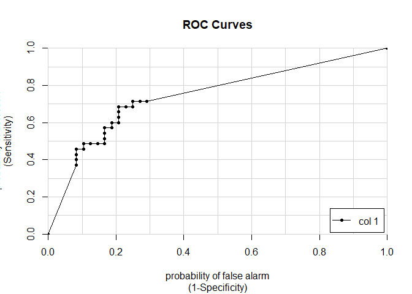
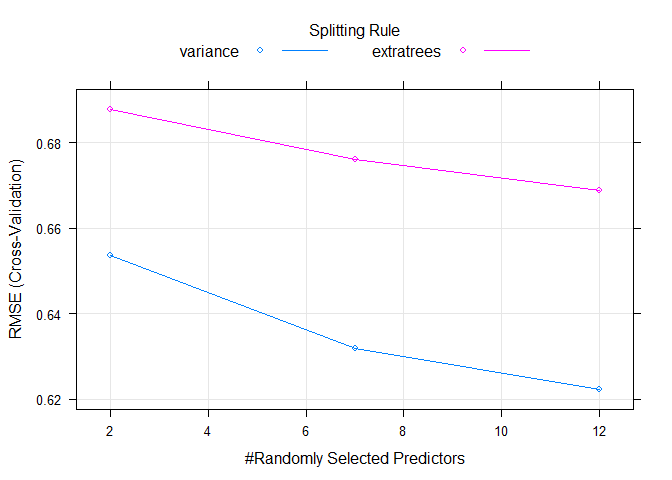
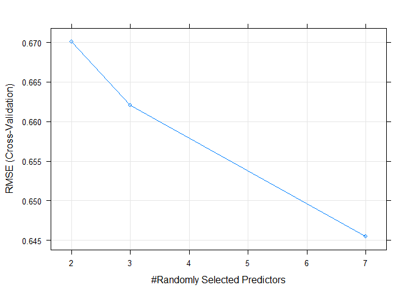
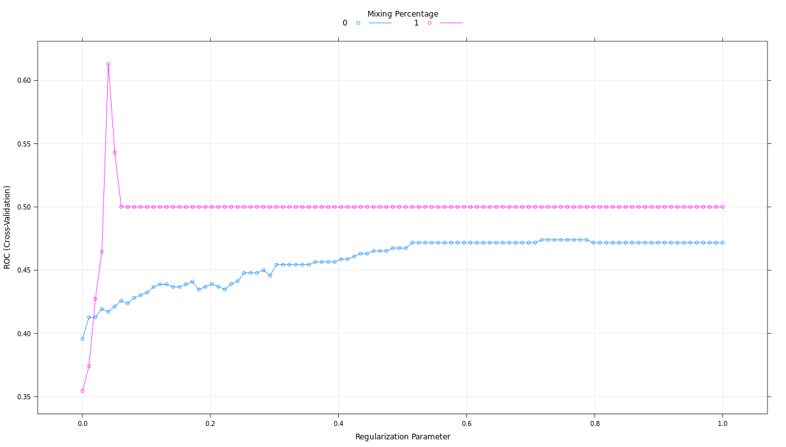
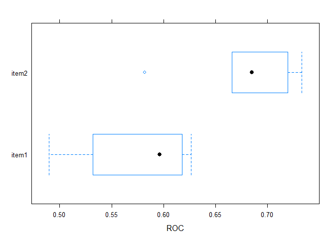
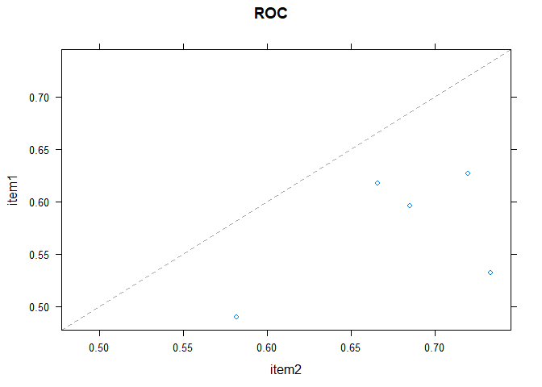

Machine learning with caret in r
================
Mburu
3/23/2020

## In-sample RMSE for linear regression on diamonds

As you saw in the video, included in the course is the diamonds dataset,
which is a classic dataset from the ggplot2 package. The dataset
contains physical attributes of diamonds as well as the price they sold
for. One interesting modeling challenge is predicting diamond price
based on their attributes using something like a linear regression.
Recall that to fit a linear regression, you use the lm() function in the
following format: mod \<- lm(y \~ x, my\_data) To make predictions using
mod on the original data, you call the predict() function: pred \<-
predict(mod, my\_data)

``` r
library(tidyverse)
library(caret)
# Fit lm model: model

model <- lm(price ~., data = diamonds)
# Predict on full data: p

p <- predict(model, data = diamonds)
# Compute errors: error

error <- p - diamonds$price
# Calculate RMSE
sqrt(mean(error ^ 2))
```

    ## [1] 1129.843

## Randomly order the data frame

One way you can take a train/test split of a dataset is to order the
dataset randomly, then divide it into the two sets. This ensures that
the training set and test set are both random samples and that any
biases in the ordering of the dataset (e.g. if it had originally been
ordered by price or size) are not retained in the samples we take for
training and testing your models. You can think of this like shuffling a
brand new deck of playing cards before dealing hands.

First, you set a random seed so that your work is reproducible and you
get the same random split each time you run your script:

set.seed(42) Next, you use the sample() function to shuffle the row
indices of the diamonds dataset. You can later use these indices to
reorder the dataset.

rows \<- sample(nrow(diamonds)) Finally, you can use this random vector
to reorder the diamonds dataset:

diamonds \<- diamonds\[rows, \]

``` r
# Set seed

set.seed(42)
# Shuffle row indices: rows
rows <- sample(nrow(diamonds))

# Randomly order data
shuffled_diamonds <- diamonds[rows, ]
```

## Try an 80/20 split

Now that your dataset is randomly ordered, you can split the first 80%
of it into a training set, and the last 20% into a test set. You can do
this by choosing a split point approximately 80% of the way through your
data:

split \<- round(nrow(mydata) \* 0.80) You can then use this point to
break off the first 80% of the dataset as a training set:

mydata\[1:split, \] And then you can use that same point to determine
the test set:

mydata\[(split + 1):nrow(mydata), \]

``` r
# Determine row to split on: split

split <- round(nrow(diamonds) * 0.80)

# Create train
train <- diamonds[1:split, ]

# Create test

test <- diamonds[(split + 1):nrow(diamonds), ]
```

## Predict on test set

Now that you have a randomly split training set and test set, you can
use the lm() function as you did in the first exercise to fit a model to
your training set, rather than the entire dataset. Recall that you can
use the formula interface to the linear regression function to fit a
model with a specified target variable using all other variables in the
dataset as predictors:

mod \<- lm(y \~ ., training\_data) You can use the predict() function to
make predictions from that model on new data. The new dataset must have
all of the columns from the training data, but they can be in a
different order with different values. Here, rather than re-predicting
on the training set, you can predict on the test set, which you did not
use for training the model. This will allow you to determine the
out-of-sample error for the model in the next exercise:

p \<- predict(model, new\_data)

``` r
# Fit lm model on train: model

model <- lm(price ~., data = train)

# Predict on test: p
p <- predict(model,  test)
```

## Calculate test set RMSE by hand

Now that you have predictions on the test set, you can use these
predictions to calculate an error metric (in this case RMSE) on the test
set and see how the model performs out-of-sample, rather than in-sample
as you did in the first exercise. You first do this by calculating the
errors between the predicted diamond prices and the actual diamond
prices by subtracting the predictions from the actual values. Once you
have an error vector, calculating RMSE is as simple as squaring it,
taking the mean, then taking the square root:

sqrt(mean(error^2))

``` r
# Compute errors: error
error <- p - test$price

# Calculate RMSE

sqrt(mean(error^2))
```

    ## [1] 796.8922

## Advantage of cross-validation

What is the advantage of cross-validation over a single train/test
split?

  - It gives you multiple estimates of out-of-sample error, rather than
    a single estimate.

## 10-fold cross-validation

As you saw in the video, a better approach to validating models is to
use multiple systematic test sets, rather than a single random
train/test split. Fortunately, the caret package makes this very easy to
do:

model \<- train(y \~ ., my\_data) caret supports many types of
cross-validation, and you can specify which type of cross-validation and
the number of cross-validation folds with the trainControl() function,
which you pass to the trControl argument in train():

model \<- train( y \~ ., my\_data, method = “lm”, trControl =
trainControl( method = “cv”, number = 10, verboseIter = TRUE ) ) It’s
important to note that you pass the method for modeling to the main
train() function and the method for cross-validation to the
trainControl() function.

``` r
# Fit lm model using 10-fold CV: model
model <- train(
  price ~., 
  diamonds,
  method = "lm",
  trControl = trainControl(
    method = "cv", 
    number = 10,
    verboseIter = TRUE
  )
)
```

    ## + Fold01: intercept=TRUE 
    ## - Fold01: intercept=TRUE 
    ## + Fold02: intercept=TRUE 
    ## - Fold02: intercept=TRUE 
    ## + Fold03: intercept=TRUE 
    ## - Fold03: intercept=TRUE 
    ## + Fold04: intercept=TRUE 
    ## - Fold04: intercept=TRUE 
    ## + Fold05: intercept=TRUE 
    ## - Fold05: intercept=TRUE 
    ## + Fold06: intercept=TRUE 
    ## - Fold06: intercept=TRUE 
    ## + Fold07: intercept=TRUE 
    ## - Fold07: intercept=TRUE 
    ## + Fold08: intercept=TRUE 
    ## - Fold08: intercept=TRUE 
    ## + Fold09: intercept=TRUE 
    ## - Fold09: intercept=TRUE 
    ## + Fold10: intercept=TRUE 
    ## - Fold10: intercept=TRUE 
    ## Aggregating results
    ## Fitting final model on full training set

``` r
# Print model to console

model
```

    ## Linear Regression 
    ## 
    ## 53940 samples
    ##     9 predictor
    ## 
    ## No pre-processing
    ## Resampling: Cross-Validated (10 fold) 
    ## Summary of sample sizes: 48547, 48546, 48546, 48547, 48545, 48547, ... 
    ## Resampling results:
    ## 
    ##   RMSE      Rsquared   MAE     
    ##   1131.015  0.9196398  740.6117
    ## 
    ## Tuning parameter 'intercept' was held constant at a value of TRUE

## 5-fold cross-validation

In this course, you will use a wide variety of datasets to explore the
full flexibility of the caret package. Here, you will use the famous
Boston housing dataset, where the goal is to predict median home values
in various Boston suburbs. You can use exactly the same code as in the
previous exercise, but change the dataset used by the model:

model \<- train( medv \~ ., Boston, \# \<- new\! method = “lm”,
trControl = trainControl( method = “cv”, number = 10, verboseIter = TRUE
) ) Next, you can reduce the number of cross-validation folds from 10 to
5 using the number argument to the trainControl() argument:

trControl = trainControl( method = “cv”, number = 5, verboseIter = TRUE
)

``` r
# Fit lm model using 5-fold CV: model
data(Boston, package = "MASS") 

model <- train(
  medv~., 
  Boston,
  method = "lm",
  trControl = trainControl(
    method = "cv", 
    number = 5,
    verboseIter = TRUE
  )
)
```

    ## + Fold1: intercept=TRUE 
    ## - Fold1: intercept=TRUE 
    ## + Fold2: intercept=TRUE 
    ## - Fold2: intercept=TRUE 
    ## + Fold3: intercept=TRUE 
    ## - Fold3: intercept=TRUE 
    ## + Fold4: intercept=TRUE 
    ## - Fold4: intercept=TRUE 
    ## + Fold5: intercept=TRUE 
    ## - Fold5: intercept=TRUE 
    ## Aggregating results
    ## Fitting final model on full training set

``` r
# Print model to console

model
```

    ## Linear Regression 
    ## 
    ## 506 samples
    ##  13 predictor
    ## 
    ## No pre-processing
    ## Resampling: Cross-Validated (5 fold) 
    ## Summary of sample sizes: 405, 405, 406, 403, 405 
    ## Resampling results:
    ## 
    ##   RMSE      Rsquared   MAE     
    ##   4.860247  0.7209221  3.398114
    ## 
    ## Tuning parameter 'intercept' was held constant at a value of TRUE

## 5 x 5-fold cross-validation

You can do more than just one iteration of cross-validation. Repeated
cross-validation gives you a better estimate of the test-set error. You
can also repeat the entire cross-validation procedure. This takes
longer, but gives you many more out-of-sample datasets to look at and
much more precise assessments of how well the model performs.

One of the awesome things about the train() function in caret is how
easy it is to run very different models or methods of cross-validation
just by tweaking a few simple arguments to the function call. For
example, you could repeat your entire cross-validation procedure 5 times
for greater confidence in your estimates of the model’s out-of-sample
accuracy, e.g.:

trControl = trainControl( method = “repeatedcv”, number = 5, repeats =
5, verboseIter = TRUE )

``` r
# Fit lm model using 5 x 5-fold CV: model
model <- train(
  medv ~ ., 
  Boston,
  method = "lm",
  trControl = trainControl(
    method = "repeatedcv", 
    number = 5,
    repeats = 5, 
    verboseIter = TRUE
  )
)
```

    ## + Fold1.Rep1: intercept=TRUE 
    ## - Fold1.Rep1: intercept=TRUE 
    ## + Fold2.Rep1: intercept=TRUE 
    ## - Fold2.Rep1: intercept=TRUE 
    ## + Fold3.Rep1: intercept=TRUE 
    ## - Fold3.Rep1: intercept=TRUE 
    ## + Fold4.Rep1: intercept=TRUE 
    ## - Fold4.Rep1: intercept=TRUE 
    ## + Fold5.Rep1: intercept=TRUE 
    ## - Fold5.Rep1: intercept=TRUE 
    ## + Fold1.Rep2: intercept=TRUE 
    ## - Fold1.Rep2: intercept=TRUE 
    ## + Fold2.Rep2: intercept=TRUE 
    ## - Fold2.Rep2: intercept=TRUE 
    ## + Fold3.Rep2: intercept=TRUE 
    ## - Fold3.Rep2: intercept=TRUE 
    ## + Fold4.Rep2: intercept=TRUE 
    ## - Fold4.Rep2: intercept=TRUE 
    ## + Fold5.Rep2: intercept=TRUE 
    ## - Fold5.Rep2: intercept=TRUE 
    ## + Fold1.Rep3: intercept=TRUE 
    ## - Fold1.Rep3: intercept=TRUE 
    ## + Fold2.Rep3: intercept=TRUE 
    ## - Fold2.Rep3: intercept=TRUE 
    ## + Fold3.Rep3: intercept=TRUE 
    ## - Fold3.Rep3: intercept=TRUE 
    ## + Fold4.Rep3: intercept=TRUE 
    ## - Fold4.Rep3: intercept=TRUE 
    ## + Fold5.Rep3: intercept=TRUE 
    ## - Fold5.Rep3: intercept=TRUE 
    ## + Fold1.Rep4: intercept=TRUE 
    ## - Fold1.Rep4: intercept=TRUE 
    ## + Fold2.Rep4: intercept=TRUE 
    ## - Fold2.Rep4: intercept=TRUE 
    ## + Fold3.Rep4: intercept=TRUE 
    ## - Fold3.Rep4: intercept=TRUE 
    ## + Fold4.Rep4: intercept=TRUE 
    ## - Fold4.Rep4: intercept=TRUE 
    ## + Fold5.Rep4: intercept=TRUE 
    ## - Fold5.Rep4: intercept=TRUE 
    ## + Fold1.Rep5: intercept=TRUE 
    ## - Fold1.Rep5: intercept=TRUE 
    ## + Fold2.Rep5: intercept=TRUE 
    ## - Fold2.Rep5: intercept=TRUE 
    ## + Fold3.Rep5: intercept=TRUE 
    ## - Fold3.Rep5: intercept=TRUE 
    ## + Fold4.Rep5: intercept=TRUE 
    ## - Fold4.Rep5: intercept=TRUE 
    ## + Fold5.Rep5: intercept=TRUE 
    ## - Fold5.Rep5: intercept=TRUE 
    ## Aggregating results
    ## Fitting final model on full training set

``` r
# Print model to console

model
```

    ## Linear Regression 
    ## 
    ## 506 samples
    ##  13 predictor
    ## 
    ## No pre-processing
    ## Resampling: Cross-Validated (5 fold, repeated 5 times) 
    ## Summary of sample sizes: 405, 406, 405, 403, 405, 405, ... 
    ## Resampling results:
    ## 
    ##   RMSE      Rsquared   MAE     
    ##   4.845724  0.7277269  3.402735
    ## 
    ## Tuning parameter 'intercept' was held constant at a value of TRUE

## Making predictions on new data

Finally, the model you fit with the train() function has the exact same
predict() interface as the linear regression models you fit earlier in
this chapter. After fitting a model with train(), you can simply call
predict() with new data, e.g: predict(my\_model, new\_data)

``` r
# Predict on full Boston dataset
p <- predict(model, Boston)
```

## Why a train/test split?

What is the point of making a train/test split for binary classification
problems?

  - To evaluate your models out-of-sample, on new data.

## Try a 60/40 split

As you saw in the video, you’ll be working with the Sonar dataset in
this chapter, using a 60% training set and a 40% test set. We’ll
practice making a train/test split one more time, just to be sure you
have the hang of it. Recall that you can use the sample() function to
get a random permutation of the row indices in a dataset, to use when
making train/test splits, e.g.:

n\_obs \<- nrow(my\_data) permuted\_rows \<- sample(n\_obs) And then use
those row indices to randomly reorder the dataset, e.g.:

my\_data \<- my\_data\[permuted\_rows, \] Once your dataset is randomly
ordered, you can split off the first 60% as a training set and the last
40% as a test set.

``` r
library(mlbench)
data(Sonar)

# Get the number of observations

n_obs <- nrow(Sonar)

# Shuffle row indices: permuted_rows
permuted_rows <- sample(n_obs)

# Randomly order data: Sonar
Sonar_shuffled <- Sonar[permuted_rows,]

# Identify row to split on: split
split <- round(n_obs * 0.6)

# Create train
sonar_train <- Sonar_shuffled[1:split,]
# Create test

sonar_test <- Sonar_shuffled[(split+1) :nrow(Sonar_shuffled), ]
```

## Fit a logistic regression model

Once you have your random training and test sets you can fit a logistic
regression model to your training set using the glm() function. glm() is
a more advanced version of lm() that allows for more varied types of
regression models, aside from plain vanilla ordinary least squares
regression.

Be sure to pass the argument family = “binomial” to glm() to specify
that you want to do logistic (rather than linear) regression. For
example:

glm(Target \~ ., family = “binomial”, dataset) Don’t worry about
warnings like glm.fit: algorithm did not converge or glm.fit: fitted
probabilities numerically 0 or 1 occurred. These are common on smaller
datasets and usually don’t cause any issues. They typically mean your
dataset is perfectly separable, which can cause problems for the math
behind the model, but R’s glm() function is almost always robust enough
to handle this case with no problems.

Once you have a glm() model fit to your dataset, you can predict the
outcome (e.g. rock or mine) on the test set using the predict() function
with the argument type = “response”: predict(my\_model, test, type =
“response”)

``` r
load("Sonar.RData")
# Fit glm model: model
model <- glm(Class ~ ., family = "binomial", sonar_train)

# Predict on test: p

p <- predict(model, sonar_test, type = "response")
```

## Confusion matrix takeaways

What information does a confusion matrix provide?

## Calculate a confusion matrix

As you saw in the video, a confusion matrix is a very useful tool for
calibrating the output of a model and examining all possible outcomes of
your predictions (true positive, true negative, false positive, false
negative).

Before you make your confusion matrix, you need to “cut” your predicted
probabilities at a given threshold to turn probabilities into a factor
of class predictions. Combine ifelse() with factor() as follows:

pos\_or\_neg \<- ifelse(probability\_prediction \> threshold,
positive\_class, negative\_class) p\_class \<- factor(pos\_or\_neg,
levels = levels(test\_values)) confusionMatrix() in caret improves on
table() from base R by adding lots of useful ancillary statistics in
addition to the base rates in the table. You can calculate the confusion
matrix (and the associated statistics) using the predicted outcomes as
well as the actual outcomes, e.g.: confusionMatrix(p\_class,
test\_values)

``` r
# If p exceeds threshold of 0.5, M else R: m_or_r
m_or_r <-  ifelse(p > .5, "M", "R")

# Convert to factor: p_class

p_class <- factor(m_or_r, levels = levels(sonar_test[["Class"]]))

# Create confusion matrix
confusionMatrix(p_class, sonar_test[["Class"]])
```

    ## Confusion Matrix and Statistics
    ## 
    ##           Reference
    ## Prediction  M  R
    ##          M  8 18
    ##          R 40 17
    ##                                           
    ##                Accuracy : 0.3012          
    ##                  95% CI : (0.2053, 0.4118)
    ##     No Information Rate : 0.5783          
    ##     P-Value [Acc > NIR] : 1.000000        
    ##                                           
    ##                   Kappa : -0.3204         
    ##                                           
    ##  Mcnemar's Test P-Value : 0.005826        
    ##                                           
    ##             Sensitivity : 0.16667         
    ##             Specificity : 0.48571         
    ##          Pos Pred Value : 0.30769         
    ##          Neg Pred Value : 0.29825         
    ##              Prevalence : 0.57831         
    ##          Detection Rate : 0.09639         
    ##    Detection Prevalence : 0.31325         
    ##       Balanced Accuracy : 0.32619         
    ##                                           
    ##        'Positive' Class : M               
    ## 

## Probabilities and classes

What’s the relationship between the predicted probabilities and the
predicted classes?

  - Predicted classes are based off of predicted probabilities plus a
    classification threshold.

## Try another threshold

In the previous exercises, you used a threshold of 0.50 to cut your
predicted probabilities to make class predictions (rock vs mine).
However, this classification threshold does not always align with the
goals for a given modeling problem.

For example, pretend you want to identify the objects you are really
certain are mines. In this case, you might want to use a probability
threshold of 0.90 to get fewer predicted mines, but with greater
confidence in each prediction.

The code pattern for cutting probabilities into predicted classes, then
calculating a confusion matrix, was shown in Exercise 7 of this chapter.

``` r
# If p exceeds threshold of 0.9, M else R: m_or_r
m_or_r <-  ifelse(p > .9, "M", "R")


# Convert to factor: p_class

p_class <- factor(m_or_r, levels = levels(sonar_test[["Class"]]))

# Create confusion matrix
confusionMatrix(p_class, sonar_test[["Class"]])
```

    ## Confusion Matrix and Statistics
    ## 
    ##           Reference
    ## Prediction  M  R
    ##          M  8 17
    ##          R 40 18
    ##                                           
    ##                Accuracy : 0.3133          
    ##                  95% CI : (0.2159, 0.4244)
    ##     No Information Rate : 0.5783          
    ##     P-Value [Acc > NIR] : 1.000000        
    ##                                           
    ##                   Kappa : -0.293          
    ##                                           
    ##  Mcnemar's Test P-Value : 0.003569        
    ##                                           
    ##             Sensitivity : 0.16667         
    ##             Specificity : 0.51429         
    ##          Pos Pred Value : 0.32000         
    ##          Neg Pred Value : 0.31034         
    ##              Prevalence : 0.57831         
    ##          Detection Rate : 0.09639         
    ##    Detection Prevalence : 0.30120         
    ##       Balanced Accuracy : 0.34048         
    ##                                           
    ##        'Positive' Class : M               
    ## 

## From probabilites to confusion matrix

Conversely, say you want to be really certain that your model correctly
identifies all the mines as mines. In this case, you might use a
prediction threshold of 0.10, instead of 0.90. The code pattern for
cutting probabilities into predicted classes, then calculating a
confusion matrix, was shown in Exercise 7 of this chapter.

``` r
# If p exceeds threshold of 0.1, M else R: m_or_r
m_or_r <-  ifelse(p > .1, "M", "R")


# Convert to factor: p_class

p_class <- factor(m_or_r, levels = levels(sonar_test[["Class"]]))

# Create confusion matrix
confusionMatrix(p_class, sonar_test[["Class"]])
```

    ## Confusion Matrix and Statistics
    ## 
    ##           Reference
    ## Prediction  M  R
    ##          M  8 20
    ##          R 40 15
    ##                                           
    ##                Accuracy : 0.2771          
    ##                  95% CI : (0.1845, 0.3862)
    ##     No Information Rate : 0.5783          
    ##     P-Value [Acc > NIR] : 1.00000         
    ##                                           
    ##                   Kappa : -0.3757         
    ##                                           
    ##  Mcnemar's Test P-Value : 0.01417         
    ##                                           
    ##             Sensitivity : 0.16667         
    ##             Specificity : 0.42857         
    ##          Pos Pred Value : 0.28571         
    ##          Neg Pred Value : 0.27273         
    ##              Prevalence : 0.57831         
    ##          Detection Rate : 0.09639         
    ##    Detection Prevalence : 0.33735         
    ##       Balanced Accuracy : 0.29762         
    ##                                           
    ##        'Positive' Class : M               
    ## 

## What’s the value of a ROC curve?

What is the primary value of an ROC curve?

  - It evaluates all possible thresholds for splitting predicted
    probabilities into predicted classes.

## Plot an ROC curve

As you saw in the video, an ROC curve is a really useful shortcut for
summarizing the performance of a classifier over all possible
thresholds. This saves you a lot of tedious work computing class
predictions for many different thresholds and examining the confusion
matrix for each.

My favorite package for computing ROC curves is caTools, which contains
a function called colAUC(). This function is very user-friendly and can
actually calculate ROC curves for multiple predictors at once. In this
case, you only need to calculate the ROC curve for one predictor, e.g.:

colAUC(predicted\_probabilities, actual, plotROC = TRUE) The function
will return a score called AUC (more on that later) and the plotROC =
TRUE argument will return the plot of the ROC curve for visual
inspection.

``` r
library(caTools)

# Predict on test: p

p <- predict(model, sonar_test, type = "response")

# Make ROC curve
colAUC(p, sonar_test$Class, plotROC = TRUE)
```

<!-- -->

    ##              [,1]
    ## M vs. R 0.7452381

## Model, ROC, and AUC

What is the AUC of a perfect model?

  - 1.0

## Customizing trainControl

As you saw in the video, area under the ROC curve is a very useful,
single-number summary of a model’s ability to discriminate the positive
from the negative class (e.g. mines from rocks). An AUC of 0.5 is no
better than random guessing, an AUC of 1.0 is a perfectly predictive
model, and an AUC of 0.0 is perfectly anti-predictive (which rarely
happens).

This is often a much more useful metric than simply ranking models by
their accuracy at a set threshold, as different models might require
different calibration steps (looking at a confusion matrix at each step)
to find the optimal classification threshold for that model.

You can use the trainControl() function in caret to use AUC (instead of
acccuracy), to tune the parameters of your models. The twoClassSummary()
convenience function allows you to do this easily.

When using twoClassSummary(), be sure to always include the argument
classProbs = TRUE or your model will throw an error\! (You cannot
calculate AUC with just class predictions. You need to have class
probabilities as well.)

``` r
# Create trainControl object: myControl
myControl <- trainControl(
  method = "cv",
  number = 10,
  summaryFunction = twoClassSummary,
  classProbs = TRUE, # IMPORTANT!
  verboseIter = TRUE
)
```

Using custom trainControl Now that you have a custom trainControl
object, it’s easy to fit caret models that use AUC rather than accuracy
to tune and evaluate the model. You can just pass your custom
trainControl object to the train() function via the trControl argument,
e.g.:

train(<standard arguments here>, trControl = myControl) This syntax
gives you a convenient way to store a lot of custom modeling parameters
and then use them across multiple different calls to train(). You will
make extensive use of this trick in Chapter 5.

``` r
# Train glm with custom trainControl: model

model <- train(
  Class~ ., 
  Sonar,
  method = "glm",
  trControl = myControl
)
```

    ## + Fold01: parameter=none 
    ## - Fold01: parameter=none 
    ## + Fold02: parameter=none 
    ## - Fold02: parameter=none 
    ## + Fold03: parameter=none 
    ## - Fold03: parameter=none 
    ## + Fold04: parameter=none 
    ## - Fold04: parameter=none 
    ## + Fold05: parameter=none 
    ## - Fold05: parameter=none 
    ## + Fold06: parameter=none 
    ## - Fold06: parameter=none 
    ## + Fold07: parameter=none 
    ## - Fold07: parameter=none 
    ## + Fold08: parameter=none 
    ## - Fold08: parameter=none 
    ## + Fold09: parameter=none 
    ## - Fold09: parameter=none 
    ## + Fold10: parameter=none 
    ## - Fold10: parameter=none 
    ## Aggregating results
    ## Fitting final model on full training set

``` r
# Print model to console
model
```

    ## Generalized Linear Model 
    ## 
    ## 208 samples
    ##  60 predictor
    ##   2 classes: 'M', 'R' 
    ## 
    ## No pre-processing
    ## Resampling: Cross-Validated (10 fold) 
    ## Summary of sample sizes: 187, 187, 188, 187, 188, 188, ... 
    ## Resampling results:
    ## 
    ##   ROC        Sens   Spec
    ##   0.7255051  0.775  0.66

## Random forests vs. linear models

What’s the primary advantage of random forests over linear models?

  - A random forest is a more flexible model than a linear model, but
    just as easy to fit

## Fit a random forest

As you saw in the video, random forest models are much more flexible
than linear models, and can model complicated nonlinear effects as well
as automatically capture interactions between variables. They tend to
give very good results on real world data, so let’s try one out on the
wine quality dataset, where the goal is to predict the human-evaluated
quality of a batch of wine, given some of the machine-measured chemical
and physical properties of that batch.

Fitting a random forest model is exactly the same as fitting a
generalized linear regression model, as you did in the previous chapter.
You simply change the method argument in the train function to be
“ranger”. The ranger package is a rewrite of R’s classic randomForest
package and fits models much faster, but gives almost exactly the same
results. We suggest that all beginners use the ranger package for random
forest modeling.

``` r
 wine <- readRDS("wine_100.RDS")
# Fit random forest: model
model <- train(
  quality~.,
  tuneLength = 1,
  data = wine, 
  method = "ranger",
  trControl = trainControl(
    method = "cv", 
    number = 5, 
    verboseIter = TRUE
  )
)
```

    ## + Fold1: mtry=3, min.node.size=5, splitrule=variance 
    ## - Fold1: mtry=3, min.node.size=5, splitrule=variance 
    ## + Fold1: mtry=3, min.node.size=5, splitrule=extratrees 
    ## - Fold1: mtry=3, min.node.size=5, splitrule=extratrees 
    ## + Fold2: mtry=3, min.node.size=5, splitrule=variance 
    ## - Fold2: mtry=3, min.node.size=5, splitrule=variance 
    ## + Fold2: mtry=3, min.node.size=5, splitrule=extratrees 
    ## - Fold2: mtry=3, min.node.size=5, splitrule=extratrees 
    ## + Fold3: mtry=3, min.node.size=5, splitrule=variance 
    ## - Fold3: mtry=3, min.node.size=5, splitrule=variance 
    ## + Fold3: mtry=3, min.node.size=5, splitrule=extratrees 
    ## - Fold3: mtry=3, min.node.size=5, splitrule=extratrees 
    ## + Fold4: mtry=3, min.node.size=5, splitrule=variance 
    ## - Fold4: mtry=3, min.node.size=5, splitrule=variance 
    ## + Fold4: mtry=3, min.node.size=5, splitrule=extratrees 
    ## - Fold4: mtry=3, min.node.size=5, splitrule=extratrees 
    ## + Fold5: mtry=3, min.node.size=5, splitrule=variance 
    ## - Fold5: mtry=3, min.node.size=5, splitrule=variance 
    ## + Fold5: mtry=3, min.node.size=5, splitrule=extratrees 
    ## - Fold5: mtry=3, min.node.size=5, splitrule=extratrees 
    ## Aggregating results
    ## Selecting tuning parameters
    ## Fitting mtry = 3, splitrule = variance, min.node.size = 5 on full training set

``` r
# Print model to console

model
```

    ## Random Forest 
    ## 
    ## 100 samples
    ##  12 predictor
    ## 
    ## No pre-processing
    ## Resampling: Cross-Validated (5 fold) 
    ## Summary of sample sizes: 81, 80, 79, 80, 80 
    ## Resampling results across tuning parameters:
    ## 
    ##   splitrule   RMSE       Rsquared   MAE      
    ##   variance    0.6556649  0.3098541  0.5009289
    ##   extratrees  0.6718675  0.2855720  0.5032282
    ## 
    ## Tuning parameter 'mtry' was held constant at a value of 3
    ## Tuning
    ##  parameter 'min.node.size' was held constant at a value of 5
    ## RMSE was used to select the optimal model using the smallest value.
    ## The final values used for the model were mtry = 3, splitrule =
    ##  variance and min.node.size = 5.

## Advantage of a longer tune length

What’s the advantage of a longer tuneLength?

  - You explore more potential models and can potentially find a better
    model

## Try a longer tune length

Recall from the video that random forest models have a primary tuning
parameter of mtry, which controls how many variables are exposed to the
splitting search routine at each split. For example, suppose that a tree
has a total of 10 splits and mtry = 2. This means that there are 10
samples of 2 predictors each time a split is evaluated.

Use a larger tuning grid this time, but stick to the defaults provided
by the train() function. Try a tuneLength of 3, rather than 1, to
explore some more potential models, and plot the resulting model using
the plot function.

``` r
# Fit random forest: model
model <- train(
  quality~ .,
  tuneLength = 3,
  data = wine, 
  method = "ranger",
  trControl = trainControl(
    method = "cv", 
    number = 5, 
    verboseIter = TRUE
  )
)
```

    ## + Fold1: mtry= 2, min.node.size=5, splitrule=variance 
    ## - Fold1: mtry= 2, min.node.size=5, splitrule=variance 
    ## + Fold1: mtry= 7, min.node.size=5, splitrule=variance 
    ## - Fold1: mtry= 7, min.node.size=5, splitrule=variance 
    ## + Fold1: mtry=12, min.node.size=5, splitrule=variance 
    ## - Fold1: mtry=12, min.node.size=5, splitrule=variance 
    ## + Fold1: mtry= 2, min.node.size=5, splitrule=extratrees 
    ## - Fold1: mtry= 2, min.node.size=5, splitrule=extratrees 
    ## + Fold1: mtry= 7, min.node.size=5, splitrule=extratrees 
    ## - Fold1: mtry= 7, min.node.size=5, splitrule=extratrees 
    ## + Fold1: mtry=12, min.node.size=5, splitrule=extratrees 
    ## - Fold1: mtry=12, min.node.size=5, splitrule=extratrees 
    ## + Fold2: mtry= 2, min.node.size=5, splitrule=variance 
    ## - Fold2: mtry= 2, min.node.size=5, splitrule=variance 
    ## + Fold2: mtry= 7, min.node.size=5, splitrule=variance 
    ## - Fold2: mtry= 7, min.node.size=5, splitrule=variance 
    ## + Fold2: mtry=12, min.node.size=5, splitrule=variance 
    ## - Fold2: mtry=12, min.node.size=5, splitrule=variance 
    ## + Fold2: mtry= 2, min.node.size=5, splitrule=extratrees 
    ## - Fold2: mtry= 2, min.node.size=5, splitrule=extratrees 
    ## + Fold2: mtry= 7, min.node.size=5, splitrule=extratrees 
    ## - Fold2: mtry= 7, min.node.size=5, splitrule=extratrees 
    ## + Fold2: mtry=12, min.node.size=5, splitrule=extratrees 
    ## - Fold2: mtry=12, min.node.size=5, splitrule=extratrees 
    ## + Fold3: mtry= 2, min.node.size=5, splitrule=variance 
    ## - Fold3: mtry= 2, min.node.size=5, splitrule=variance 
    ## + Fold3: mtry= 7, min.node.size=5, splitrule=variance 
    ## - Fold3: mtry= 7, min.node.size=5, splitrule=variance 
    ## + Fold3: mtry=12, min.node.size=5, splitrule=variance 
    ## - Fold3: mtry=12, min.node.size=5, splitrule=variance 
    ## + Fold3: mtry= 2, min.node.size=5, splitrule=extratrees 
    ## - Fold3: mtry= 2, min.node.size=5, splitrule=extratrees 
    ## + Fold3: mtry= 7, min.node.size=5, splitrule=extratrees 
    ## - Fold3: mtry= 7, min.node.size=5, splitrule=extratrees 
    ## + Fold3: mtry=12, min.node.size=5, splitrule=extratrees 
    ## - Fold3: mtry=12, min.node.size=5, splitrule=extratrees 
    ## + Fold4: mtry= 2, min.node.size=5, splitrule=variance 
    ## - Fold4: mtry= 2, min.node.size=5, splitrule=variance 
    ## + Fold4: mtry= 7, min.node.size=5, splitrule=variance 
    ## - Fold4: mtry= 7, min.node.size=5, splitrule=variance 
    ## + Fold4: mtry=12, min.node.size=5, splitrule=variance 
    ## - Fold4: mtry=12, min.node.size=5, splitrule=variance 
    ## + Fold4: mtry= 2, min.node.size=5, splitrule=extratrees 
    ## - Fold4: mtry= 2, min.node.size=5, splitrule=extratrees 
    ## + Fold4: mtry= 7, min.node.size=5, splitrule=extratrees 
    ## - Fold4: mtry= 7, min.node.size=5, splitrule=extratrees 
    ## + Fold4: mtry=12, min.node.size=5, splitrule=extratrees 
    ## - Fold4: mtry=12, min.node.size=5, splitrule=extratrees 
    ## + Fold5: mtry= 2, min.node.size=5, splitrule=variance 
    ## - Fold5: mtry= 2, min.node.size=5, splitrule=variance 
    ## + Fold5: mtry= 7, min.node.size=5, splitrule=variance 
    ## - Fold5: mtry= 7, min.node.size=5, splitrule=variance 
    ## + Fold5: mtry=12, min.node.size=5, splitrule=variance 
    ## - Fold5: mtry=12, min.node.size=5, splitrule=variance 
    ## + Fold5: mtry= 2, min.node.size=5, splitrule=extratrees 
    ## - Fold5: mtry= 2, min.node.size=5, splitrule=extratrees 
    ## + Fold5: mtry= 7, min.node.size=5, splitrule=extratrees 
    ## - Fold5: mtry= 7, min.node.size=5, splitrule=extratrees 
    ## + Fold5: mtry=12, min.node.size=5, splitrule=extratrees 
    ## - Fold5: mtry=12, min.node.size=5, splitrule=extratrees 
    ## Aggregating results
    ## Selecting tuning parameters
    ## Fitting mtry = 12, splitrule = variance, min.node.size = 5 on full training set

``` r
# Print model to console

model
```

    ## Random Forest 
    ## 
    ## 100 samples
    ##  12 predictor
    ## 
    ## No pre-processing
    ## Resampling: Cross-Validated (5 fold) 
    ## Summary of sample sizes: 79, 80, 81, 80, 80 
    ## Resampling results across tuning parameters:
    ## 
    ##   mtry  splitrule   RMSE       Rsquared   MAE      
    ##    2    variance    0.6536186  0.3201670  0.4978802
    ##    2    extratrees  0.6878556  0.2368974  0.5138376
    ##    7    variance    0.6317538  0.3629250  0.4823873
    ##    7    extratrees  0.6760123  0.2537327  0.5108959
    ##   12    variance    0.6221994  0.3856691  0.4836818
    ##   12    extratrees  0.6687698  0.2765809  0.5081342
    ## 
    ## Tuning parameter 'min.node.size' was held constant at a value of 5
    ## RMSE was used to select the optimal model using the smallest value.
    ## The final values used for the model were mtry = 12, splitrule =
    ##  variance and min.node.size = 5.

``` r
# Plot model

plot(model)
```

<!-- -->

## Advantages of a custom tuning grid

Why use a custom tuneGrid?

  - It gives you more fine-grained control over the tuning parameters
    that are explored

## Fit a random forest with custom tuning

Now that you’ve explored the default tuning grids provided by the
train() function, let’s customize your models a bit more.

You can provide any number of values for mtry, from 2 up to the number
of columns in the dataset. In practice, there are diminishing returns
for much larger values of mtry, so you will use a custom tuning grid
that explores 2 simple models (mtry = 2 and mtry = 3) as well as one
more complicated model (mtry = 7).

``` r
# From previous step
tuneGrid <- data.frame(
  .mtry = c(2, 3, 7),
  .splitrule = "variance",
  .min.node.size = 5
)

# Fit random forest: model
model <- train(
  quality ~ .,
  tuneGrid = tuneGrid,
  data = wine, 
  method = "ranger",
  trControl = trainControl(
    method = "cv", 
    number = 5, 
    verboseIter = TRUE
  )
)
```

    ## + Fold1: mtry=2, splitrule=variance, min.node.size=5 
    ## - Fold1: mtry=2, splitrule=variance, min.node.size=5 
    ## + Fold1: mtry=3, splitrule=variance, min.node.size=5 
    ## - Fold1: mtry=3, splitrule=variance, min.node.size=5 
    ## + Fold1: mtry=7, splitrule=variance, min.node.size=5 
    ## - Fold1: mtry=7, splitrule=variance, min.node.size=5 
    ## + Fold2: mtry=2, splitrule=variance, min.node.size=5 
    ## - Fold2: mtry=2, splitrule=variance, min.node.size=5 
    ## + Fold2: mtry=3, splitrule=variance, min.node.size=5 
    ## - Fold2: mtry=3, splitrule=variance, min.node.size=5 
    ## + Fold2: mtry=7, splitrule=variance, min.node.size=5 
    ## - Fold2: mtry=7, splitrule=variance, min.node.size=5 
    ## + Fold3: mtry=2, splitrule=variance, min.node.size=5 
    ## - Fold3: mtry=2, splitrule=variance, min.node.size=5 
    ## + Fold3: mtry=3, splitrule=variance, min.node.size=5 
    ## - Fold3: mtry=3, splitrule=variance, min.node.size=5 
    ## + Fold3: mtry=7, splitrule=variance, min.node.size=5 
    ## - Fold3: mtry=7, splitrule=variance, min.node.size=5 
    ## + Fold4: mtry=2, splitrule=variance, min.node.size=5 
    ## - Fold4: mtry=2, splitrule=variance, min.node.size=5 
    ## + Fold4: mtry=3, splitrule=variance, min.node.size=5 
    ## - Fold4: mtry=3, splitrule=variance, min.node.size=5 
    ## + Fold4: mtry=7, splitrule=variance, min.node.size=5 
    ## - Fold4: mtry=7, splitrule=variance, min.node.size=5 
    ## + Fold5: mtry=2, splitrule=variance, min.node.size=5 
    ## - Fold5: mtry=2, splitrule=variance, min.node.size=5 
    ## + Fold5: mtry=3, splitrule=variance, min.node.size=5 
    ## - Fold5: mtry=3, splitrule=variance, min.node.size=5 
    ## + Fold5: mtry=7, splitrule=variance, min.node.size=5 
    ## - Fold5: mtry=7, splitrule=variance, min.node.size=5 
    ## Aggregating results
    ## Selecting tuning parameters
    ## Fitting mtry = 7, splitrule = variance, min.node.size = 5 on full training set

``` r
# Print model to console

model
```

    ## Random Forest 
    ## 
    ## 100 samples
    ##  12 predictor
    ## 
    ## No pre-processing
    ## Resampling: Cross-Validated (5 fold) 
    ## Summary of sample sizes: 80, 79, 80, 81, 80 
    ## Resampling results across tuning parameters:
    ## 
    ##   mtry  RMSE       Rsquared   MAE      
    ##   2     0.6700553  0.3198135  0.5180831
    ##   3     0.6620685  0.3173636  0.5109953
    ##   7     0.6455139  0.3467665  0.4937458
    ## 
    ## Tuning parameter 'splitrule' was held constant at a value of
    ##  variance
    ## Tuning parameter 'min.node.size' was held constant at a value
    ##  of 5
    ## RMSE was used to select the optimal model using the smallest value.
    ## The final values used for the model were mtry = 7, splitrule =
    ##  variance and min.node.size = 5.

``` r
# Plot model

plot(model)
```

<!-- -->

## Advantage of glmnet

What’s the advantage of glmnet over regular glm models?

  - glmnet models place constraints on your coefficients, which helps
    prevent overfitting.

## Make a custom trainControl

The wine quality dataset was a regression problem, but now you are
looking at a classification problem. This is a simulated dataset based
on the “don’t overfit” competition on Kaggle a number of years ago.

Classification problems are a little more complicated than regression
problems because you have to provide a custom summaryFunction to the
train() function to use the AUC metric to rank your models. Start by
making a custom trainControl, as you did in the previous chapter. Be
sure to set classProbs = TRUE, otherwise the twoClassSummary for
summaryFunction will break.

``` r
# Create custom trainControl: myControl
myControl <- trainControl(
  method = "cv", 
  number = 10,
  summaryFunction = twoClassSummary,
  classProbs = TRUE, # IMPORTANT!
  verboseIter = TRUE
)
```

## Fit glmnet with custom trainControl

Now that you have a custom trainControl object, fit a glmnet model to
the “don’t overfit” dataset. Recall from the video that glmnet is an
extension of the generalized linear regression model (or glm) that
places constraints on the magnitude of the coefficients to prevent
overfitting. This is more commonly known as “penalized” regression
modeling and is a very useful technique on datasets with many predictors
and few values.

glmnet is capable of fitting two different kinds of penalized models,
controlled by the alpha parameter:

Ridge regression (or alpha = 0) Lasso regression (or alpha = 1) You’ll
now fit a glmnet model to the “don’t overfit” dataset using the defaults
provided by the caret package.

``` r
overfit <- read_csv("overfit.csv")

# Fit glmnet model: model
model <- train(
  y ~ ., 
  overfit,
  method = "glmnet",
  trControl = myControl
)
```

    ## + Fold01: alpha=0.10, lambda=0.01013 
    ## - Fold01: alpha=0.10, lambda=0.01013 
    ## + Fold01: alpha=0.55, lambda=0.01013 
    ## - Fold01: alpha=0.55, lambda=0.01013 
    ## + Fold01: alpha=1.00, lambda=0.01013 
    ## - Fold01: alpha=1.00, lambda=0.01013 
    ## + Fold02: alpha=0.10, lambda=0.01013 
    ## - Fold02: alpha=0.10, lambda=0.01013 
    ## + Fold02: alpha=0.55, lambda=0.01013 
    ## - Fold02: alpha=0.55, lambda=0.01013 
    ## + Fold02: alpha=1.00, lambda=0.01013 
    ## - Fold02: alpha=1.00, lambda=0.01013 
    ## + Fold03: alpha=0.10, lambda=0.01013 
    ## - Fold03: alpha=0.10, lambda=0.01013 
    ## + Fold03: alpha=0.55, lambda=0.01013 
    ## - Fold03: alpha=0.55, lambda=0.01013 
    ## + Fold03: alpha=1.00, lambda=0.01013 
    ## - Fold03: alpha=1.00, lambda=0.01013 
    ## + Fold04: alpha=0.10, lambda=0.01013 
    ## - Fold04: alpha=0.10, lambda=0.01013 
    ## + Fold04: alpha=0.55, lambda=0.01013 
    ## - Fold04: alpha=0.55, lambda=0.01013 
    ## + Fold04: alpha=1.00, lambda=0.01013 
    ## - Fold04: alpha=1.00, lambda=0.01013 
    ## + Fold05: alpha=0.10, lambda=0.01013 
    ## - Fold05: alpha=0.10, lambda=0.01013 
    ## + Fold05: alpha=0.55, lambda=0.01013 
    ## - Fold05: alpha=0.55, lambda=0.01013 
    ## + Fold05: alpha=1.00, lambda=0.01013 
    ## - Fold05: alpha=1.00, lambda=0.01013 
    ## + Fold06: alpha=0.10, lambda=0.01013 
    ## - Fold06: alpha=0.10, lambda=0.01013 
    ## + Fold06: alpha=0.55, lambda=0.01013 
    ## - Fold06: alpha=0.55, lambda=0.01013 
    ## + Fold06: alpha=1.00, lambda=0.01013 
    ## - Fold06: alpha=1.00, lambda=0.01013 
    ## + Fold07: alpha=0.10, lambda=0.01013 
    ## - Fold07: alpha=0.10, lambda=0.01013 
    ## + Fold07: alpha=0.55, lambda=0.01013 
    ## - Fold07: alpha=0.55, lambda=0.01013 
    ## + Fold07: alpha=1.00, lambda=0.01013 
    ## - Fold07: alpha=1.00, lambda=0.01013 
    ## + Fold08: alpha=0.10, lambda=0.01013 
    ## - Fold08: alpha=0.10, lambda=0.01013 
    ## + Fold08: alpha=0.55, lambda=0.01013 
    ## - Fold08: alpha=0.55, lambda=0.01013 
    ## + Fold08: alpha=1.00, lambda=0.01013 
    ## - Fold08: alpha=1.00, lambda=0.01013 
    ## + Fold09: alpha=0.10, lambda=0.01013 
    ## - Fold09: alpha=0.10, lambda=0.01013 
    ## + Fold09: alpha=0.55, lambda=0.01013 
    ## - Fold09: alpha=0.55, lambda=0.01013 
    ## + Fold09: alpha=1.00, lambda=0.01013 
    ## - Fold09: alpha=1.00, lambda=0.01013 
    ## + Fold10: alpha=0.10, lambda=0.01013 
    ## - Fold10: alpha=0.10, lambda=0.01013 
    ## + Fold10: alpha=0.55, lambda=0.01013 
    ## - Fold10: alpha=0.55, lambda=0.01013 
    ## + Fold10: alpha=1.00, lambda=0.01013 
    ## - Fold10: alpha=1.00, lambda=0.01013 
    ## Aggregating results
    ## Selecting tuning parameters
    ## Fitting alpha = 0.1, lambda = 0.0101 on full training set

``` r
# Print model to console

model
```

    ## glmnet 
    ## 
    ## 250 samples
    ## 200 predictors
    ##   2 classes: 'class1', 'class2' 
    ## 
    ## No pre-processing
    ## Resampling: Cross-Validated (10 fold) 
    ## Summary of sample sizes: 225, 225, 225, 224, 225, 225, ... 
    ## Resampling results across tuning parameters:
    ## 
    ##   alpha  lambda        ROC        Sens  Spec     
    ##   0.10   0.0001012745  0.4564312  0.1   0.9617754
    ##   0.10   0.0010127448  0.4524457  0.0   0.9786232
    ##   0.10   0.0101274483  0.4677536  0.0   0.9916667
    ##   0.55   0.0001012745  0.4137681  0.1   0.9615942
    ##   0.55   0.0010127448  0.4310688  0.1   0.9574275
    ##   0.55   0.0101274483  0.4398551  0.0   0.9789855
    ##   1.00   0.0001012745  0.4009058  0.1   0.9273551
    ##   1.00   0.0010127448  0.3989130  0.1   0.9360507
    ##   1.00   0.0101274483  0.4476449  0.1   0.9748188
    ## 
    ## ROC was used to select the optimal model using the largest value.
    ## The final values used for the model were alpha = 0.1 and lambda
    ##  = 0.01012745.

``` r
# Print maximum ROC statistic

max(model[["results"]]$ROC)
```

    ## [1] 0.4677536

## Why a custom tuning grid?

Why use a custom tuning grid for a glmnet model?

  - The default tuning grid is very small and there are many more
    potential glmnet models you want to explore.

## glmnet with custom trainControl and tuning

As you saw in the video, the glmnet model actually fits many models at
once (one of the great things about the package). You can exploit this
by passing a large number of lambda values, which control the amount of
penalization in the model. train() is smart enough to only fit one model
per alpha value and pass all of the lambda values at once for
simultaneous fitting.

My favorite tuning grid for glmnet models is:

expand.grid( alpha = 0:1, lambda = seq(0.0001, 1, length = 100) ) This
grid explores a large number of lambda values (100, in fact), from a
very small one to a very large one. (You could increase the maximum
lambda to 10, but in this exercise 1 is a good upper bound.)

If you want to explore fewer models, you can use a shorter lambda
sequence. For example, lambda = seq(0.0001, 1, length = 10) would fit 10
models per value of alpha.

You also look at the two forms of penalized models with this tuneGrid:
ridge regression and lasso regression. alpha = 0 is pure ridge
regression, and alpha = 1 is pure lasso regression. You can fit a
mixture of the two models (i.e. an elastic net) using an alpha between 0
and 1. For example, alpha = 0.05 would be 95% ridge regression and 5%
lasso regression.

In this problem you’ll just explore the 2 extremes – pure ridge and pure
lasso regression – for the purpose of illustrating their differences.

``` r
# Train glmnet with custom trainControl and tuning: model
model <- train(
  y ~ ., 
  overfit,
  tuneGrid = expand.grid(
    alpha = 0:1,
    lambda = seq(0.0001, 1, length.out = 20)
  ),
  method = "glmnet",
  trControl = myControl
)
```

    ## + Fold01: alpha=0, lambda=1 
    ## - Fold01: alpha=0, lambda=1 
    ## + Fold01: alpha=1, lambda=1 
    ## - Fold01: alpha=1, lambda=1 
    ## + Fold02: alpha=0, lambda=1 
    ## - Fold02: alpha=0, lambda=1 
    ## + Fold02: alpha=1, lambda=1 
    ## - Fold02: alpha=1, lambda=1 
    ## + Fold03: alpha=0, lambda=1 
    ## - Fold03: alpha=0, lambda=1 
    ## + Fold03: alpha=1, lambda=1 
    ## - Fold03: alpha=1, lambda=1 
    ## + Fold04: alpha=0, lambda=1 
    ## - Fold04: alpha=0, lambda=1 
    ## + Fold04: alpha=1, lambda=1 
    ## - Fold04: alpha=1, lambda=1 
    ## + Fold05: alpha=0, lambda=1 
    ## - Fold05: alpha=0, lambda=1 
    ## + Fold05: alpha=1, lambda=1 
    ## - Fold05: alpha=1, lambda=1 
    ## + Fold06: alpha=0, lambda=1 
    ## - Fold06: alpha=0, lambda=1 
    ## + Fold06: alpha=1, lambda=1 
    ## - Fold06: alpha=1, lambda=1 
    ## + Fold07: alpha=0, lambda=1 
    ## - Fold07: alpha=0, lambda=1 
    ## + Fold07: alpha=1, lambda=1 
    ## - Fold07: alpha=1, lambda=1 
    ## + Fold08: alpha=0, lambda=1 
    ## - Fold08: alpha=0, lambda=1 
    ## + Fold08: alpha=1, lambda=1 
    ## - Fold08: alpha=1, lambda=1 
    ## + Fold09: alpha=0, lambda=1 
    ## - Fold09: alpha=0, lambda=1 
    ## + Fold09: alpha=1, lambda=1 
    ## - Fold09: alpha=1, lambda=1 
    ## + Fold10: alpha=0, lambda=1 
    ## - Fold10: alpha=0, lambda=1 
    ## + Fold10: alpha=1, lambda=1 
    ## - Fold10: alpha=1, lambda=1 
    ## Aggregating results
    ## Selecting tuning parameters
    ## Fitting alpha = 1, lambda = 0.0527 on full training set

``` r
# Print model to console
model
```

    ## glmnet 
    ## 
    ## 250 samples
    ## 200 predictors
    ##   2 classes: 'class1', 'class2' 
    ## 
    ## No pre-processing
    ## Resampling: Cross-Validated (10 fold) 
    ## Summary of sample sizes: 225, 224, 226, 224, 225, 225, ... 
    ## Resampling results across tuning parameters:
    ## 
    ##   alpha  lambda      ROC        Sens  Spec     
    ##   0      0.00010000  0.4558877  0.0   0.9742754
    ##   0      0.05272632  0.4473732  0.0   0.9958333
    ##   0      0.10535263  0.4538949  0.0   1.0000000
    ##   0      0.15797895  0.4667572  0.0   1.0000000
    ##   0      0.21060526  0.4753623  0.0   1.0000000
    ##   0      0.26323158  0.4797101  0.0   1.0000000
    ##   0      0.31585789  0.4797101  0.0   1.0000000
    ##   0      0.36848421  0.4797101  0.0   1.0000000
    ##   0      0.42111053  0.4860507  0.0   1.0000000
    ##   0      0.47373684  0.4795290  0.0   1.0000000
    ##   0      0.52636316  0.4837862  0.0   1.0000000
    ##   0      0.57898947  0.4837862  0.0   1.0000000
    ##   0      0.63161579  0.4859601  0.0   1.0000000
    ##   0      0.68424211  0.4859601  0.0   1.0000000
    ##   0      0.73686842  0.4881341  0.0   1.0000000
    ##   0      0.78949474  0.4837862  0.0   1.0000000
    ##   0      0.84212105  0.4816123  0.0   1.0000000
    ##   0      0.89474737  0.4857790  0.0   1.0000000
    ##   0      0.94737368  0.4836051  0.0   1.0000000
    ##   0      1.00000000  0.4836051  0.0   1.0000000
    ##   1      0.00010000  0.4336051  0.1   0.9443841
    ##   1      0.05272632  0.5086957  0.0   1.0000000
    ##   1      0.10535263  0.5000000  0.0   1.0000000
    ##   1      0.15797895  0.5000000  0.0   1.0000000
    ##   1      0.21060526  0.5000000  0.0   1.0000000
    ##   1      0.26323158  0.5000000  0.0   1.0000000
    ##   1      0.31585789  0.5000000  0.0   1.0000000
    ##   1      0.36848421  0.5000000  0.0   1.0000000
    ##   1      0.42111053  0.5000000  0.0   1.0000000
    ##   1      0.47373684  0.5000000  0.0   1.0000000
    ##   1      0.52636316  0.5000000  0.0   1.0000000
    ##   1      0.57898947  0.5000000  0.0   1.0000000
    ##   1      0.63161579  0.5000000  0.0   1.0000000
    ##   1      0.68424211  0.5000000  0.0   1.0000000
    ##   1      0.73686842  0.5000000  0.0   1.0000000
    ##   1      0.78949474  0.5000000  0.0   1.0000000
    ##   1      0.84212105  0.5000000  0.0   1.0000000
    ##   1      0.89474737  0.5000000  0.0   1.0000000
    ##   1      0.94737368  0.5000000  0.0   1.0000000
    ##   1      1.00000000  0.5000000  0.0   1.0000000
    ## 
    ## ROC was used to select the optimal model using the largest value.
    ## The final values used for the model were alpha = 1 and lambda = 0.05272632.

``` r
# Print maximum ROC statistic
max(model[["results"]][["ROC"]])
```

    ## [1] 0.5086957

## Interpreting glmnet plots

Here’s the tuning plot for the custom tuned glmnet model you created in
the last exercise. For the overfit dataset, which value of alpha is
better?



  - alpha = 1 (lasso) is better

## Median imputation vs. omitting rows

What’s the value of median imputation?

  - It lets you model data with missing values.

## Apply median imputation

In this chapter, you’ll be using a version of the Wisconsin Breast
Cancer dataset. This dataset presents a classic binary classification
problem: 50% of the samples are benign, 50% are malignant, and the
challenge is to identify which are which.

This dataset is interesting because many of the predictors contain
missing values and most rows of the dataset have at least one missing
value. This presents a modeling challenge, because most machine learning
algorithms cannot handle missing values out of the box. For example,
your first instinct might be to fit a logistic regression model to this
data, but prior to doing this you need a strategy for handling the NAs.

Fortunately, the train() function in caret contains an argument called
preProcess, which allows you to specify that median imputation should be
used to fill in the missing values. In previous chapters, you created
models with the train() function using formulas such as y \~ .. An
alternative way is to specify the x and y arguments to train(), where x
is an object with samples in rows and features in columns and y is a
numeric or factor vector containing the outcomes. Said differently, x is
a matrix or data frame that contains the whole dataset you’d use for the
data argument to the lm() call, for example, but excludes the response
variable column; y is a vector that contains just the response variable
column. For this exercise, the argument x to train() is loaded in your
workspace as breast\_cancer\_x and y as breast\_cancer\_y

``` r
load("BreastCancer.RData")
# Apply median imputation: median_model
median_model <- train(
  x = breast_cancer_x, 
  y = breast_cancer_y,
  method = "glm",
  trControl = myControl,
  preProcess = "medianImpute"
)
```

    ## + Fold01: parameter=none 
    ## - Fold01: parameter=none 
    ## + Fold02: parameter=none 
    ## - Fold02: parameter=none 
    ## + Fold03: parameter=none 
    ## - Fold03: parameter=none 
    ## + Fold04: parameter=none 
    ## - Fold04: parameter=none 
    ## + Fold05: parameter=none 
    ## - Fold05: parameter=none 
    ## + Fold06: parameter=none 
    ## - Fold06: parameter=none 
    ## + Fold07: parameter=none 
    ## - Fold07: parameter=none 
    ## + Fold08: parameter=none 
    ## - Fold08: parameter=none 
    ## + Fold09: parameter=none 
    ## - Fold09: parameter=none 
    ## + Fold10: parameter=none 
    ## - Fold10: parameter=none 
    ## Aggregating results
    ## Fitting final model on full training set

``` r
# Print median_model to console
median_model
```

    ## Generalized Linear Model 
    ## 
    ## 699 samples
    ##   9 predictor
    ##   2 classes: 'benign', 'malignant' 
    ## 
    ## Pre-processing: median imputation (9) 
    ## Resampling: Cross-Validated (10 fold) 
    ## Summary of sample sizes: 629, 629, 629, 628, 629, 630, ... 
    ## Resampling results:
    ## 
    ##   ROC        Sens       Spec     
    ##   0.9913969  0.9694203  0.9461667

## Comparing KNN imputation to median imputation

Will KNN imputation always be better than median imputation?

  - No, you should try both options and keep the one that gives more
    accurate models.

## Use KNN imputation

In the previous exercise, you used median imputation to fill in missing
values in the breast cancer dataset, but that is not the only possible
method for dealing with missing data.

An alternative to median imputation is k-nearest neighbors, or KNN,
imputation. This is a more advanced form of imputation where missing
values are replaced with values from other rows that are similar to the
current row. While this is a lot more complicated to implement in
practice than simple median imputation, it is very easy to explore in
caret using the preProcess argument to train(). You can simply use
preProcess = “knnImpute” to change the method of imputation used prior
to model fitting.

``` r
# Apply KNN imputation: knn_model
knn_model <- train(
  x = breast_cancer_x, 
  y = breast_cancer_y,
  method = "glm",
  trControl = myControl,
  preProcess = "knnImpute"
)
```

    ## + Fold01: parameter=none 
    ## - Fold01: parameter=none 
    ## + Fold02: parameter=none 
    ## - Fold02: parameter=none 
    ## + Fold03: parameter=none 
    ## - Fold03: parameter=none 
    ## + Fold04: parameter=none 
    ## - Fold04: parameter=none 
    ## + Fold05: parameter=none 
    ## - Fold05: parameter=none 
    ## + Fold06: parameter=none 
    ## - Fold06: parameter=none 
    ## + Fold07: parameter=none 
    ## - Fold07: parameter=none 
    ## + Fold08: parameter=none 
    ## - Fold08: parameter=none 
    ## + Fold09: parameter=none 
    ## - Fold09: parameter=none 
    ## + Fold10: parameter=none 
    ## - Fold10: parameter=none 
    ## Aggregating results
    ## Fitting final model on full training set

``` r
# Print knn_model to console

knn_model
```

    ## Generalized Linear Model 
    ## 
    ## 699 samples
    ##   9 predictor
    ##   2 classes: 'benign', 'malignant' 
    ## 
    ## Pre-processing: nearest neighbor imputation (9), centered (9), scaled (9) 
    ## Resampling: Cross-Validated (10 fold) 
    ## Summary of sample sizes: 630, 629, 629, 629, 630, 628, ... 
    ## Resampling results:
    ## 
    ##   ROC        Sens       Spec     
    ##   0.9909863  0.9715459  0.9376667

## Compare KNN and median imputation

All of the preprocessing steps in the train() function happen in the
training set of each cross-validation fold, so the error metrics
reported include the effects of the preprocessing.

This includes the imputation method used (e.g. knnImpute or
medianImpute). This is useful because it allows you to compare different
methods of imputation and choose the one that performs the best
out-of-sample.

median\_model and knn\_model are available in your workspace, as is
resamples, which contains the resampled results of both models. Look at
the results of the models by calling

dotplot(resamples, metric = “ROC”) and choose the one that performs the
best out-of-sample. Which method of imputation yields the highest
out-of-sample ROC score for your glm model?

  - Median imputation is slightly better than KNN imputation.

## Order of operations

Which comes first in caret’s preProcess() function: median imputation or
centering and scaling of variables?

## Combining preprocessing methods

The preProcess argument to train() doesn’t just limit you to imputing
missing values. It also includes a wide variety of other preProcess
techniques to make your life as a data scientist much easier. You can
read a full list of them by typing ?preProcess and reading the help page
for this function.

One set of preprocessing functions that is particularly useful for
fitting regression models is standardization: centering and scaling. You
first center by subtracting the mean of each column from each value in
that column, then you scale by dividing by the standard deviation.

Standardization transforms your data such that for each column, the mean
is 0 and the standard deviation is 1. This makes it easier for
regression models to find a good solution.

``` r
# Update model with standardization
model <- train(
  x = breast_cancer_x, 
  y = breast_cancer_y,
  method = "glm",
  trControl = myControl,
  preProcess = c("medianImpute", "center", "scale")
)
```

    ## + Fold01: parameter=none 
    ## - Fold01: parameter=none 
    ## + Fold02: parameter=none 
    ## - Fold02: parameter=none 
    ## + Fold03: parameter=none 
    ## - Fold03: parameter=none 
    ## + Fold04: parameter=none 
    ## - Fold04: parameter=none 
    ## + Fold05: parameter=none 
    ## - Fold05: parameter=none 
    ## + Fold06: parameter=none 
    ## - Fold06: parameter=none 
    ## + Fold07: parameter=none 
    ## - Fold07: parameter=none 
    ## + Fold08: parameter=none 
    ## - Fold08: parameter=none 
    ## + Fold09: parameter=none 
    ## - Fold09: parameter=none 
    ## + Fold10: parameter=none 
    ## - Fold10: parameter=none 
    ## Aggregating results
    ## Fitting final model on full training set

``` r
# Print updated model
model
```

    ## Generalized Linear Model 
    ## 
    ## 699 samples
    ##   9 predictor
    ##   2 classes: 'benign', 'malignant' 
    ## 
    ## Pre-processing: median imputation (9), centered (9), scaled (9) 
    ## Resampling: Cross-Validated (10 fold) 
    ## Summary of sample sizes: 629, 629, 629, 628, 629, 630, ... 
    ## Resampling results:
    ## 
    ##   ROC       Sens       Spec     
    ##   0.992494  0.9695169  0.9458333

## Why remove near zero variance predictors?

What’s the best reason to remove near zero variance predictors from your
data before building a model?

  - To reduce model-fitting time without reducing model accuracy

## Remove near zero variance predictors

As you saw in the video, for the next set of exercises, you’ll be using
the blood-brain dataset. This is a biochemical dataset in which the task
is to predict the following value for a set of biochemical compounds:

log((concentration of compound in brain) / (concentration of compound in
blood)) This gives a quantitative metric of the compound’s ability to
cross the blood-brain barrier, and is useful for understanding the
biological properties of that barrier.

One interesting aspect of this dataset is that it contains many
variables and many of these variables have extemely low variances. This
means that there is very little information in these variables because
they mostly consist of a single value (e.g. zero).

Fortunately, caret contains a utility function called nearZeroVar() for
removing such variables to save time during modeling.

nearZeroVar() takes in data x, then looks at the ratio of the most
common value to the second most common value, freqCut, and the
percentage of distinct values out of the number of total samples,
uniqueCut. By default, caret uses freqCut = 19 and uniqueCut = 10, which
is fairly conservative. I like to be a little more aggressive and use
freqCut = 2 and uniqueCut = 20 when calling nearZeroVar().

``` r
 load("BloodBrain.RData")
# Identify near zero variance predictors: remove_cols
remove_cols <- nearZeroVar(bloodbrain_x, names = TRUE, 
                           freqCut = 2, uniqueCut = 20)

# Get all column names from bloodbrain_x: all_cols

all_cols <- names(bloodbrain_x)

# Remove from data: bloodbrain_x_small
bloodbrain_x_small <- bloodbrain_x[ , setdiff(all_cols, remove_cols)]
```

## preProcess() and nearZeroVar()

Can you use the preProcess argument in caret to remove near-zero
variance predictors? Or do you have to do this by hand, prior to
modeling, using the nearZeroVar() function?

  - Yes\! Set the preProcess argument equal to “nzv”

## Fit model on reduced blood-brain data

Now that you’ve reduced your dataset, you can fit a glm model to it
using the train() function. This model will run faster than using the
full dataset and will yield very similar predictive accuracy.

Furthermore, zero variance variables can cause problems with
cross-validation (e.g. if one fold ends up with only a single unique
value for that variable), so removing them prior to modeling means you
are less likely to get errors during the fitting process.

``` r
# Fit model on reduced data: model
model <- train(
  x = bloodbrain_x_small, 
  y = bloodbrain_y, 
  method = "glm"
)

# Print model to console

model
```

    ## Generalized Linear Model 
    ## 
    ## 208 samples
    ## 112 predictors
    ## 
    ## No pre-processing
    ## Resampling: Bootstrapped (25 reps) 
    ## Summary of sample sizes: 208, 208, 208, 208, 208, 208, ... 
    ## Resampling results:
    ## 
    ##   RMSE      Rsquared  MAE     
    ##   1.564631  0.136215  1.029266

## Using PCA as an alternative to nearZeroVar()

An alternative to removing low-variance predictors is to run PCA on your
dataset. This is sometimes preferable because it does not throw out all
of your data: many different low variance predictors may end up combined
into one high variance PCA variable, which might have a positive impact
on your model’s accuracy.

This is an especially good trick for linear models: the pca option in
the preProcess argument will center and scale your data, combine low
variance variables, and ensure that all of your predictors are
orthogonal. This creates an ideal dataset for linear regression
modeling, and can often improve the accuracy of your models.

``` r
# Fit glm model using PCA: model
model <- train(
  x = bloodbrain_x, 
  y = bloodbrain_y,
  method = "glm", 
  preProcess =  "pca"
)

# Print model to console
model
```

    ## Generalized Linear Model 
    ## 
    ## 208 samples
    ## 132 predictors
    ## 
    ## Pre-processing: principal component signal extraction (132),
    ##  centered (132), scaled (132) 
    ## Resampling: Bootstrapped (25 reps) 
    ## Summary of sample sizes: 208, 208, 208, 208, 208, 208, ... 
    ## Resampling results:
    ## 
    ##   RMSE       Rsquared   MAE      
    ##   0.6010183  0.4548847  0.4557029

## Why reuse a trainControl?

So you can use the same summaryFunction and tuning parameters for
multiple models.

So you don’t have to repeat code when fitting multiple models.

So you can compare models on the exact same training and test data.

  - ans = All of the above.

## Make custom train/test indices

As you saw in the video, for this chapter you will focus on a real-world
dataset that brings together all of the concepts discussed in the
previous chapters.

The churn dataset contains data on a variety of telecom customers and
the modeling challenge is to predict which customers will cancel their
service (or churn).

In this chapter, you will be exploring two different types of predictive
models: glmnet and rf, so the first order of business is to create a
reusable trainControl object you can use to reliably compare them.

``` r
load("Churn.RData")
# Create custom indices: myFolds
myFolds <- createFolds(churn_y, k = 5)

# Create reusable trainControl object: myControl
myControl <- trainControl(
  summaryFunction = twoClassSummary,
  classProbs = TRUE, # IMPORTANT!
  verboseIter = TRUE,
  savePredictions = TRUE,
  index = myFolds
)
```

## glmnet as a baseline model

What makes glmnet a good baseline model?

  - It’s simple, fast, and easy to interpret

## Fit the baseline model

Now that you have a reusable trainControl object called myControl, you
can start fitting different predictive models to your churn dataset and
evaluate their predictive accuracy. You’ll start with one of my favorite
models, glmnet, which penalizes linear and logistic regression models on
the size and number of coefficients to help prevent overfitting.

``` r
# Fit glmnet model: model_glmnet
model_glmnet <- train(
  x = churn_x, 
  y = churn_y,
  metric = "ROC",
  method = "glmnet",
  trControl = myControl
)
```

    ## + Fold1: alpha=0.10, lambda=0.01821 
    ## - Fold1: alpha=0.10, lambda=0.01821 
    ## + Fold1: alpha=0.55, lambda=0.01821 
    ## - Fold1: alpha=0.55, lambda=0.01821 
    ## + Fold1: alpha=1.00, lambda=0.01821 
    ## - Fold1: alpha=1.00, lambda=0.01821 
    ## + Fold2: alpha=0.10, lambda=0.01821 
    ## - Fold2: alpha=0.10, lambda=0.01821 
    ## + Fold2: alpha=0.55, lambda=0.01821 
    ## - Fold2: alpha=0.55, lambda=0.01821 
    ## + Fold2: alpha=1.00, lambda=0.01821 
    ## - Fold2: alpha=1.00, lambda=0.01821 
    ## + Fold3: alpha=0.10, lambda=0.01821 
    ## - Fold3: alpha=0.10, lambda=0.01821 
    ## + Fold3: alpha=0.55, lambda=0.01821 
    ## - Fold3: alpha=0.55, lambda=0.01821 
    ## + Fold3: alpha=1.00, lambda=0.01821 
    ## - Fold3: alpha=1.00, lambda=0.01821 
    ## + Fold4: alpha=0.10, lambda=0.01821 
    ## - Fold4: alpha=0.10, lambda=0.01821 
    ## + Fold4: alpha=0.55, lambda=0.01821 
    ## - Fold4: alpha=0.55, lambda=0.01821 
    ## + Fold4: alpha=1.00, lambda=0.01821 
    ## - Fold4: alpha=1.00, lambda=0.01821 
    ## + Fold5: alpha=0.10, lambda=0.01821 
    ## - Fold5: alpha=0.10, lambda=0.01821 
    ## + Fold5: alpha=0.55, lambda=0.01821 
    ## - Fold5: alpha=0.55, lambda=0.01821 
    ## + Fold5: alpha=1.00, lambda=0.01821 
    ## - Fold5: alpha=1.00, lambda=0.01821 
    ## Aggregating results
    ## Selecting tuning parameters
    ## Fitting alpha = 0.55, lambda = 0.0182 on full training set

``` r
model_glmnet
```

    ## glmnet 
    ## 
    ## 250 samples
    ##  70 predictor
    ##   2 classes: 'no', 'yes' 
    ## 
    ## No pre-processing
    ## Resampling: Bootstrapped (5 reps) 
    ## Summary of sample sizes: 50, 50, 50, 51, 49 
    ## Resampling results across tuning parameters:
    ## 
    ##   alpha  lambda       ROC        Sens       Spec      
    ##   0.10   0.000182072  0.5696518  0.9415172  0.09384615
    ##   0.10   0.001820720  0.5696518  0.9415172  0.09384615
    ##   0.10   0.018207203  0.5715812  0.9438161  0.08584615
    ##   0.55   0.000182072  0.5663835  0.9323284  0.13230769
    ##   0.55   0.001820720  0.5663835  0.9323284  0.13230769
    ##   0.55   0.018207203  0.5725282  0.9461215  0.11661538
    ##   1.00   0.000182072  0.5469888  0.9242956  0.14000000
    ##   1.00   0.001820720  0.5475770  0.9265944  0.14000000
    ##   1.00   0.018207203  0.5606789  0.9484138  0.12400000
    ## 
    ## ROC was used to select the optimal model using the largest value.
    ## The final values used for the model were alpha = 0.55 and lambda
    ##  = 0.0182072.

## Random forest drawback

What’s the drawback of using a random forest model for churn prediction?

  - You no longer have model coefficients to help interpret the model.

## Random forest with custom trainControl

Another one of my favorite models is the random forest, which combines
an ensemble of non-linear decision trees into a highly flexible (and
usually quite accurate) model.

Rather than using the classic randomForest package, you’ll be using the
ranger package, which is a re-implementation of randomForest that
produces almost the exact same results, but is faster, more stable, and
uses less memory. I highly recommend it as a starting point for random
forest modeling in R.

``` r
# Fit random forest: model_rf
model_rf <- train(
  x = churn_x, 
  y = churn_y,
  metric = "ROC",
  method = "ranger",
  trControl = myControl
)
```

    ## + Fold1: mtry= 2, min.node.size=1, splitrule=gini 
    ## - Fold1: mtry= 2, min.node.size=1, splitrule=gini 
    ## + Fold1: mtry=36, min.node.size=1, splitrule=gini 
    ## - Fold1: mtry=36, min.node.size=1, splitrule=gini 
    ## + Fold1: mtry=70, min.node.size=1, splitrule=gini 
    ## - Fold1: mtry=70, min.node.size=1, splitrule=gini 
    ## + Fold1: mtry= 2, min.node.size=1, splitrule=extratrees 
    ## - Fold1: mtry= 2, min.node.size=1, splitrule=extratrees 
    ## + Fold1: mtry=36, min.node.size=1, splitrule=extratrees 
    ## - Fold1: mtry=36, min.node.size=1, splitrule=extratrees 
    ## + Fold1: mtry=70, min.node.size=1, splitrule=extratrees 
    ## - Fold1: mtry=70, min.node.size=1, splitrule=extratrees 
    ## + Fold2: mtry= 2, min.node.size=1, splitrule=gini 
    ## - Fold2: mtry= 2, min.node.size=1, splitrule=gini 
    ## + Fold2: mtry=36, min.node.size=1, splitrule=gini 
    ## - Fold2: mtry=36, min.node.size=1, splitrule=gini 
    ## + Fold2: mtry=70, min.node.size=1, splitrule=gini 
    ## - Fold2: mtry=70, min.node.size=1, splitrule=gini 
    ## + Fold2: mtry= 2, min.node.size=1, splitrule=extratrees 
    ## - Fold2: mtry= 2, min.node.size=1, splitrule=extratrees 
    ## + Fold2: mtry=36, min.node.size=1, splitrule=extratrees 
    ## - Fold2: mtry=36, min.node.size=1, splitrule=extratrees 
    ## + Fold2: mtry=70, min.node.size=1, splitrule=extratrees 
    ## - Fold2: mtry=70, min.node.size=1, splitrule=extratrees 
    ## + Fold3: mtry= 2, min.node.size=1, splitrule=gini 
    ## - Fold3: mtry= 2, min.node.size=1, splitrule=gini 
    ## + Fold3: mtry=36, min.node.size=1, splitrule=gini 
    ## - Fold3: mtry=36, min.node.size=1, splitrule=gini 
    ## + Fold3: mtry=70, min.node.size=1, splitrule=gini 
    ## - Fold3: mtry=70, min.node.size=1, splitrule=gini 
    ## + Fold3: mtry= 2, min.node.size=1, splitrule=extratrees 
    ## - Fold3: mtry= 2, min.node.size=1, splitrule=extratrees 
    ## + Fold3: mtry=36, min.node.size=1, splitrule=extratrees 
    ## - Fold3: mtry=36, min.node.size=1, splitrule=extratrees 
    ## + Fold3: mtry=70, min.node.size=1, splitrule=extratrees 
    ## - Fold3: mtry=70, min.node.size=1, splitrule=extratrees 
    ## + Fold4: mtry= 2, min.node.size=1, splitrule=gini 
    ## - Fold4: mtry= 2, min.node.size=1, splitrule=gini 
    ## + Fold4: mtry=36, min.node.size=1, splitrule=gini 
    ## - Fold4: mtry=36, min.node.size=1, splitrule=gini 
    ## + Fold4: mtry=70, min.node.size=1, splitrule=gini 
    ## - Fold4: mtry=70, min.node.size=1, splitrule=gini 
    ## + Fold4: mtry= 2, min.node.size=1, splitrule=extratrees 
    ## - Fold4: mtry= 2, min.node.size=1, splitrule=extratrees 
    ## + Fold4: mtry=36, min.node.size=1, splitrule=extratrees 
    ## - Fold4: mtry=36, min.node.size=1, splitrule=extratrees 
    ## + Fold4: mtry=70, min.node.size=1, splitrule=extratrees 
    ## - Fold4: mtry=70, min.node.size=1, splitrule=extratrees 
    ## + Fold5: mtry= 2, min.node.size=1, splitrule=gini 
    ## - Fold5: mtry= 2, min.node.size=1, splitrule=gini 
    ## + Fold5: mtry=36, min.node.size=1, splitrule=gini 
    ## - Fold5: mtry=36, min.node.size=1, splitrule=gini 
    ## + Fold5: mtry=70, min.node.size=1, splitrule=gini 
    ## - Fold5: mtry=70, min.node.size=1, splitrule=gini 
    ## + Fold5: mtry= 2, min.node.size=1, splitrule=extratrees 
    ## - Fold5: mtry= 2, min.node.size=1, splitrule=extratrees 
    ## + Fold5: mtry=36, min.node.size=1, splitrule=extratrees 
    ## - Fold5: mtry=36, min.node.size=1, splitrule=extratrees 
    ## + Fold5: mtry=70, min.node.size=1, splitrule=extratrees 
    ## - Fold5: mtry=70, min.node.size=1, splitrule=extratrees 
    ## Aggregating results
    ## Selecting tuning parameters
    ## Fitting mtry = 36, splitrule = extratrees, min.node.size = 1 on full training set

``` r
model_rf
```

    ## Random Forest 
    ## 
    ## 250 samples
    ##  70 predictor
    ##   2 classes: 'no', 'yes' 
    ## 
    ## No pre-processing
    ## Resampling: Bootstrapped (5 reps) 
    ## Summary of sample sizes: 50, 50, 50, 51, 49 
    ## Resampling results across tuning parameters:
    ## 
    ##   mtry  splitrule   ROC        Sens       Spec      
    ##    2    gini        0.6323734  1.0000000  0.00000000
    ##    2    extratrees  0.6234905  1.0000000  0.00000000
    ##   36    gini        0.6502879  0.9804795  0.09415385
    ##   36    extratrees  0.6769788  0.9896814  0.02338462
    ##   70    gini        0.6682147  0.9655764  0.14030769
    ##   70    extratrees  0.6747365  0.9747849  0.03876923
    ## 
    ## Tuning parameter 'min.node.size' was held constant at a value of 1
    ## ROC was used to select the optimal model using the largest value.
    ## The final values used for the model were mtry = 36, splitrule =
    ##  extratrees and min.node.size = 1.

## Matching train/test indices

What’s the primary reason that train/test indices need to match when
comparing two models?

  - Because otherwise you wouldn’t be doing a fair comparison of your
    models and your results could be due to chance.

## Create a resamples object

Now that you have fit two models to the churn dataset, it’s time to
compare their out-of-sample predictions and choose which one is the best
model for your dataset.

You can compare models in caret using the resamples() function, provided
they have the same training data and use the same trainControl object
with preset cross-validation folds. resamples() takes as input a list of
models and can be used to compare dozens of models at once (though in
this case you are only comparing two models).

``` r
# Create model_list
model_list <- list(item1 = model_glmnet, item2 = model_rf)

# Pass model_list to resamples(): resamples
resamples <- resamples(model_list)

# Summarize the results

summary(resamples)
```

    ## 
    ## Call:
    ## summary.resamples(object = resamples)
    ## 
    ## Models: item1, item2 
    ## Number of resamples: 5 
    ## 
    ## ROC 
    ##            Min.   1st Qu.    Median      Mean   3rd Qu.      Max. NA's
    ## item1 0.4898901 0.5321143 0.5961538 0.5725282 0.6178161 0.6266667    0
    ## item2 0.5817582 0.6658930 0.6849027 0.6769788 0.7195402 0.7328000    0
    ## 
    ## Sens 
    ##            Min.   1st Qu.    Median      Mean   3rd Qu.      Max. NA's
    ## item1 0.8914286 0.9425287 0.9482759 0.9461215 0.9655172 0.9828571    0
    ## item2 0.9827586 0.9828571 0.9942529 0.9896814 0.9942529 0.9942857    0
    ## 
    ## Spec 
    ##       Min. 1st Qu.     Median       Mean    3rd Qu.      Max. NA's
    ## item1 0.08    0.08 0.11538462 0.11661538 0.11538462 0.1923077    0
    ## item2 0.00    0.00 0.03846154 0.02338462 0.03846154 0.0400000    0

## Create a box-and-whisker plot

caret provides a variety of methods to use for comparing models. All of
these methods are based on the resamples() function. My favorite is the
box-and-whisker plot, which allows you to compare the distribution of
predictive accuracy (in this case AUC) for the two models.

In general, you want the model with the higher median AUC, as well as a
smaller range between min and max AUC.

You can make this plot using the bwplot() function, which makes a box
and whisker plot of the model’s out of sample scores. Box and whisker
plots show the median of each distribution as a line and the
interquartile range of each distribution as a box around the median
line. You can pass the metric = “ROC” argument to the bwplot() function
to show a plot of the model’s out-of-sample ROC scores and choose the
model with the highest median ROC. If you do not specify a metric to
plot, bwplot() will automatically plot 3 of them.

``` r
# Create bwplot

bwplot(resamples, metric = "ROC")
```

<!-- -->

## Create a scatterplot

Another useful plot for comparing models is the scatterplot, also known
as the xy-plot. This plot shows you how similar the two models’
performances are on different folds.

It’s particularly useful for identifying if one model is consistently
better than the other across all folds, or if there are situations when
the inferior model produces better predictions on a particular subset of
the data.

``` r
# Create xyplot
xyplot(resamples, metric = "ROC")
```

<!-- -->

## Ensembling models

That concludes the course\! As a teaser for a future course on making
ensembles of caret models, I’ll show you how to fit a stacked ensemble
of models using the caretEnsemble package.

caretEnsemble provides the caretList() function for creating multiple
caret models at once on the same dataset, using the same resampling
folds. You can also create your own lists of caret models.

In this exercise, I’ve made a caretList for you, containing the glmnet
and ranger models you fit on the churn dataset. Use the caretStack()
function to make a stack of caret models, with the two sub-models
(glmnet and ranger) feeding into another (hopefully more accurate\!)
caret model.

``` r
library(caretEnsemble)

model_list <- caretList(
  x = churn_x,
  y = churn_y,
  trControl=myControl,
  methodList=c("glm", "ranger")
  )
```

    ## + Fold1: parameter=none 
    ## - Fold1: parameter=none 
    ## + Fold2: parameter=none 
    ## - Fold2: parameter=none 
    ## + Fold3: parameter=none 
    ## - Fold3: parameter=none 
    ## + Fold4: parameter=none 
    ## - Fold4: parameter=none 
    ## + Fold5: parameter=none 
    ## - Fold5: parameter=none 
    ## Aggregating results
    ## Fitting final model on full training set
    ## + Fold1: mtry= 2, min.node.size=1, splitrule=gini 
    ## - Fold1: mtry= 2, min.node.size=1, splitrule=gini 
    ## + Fold1: mtry=36, min.node.size=1, splitrule=gini 
    ## - Fold1: mtry=36, min.node.size=1, splitrule=gini 
    ## + Fold1: mtry=70, min.node.size=1, splitrule=gini 
    ## - Fold1: mtry=70, min.node.size=1, splitrule=gini 
    ## + Fold1: mtry= 2, min.node.size=1, splitrule=extratrees 
    ## - Fold1: mtry= 2, min.node.size=1, splitrule=extratrees 
    ## + Fold1: mtry=36, min.node.size=1, splitrule=extratrees 
    ## - Fold1: mtry=36, min.node.size=1, splitrule=extratrees 
    ## + Fold1: mtry=70, min.node.size=1, splitrule=extratrees 
    ## - Fold1: mtry=70, min.node.size=1, splitrule=extratrees 
    ## + Fold2: mtry= 2, min.node.size=1, splitrule=gini 
    ## - Fold2: mtry= 2, min.node.size=1, splitrule=gini 
    ## + Fold2: mtry=36, min.node.size=1, splitrule=gini 
    ## - Fold2: mtry=36, min.node.size=1, splitrule=gini 
    ## + Fold2: mtry=70, min.node.size=1, splitrule=gini 
    ## - Fold2: mtry=70, min.node.size=1, splitrule=gini 
    ## + Fold2: mtry= 2, min.node.size=1, splitrule=extratrees 
    ## - Fold2: mtry= 2, min.node.size=1, splitrule=extratrees 
    ## + Fold2: mtry=36, min.node.size=1, splitrule=extratrees 
    ## - Fold2: mtry=36, min.node.size=1, splitrule=extratrees 
    ## + Fold2: mtry=70, min.node.size=1, splitrule=extratrees 
    ## - Fold2: mtry=70, min.node.size=1, splitrule=extratrees 
    ## + Fold3: mtry= 2, min.node.size=1, splitrule=gini 
    ## - Fold3: mtry= 2, min.node.size=1, splitrule=gini 
    ## + Fold3: mtry=36, min.node.size=1, splitrule=gini 
    ## - Fold3: mtry=36, min.node.size=1, splitrule=gini 
    ## + Fold3: mtry=70, min.node.size=1, splitrule=gini 
    ## - Fold3: mtry=70, min.node.size=1, splitrule=gini 
    ## + Fold3: mtry= 2, min.node.size=1, splitrule=extratrees 
    ## - Fold3: mtry= 2, min.node.size=1, splitrule=extratrees 
    ## + Fold3: mtry=36, min.node.size=1, splitrule=extratrees 
    ## - Fold3: mtry=36, min.node.size=1, splitrule=extratrees 
    ## + Fold3: mtry=70, min.node.size=1, splitrule=extratrees 
    ## - Fold3: mtry=70, min.node.size=1, splitrule=extratrees 
    ## + Fold4: mtry= 2, min.node.size=1, splitrule=gini 
    ## - Fold4: mtry= 2, min.node.size=1, splitrule=gini 
    ## + Fold4: mtry=36, min.node.size=1, splitrule=gini 
    ## - Fold4: mtry=36, min.node.size=1, splitrule=gini 
    ## + Fold4: mtry=70, min.node.size=1, splitrule=gini 
    ## - Fold4: mtry=70, min.node.size=1, splitrule=gini 
    ## + Fold4: mtry= 2, min.node.size=1, splitrule=extratrees 
    ## - Fold4: mtry= 2, min.node.size=1, splitrule=extratrees 
    ## + Fold4: mtry=36, min.node.size=1, splitrule=extratrees 
    ## - Fold4: mtry=36, min.node.size=1, splitrule=extratrees 
    ## + Fold4: mtry=70, min.node.size=1, splitrule=extratrees 
    ## - Fold4: mtry=70, min.node.size=1, splitrule=extratrees 
    ## + Fold5: mtry= 2, min.node.size=1, splitrule=gini 
    ## - Fold5: mtry= 2, min.node.size=1, splitrule=gini 
    ## + Fold5: mtry=36, min.node.size=1, splitrule=gini 
    ## - Fold5: mtry=36, min.node.size=1, splitrule=gini 
    ## + Fold5: mtry=70, min.node.size=1, splitrule=gini 
    ## - Fold5: mtry=70, min.node.size=1, splitrule=gini 
    ## + Fold5: mtry= 2, min.node.size=1, splitrule=extratrees 
    ## - Fold5: mtry= 2, min.node.size=1, splitrule=extratrees 
    ## + Fold5: mtry=36, min.node.size=1, splitrule=extratrees 
    ## - Fold5: mtry=36, min.node.size=1, splitrule=extratrees 
    ## + Fold5: mtry=70, min.node.size=1, splitrule=extratrees 
    ## - Fold5: mtry=70, min.node.size=1, splitrule=extratrees 
    ## Aggregating results
    ## Selecting tuning parameters
    ## Fitting mtry = 36, splitrule = extratrees, min.node.size = 1 on full training set

``` r
# Create ensemble model: stack
stack <- caretStack(model_list, method = "glm")

   
 
# Look at summary

summary(stack)
```

    ## 
    ## Call:
    ## NULL
    ## 
    ## Deviance Residuals: 
    ##     Min       1Q   Median       3Q      Max  
    ## -1.3138  -0.4924  -0.4396  -0.4177   2.2407  
    ## 
    ## Coefficients:
    ##             Estimate Std. Error z value Pr(>|z|)    
    ## (Intercept)  1.78241    0.57290   3.111  0.00186 ** 
    ## glm          0.01346    0.20250   0.066  0.94702    
    ## ranger      -4.21642    0.66420  -6.348 2.18e-10 ***
    ## ---
    ## Signif. codes:  0 '***' 0.001 '**' 0.01 '*' 0.05 '.' 0.1 ' ' 1
    ## 
    ## (Dispersion parameter for binomial family taken to be 1)
    ## 
    ##     Null deviance: 765.13  on 999  degrees of freedom
    ## Residual deviance: 726.87  on 997  degrees of freedom
    ## AIC: 732.87
    ## 
    ## Number of Fisher Scoring iterations: 4
