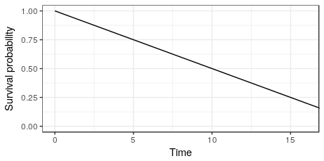

```{r setup, include=FALSE}
knitr::opts_chunk$set(echo = TRUE, message = FALSE, warning = FALSE)
```

## Introducing the GBSG2 dataset

In this course, we will frequently use the GBSG2 dataset.
This dataset contains information on breast cancer patients
and their survival. In this exercise, we will take a first look at it in R.
The TH.data package is loaded for you in this exercise.


```{r}
# Check out the help page for this dataset
#help(GBSG2, package = "TH.data")
# Load the data
library(survival)
library(survminer)
library(knitr)
library(tidyverse)
#library(TH.data)
#library(Ecdat)

data(GBSG2, package = "TH.data")

# Look at the summary of the dataset
summary(GBSG2)
```

## What will this course cover?
What will we cover in this course?

- Time-to-event analysis (type of the event does not matter, just
the fact that we are looking at the times until the event happens).


## Digging into the GBSG2 dataset 1
In the previous exercise, we learned about the GBSG2 dataset. 
Let's dig a bit deeper into it to understand the variables
we will use in the following.
The cens variable contains values that indicate whether or 
not a person in the study has died. In this exercise,
you'll explore these censored values.

What does the variable cens mean?
- Exactly! The convention is that the censoring indicator is 1 
if the event of interest happened.


```{r}
# Count censored and uncensored data
num_cens <- table(GBSG2$cens)
num_cens

# Create barplot of censored and uncensored data
barplot(num_cens)

# Use help() to look at cens
#help(GBSG2, package = "TH.data")

```


## Using the Surv() function for GBSG2
In the video, we learned about the Surv() function, 
which generates a Surv object. Let's look a little deeper
into what a Surv object actually is. We will use the GBSG2 data again.

The survival package and GBSG2 data are loaded for you in this exercise.

- Interesting right? The Surv object allows us to specify that time
and cens belong together. Notice that the elements of the object
have a + symbol if they are censored observations.

```{r}
# Create Surv-Object
sobj <- Surv( GBSG2$time, GBSG2$cens)

# Look at 10 first elements
sobj[1:10]

# Look at summary
summary(sobj)

# Look at structure
str(sobj)
```


## The UnempDur dataset
The UnempDur dataset contains information on how 
long people stay unemployed. In this case, the event
(finding a job) is something positive. This information
is stored in the censor1 variable, which has a value of
1 if an individual was re-employed at a full-time job.
The spell variable indicates the length of time an 
individual was unemployed in number of two-week intervals.

In this exercise, you'll explore these censored values 
and create a Surv object, just as you did in the 
previous exercises with the GBSG2 dataset.


```{r}
# Load the UnempDur data
data(UnempDur, package = "Ecdat")

# Count censored and uncensored data
cens_employ_ft <- table(UnempDur$censor1)
cens_employ_ft

# Create barplot of censored and uncensored data
barplot(cens_employ_ft)

# Create Surv-Object
sobj <- Surv(UnempDur$spell, UnempDur$censor1)

# Look at 10 first elements
head(sobj, 10)
```

## Interpreting a survival curve I
You are given the following survival curve:




What is the median survival time?

- 10

What is the probability to survive longer than 15 months?

- 0.25

Out of 100 patients, how many do you expect to be dead after 15 months?

- 75


## Function to compute the Kaplan-Meier estimate
In R, which function can you use to compute the Kaplan-Meier estimate?

- Surv() is used to define the time-to-event outcome, survreg() 
can be used to estimate a Weibull model (see upcoming lessons),
and with survfit() you can estimate survival curves, e.g. 
with the Kaplan-Meier technique.

## First Kaplan-Meier estimate
In this exercise, we will use the same data shown in the video.
We will take a look at the survfit() function and the object it generates.
This exercise will help you explore the survfit object.
The survival package is loaded for you in this exercise.


```{r}
# Create time and event data
time <- c(5, 6, 2, 4, 4)
event <- c(1, 0, 0, 1, 1)

# Compute Kaplan-Meier estimate
km <- survfit(Surv(time, event) ~ 1)
km

# Take a look at the structure
str(km)

# Create data.frame
data.frame(time = km$time, n.risk = km$n.risk, n.event = km$n.event,
  n.censor = km$n.censor, surv = km$surv) %>%
    kable
```


## When does the Kaplan-Meier curve drop?

- When a patient dies

## Why use Kaplan-Meier
Why don't we just compute the simple cumulative distribution
function (CDF) and use 1−CDF as the estimate for the survivor curve?

- The survival function is the same as 1−distribution function,
but we must think about censoring. Kaplan-Meier curves allow for this.


## Exercise ignoring censoring
You throw a party and at 1 a.m. guests suddenly start dancing.
You are curious to analyze how long your guests will dance for
and start collecting data. The problem is that you get tired and go to bed after a while.

You obtain the following right censored dancing times data given in dancedat:

name is the name of your friend.
time is the right-censored dancing time.
obs_end indicates if you observed the end of your friends
dance (1) or if you went to sleep before they stopped dancing (0).
You start analyzing the data in the morning, but you are tired and, 
at first, ignore the fact that you have censored observations. 
Then you remember this course on DataCamp and do it correctly.

The survival package is loaded for you in this exercise.


```{r}
# Create dancedat data
dancedat <- data.frame(
  name = c("Chris", "Martin", "Conny", "Desi", "Reni", "Phil", 
    "Flo", "Andrea", "Isaac", "Dayra", "Caspar"),
  time = c(20, 2, 14, 22, 3, 7, 4, 15, 25, 17, 12),
  obs_end = c(1, 1, 0, 1, 1, 1, 1, 1, 0, 0, 0))

# Estimate the survivor function pretending that all censored observations are actual observations.
km_wrong <- survfit(Surv(time) ~ 1, data = dancedat)

# Estimate the survivor function from this dataset via kaplan-meier.
km <- survfit(Surv(time, obs_end) ~ 1, data = dancedat)

# Plot the two and compare
ggsurvplot_combine(list(correct = km, wrong = km_wrong))
```


## Estimating and visualizing a survival curve
Let's take a look at the survival of breast cancer patients.
In this exercise, we work with the GBSG2 dataset again.
The survival and survminer packages and the GBSG2 data are loaded for you in this exercise.


```{r}

# Kaplan-Meier estimate
km <- survfit(Surv(time, cens)~1, data = GBSG2)

# plot of the Kaplan-Meier estimate
ggsurvplot(km)

# add the risk table to plot
ggsurvplot(km, risk.table = TRUE)

# add a line showing the median survival time
ggsurvplot(km, risk.table = TRUE, surv.median.line = "hv")

```


## Estimating median survival from a Weibull model
We can now estimate the survival of the breast cancer 
patients in the GBSG2 data using a Weibull model 
(function survreg()). Remember, the Weibull model estimates
a smooth survival function instead of a step function,
which is what the Kaplan-Meier method estimates.

The predict() function with type = "quantile" allows 
us to compute the quantiles of the distribution function.
We will use this to compute the median survival.

The survival package and the GBSG2 data are loaded for you in this exercise.


```{r}
# Weibull model
wb <- survreg(Surv(time, cens) ~ 1, data = GBSG2)

# Compute the median survival from the model
predict(wb, type = "quantile", p = 0.5, newdata = data.frame(1))
```


## Survival curve quantiles from a Weibull model
We can now estimate the survival of the breast 
cancer patients in the GBSG2 data using a Weibull model.
The predict() function with type = "quantile" allows us 
to compute the quantiles of the distribution function. 
As we learned in this course so far, the survival function 
is 1 - the distribution function (S=1−D), so we can easily
compute the quantiles of the survival function using the predict() function.
The survival package and GBSG2 data are loaded for you in this exercise.


```{r}
# Weibull model
wb <- survreg(Surv(time, cens) ~ 1, data = GBSG2)

# 70 Percent of patients survive beyond time point...
predict(wb, type = "quantile", p = 1-.7, newdata = data.frame(1))
```

## Estimating the survival curve with survreg()

We can now estimate the survival of the breast cancer patients in the GBSG2 data using a Weibull model.
The Weibull distribution has two parameters, which determine the form of the survival curve.
The survival package and the GBSG2 data are loaded for you in this exercise.


```{r}
# Weibull model
wb <- survreg(Surv(time, cens) ~ 1, GBSG2)

# Retrieve survival curve from model probabilities 
surv <- seq(.99, .01, by = -.01)

# Get time for each probability
t <- predict(wb, type = "quantile", p = 1 - surv, newdata = data.frame(1))

# Create data frame with the information
surv_wb <- data.frame(time = t, surv = surv)

# Look at first few lines of the result
head(surv_wb ) %>% kable()
```


## Comparing Weibull model and Kaplan-Meier estimate
Let's plot the survival curve we get from the Weibull model for the GBSG2 data!
The survival and survminer packages and the GBSG2 data are loaded for you in this exercise.


```{r}
# Weibull model
wb <- survreg(Surv(time, cens) ~ 1, GBSG2)

# Retrieve survival curve from model
surv <- seq(.99, .01, by = -.01)

# Get time for each probability
t <- predict(wb, type = "quantile", p = 1-surv, newdata = data.frame(1))

# Create data frame with the information needed for ggsurvplot_df
surv_wb <- data.frame(time = t, surv = surv, 
  upper = NA, lower = NA, std.err = NA)

# Plot
ggsurvplot_df(fit = surv_wb, surv.geom = geom_line)
```


## Interpreting coefficients
We have a dataset of lung cancer patients. 
In this exercise, we want to know if the sex
of the patients is associated with their survival time.
The survival package and the dataset are already loaded for you.


```{r}

dat <- read.csv("dat.csv")

dat$sex <- factor(dat$sex, levels = c("male", "female"))
str(dat)

# Estimate a Weibull model
wbmod <- survreg(Surv(time, status) ~ sex, data = dat)
coef(wbmod)
```


The sexfemale coefficient is positive which means women tend to survive longer.

## Compute Weibull model
For a Weibull model with covariates, we can compute the survival
curve just as we did for the Weibull model without covariates.
The only thing we need to do is specify the covariate values 
for a given survival curve in the predict() function. This can be done with the argument newdata.

```{r}
# Weibull model
wbmod <- survreg(Surv(time, cens) ~ horTh, data = GBSG2)

# Retrieve survival curve from model
surv <- seq(.99, .01, by = -.01)
t_yes <- predict(wbmod, type = "quantile", p = 1 - surv,
  newdata = data.frame(horTh = "yes"))

# Take a look at survival curve
str(t_yes)
```


## ggsurvplot() versus ggsurvplot_df()

What is the difference between the ggsurvplot_df() function and the ggsurvplot() function?
Take a look at the help files of the two functions to determine your answer.
?ggsurvplot_df
?ggsurvplot

## Computing a Weibull model and the survival curves
In this exercise we will reproduce the example from the video using the following steps:
Compute Weibull model
Decide on "imaginary patients"
Compute survival curves
Create data.frame with survival curve information
Plot
In this exercise, we will focus on the first three steps. The next exercise will cover the remaining steps.

The survival, survminer, and reshape2 packages and the GBSG2 data are loaded for you in this exercise.


```{r}
# Weibull model
library(data.table)
wbmod <- survreg(Surv(time, cens) ~ horTh + tsize, data = GBSG2)

# Imaginary patients
newdat <- expand.grid(
  horTh = levels(GBSG2$horTh),
  tsize = quantile(GBSG2$tsize, probs = c(0.25, 0.5, 0.75)))

# Compute survival curves
surv <- seq(.99, .01, by = -.01)
t <- predict(wbmod, type = "quantile", p = 1 - surv,
  newdata = newdat)

# How many rows and columns does t have?
dim(t)
```


## Visualising a Weibull model
In this exercise we will reproduce the example from the video following the steps:
Compute Weibull model
Decide on "imaginary patients"
Compute survival curves
Create data.frame with survival curve information
Plot
We will focus now on the last two steps.
The survival, survminer, and reshape2 packages 
and the GBSG2 data are loaded for you in this exercise.
The Weibull model wbmod and the imaginary patient data 
newdat you already computed are also available.


```{r}
# Use cbind() to combine the information in newdat with t
surv_wbmod_wide <- cbind(newdat, t)
  
# Use melt() to bring the data.frame to long format
surv_wbmod <- melt(surv_wbmod_wide, id.vars = c("horTh", "tsize"), variable.name = "surv_id", value.name = "time")

# Use surv_wbmod$surv_id to add the correct survival probabilities surv
surv_wbmod$surv <- surv[as.numeric(surv_wbmod$surv_id)]

# Add columns upper, lower, std.err, and strata to the data.frame
surv_wbmod[, c("upper", "lower", "std.err", "strata")] <- NA

# Plot the survival curves
ggsurvplot_df(surv_wbmod, surv.geom = geom_line,
  linetype = "horTh", color = "tsize", legend.title = NULL)
```

- The visualization shows that patients with smaller tumors tend
to survive longer and patients who receive hormonal therapy tend to survive longer.

- geom_line will produce a smooth line correctly representing the 
survival curve estimate from the Weibull model (the default surv.geom =
geom_step shows a step function and is incorrect for Weibull models).


- Exactly! dist is the argument to set the assumed distribution for y variable.
You can check which options are possible when looking at the help of survreg.distributions (?survreg.distributions).

## Computing a Weibull and a log-normal model
In this exercise, we want to compute a Weibull model and
a log-normal model for the GBSG2 data. You will see that
the process of computing the survival curve is the same.
In the upcoming exercise, we will compare the results from the two models and see the differences.
The survival, survminer, and reshape2 packages and the GBSG2 data are loaded for you in this exercise.


```{r}
# Weibull model
wbmod <- survreg(Surv(time, cens) ~ horTh, data = GBSG2)

# Log-Normal model
lnmod <- survreg(Surv(time, cens) ~ horTh, data = GBSG2, dist = "lognormal")

# Newdata
newdat <- data.frame(horTh = levels(GBSG2$horTh))

# Surv
surv <- seq(.99, .01, by = -.01)

# Survival curve from Weibull model and log-normal model
wbt <- predict(wbmod, type= "quantile", p = 1- surv, newdata = newdat)
lnt <- predict(lnmod, type = "quantile", p = 1 - surv, newdata = newdat)
```

## Comparing Weibull and Log-Normal Model I
In this exercise, we want to add the correct survival
probabilities to a data frame. This data frame will be
used to plot the survival curves. surv_wide is a wide 
data frame containing hormonal therapy information 
and the survival curves for the Weibull and log-normal models.
The survival, survminer, and reshape2 packages and the GBSG2 data are loaded for you in this exercise.

```{r}
# Melt the data.frame into long format.
surv_wide_wbt <- cbind(newdat, wbt, dist = "weibull")
surv_wide_lnt <- cbind(newdat, lnt, dist = "lognormal")

surv_wide <- rbind(surv_wide_wbt, surv_wide_lnt)
surv_long <- melt(surv_wide, id.vars = c("horTh", "dist"), 
                  variable = "surv_id", value.name = "time")

# Add column for the survival probabilities
surv_long$surv <- surv[as.numeric(surv_long$surv_id)]

# Add columns upper, lower, std.err, and strata contianing NA values
surv_long[, c("upper", "lower", "std.err", "strata")] <- NA
```

## Comparing Weibull and Log-Normal Model II
In this exercise, we want to compare the survival curves 
estimated by a Weibull model and by a log-normal model for
the GBSG2 data. This exercise shows how the estimates change if you use a different distribution.
The survival, survminer, and reshape2 packages and the GBSG2 data are loaded for you in this exercise.


```{r}
# Plot the survival curves
ggsurvplot_df(surv_long, surv.geom = geom_line,
              linetype ="horTh" , color = "dist", legend.title = NULL)
```


## Computing a Cox model
We have a dataset of lung cancer patients. We want to
know if their performance score (variable performance) is associated
with their survival time. The performance score measures how well
a patient can perform usual daily activities (bad=0, good=100).
The survival package and the dat dataset are already loaded for you.

```{r}
lung <- read.csv("lung.csv")
# Compute Cox model
cxmod <- coxph(Surv(time, status) ~ performance, data = lung)

# Show model coefficient
coef(cxmod)
```

Given the coefficient (coef(cxmod)), would you say that higher
performance scores are associated with longer survival?

- The performance coefficient is negative which means that
higher values of the performance score tend to go along with 
longer survival (interpretation is contrary to the Weibull model).


## Proportional hazards assumption
The Cox model is also called proportional hazards model. What does that mean?
- The Cox model cannot deal with the situation where survival curves cross


Computing the survival curve from a Cox model
In this exercise, we will reproduce the example from the video following the steps:

## Compute Cox model
Decide on "imaginary patients"
Compute survival curves
Create data.frame with survival curve information
Plot
We will focus now on the first three steps in 
this exercise and do the next two steps in the upcoming exercise.
The survival and survminer packages and the GBSG2
data are loaded for you in this exercise.

```{r}
# Cox model
cxmod <- coxph(Surv(time, cens) ~ horTh + tsize, data = GBSG2)

# Imaginary patients
newdat <- expand.grid(
  horTh = levels(GBSG2$horTh),
  tsize = quantile(GBSG2$tsize, probs = c(0.25, 0.5, 0.75)))
rownames(newdat) <- letters[1:6]

# Compute survival curves
cxsf <- survfit(cxmod, data = GBSG2, newdata = newdat, conf.type = "none")

# Look at first 6 rows of cxsf$surv and time points
head(cxsf$surv)
head(cxsf$time)
```

## Question
In the upcoming exercise, we will use surv_summary() 
to extract the necessary information from the survfit object.
Take a look at the help file ?surv_summary. Do you recognize 
the column names of the object returned by the function?
- With the function we create a data.frames with columns time, 
surv, strata, std.err, lower, upper, and others to plot the Weibull model using ggsurvplot_df().

## Visualizing a Cox model
In this exercise we will reproduce the example from the video following the steps:

Compute Cox model
Decide on "imaginary patients"
Compute survival curves
Create data.frame with survival curve information
Plot
We will focus now on the last two steps in this exercise.

The survival and survminer packages and the GBSG2 data are
loaded for you in this exercise. The Cox model cxmod, the 
imaginary patient data newdat, and the survival curve
information cxsf from the previous exercise are also available.

```{r}
# Compute data.frame needed for plotting
surv_cxmod0 <- surv_summary(cxsf)

# Get a character vector of patient letters (patient IDs)
pid <- as.character(surv_cxmod0$strata)

# Multiple of the rows in newdat so that it fits with surv_cxmod0
m_newdat <- newdat[pid, ]

# Add patient info to data.frame
surv_cxmod <- cbind(surv_cxmod0, m_newdat)

# Plot
ggsurvplot_df(surv_cxmod, linetype = "horTh", color = "tsize",
  legend.title = NULL, censor = FALSE)
```

## surv_summary()
What does the surv_summary() function return?

- A data.frame containing a nice summary from survfit() results, including
columns like time (survival time) and surv (survival probability).

## Why "imaginary patients"?
Why do we need to create a data.frame of "imaginary patients"
when plotting survival models with covariates?

- You can also use real patients, but you will have to tell
the function which covariate combinations you want to look at. 
That is why we call them imaginary patients.

## Capstone: The Cox model
To conclude the course, let's take a look back at the lung
cancer dataset we utilized briefly in these last 2 chapters.
To recap, this dataset contains information on the survival
of patients with advanced lung cancer from the North Central
Cancer Treatment Group. The event is stored in the status variable,
which has a value of 2 if an individual did not survive.
The performance score (variable performance) measures how
well a patient can perform usual daily activities (bad=0, good=100), 
rated by a physician. We want to know the association between specific performance scores and survival time.


```{r}
# Compute Cox model and survival curves
cxmod <- coxph(Surv(time, status) ~ performance, data = lung)
new_lung <- data.frame(performance = c(60, 70, 80, 90))
cxsf <- survfit(cxmod, data = lung, newdata = new_lung, conf.type = "none")

# Use the summary of cxsf to take a vector of patient IDs
surv_cxmod0 <- surv_summary(cxsf)
pid <- as.character(surv_cxmod0$strata)

# Duplicate rows in newdat to fit with surv_cxmod0 and add them in
m_newdat <- new_lung[pid, , drop = FALSE]
surv_cxmod <- cbind(surv_cxmod0, m_newdat)

# Plot
ggsurvplot_df(surv_cxmod, color = "performance", legend.title = NULL, censor = FALSE)
```

- Notice that individuals who had a higher performance score had a higher probability of surviving.


Capstone: Comparing survival curves
We saw from the last exercise that performance scores
do have an effect on the survival probability. Now, let's
take a look at the survival curve of all individuals using
the Kaplan-Meier estimate and compare it to the curve of a 
Cox model that takes performance into account. Note that for
Cox models, you can just enter the survfit() output into
ggsurvplot() instead of creating the needed data frame yourself and plugging it into ggsurvplot_df()


```{r}
# Compute Kaplan-Meier curve
km <- survfit(Surv(time, status) ~ 1, data = lung)

# Compute Cox model
cxmod <- coxph(Surv(time, status) ~ performance, data = lung)

# Compute Cox model survival curves
new_lung <- data.frame(performance = c(60, 70, 80, 90))
cxsf <- survfit(cxmod, data = lung, newdata = new_lung, conf.type = "none")

# Plot Kaplan-Meier curve
ggsurvplot(km, conf.int = FALSE)

# Plot Cox model survival curves
#survminer::ggsurvplot(cxsf, censor = FALSE)
```

