Survival Analysis in R
================
Mburu
3/31/2020

## Introducing the GBSG2 dataset

In this course, we will frequently use the GBSG2 dataset. This dataset
contains information on breast cancer patients and their survival. In
this exercise, we will take a first look at it in R. The TH.data package
is loaded for you in this exercise.

``` r
# Check out the help page for this dataset
#help(GBSG2, package = "TH.data")
# Load the data
library(survival)
library(survminer)
library(knitr)
library(tidyverse)
#library(TH.data)
#library(Ecdat)

data(GBSG2, package = "TH.data")

# Look at the summary of the dataset
summary(GBSG2)
```

    ##  horTh          age        menostat       tsize        tgrade   
    ##  no :440   Min.   :21.00   Pre :290   Min.   :  3.00   I  : 81  
    ##  yes:246   1st Qu.:46.00   Post:396   1st Qu.: 20.00   II :444  
    ##            Median :53.00              Median : 25.00   III:161  
    ##            Mean   :53.05              Mean   : 29.33            
    ##            3rd Qu.:61.00              3rd Qu.: 35.00            
    ##            Max.   :80.00              Max.   :120.00            
    ##      pnodes         progrec           estrec             time       
    ##  Min.   : 1.00   Min.   :   0.0   Min.   :   0.00   Min.   :   8.0  
    ##  1st Qu.: 1.00   1st Qu.:   7.0   1st Qu.:   8.00   1st Qu.: 567.8  
    ##  Median : 3.00   Median :  32.5   Median :  36.00   Median :1084.0  
    ##  Mean   : 5.01   Mean   : 110.0   Mean   :  96.25   Mean   :1124.5  
    ##  3rd Qu.: 7.00   3rd Qu.: 131.8   3rd Qu.: 114.00   3rd Qu.:1684.8  
    ##  Max.   :51.00   Max.   :2380.0   Max.   :1144.00   Max.   :2659.0  
    ##       cens       
    ##  Min.   :0.0000  
    ##  1st Qu.:0.0000  
    ##  Median :0.0000  
    ##  Mean   :0.4359  
    ##  3rd Qu.:1.0000  
    ##  Max.   :1.0000

## What will this course cover?

What will we cover in this course?

  - Time-to-event analysis (type of the event does not matter, just the
    fact that we are looking at the times until the event happens).

## Digging into the GBSG2 dataset 1

In the previous exercise, we learned about the GBSG2 dataset. Let’s dig
a bit deeper into it to understand the variables we will use in the
following. The cens variable contains values that indicate whether or
not a person in the study has died. In this exercise, you’ll explore
these censored values.

What does the variable cens mean? - Exactly\! The convention is that the
censoring indicator is 1 if the event of interest happened.

``` r
# Count censored and uncensored data
num_cens <- table(GBSG2$cens)
num_cens
```

    ## 
    ##   0   1 
    ## 387 299

``` r
# Create barplot of censored and uncensored data
barplot(num_cens)
```

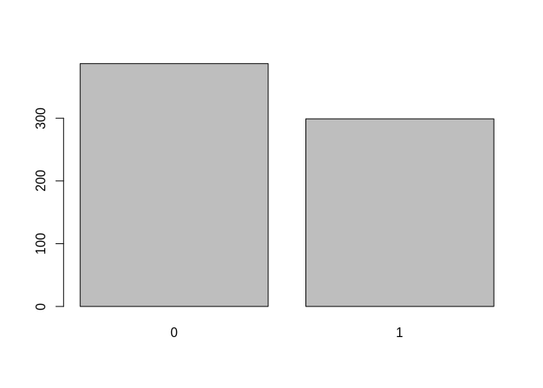<!-- -->

``` r
# Use help() to look at cens
#help(GBSG2, package = "TH.data")
```

## Using the Surv() function for GBSG2

In the video, we learned about the Surv() function, which generates a
Surv object. Let’s look a little deeper into what a Surv object actually
is. We will use the GBSG2 data again.

The survival package and GBSG2 data are loaded for you in this exercise.

  - Interesting right? The Surv object allows us to specify that time
    and cens belong together. Notice that the elements of the object
    have a + symbol if they are censored observations.

<!-- end list -->

``` r
# Create Surv-Object
sobj <- Surv( GBSG2$time, GBSG2$cens)

# Look at 10 first elements
sobj[1:10]
```

    ##  [1] 1814  2018   712  1807   772   448  2172+ 2161+  471  2014+

``` r
# Look at summary
summary(sobj)
```

    ##       time            status      
    ##  Min.   :   8.0   Min.   :0.0000  
    ##  1st Qu.: 567.8   1st Qu.:0.0000  
    ##  Median :1084.0   Median :0.0000  
    ##  Mean   :1124.5   Mean   :0.4359  
    ##  3rd Qu.:1684.8   3rd Qu.:1.0000  
    ##  Max.   :2659.0   Max.   :1.0000

``` r
# Look at structure
str(sobj)
```

    ##  'Surv' num [1:686, 1:2] 1814  2018   712  1807   772   448  2172+ 2161+  471  2014+ ...
    ##  - attr(*, "dimnames")=List of 2
    ##   ..$ : NULL
    ##   ..$ : chr [1:2] "time" "status"
    ##  - attr(*, "type")= chr "right"

## The UnempDur dataset

The UnempDur dataset contains information on how long people stay
unemployed. In this case, the event (finding a job) is something
positive. This information is stored in the censor1 variable, which has
a value of 1 if an individual was re-employed at a full-time job. The
spell variable indicates the length of time an individual was unemployed
in number of two-week intervals.

In this exercise, you’ll explore these censored values and create a Surv
object, just as you did in the previous exercises with the GBSG2
dataset.

``` r
# Load the UnempDur data
data(UnempDur, package = "Ecdat")

# Count censored and uncensored data
cens_employ_ft <- table(UnempDur$censor1)
cens_employ_ft
```

    ## 
    ##    0    1 
    ## 2270 1073

``` r
# Create barplot of censored and uncensored data
barplot(cens_employ_ft)
```

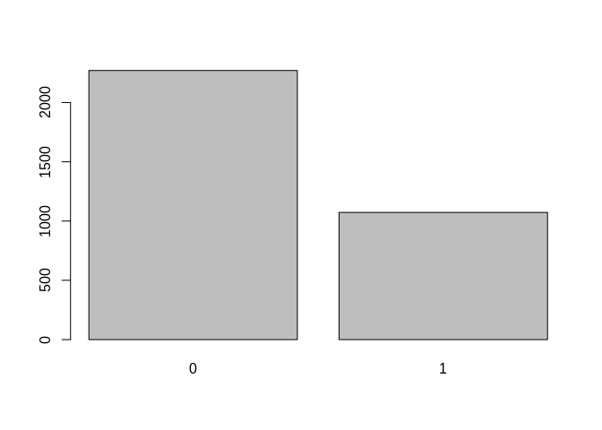<!-- -->

``` r
# Create Surv-Object
sobj <- Surv(UnempDur$spell, UnempDur$censor1)

# Look at 10 first elements
head(sobj, 10)
```

    ##  [1]  5  13  21   3   9+ 11+  1+  3   7   5+

## Interpreting a survival curve I

You are given the following survival curve:

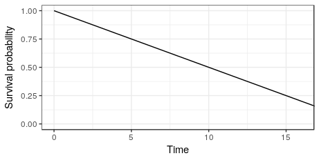

What is the median survival time?

  - 10

What is the probability to survive longer than 15 months?

  - 0.25

Out of 100 patients, how many do you expect to be dead after 15 months?

  - 75

## Function to compute the Kaplan-Meier estimate

In R, which function can you use to compute the Kaplan-Meier estimate?

  - Surv() is used to define the time-to-event outcome, survreg() can be
    used to estimate a Weibull model (see upcoming lessons), and with
    survfit() you can estimate survival curves, e.g.  with the
    Kaplan-Meier technique.

## First Kaplan-Meier estimate

In this exercise, we will use the same data shown in the video. We will
take a look at the survfit() function and the object it generates. This
exercise will help you explore the survfit object. The survival package
is loaded for you in this exercise.

``` r
# Create time and event data
time <- c(5, 6, 2, 4, 4)
event <- c(1, 0, 0, 1, 1)

# Compute Kaplan-Meier estimate
km <- survfit(Surv(time, event) ~ 1)
km
```

    ## Call: survfit(formula = Surv(time, event) ~ 1)
    ## 
    ##       n  events  median 0.95LCL 0.95UCL 
    ##     5.0     3.0     4.5     4.0      NA

``` r
# Take a look at the structure
str(km)
```

    ## List of 16
    ##  $ n        : int 5
    ##  $ time     : num [1:4] 2 4 5 6
    ##  $ n.risk   : num [1:4] 5 4 2 1
    ##  $ n.event  : num [1:4] 0 2 1 0
    ##  $ n.censor : num [1:4] 1 0 0 1
    ##  $ surv     : num [1:4] 1 0.5 0.25 0.25
    ##  $ std.err  : num [1:4] 0 0.5 0.866 0.866
    ##  $ cumhaz   : num [1:4] 0 0.5 1 1
    ##  $ std.chaz : num [1:4] 0 0.354 0.612 0.612
    ##  $ type     : chr "right"
    ##  $ logse    : logi TRUE
    ##  $ conf.int : num 0.95
    ##  $ conf.type: chr "log"
    ##  $ lower    : num [1:4] 1 0.1877 0.0458 0.0458
    ##  $ upper    : num [1:4] 1 1 1 1
    ##  $ call     : language survfit(formula = Surv(time, event) ~ 1)
    ##  - attr(*, "class")= chr "survfit"

``` r
# Create data.frame
data.frame(time = km$time, n.risk = km$n.risk, n.event = km$n.event,
  n.censor = km$n.censor, surv = km$surv) %>%
    kable
```

| time | n.risk | n.event | n.censor | surv |
| ---: | -----: | ------: | -------: | ---: |
|    2 |      5 |       0 |        1 | 1.00 |
|    4 |      4 |       2 |        0 | 0.50 |
|    5 |      2 |       1 |        0 | 0.25 |
|    6 |      1 |       0 |        1 | 0.25 |

## When does the Kaplan-Meier curve drop?

  - When a patient dies

## Why use Kaplan-Meier

Why don’t we just compute the simple cumulative distribution function
(CDF) and use 1−CDF as the estimate for the survivor curve?

  - The survival function is the same as 1−distribution function, but we
    must think about censoring. Kaplan-Meier curves allow for this.

## Exercise ignoring censoring

You throw a party and at 1 a.m. guests suddenly start dancing. You are
curious to analyze how long your guests will dance for and start
collecting data. The problem is that you get tired and go to bed after a
while.

You obtain the following right censored dancing times data given in
dancedat:

name is the name of your friend. time is the right-censored dancing
time. obs\_end indicates if you observed the end of your friends dance
(1) or if you went to sleep before they stopped dancing (0). You start
analyzing the data in the morning, but you are tired and, at first,
ignore the fact that you have censored observations. Then you remember
this course on DataCamp and do it correctly.

The survival package is loaded for you in this exercise.

``` r
# Create dancedat data
dancedat <- data.frame(
  name = c("Chris", "Martin", "Conny", "Desi", "Reni", "Phil", 
    "Flo", "Andrea", "Isaac", "Dayra", "Caspar"),
  time = c(20, 2, 14, 22, 3, 7, 4, 15, 25, 17, 12),
  obs_end = c(1, 1, 0, 1, 1, 1, 1, 1, 0, 0, 0))

# Estimate the survivor function pretending that all censored observations are actual observations.
km_wrong <- survfit(Surv(time) ~ 1, data = dancedat)

# Estimate the survivor function from this dataset via kaplan-meier.
km <- survfit(Surv(time, obs_end) ~ 1, data = dancedat)

# Plot the two and compare
ggsurvplot_combine(list(correct = km, wrong = km_wrong))
```

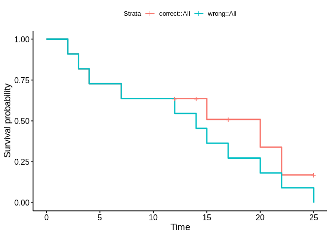<!-- -->

## Estimating and visualizing a survival curve

Let’s take a look at the survival of breast cancer patients. In this
exercise, we work with the GBSG2 dataset again. The survival and
survminer packages and the GBSG2 data are loaded for you in this
exercise.

``` r
# Kaplan-Meier estimate
km <- survfit(Surv(time, cens)~1, data = GBSG2)

# plot of the Kaplan-Meier estimate
ggsurvplot(km)
```

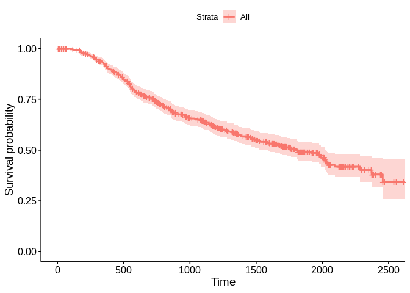<!-- -->

``` r
# add the risk table to plot
ggsurvplot(km, risk.table = TRUE)
```

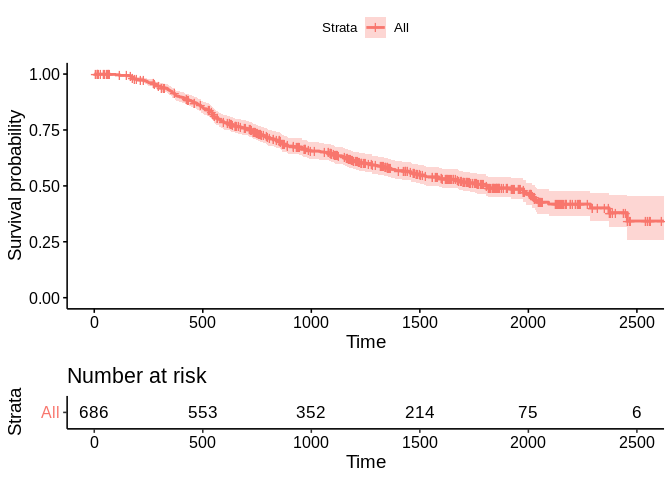<!-- -->

``` r
# add a line showing the median survival time
ggsurvplot(km, risk.table = TRUE, surv.median.line = "hv")
```

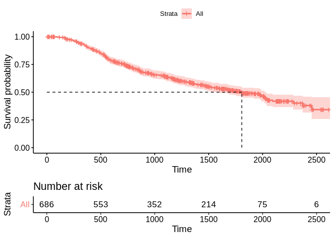<!-- -->

## Estimating median survival from a Weibull model

We can now estimate the survival of the breast cancer patients in the
GBSG2 data using a Weibull model (function survreg()). Remember, the
Weibull model estimates a smooth survival function instead of a step
function, which is what the Kaplan-Meier method estimates.

The predict() function with type = “quantile” allows us to compute the
quantiles of the distribution function. We will use this to compute the
median survival.

The survival package and the GBSG2 data are loaded for you in this
exercise.

``` r
# Weibull model
wb <- survreg(Surv(time, cens) ~ 1, data = GBSG2)

# Compute the median survival from the model
predict(wb, type = "quantile", p = 0.5, newdata = data.frame(1))
```

    ##       1 
    ## 1693.93

## Survival curve quantiles from a Weibull model

We can now estimate the survival of the breast cancer patients in the
GBSG2 data using a Weibull model. The predict() function with type =
“quantile” allows us to compute the quantiles of the distribution
function. As we learned in this course so far, the survival function is
1 - the distribution function (S=1−D), so we can easily compute the
quantiles of the survival function using the predict() function. The
survival package and GBSG2 data are loaded for you in this exercise.

``` r
# Weibull model
wb <- survreg(Surv(time, cens) ~ 1, data = GBSG2)

# 70 Percent of patients survive beyond time point...
predict(wb, type = "quantile", p = 1-.7, newdata = data.frame(1))
```

    ##        1 
    ## 1004.524

## Estimating the survival curve with survreg()

We can now estimate the survival of the breast cancer patients in the
GBSG2 data using a Weibull model. The Weibull distribution has two
parameters, which determine the form of the survival curve. The survival
package and the GBSG2 data are loaded for you in this exercise.

``` r
# Weibull model
wb <- survreg(Surv(time, cens) ~ 1, GBSG2)

# Retrieve survival curve from model probabilities 
surv <- seq(.99, .01, by = -.01)

# Get time for each probability
t <- predict(wb, type = "quantile", p = 1 - surv, newdata = data.frame(1))

# Create data frame with the information
surv_wb <- data.frame(time = t, surv = surv)

# Look at first few lines of the result
head(surv_wb ) %>% kable()
```

|     time | surv |
| -------: | ---: |
|  60.6560 | 0.99 |
| 105.0392 | 0.98 |
| 145.0723 | 0.97 |
| 182.6430 | 0.96 |
| 218.5715 | 0.95 |
| 253.3125 | 0.94 |

## Comparing Weibull model and Kaplan-Meier estimate

Let’s plot the survival curve we get from the Weibull model for the
GBSG2 data\! The survival and survminer packages and the GBSG2 data are
loaded for you in this exercise.

``` r
# Weibull model
wb <- survreg(Surv(time, cens) ~ 1, GBSG2)

# Retrieve survival curve from model
surv <- seq(.99, .01, by = -.01)

# Get time for each probability
t <- predict(wb, type = "quantile", p = 1-surv, newdata = data.frame(1))

# Create data frame with the information needed for ggsurvplot_df
surv_wb <- data.frame(time = t, surv = surv, 
  upper = NA, lower = NA, std.err = NA)

# Plot
ggsurvplot_df(fit = surv_wb, surv.geom = geom_line)
```

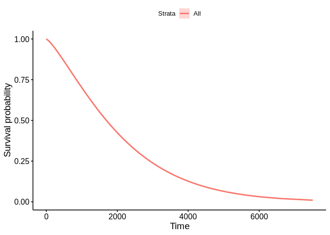<!-- -->

## Interpreting coefficients

We have a dataset of lung cancer patients. In this exercise, we want to
know if the sex of the patients is associated with their survival time.
The survival package and the dataset are already loaded for you.

``` r
dat <- read.csv("dat.csv")

dat$sex <- factor(dat$sex, levels = c("male", "female"))
str(dat)
```

    ## 'data.frame':    228 obs. of  3 variables:
    ##  $ time  : int  306 455 1010 210 883 1022 310 361 218 166 ...
    ##  $ status: int  2 2 1 2 2 1 2 2 2 2 ...
    ##  $ sex   : Factor w/ 2 levels "male","female": 1 1 1 1 1 1 2 2 1 1 ...

``` r
# Estimate a Weibull model
wbmod <- survreg(Surv(time, status) ~ sex, data = dat)
coef(wbmod)
```

    ## (Intercept)   sexfemale 
    ##    5.884162    0.395578

The sexfemale coefficient is positive which means women tend to survive
longer.

## Compute Weibull model

For a Weibull model with covariates, we can compute the survival curve
just as we did for the Weibull model without covariates. The only thing
we need to do is specify the covariate values for a given survival curve
in the predict() function. This can be done with the argument newdata.

``` r
# Weibull model
wbmod <- survreg(Surv(time, cens) ~ horTh, data = GBSG2)

# Retrieve survival curve from model
surv <- seq(.99, .01, by = -.01)
t_yes <- predict(wbmod, type = "quantile", p = 1 - surv,
  newdata = data.frame(horTh = "yes"))

# Take a look at survival curve
str(t_yes)
```

    ##  num [1:99] 76.4 131.4 180.9 227.2 271.4 ...

## ggsurvplot() versus ggsurvplot\_df()

What is the difference between the ggsurvplot\_df() function and the
ggsurvplot() function? Take a look at the help files of the two
functions to determine your answer. ?ggsurvplot\_df ?ggsurvplot

## Computing a Weibull model and the survival curves

In this exercise we will reproduce the example from the video using the
following steps: Compute Weibull model Decide on “imaginary patients”
Compute survival curves Create data.frame with survival curve
information Plot In this exercise, we will focus on the first three
steps. The next exercise will cover the remaining steps.

The survival, survminer, and reshape2 packages and the GBSG2 data are
loaded for you in this exercise.

``` r
# Weibull model
library(data.table)
wbmod <- survreg(Surv(time, cens) ~ horTh + tsize, data = GBSG2)

# Imaginary patients
newdat <- expand.grid(
  horTh = levels(GBSG2$horTh),
  tsize = quantile(GBSG2$tsize, probs = c(0.25, 0.5, 0.75)))

# Compute survival curves
surv <- seq(.99, .01, by = -.01)
t <- predict(wbmod, type = "quantile", p = 1 - surv,
  newdata = newdat)

# How many rows and columns does t have?
dim(t)
```

    ## [1]  6 99

## Visualising a Weibull model

In this exercise we will reproduce the example from the video following
the steps: Compute Weibull model Decide on “imaginary patients” Compute
survival curves Create data.frame with survival curve information Plot
We will focus now on the last two steps. The survival, survminer, and
reshape2 packages and the GBSG2 data are loaded for you in this
exercise. The Weibull model wbmod and the imaginary patient data newdat
you already computed are also available.

``` r
# Use cbind() to combine the information in newdat with t
surv_wbmod_wide <- cbind(newdat, t)
  
# Use melt() to bring the data.frame to long format
surv_wbmod <- melt(surv_wbmod_wide, id.vars = c("horTh", "tsize"), variable.name = "surv_id", value.name = "time")

# Use surv_wbmod$surv_id to add the correct survival probabilities surv
surv_wbmod$surv <- surv[as.numeric(surv_wbmod$surv_id)]

# Add columns upper, lower, std.err, and strata to the data.frame
surv_wbmod[, c("upper", "lower", "std.err", "strata")] <- NA

# Plot the survival curves
ggsurvplot_df(surv_wbmod, surv.geom = geom_line,
  linetype = "horTh", color = "tsize", legend.title = NULL)
```

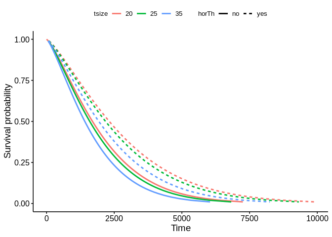<!-- -->

  - The visualization shows that patients with smaller tumors tend to
    survive longer and patients who receive hormonal therapy tend to
    survive longer.

  - geom\_line will produce a smooth line correctly representing the
    survival curve estimate from the Weibull model (the default
    surv.geom = geom\_step shows a step function and is incorrect for
    Weibull models).

  - Exactly\! dist is the argument to set the assumed distribution for y
    variable. You can check which options are possible when looking at
    the help of survreg.distributions (?survreg.distributions).

## Computing a Weibull and a log-normal model

In this exercise, we want to compute a Weibull model and a log-normal
model for the GBSG2 data. You will see that the process of computing the
survival curve is the same. In the upcoming exercise, we will compare
the results from the two models and see the differences. The survival,
survminer, and reshape2 packages and the GBSG2 data are loaded for you
in this exercise.

``` r
# Weibull model
wbmod <- survreg(Surv(time, cens) ~ horTh, data = GBSG2)

# Log-Normal model
lnmod <- survreg(Surv(time, cens) ~ horTh, data = GBSG2, dist = "lognormal")

# Newdata
newdat <- data.frame(horTh = levels(GBSG2$horTh))

# Surv
surv <- seq(.99, .01, by = -.01)

# Survival curve from Weibull model and log-normal model
wbt <- predict(wbmod, type= "quantile", p = 1- surv, newdata = newdat)
lnt <- predict(lnmod, type = "quantile", p = 1 - surv, newdata = newdat)
```

## Comparing Weibull and Log-Normal Model I

In this exercise, we want to add the correct survival probabilities to a
data frame. This data frame will be used to plot the survival curves.
surv\_wide is a wide data frame containing hormonal therapy information
and the survival curves for the Weibull and log-normal models. The
survival, survminer, and reshape2 packages and the GBSG2 data are loaded
for you in this exercise.

``` r
# Melt the data.frame into long format.
surv_wide_wbt <- cbind(newdat, wbt, dist = "weibull")
surv_wide_lnt <- cbind(newdat, lnt, dist = "lognormal")

surv_wide <- rbind(surv_wide_wbt, surv_wide_lnt)
surv_long <- melt(surv_wide, id.vars = c("horTh", "dist"), 
                  variable = "surv_id", value.name = "time")

# Add column for the survival probabilities
surv_long$surv <- surv[as.numeric(surv_long$surv_id)]

# Add columns upper, lower, std.err, and strata contianing NA values
surv_long[, c("upper", "lower", "std.err", "strata")] <- NA
```

## Comparing Weibull and Log-Normal Model II

In this exercise, we want to compare the survival curves estimated by a
Weibull model and by a log-normal model for the GBSG2 data. This
exercise shows how the estimates change if you use a different
distribution. The survival, survminer, and reshape2 packages and the
GBSG2 data are loaded for you in this exercise.

``` r
# Plot the survival curves
ggsurvplot_df(surv_long, surv.geom = geom_line,
              linetype ="horTh" , color = "dist", legend.title = NULL)
```

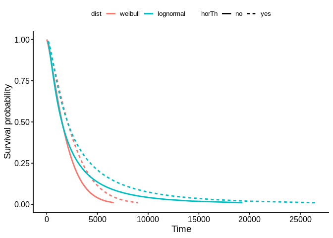<!-- -->

## Computing a Cox model

We have a dataset of lung cancer patients. We want to know if their
performance score (variable performance) is associated with their
survival time. The performance score measures how well a patient can
perform usual daily activities (bad=0, good=100). The survival package
and the dat dataset are already loaded for you.

``` r
lung <- read.csv("lung.csv")
# Compute Cox model
cxmod <- coxph(Surv(time, status) ~ performance, data = lung)

# Show model coefficient
coef(cxmod)
```

    ## performance 
    ## -0.01644821

Given the coefficient (coef(cxmod)), would you say that higher
performance scores are associated with longer survival?

  - The performance coefficient is negative which means that higher
    values of the performance score tend to go along with longer
    survival (interpretation is contrary to the Weibull model).

## Proportional hazards assumption

The Cox model is also called proportional hazards model. What does that
mean? - The Cox model cannot deal with the situation where survival
curves cross

Computing the survival curve from a Cox model In this exercise, we will
reproduce the example from the video following the steps:

## Compute Cox model

Decide on “imaginary patients” Compute survival curves Create data.frame
with survival curve information Plot We will focus now on the first
three steps in this exercise and do the next two steps in the upcoming
exercise. The survival and survminer packages and the GBSG2 data are
loaded for you in this exercise.

``` r
# Cox model
cxmod <- coxph(Surv(time, cens) ~ horTh + tsize, data = GBSG2)

# Imaginary patients
newdat <- expand.grid(
  horTh = levels(GBSG2$horTh),
  tsize = quantile(GBSG2$tsize, probs = c(0.25, 0.5, 0.75)))
rownames(newdat) <- letters[1:6]

# Compute survival curves
cxsf <- survfit(cxmod, data = GBSG2, newdata = newdat, conf.type = "none")

# Look at first 6 rows of cxsf$surv and time points
head(cxsf$surv)
```

    ##      a b c d e f
    ## [1,] 1 1 1 1 1 1
    ## [2,] 1 1 1 1 1 1
    ## [3,] 1 1 1 1 1 1
    ## [4,] 1 1 1 1 1 1
    ## [5,] 1 1 1 1 1 1
    ## [6,] 1 1 1 1 1 1

``` r
head(cxsf$time)
```

    ## [1]  8 15 16 17 18 29

## Question

In the upcoming exercise, we will use surv\_summary() to extract the
necessary information from the survfit object. Take a look at the help
file ?surv\_summary. Do you recognize the column names of the object
returned by the function? - With the function we create a data.frames
with columns time, surv, strata, std.err, lower, upper, and others to
plot the Weibull model using ggsurvplot\_df().

## Visualizing a Cox model

In this exercise we will reproduce the example from the video following
the steps:

Compute Cox model Decide on “imaginary patients” Compute survival curves
Create data.frame with survival curve information Plot We will focus now
on the last two steps in this exercise.

The survival and survminer packages and the GBSG2 data are loaded for
you in this exercise. The Cox model cxmod, the imaginary patient data
newdat, and the survival curve information cxsf from the previous
exercise are also available.

``` r
# Compute data.frame needed for plotting
surv_cxmod0 <- surv_summary(cxsf)

# Get a character vector of patient letters (patient IDs)
pid <- as.character(surv_cxmod0$strata)

# Multiple of the rows in newdat so that it fits with surv_cxmod0
m_newdat <- newdat[pid, ]

# Add patient info to data.frame
surv_cxmod <- cbind(surv_cxmod0, m_newdat)

# Plot
ggsurvplot_df(surv_cxmod, linetype = "horTh", color = "tsize",
  legend.title = NULL, censor = FALSE)
```

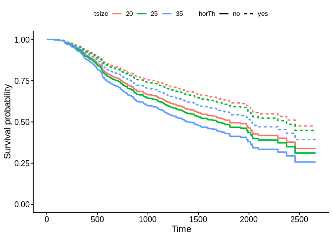<!-- -->

## surv\_summary()

What does the surv\_summary() function return?

  - A data.frame containing a nice summary from survfit() results,
    including columns like time (survival time) and surv (survival
    probability).

## Why “imaginary patients”?

Why do we need to create a data.frame of “imaginary patients” when
plotting survival models with covariates?

  - You can also use real patients, but you will have to tell the
    function which covariate combinations you want to look at. That is
    why we call them imaginary patients.

## Capstone: The Cox model

To conclude the course, let’s take a look back at the lung cancer
dataset we utilized briefly in these last 2 chapters. To recap, this
dataset contains information on the survival of patients with advanced
lung cancer from the North Central Cancer Treatment Group. The event is
stored in the status variable, which has a value of 2 if an individual
did not survive. The performance score (variable performance) measures
how well a patient can perform usual daily activities (bad=0, good=100),
rated by a physician. We want to know the association between specific
performance scores and survival time.

``` r
# Compute Cox model and survival curves
cxmod <- coxph(Surv(time, status) ~ performance, data = lung)
new_lung <- data.frame(performance = c(60, 70, 80, 90))
cxsf <- survfit(cxmod, data = lung, newdata = new_lung, conf.type = "none")

# Use the summary of cxsf to take a vector of patient IDs
surv_cxmod0 <- surv_summary(cxsf)
pid <- as.character(surv_cxmod0$strata)

# Duplicate rows in newdat to fit with surv_cxmod0 and add them in
m_newdat <- new_lung[pid, , drop = FALSE]
surv_cxmod <- cbind(surv_cxmod0, m_newdat)

# Plot
ggsurvplot_df(surv_cxmod, color = "performance", legend.title = NULL, censor = FALSE)
```

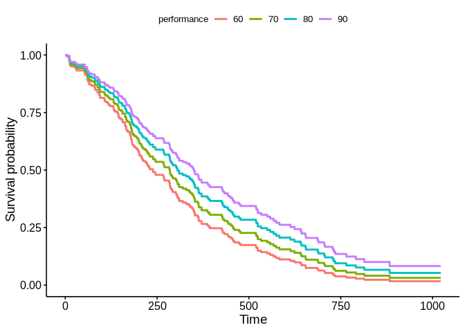<!-- -->

  - Notice that individuals who had a higher performance score had a
    higher probability of surviving.

Capstone: Comparing survival curves We saw from the last exercise that
performance scores do have an effect on the survival probability. Now,
let’s take a look at the survival curve of all individuals using the
Kaplan-Meier estimate and compare it to the curve of a Cox model that
takes performance into account. Note that for Cox models, you can just
enter the survfit() output into ggsurvplot() instead of creating the
needed data frame yourself and plugging it into ggsurvplot\_df()

``` r
# Compute Kaplan-Meier curve
km <- survfit(Surv(time, status) ~ 1, data = lung)

# Compute Cox model
cxmod <- coxph(Surv(time, status) ~ performance, data = lung)

# Compute Cox model survival curves
new_lung <- data.frame(performance = c(60, 70, 80, 90))
cxsf <- survfit(cxmod, data = lung, newdata = new_lung, conf.type = "none")

# Plot Kaplan-Meier curve
ggsurvplot(km, conf.int = FALSE)
```

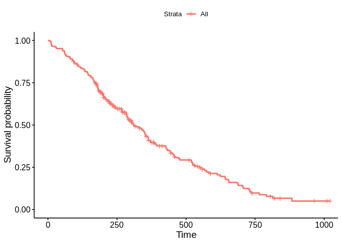<!-- -->

``` r
# Plot Cox model survival curves
#survminer::ggsurvplot(cxsf, censor = FALSE)
```
