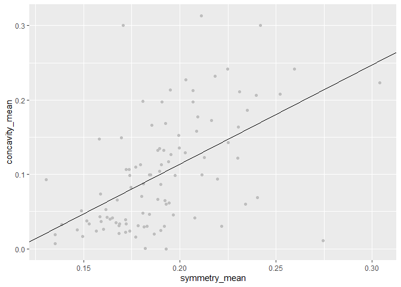
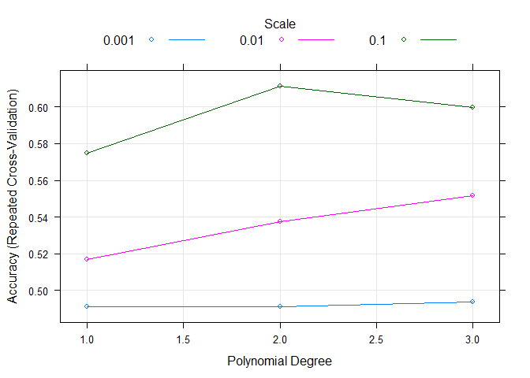
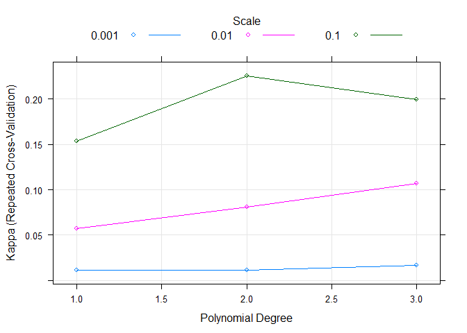
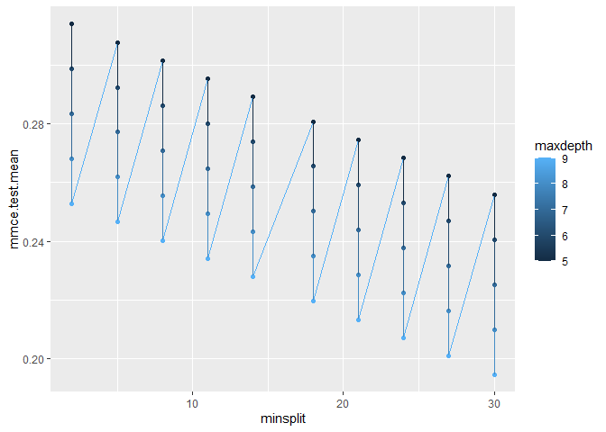

Hyperparameter Tuning in R
================
Mburu
3/23/2020

## Datacamp Courses README will be on the latest course done

``` r
library(tidyverse)
library(data.table)
library(tictoc)
library(caret)
library(knitr)
```

## Model parameters vs. hyperparameters

In order to perform hyperparameter tuning, it is important to really
understand what hyperparameters are (and what they are not). So let’s
look at model parameters versus hyperparameters in detail. Note: The
Breast Cancer Wisconsin (Diagnostic) Data Set has been loaded as
breast\_cancer\_data for you.

``` r
breast_cancer_data <- fread("breast_cancer_data.csv")

# Fit a linear model on the breast_cancer_data.
linear_model <- lm(concavity_mean ~ symmetry_mean,data = breast_cancer_data)

# Look at the summary of the linear_model.
summary(linear_model)
```

    ## 
    ## Call:
    ## lm(formula = concavity_mean ~ symmetry_mean, data = breast_cancer_data)
    ## 
    ## Residuals:
    ##       Min        1Q    Median        3Q       Max 
    ## -0.201877 -0.039201 -0.008432  0.030655  0.226150 
    ## 
    ## Coefficients:
    ##               Estimate Std. Error t value Pr(>|t|)    
    ## (Intercept)   -0.15311    0.04086  -3.747 0.000303 ***
    ## symmetry_mean  1.33366    0.21257   6.274 9.57e-09 ***
    ## ---
    ## Signif. codes:  0 '***' 0.001 '**' 0.01 '*' 0.05 '.' 0.1 ' ' 1
    ## 
    ## Residual standard error: 0.06412 on 98 degrees of freedom
    ## Multiple R-squared:  0.2866, Adjusted R-squared:  0.2793 
    ## F-statistic: 39.36 on 1 and 98 DF,  p-value: 9.575e-09

``` r
# Extract the coefficients.
coef(linear_model)
```

    ##   (Intercept) symmetry_mean 
    ##    -0.1531055     1.3336568

## What are the coefficients?

To get a good feel for the difference between fitted model parameters
and hyperparameters, we are going to take a closer look at those fitted
parameters: in our simple linear model, the coefficients. The dataset
breast\_cancer\_data has already been loaded for you and the linear
model call was run as in the previous lesson, so you can directly access
the object linear\_model. In our linear model, we can extract the
coefficients in the following way: linear\_model$coefficients. And we
can visualize the relationship we modeled with a plot. Remember, that a
linear model has the basic formula: y = x \* slope + intercept

``` r
# Plot linear relationship.
ggplot(data = breast_cancer_data, 
       aes(x = symmetry_mean, y = concavity_mean)) +
    geom_point(color = "grey") +
    geom_abline(slope = linear_model$coefficients[2], 
                intercept = linear_model$coefficients[1])
```

<!-- -->

## Machine learning with caret

Before we can train machine learning models and tune hyperparameters, we
need to prepare the data. The data has again been loaded into your
workspace as breast\_cancer\_data. The library caret has already been
loaded

``` r
# Create partition index
index <- createDataPartition(breast_cancer_data$diagnosis, p = 0.7, list = FALSE)

# Subset `breast_cancer_data` with index
bc_train_data <- breast_cancer_data[index, ]
bc_test_data  <- breast_cancer_data[-index, ]

# Define 3x5 folds repeated cross-validation
fitControl <- trainControl(method = "repeatedcv", number = 5, repeats = 3)

# Run the train() function
gbm_model <- train(diagnosis ~ ., 
                   data = bc_train_data, 
                   method = "gbm", 
                   trControl = fitControl,
                   verbose = FALSE)

# Look at the model
gbm_model
```

    ## Stochastic Gradient Boosting 
    ## 
    ## 70 samples
    ## 10 predictors
    ##  2 classes: 'B', 'M' 
    ## 
    ## No pre-processing
    ## Resampling: Cross-Validated (5 fold, repeated 3 times) 
    ## Summary of sample sizes: 56, 56, 56, 56, 56, 56, ... 
    ## Resampling results across tuning parameters:
    ## 
    ##   interaction.depth  n.trees  Accuracy   Kappa    
    ##   1                   50      0.9857143  0.9714286
    ##   1                  100      0.9857143  0.9714286
    ##   1                  150      0.9904762  0.9809524
    ##   2                   50      0.9809524  0.9619048
    ##   2                  100      0.9857143  0.9714286
    ##   2                  150      0.9904762  0.9809524
    ##   3                   50      0.9761905  0.9523810
    ##   3                  100      0.9857143  0.9714286
    ##   3                  150      0.9904762  0.9809524
    ## 
    ## Tuning parameter 'shrinkage' was held constant at a value of 0.1
    ## 
    ## Tuning parameter 'n.minobsinnode' was held constant at a value of 10
    ## Accuracy was used to select the optimal model using the largest value.
    ## The final values used for the model were n.trees = 150,
    ##  interaction.depth = 1, shrinkage = 0.1 and n.minobsinnode = 10.

## Changing the number of hyperparameters to tune

When we examine the model object closely, we can see that caret already
did some automatic hyperparameter tuning for us: train automatically
creates a grid of tuning parameters. By default, if p is the number of
tuning parameters, the grid size is 3^p. But we can also specify the
number of different values to try for each hyperparameter. The data has
again been preloaded as bc\_train\_data. The libraries caret and tictoc
have also been preloaded.

``` r
set.seed(42)
# Start timer.
tic()
# Train model.
gbm_model <- train(diagnosis ~ ., 
                   data = bc_train_data, 
                   method = "gbm", 
                   trControl = trainControl(method = "repeatedcv", 
                                            number = 5, repeats = 3),
                   verbose = FALSE,
                   tuneLength = 4)
# Stop timer.
toc()
```

    ## 1.2 sec elapsed

``` r
gbm_model
```

    ## Stochastic Gradient Boosting 
    ## 
    ## 70 samples
    ## 10 predictors
    ##  2 classes: 'B', 'M' 
    ## 
    ## No pre-processing
    ## Resampling: Cross-Validated (5 fold, repeated 3 times) 
    ## Summary of sample sizes: 56, 56, 56, 56, 56, 56, ... 
    ## Resampling results across tuning parameters:
    ## 
    ##   interaction.depth  n.trees  Accuracy   Kappa    
    ##   1                   50      0.9380952  0.8761905
    ##   1                  100      0.9380952  0.8761905
    ##   1                  150      0.9380952  0.8761905
    ##   1                  200      0.9380952  0.8761905
    ##   2                   50      0.9476190  0.8952381
    ##   2                  100      0.9476190  0.8952381
    ##   2                  150      0.9476190  0.8952381
    ##   2                  200      0.9476190  0.8952381
    ##   3                   50      0.9380952  0.8761905
    ##   3                  100      0.9428571  0.8857143
    ##   3                  150      0.9571429  0.9142857
    ##   3                  200      0.9571429  0.9142857
    ##   4                   50      0.9380952  0.8761905
    ##   4                  100      0.9380952  0.8761905
    ##   4                  150      0.9476190  0.8952381
    ##   4                  200      0.9476190  0.8952381
    ## 
    ## Tuning parameter 'shrinkage' was held constant at a value of 0.1
    ## 
    ## Tuning parameter 'n.minobsinnode' was held constant at a value of 10
    ## Accuracy was used to select the optimal model using the largest value.
    ## The final values used for the model were n.trees = 150,
    ##  interaction.depth = 3, shrinkage = 0.1 and n.minobsinnode = 10.

## Cartesian grid search in caret

In chapter 1, you learned how to use the expand.grid() function to
manually define hyperparameters. The same function can also be used to
define a grid of hyperparameters. The voters\_train\_data dataset has
already been preprocessed to make it a bit smaller so training will run
faster; it has now 80 observations and balanced classes and has been
loaded for you. The caret and tictoc packages have also been loaded and
the trainControl object has been defined with repeated cross-validation:

``` r
fitControl <- trainControl(method = "repeatedcv",
                           number = 3,
                           repeats = 5)


voters_data <- fread("voters_data.csv")


index <- createDataPartition(voters_data$turnout16_2016, p = 0.7, list = FALSE)

# Subset `breast_cancer_data` with index
voters_train_data <-voters_data[index, ]
voters_test_data  <- voters_data[-index, ]

# Define Cartesian grid
man_grid <- expand.grid(degree = c(1, 2, 3), 
                        scale = c(0.1, 0.01, 0.001), 
                        C = 0.5)

# Start timer, set seed & train model
tic()
set.seed(42)
svm_model_voters_grid <- train(turnout16_2016 ~ ., 
                               data = voters_train_data, 
                               method = "svmPoly", 
                               trControl = fitControl,
                               verbose= FALSE,
                               tuneGrid = man_grid)
toc()
```

    ## 2.43 sec elapsed

``` r
svm_model_voters_grid
```

    ## Support Vector Machines with Polynomial Kernel 
    ## 
    ## 70 samples
    ## 39 predictors
    ##  2 classes: 'Did not vote', 'Voted' 
    ## 
    ## No pre-processing
    ## Resampling: Cross-Validated (3 fold, repeated 5 times) 
    ## Summary of sample sizes: 47, 47, 46, 47, 46, 47, ... 
    ## Resampling results across tuning parameters:
    ## 
    ##   degree  scale  Accuracy   Kappa     
    ##   1       0.001  0.4910628  0.01111111
    ##   1       0.010  0.5170290  0.05681199
    ##   1       0.100  0.5747585  0.15355334
    ##   2       0.001  0.4910628  0.01111111
    ##   2       0.010  0.5374396  0.08091976
    ##   2       0.100  0.6114734  0.22581901
    ##   3       0.001  0.4938406  0.01666667
    ##   3       0.010  0.5518116  0.10684649
    ##   3       0.100  0.5996377  0.19949308
    ## 
    ## Tuning parameter 'C' was held constant at a value of 0.5
    ## Accuracy was used to select the optimal model using the largest value.
    ## The final values used for the model were degree = 2, scale = 0.1 and C
    ##  = 0.5.

``` r
# Plot default
plot(svm_model_voters_grid)
```

<!-- -->

``` r
# Plot Kappa level-plot
plot(svm_model_voters_grid, metric = "Kappa", plottype = "level")
```

<!-- -->

## Tune hyperparameters manually

If you already know which hyperparameter values you want to set, you can
also manually define hyperparameters as a grid. Go to modelLookup(‘gbm’)
or search for gbm in the list of available models in caret and check
under Tuning Parameters.

Note: Just as before,bc\_train\_data and the libraries caret and tictoc
have been preloaded.

``` r
# Define hyperparameter grid.
hyperparams <- expand.grid(n.trees = 200, 
                           interaction.depth = 1, 
                           shrinkage = 0.1, 
                           n.minobsinnode = 10)

# Apply hyperparameter grid to train().
set.seed(42)
gbm_model <- train(diagnosis ~ ., 
                   data = bc_train_data, 
                   method = "gbm", 
                   trControl = trainControl(method = "repeatedcv", 
                                            number = 5,repeats = 3),
                   verbose = FALSE,
                   tuneGrid = hyperparams)

gbm_model
```

    ## Stochastic Gradient Boosting 
    ## 
    ## 70 samples
    ## 10 predictors
    ##  2 classes: 'B', 'M' 
    ## 
    ## No pre-processing
    ## Resampling: Cross-Validated (5 fold, repeated 3 times) 
    ## Summary of sample sizes: 56, 56, 56, 56, 56, 56, ... 
    ## Resampling results:
    ## 
    ##   Accuracy  Kappa    
    ##   0.947619  0.8952381
    ## 
    ## Tuning parameter 'n.trees' was held constant at a value of 200
    ##  1
    ## Tuning parameter 'shrinkage' was held constant at a value of 0.1
    ## 
    ## Tuning parameter 'n.minobsinnode' was held constant at a value of 10

## Grid search with range of hyperparameters

In chapter 1, you learned how to use the expand.grid() function to
manually define a set of hyperparameters. The same function can also be
used to define a grid with ranges of hyperparameters. The
voters\_train\_data dataset has been loaded for you, as have the caret
and tictoc packages.

``` r
# Define the grid with hyperparameter ranges
big_grid <- expand.grid(size = seq(from = 1, to = 5, by = 1), decay = c(0, 1))

# Train control with grid search
fitControl <- trainControl(method = "repeatedcv", number = 3, repeats = 5, search = "grid")

# Train neural net
tic()
set.seed(42)
nn_model_voters_big_grid <- train(turnout16_2016 ~ ., 
                                  data = voters_train_data, 
                                  method = "nnet", 
                                  trControl = fitControl,
                                  verbose = FALSE)
```

    ## # weights:  42
    ## initial  value 37.138322 
    ## iter  10 value 32.567037
    ## iter  20 value 32.566351
    ## iter  30 value 30.899224
    ## iter  40 value 18.006739
    ## iter  50 value 17.994803
    ## iter  60 value 17.994725
    ## final  value 17.994725 
    ## converged
    ## # weights:  124
    ## initial  value 32.491600 
    ## iter  10 value 20.787421
    ## iter  20 value 8.303061
    ## iter  30 value 8.275658
    ## iter  40 value 8.271932
    ## iter  50 value 8.271377
    ## iter  60 value 8.270560
    ## iter  70 value 8.270488
    ## iter  80 value 8.270456
    ## iter  90 value 8.270360
    ## final  value 8.270358 
    ## converged
    ## # weights:  206
    ## initial  value 34.710434 
    ## iter  10 value 14.932746
    ## iter  20 value 10.027934
    ## iter  30 value 8.079911
    ## iter  40 value 7.095446
    ## iter  50 value 5.648801
    ## iter  60 value 5.173779
    ## iter  70 value 4.900751
    ## iter  80 value 4.782411
    ## iter  90 value 4.780912
    ## iter 100 value 4.780760
    ## final  value 4.780760 
    ## stopped after 100 iterations
    ## # weights:  42
    ## initial  value 38.344128 
    ## iter  10 value 30.496596
    ## iter  20 value 13.206270
    ## iter  30 value 10.168056
    ## iter  40 value 10.093036
    ## iter  50 value 10.092239
    ## final  value 10.092234 
    ## converged
    ## # weights:  124
    ## initial  value 36.334568 
    ## iter  10 value 20.975290
    ## iter  20 value 12.279457
    ## iter  30 value 10.152080
    ## iter  40 value 7.967916
    ## iter  50 value 7.678386
    ## iter  60 value 7.627699
    ## iter  70 value 7.626699
    ## final  value 7.626690 
    ## converged
    ## # weights:  206
    ## initial  value 35.260076 
    ## iter  10 value 13.922542
    ## iter  20 value 8.431612
    ## iter  30 value 7.742616
    ## iter  40 value 7.399642
    ## iter  50 value 7.210452
    ## iter  60 value 7.192967
    ## iter  70 value 7.192614
    ## iter  80 value 7.192600
    ## iter  80 value 7.192600
    ## iter  80 value 7.192600
    ## final  value 7.192600 
    ## converged
    ## # weights:  42
    ## initial  value 32.966387 
    ## iter  10 value 32.567890
    ## final  value 32.567822 
    ## converged
    ## # weights:  124
    ## initial  value 32.584642 
    ## iter  10 value 13.845332
    ## iter  20 value 13.383216
    ## iter  30 value 13.375452
    ## iter  40 value 13.369854
    ## iter  50 value 13.364270
    ## iter  60 value 13.358571
    ## iter  70 value 13.354610
    ## iter  80 value 13.352717
    ## iter  90 value 13.351490
    ## iter 100 value 13.349026
    ## final  value 13.349026 
    ## stopped after 100 iterations
    ## # weights:  206
    ## initial  value 37.367703 
    ## iter  10 value 19.447628
    ## iter  20 value 13.274946
    ## iter  30 value 13.233949
    ## iter  40 value 13.205138
    ## iter  50 value 13.190925
    ## iter  60 value 13.183849
    ## iter  70 value 13.181510
    ## iter  80 value 12.549513
    ## iter  90 value 8.172932
    ## iter 100 value 4.300194
    ## final  value 4.300194 
    ## stopped after 100 iterations
    ## # weights:  42
    ## initial  value 32.550204 
    ## iter  10 value 30.373148
    ## iter  20 value 30.316479
    ## final  value 30.316406 
    ## converged
    ## # weights:  124
    ## initial  value 34.759241 
    ## iter  10 value 16.317194
    ## iter  20 value 7.701699
    ## iter  30 value 6.401910
    ## iter  40 value 6.368882
    ## iter  50 value 6.363627
    ## iter  60 value 6.362852
    ## final  value 6.362784 
    ## converged
    ## # weights:  206
    ## initial  value 31.462407 
    ## iter  10 value 11.562016
    ## iter  20 value 3.002230
    ## iter  30 value 2.773046
    ## iter  40 value 2.772591
    ## final  value 2.772589 
    ## converged
    ## # weights:  42
    ## initial  value 33.729380 
    ## iter  10 value 24.501446
    ## iter  20 value 16.162788
    ## iter  30 value 13.052881
    ## iter  40 value 11.023865
    ## iter  50 value 10.850147
    ## iter  60 value 10.849939
    ## iter  60 value 10.849939
    ## iter  60 value 10.849939
    ## final  value 10.849939 
    ## converged
    ## # weights:  124
    ## initial  value 36.631374 
    ## iter  10 value 23.069214
    ## iter  20 value 13.528209
    ## iter  30 value 10.889040
    ## iter  40 value 9.071781
    ## iter  50 value 8.790094
    ## iter  60 value 8.579499
    ## iter  70 value 8.520462
    ## iter  80 value 8.519375
    ## final  value 8.519375 
    ## converged
    ## # weights:  206
    ## initial  value 35.892929 
    ## iter  10 value 19.418160
    ## iter  20 value 14.042050
    ## iter  30 value 9.812626
    ## iter  40 value 8.967699
    ## iter  50 value 8.666277
    ## iter  60 value 8.522306
    ## iter  70 value 8.278827
    ## iter  80 value 8.214929
    ## iter  90 value 8.169273
    ## iter 100 value 8.134234
    ## final  value 8.134234 
    ## stopped after 100 iterations
    ## # weights:  42
    ## initial  value 34.540476 
    ## iter  10 value 31.343632
    ## iter  20 value 20.672582
    ## iter  30 value 20.632905
    ## iter  40 value 20.628823
    ## iter  50 value 20.627356
    ## iter  60 value 20.625384
    ## iter  70 value 20.623735
    ## iter  80 value 20.623023
    ## iter  90 value 17.711970
    ## iter 100 value 16.616884
    ## final  value 16.616884 
    ## stopped after 100 iterations
    ## # weights:  124
    ## initial  value 32.260381 
    ## iter  10 value 15.554442
    ## iter  20 value 6.737224
    ## iter  30 value 5.847377
    ## iter  40 value 5.641201
    ## iter  50 value 5.520411
    ## iter  60 value 4.513731
    ## iter  70 value 4.025861
    ## iter  80 value 3.416975
    ## iter  90 value 3.407775
    ## iter 100 value 2.287484
    ## final  value 2.287484 
    ## stopped after 100 iterations
    ## # weights:  206
    ## initial  value 32.065780 
    ## iter  10 value 8.858859
    ## iter  20 value 1.099506
    ## iter  30 value 0.239510
    ## iter  40 value 0.206114
    ## iter  50 value 0.177138
    ## iter  60 value 0.141209
    ## iter  70 value 0.127889
    ## iter  80 value 0.119888
    ## iter  90 value 0.113615
    ## iter 100 value 0.110907
    ## final  value 0.110907 
    ## stopped after 100 iterations
    ## # weights:  42
    ## initial  value 32.418118 
    ## iter  10 value 31.828391
    ## iter  20 value 11.594870
    ## iter  30 value 4.206525
    ## iter  40 value 4.158247
    ## iter  50 value 4.156928
    ## final  value 4.156925 
    ## converged
    ## # weights:  124
    ## initial  value 40.659179 
    ## iter  10 value 13.036133
    ## iter  20 value 4.514555
    ## iter  30 value 4.158193
    ## iter  40 value 4.156933
    ## final  value 4.156927 
    ## converged
    ## # weights:  206
    ## initial  value 35.839518 
    ## iter  10 value 24.107551
    ## iter  20 value 23.546847
    ## iter  30 value 23.545965
    ## iter  30 value 23.545964
    ## final  value 23.545964 
    ## converged
    ## # weights:  42
    ## initial  value 34.055374 
    ## iter  10 value 20.722532
    ## iter  20 value 10.867173
    ## iter  30 value 9.889161
    ## final  value 9.888419 
    ## converged
    ## # weights:  124
    ## initial  value 36.212847 
    ## iter  10 value 25.160018
    ## iter  20 value 14.737874
    ## iter  30 value 8.242734
    ## iter  40 value 7.473331
    ## iter  50 value 7.433053
    ## iter  60 value 7.432941
    ## final  value 7.432941 
    ## converged
    ## # weights:  206
    ## initial  value 36.763593 
    ## iter  10 value 18.992488
    ## iter  20 value 9.554745
    ## iter  30 value 8.740429
    ## iter  40 value 7.485818
    ## iter  50 value 7.129350
    ## iter  60 value 7.101764
    ## iter  70 value 7.037369
    ## iter  80 value 7.017195
    ## iter  90 value 7.013800
    ## iter 100 value 7.013664
    ## final  value 7.013664 
    ## stopped after 100 iterations
    ## # weights:  42
    ## initial  value 34.049213 
    ## iter  10 value 23.843743
    ## iter  20 value 23.591345
    ## iter  30 value 23.582750
    ## iter  40 value 23.578091
    ## iter  50 value 23.574798
    ## iter  60 value 23.566726
    ## iter  70 value 22.106178
    ## iter  80 value 21.426956
    ## iter  90 value 21.424894
    ## iter 100 value 21.409346
    ## final  value 21.409346 
    ## stopped after 100 iterations
    ## # weights:  124
    ## initial  value 34.204443 
    ## iter  10 value 4.222549
    ## iter  20 value 0.115536
    ## iter  30 value 0.058841
    ## iter  40 value 0.057024
    ## iter  50 value 0.055873
    ## iter  60 value 0.053731
    ## iter  70 value 0.052186
    ## iter  80 value 0.051543
    ## iter  90 value 0.051031
    ## iter 100 value 0.050688
    ## final  value 0.050688 
    ## stopped after 100 iterations
    ## # weights:  206
    ## initial  value 37.955534 
    ## iter  10 value 7.172408
    ## iter  20 value 6.037557
    ## iter  30 value 0.151792
    ## iter  40 value 0.143672
    ## iter  50 value 0.116684
    ## iter  60 value 0.110067
    ## iter  70 value 0.103737
    ## iter  80 value 0.090443
    ## iter  90 value 0.081569
    ## iter 100 value 0.075201
    ## final  value 0.075201 
    ## stopped after 100 iterations
    ## # weights:  42
    ## initial  value 34.207941 
    ## iter  10 value 23.992142
    ## iter  20 value 20.108503
    ## iter  30 value 19.067701
    ## iter  40 value 18.649545
    ## iter  50 value 18.647176
    ## iter  60 value 18.646917
    ## final  value 18.646772 
    ## converged
    ## # weights:  124
    ## initial  value 37.437591 
    ## iter  10 value 22.236591
    ## iter  20 value 1.818832
    ## iter  30 value 0.035498
    ## iter  40 value 0.013061
    ## iter  50 value 0.001055
    ## final  value 0.000057 
    ## converged
    ## # weights:  206
    ## initial  value 39.135610 
    ## iter  10 value 32.369807
    ## iter  20 value 28.008066
    ## iter  30 value 18.083351
    ## iter  40 value 17.997835
    ## iter  50 value 15.080790
    ## iter  60 value 15.014965
    ## iter  70 value 15.013418
    ## iter  80 value 11.672973
    ## iter  90 value 9.493927
    ## iter 100 value 9.389416
    ## final  value 9.389416 
    ## stopped after 100 iterations
    ## # weights:  42
    ## initial  value 33.499306 
    ## iter  10 value 28.306589
    ## iter  20 value 16.599767
    ## iter  30 value 13.550631
    ## iter  40 value 12.656175
    ## iter  50 value 10.905539
    ## iter  60 value 10.823095
    ## final  value 10.823059 
    ## converged
    ## # weights:  124
    ## initial  value 35.163076 
    ## iter  10 value 23.804076
    ## iter  20 value 14.949483
    ## iter  30 value 11.771198
    ## iter  40 value 9.948936
    ## iter  50 value 9.381415
    ## iter  60 value 9.358876
    ## iter  70 value 9.351510
    ## iter  80 value 9.203462
    ## iter  90 value 8.999876
    ## iter 100 value 8.995961
    ## final  value 8.995961 
    ## stopped after 100 iterations
    ## # weights:  206
    ## initial  value 42.276985 
    ## iter  10 value 22.814280
    ## iter  20 value 11.303930
    ## iter  30 value 9.027344
    ## iter  40 value 8.491127
    ## iter  50 value 8.381834
    ## iter  60 value 8.307150
    ## iter  70 value 8.291083
    ## iter  80 value 8.288351
    ## final  value 8.288341 
    ## converged
    ## # weights:  42
    ## initial  value 34.516865 
    ## iter  10 value 18.995965
    ## iter  20 value 11.586190
    ## iter  30 value 11.575648
    ## iter  40 value 11.563385
    ## iter  50 value 11.557125
    ## iter  60 value 11.551539
    ## iter  70 value 11.548624
    ## iter  80 value 11.542615
    ## iter  90 value 11.539088
    ## iter 100 value 9.565523
    ## final  value 9.565523 
    ## stopped after 100 iterations
    ## # weights:  124
    ## initial  value 33.414591 
    ## iter  10 value 23.930840
    ## iter  20 value 5.649803
    ## iter  30 value 4.266323
    ## iter  40 value 1.442154
    ## iter  50 value 0.145910
    ## iter  60 value 0.106844
    ## iter  70 value 0.094847
    ## iter  80 value 0.090703
    ## iter  90 value 0.083594
    ## iter 100 value 0.079320
    ## final  value 0.079320 
    ## stopped after 100 iterations
    ## # weights:  206
    ## initial  value 32.857007 
    ## iter  10 value 19.480310
    ## iter  20 value 5.306910
    ## iter  30 value 4.398381
    ## iter  40 value 3.990084
    ## iter  50 value 3.060991
    ## iter  60 value 2.112226
    ## iter  70 value 0.229094
    ## iter  80 value 0.185529
    ## iter  90 value 0.163159
    ## iter 100 value 0.156153
    ## final  value 0.156153 
    ## stopped after 100 iterations
    ## # weights:  42
    ## initial  value 31.896491 
    ## iter  10 value 26.636392
    ## iter  20 value 0.595448
    ## iter  30 value 0.000853
    ## final  value 0.000055 
    ## converged
    ## # weights:  124
    ## initial  value 32.338753 
    ## iter  10 value 22.374763
    ## iter  20 value 7.695260
    ## iter  30 value 4.026041
    ## iter  40 value 0.000274
    ## final  value 0.000069 
    ## converged
    ## # weights:  206
    ## initial  value 32.036036 
    ## iter  10 value 16.396274
    ## iter  20 value 7.002894
    ## iter  30 value 6.969741
    ## iter  40 value 6.527133
    ## iter  50 value 0.002980
    ## iter  60 value 0.000631
    ## final  value 0.000066 
    ## converged
    ## # weights:  42
    ## initial  value 36.170963 
    ## iter  10 value 24.171865
    ## iter  20 value 19.123100
    ## iter  30 value 14.947626
    ## iter  40 value 10.783141
    ## iter  50 value 9.680607
    ## iter  60 value 9.671415
    ## final  value 9.671414 
    ## converged
    ## # weights:  124
    ## initial  value 35.008053 
    ## iter  10 value 26.100772
    ## iter  20 value 14.995687
    ## iter  30 value 8.606395
    ## iter  40 value 7.634167
    ## iter  50 value 7.555421
    ## iter  60 value 7.524744
    ## iter  70 value 7.315395
    ## iter  80 value 7.218899
    ## iter  90 value 7.170277
    ## iter 100 value 7.166622
    ## final  value 7.166622 
    ## stopped after 100 iterations
    ## # weights:  206
    ## initial  value 41.656922 
    ## iter  10 value 28.186555
    ## iter  20 value 13.764544
    ## iter  30 value 7.871910
    ## iter  40 value 7.366928
    ## iter  50 value 7.084649
    ## iter  60 value 6.945875
    ## iter  70 value 6.787148
    ## iter  80 value 6.752342
    ## iter  90 value 6.733848
    ## iter 100 value 6.726397
    ## final  value 6.726397 
    ## stopped after 100 iterations
    ## # weights:  42
    ## initial  value 32.416820 
    ## iter  10 value 28.881714
    ## iter  20 value 11.784418
    ## iter  30 value 11.406996
    ## iter  40 value 11.386743
    ## iter  50 value 11.374973
    ## iter  60 value 11.370474
    ## iter  70 value 11.366366
    ## iter  80 value 11.363236
    ## iter  90 value 11.360690
    ## iter 100 value 11.359587
    ## final  value 11.359587 
    ## stopped after 100 iterations
    ## # weights:  124
    ## initial  value 37.810586 
    ## iter  10 value 15.277433
    ## iter  20 value 7.815065
    ## iter  30 value 3.790363
    ## iter  40 value 3.571352
    ## iter  50 value 2.855349
    ## iter  60 value 0.180214
    ## iter  70 value 0.114622
    ## iter  80 value 0.106663
    ## iter  90 value 0.104385
    ## iter 100 value 0.100720
    ## final  value 0.100720 
    ## stopped after 100 iterations
    ## # weights:  206
    ## initial  value 36.828782 
    ## iter  10 value 11.557567
    ## iter  20 value 2.351067
    ## iter  30 value 0.508083
    ## iter  40 value 0.106624
    ## iter  50 value 0.092913
    ## iter  60 value 0.089128
    ## iter  70 value 0.086920
    ## iter  80 value 0.081525
    ## iter  90 value 0.076124
    ## iter 100 value 0.070527
    ## final  value 0.070527 
    ## stopped after 100 iterations
    ## # weights:  42
    ## initial  value 34.668728 
    ## iter  10 value 24.280561
    ## iter  20 value 13.270382
    ## iter  30 value 13.139015
    ## iter  40 value 13.138169
    ## iter  50 value 11.366047
    ## iter  60 value 11.326171
    ## iter  70 value 11.326065
    ## iter  70 value 11.326065
    ## iter  70 value 11.326065
    ## final  value 11.326065 
    ## converged
    ## # weights:  124
    ## initial  value 33.995467 
    ## iter  10 value 25.102165
    ## iter  20 value 18.119954
    ## iter  30 value 17.997397
    ## iter  40 value 11.981328
    ## iter  50 value 11.487756
    ## iter  60 value 11.483318
    ## iter  70 value 11.482947
    ## iter  80 value 9.425540
    ## iter  90 value 9.418502
    ## final  value 9.418474 
    ## converged
    ## # weights:  206
    ## initial  value 33.208888 
    ## iter  10 value 16.878214
    ## iter  20 value 7.312249
    ## iter  30 value 1.146936
    ## iter  40 value 0.102939
    ## iter  50 value 0.030881
    ## iter  60 value 0.018041
    ## iter  70 value 0.005238
    ## iter  80 value 0.001219
    ## iter  90 value 0.000286
    ## final  value 0.000073 
    ## converged
    ## # weights:  42
    ## initial  value 33.887641 
    ## iter  10 value 24.592992
    ## iter  20 value 17.962387
    ## iter  30 value 14.465504
    ## iter  40 value 13.079709
    ## iter  50 value 13.074488
    ## final  value 13.074488 
    ## converged
    ## # weights:  124
    ## initial  value 37.236638 
    ## iter  10 value 23.400039
    ## iter  20 value 15.250442
    ## iter  30 value 14.246787
    ## iter  40 value 13.010269
    ## iter  50 value 10.220780
    ## iter  60 value 9.844318
    ## iter  70 value 9.822198
    ## iter  80 value 9.821406
    ## iter  90 value 9.821372
    ## final  value 9.821371 
    ## converged
    ## # weights:  206
    ## initial  value 41.717800 
    ## iter  10 value 18.719481
    ## iter  20 value 14.365162
    ## iter  30 value 10.475919
    ## iter  40 value 9.210428
    ## iter  50 value 9.043366
    ## iter  60 value 9.001454
    ## iter  70 value 8.922982
    ## iter  80 value 8.890284
    ## iter  90 value 8.889740
    ## final  value 8.889738 
    ## converged
    ## # weights:  42
    ## initial  value 32.975429 
    ## iter  10 value 27.738656
    ## iter  20 value 20.180926
    ## iter  30 value 20.114523
    ## iter  40 value 17.394645
    ## iter  50 value 15.353182
    ## iter  60 value 15.324842
    ## iter  70 value 15.323361
    ## iter  80 value 15.319990
    ## iter  90 value 15.318632
    ## iter 100 value 15.317575
    ## final  value 15.317575 
    ## stopped after 100 iterations
    ## # weights:  124
    ## initial  value 34.828621 
    ## iter  10 value 14.395361
    ## iter  20 value 9.239453
    ## iter  30 value 4.425942
    ## iter  40 value 4.221287
    ## iter  50 value 4.215486
    ## iter  60 value 4.213879
    ## iter  70 value 4.209636
    ## iter  80 value 4.206112
    ## iter  90 value 4.203923
    ## iter 100 value 4.201885
    ## final  value 4.201885 
    ## stopped after 100 iterations
    ## # weights:  206
    ## initial  value 40.227681 
    ## iter  10 value 20.333336
    ## iter  20 value 5.749095
    ## iter  30 value 4.345795
    ## iter  40 value 4.272345
    ## iter  50 value 4.267624
    ## iter  60 value 1.568857
    ## iter  70 value 0.258102
    ## iter  80 value 0.250244
    ## iter  90 value 0.237601
    ## iter 100 value 0.227726
    ## final  value 0.227726 
    ## stopped after 100 iterations
    ## # weights:  42
    ## initial  value 32.314100 
    ## iter  10 value 14.333381
    ## iter  20 value 10.968844
    ## iter  30 value 10.952431
    ## final  value 10.952034 
    ## converged
    ## # weights:  124
    ## initial  value 33.317817 
    ## iter  10 value 13.645506
    ## iter  20 value 3.519343
    ## iter  30 value 0.317590
    ## iter  40 value 0.019566
    ## final  value 0.000081 
    ## converged
    ## # weights:  206
    ## initial  value 31.949605 
    ## iter  10 value 21.113290
    ## iter  20 value 4.180959
    ## iter  30 value 0.289823
    ## iter  40 value 0.034464
    ## iter  50 value 0.007798
    ## iter  60 value 0.001623
    ## iter  70 value 0.000510
    ## iter  80 value 0.000195
    ## final  value 0.000069 
    ## converged
    ## # weights:  42
    ## initial  value 32.815233 
    ## iter  10 value 23.481895
    ## iter  20 value 12.800074
    ## iter  30 value 9.660430
    ## iter  40 value 9.594575
    ## final  value 9.594568 
    ## converged
    ## # weights:  124
    ## initial  value 34.582692 
    ## iter  10 value 22.678655
    ## iter  20 value 12.563966
    ## iter  30 value 7.980912
    ## iter  40 value 7.131103
    ## iter  50 value 7.092960
    ## iter  60 value 7.089468
    ## final  value 7.089465 
    ## converged
    ## # weights:  206
    ## initial  value 35.059394 
    ## iter  10 value 18.099957
    ## iter  20 value 8.569211
    ## iter  30 value 7.311399
    ## iter  40 value 6.864339
    ## iter  50 value 6.705996
    ## iter  60 value 6.660671
    ## iter  70 value 6.655006
    ## iter  80 value 6.653507
    ## iter  90 value 6.653417
    ## final  value 6.653417 
    ## converged
    ## # weights:  42
    ## initial  value 31.931339 
    ## iter  10 value 30.035261
    ## iter  20 value 11.536855
    ## iter  30 value 11.466038
    ## iter  40 value 11.399883
    ## iter  50 value 11.384625
    ## iter  60 value 11.377477
    ## iter  70 value 11.368204
    ## iter  80 value 7.276830
    ## iter  90 value 7.013031
    ## iter 100 value 7.009165
    ## final  value 7.009165 
    ## stopped after 100 iterations
    ## # weights:  124
    ## initial  value 35.809378 
    ## iter  10 value 28.630512
    ## iter  20 value 19.800423
    ## iter  30 value 11.549914
    ## iter  40 value 7.803147
    ## iter  50 value 3.638195
    ## iter  60 value 0.220125
    ## iter  70 value 0.158702
    ## iter  80 value 0.127301
    ## iter  90 value 0.080317
    ## iter 100 value 0.071102
    ## final  value 0.071102 
    ## stopped after 100 iterations
    ## # weights:  206
    ## initial  value 33.887263 
    ## iter  10 value 11.183135
    ## iter  20 value 0.173725
    ## iter  30 value 0.147919
    ## iter  40 value 0.119107
    ## iter  50 value 0.095334
    ## iter  60 value 0.086659
    ## iter  70 value 0.079446
    ## iter  80 value 0.075066
    ## iter  90 value 0.071991
    ## iter 100 value 0.065775
    ## final  value 0.065775 
    ## stopped after 100 iterations
    ## # weights:  42
    ## initial  value 34.327102 
    ## iter  10 value 14.941656
    ## iter  20 value 10.822172
    ## iter  30 value 9.445182
    ## iter  40 value 9.426061
    ## iter  50 value 9.418858
    ## iter  60 value 9.418671
    ## iter  70 value 9.418503
    ## final  value 9.418493 
    ## converged
    ## # weights:  124
    ## initial  value 42.783083 
    ## iter  10 value 22.405303
    ## iter  20 value 21.789124
    ## iter  30 value 21.787046
    ## final  value 21.787042 
    ## converged
    ## # weights:  206
    ## initial  value 43.817719 
    ## iter  10 value 9.884278
    ## iter  20 value 9.041229
    ## iter  30 value 4.447337
    ## iter  40 value 0.022051
    ## iter  50 value 0.003581
    ## iter  60 value 0.001016
    ## iter  70 value 0.000126
    ## final  value 0.000094 
    ## converged
    ## # weights:  42
    ## initial  value 34.058388 
    ## iter  10 value 20.085106
    ## iter  20 value 15.105858
    ## iter  30 value 14.954282
    ## iter  40 value 13.130561
    ## iter  50 value 11.136873
    ## iter  60 value 11.095066
    ## final  value 11.095027 
    ## converged
    ## # weights:  124
    ## initial  value 35.160987 
    ## iter  10 value 22.637535
    ## iter  20 value 13.178000
    ## iter  30 value 10.209372
    ## iter  40 value 9.224724
    ## iter  50 value 9.006025
    ## iter  60 value 8.794866
    ## iter  70 value 8.762496
    ## iter  80 value 8.761868
    ## iter  80 value 8.761868
    ## iter  80 value 8.761868
    ## final  value 8.761868 
    ## converged
    ## # weights:  206
    ## initial  value 37.061857 
    ## iter  10 value 19.841395
    ## iter  20 value 11.869660
    ## iter  30 value 9.282388
    ## iter  40 value 8.776425
    ## iter  50 value 8.497690
    ## iter  60 value 8.354765
    ## iter  70 value 8.336566
    ## iter  80 value 8.335912
    ## iter  90 value 8.335572
    ## iter 100 value 8.335563
    ## final  value 8.335563 
    ## stopped after 100 iterations
    ## # weights:  42
    ## initial  value 35.587454 
    ## iter  10 value 16.927975
    ## iter  20 value 11.086690
    ## iter  30 value 11.068681
    ## iter  40 value 11.059485
    ## iter  50 value 9.860872
    ## iter  60 value 8.334825
    ## iter  70 value 8.328491
    ## iter  80 value 8.326662
    ## iter  90 value 8.323935
    ## iter 100 value 8.318884
    ## final  value 8.318884 
    ## stopped after 100 iterations
    ## # weights:  124
    ## initial  value 33.682952 
    ## iter  10 value 18.480538
    ## iter  20 value 14.200562
    ## iter  30 value 9.702720
    ## iter  40 value 4.057261
    ## iter  50 value 3.285884
    ## iter  60 value 3.235367
    ## iter  70 value 3.220374
    ## iter  80 value 3.202360
    ## iter  90 value 3.187683
    ## iter 100 value 3.173399
    ## final  value 3.173399 
    ## stopped after 100 iterations
    ## # weights:  206
    ## initial  value 34.863480 
    ## iter  10 value 13.448310
    ## iter  20 value 3.884597
    ## iter  30 value 0.229869
    ## iter  40 value 0.133667
    ## iter  50 value 0.118463
    ## iter  60 value 0.109837
    ## iter  70 value 0.092487
    ## iter  80 value 0.081566
    ## iter  90 value 0.078268
    ## iter 100 value 0.076307
    ## final  value 0.076307 
    ## stopped after 100 iterations
    ## # weights:  42
    ## initial  value 34.251949 
    ## iter  10 value 17.455592
    ## iter  20 value 11.897929
    ## iter  30 value 11.022840
    ## iter  40 value 10.998167
    ## iter  50 value 10.997498
    ## final  value 10.997497 
    ## converged
    ## # weights:  124
    ## initial  value 33.500616 
    ## iter  10 value 20.979017
    ## iter  20 value 9.271695
    ## iter  30 value 6.719202
    ## iter  40 value 2.677725
    ## iter  50 value 1.951646
    ## iter  60 value 1.925282
    ## iter  70 value 1.910617
    ## iter  80 value 1.909773
    ## iter  90 value 1.909628
    ## iter 100 value 1.909584
    ## final  value 1.909584 
    ## stopped after 100 iterations
    ## # weights:  206
    ## initial  value 38.706622 
    ## iter  10 value 28.928694
    ## iter  20 value 6.573425
    ## iter  30 value 5.562319
    ## iter  40 value 3.875372
    ## iter  50 value 3.086160
    ## iter  60 value 1.935572
    ## iter  70 value 1.398383
    ## iter  80 value 1.388289
    ## iter  90 value 1.386837
    ## iter 100 value 1.386625
    ## final  value 1.386625 
    ## stopped after 100 iterations
    ## # weights:  42
    ## initial  value 33.555902 
    ## iter  10 value 27.833718
    ## iter  20 value 18.051216
    ## iter  30 value 14.029004
    ## iter  40 value 13.400562
    ## iter  50 value 13.397003
    ## final  value 13.397002 
    ## converged
    ## # weights:  124
    ## initial  value 33.859072 
    ## iter  10 value 20.496606
    ## iter  20 value 12.181875
    ## iter  30 value 10.588987
    ## iter  40 value 9.645164
    ## iter  50 value 9.279715
    ## iter  60 value 9.209551
    ## iter  70 value 9.209387
    ## final  value 9.209387 
    ## converged
    ## # weights:  206
    ## initial  value 42.282658 
    ## iter  10 value 21.059284
    ## iter  20 value 14.114715
    ## iter  30 value 11.220551
    ## iter  40 value 9.771410
    ## iter  50 value 9.398855
    ## iter  60 value 9.074158
    ## iter  70 value 8.873861
    ## iter  80 value 8.675614
    ## iter  90 value 8.612258
    ## iter 100 value 8.603274
    ## final  value 8.603274 
    ## stopped after 100 iterations
    ## # weights:  42
    ## initial  value 33.522205 
    ## iter  10 value 23.239578
    ## iter  20 value 21.838042
    ## iter  30 value 21.369100
    ## iter  40 value 21.365678
    ## iter  50 value 21.362999
    ## iter  60 value 21.362302
    ## iter  70 value 17.987690
    ## iter  80 value 17.972823
    ## iter  90 value 17.969927
    ## iter 100 value 16.294143
    ## final  value 16.294143 
    ## stopped after 100 iterations
    ## # weights:  124
    ## initial  value 34.933522 
    ## iter  10 value 22.556073
    ## iter  20 value 20.337143
    ## iter  30 value 15.637522
    ## iter  40 value 9.602916
    ## iter  50 value 9.351237
    ## iter  60 value 8.727652
    ## iter  70 value 0.811514
    ## iter  80 value 0.108802
    ## iter  90 value 0.098821
    ## iter 100 value 0.094501
    ## final  value 0.094501 
    ## stopped after 100 iterations
    ## # weights:  206
    ## initial  value 31.950676 
    ## iter  10 value 16.355411
    ## iter  20 value 11.155211
    ## iter  30 value 8.792638
    ## iter  40 value 7.159510
    ## iter  50 value 6.822208
    ## iter  60 value 6.805497
    ## iter  70 value 5.397866
    ## iter  80 value 5.188265
    ## iter  90 value 4.791876
    ## iter 100 value 4.783245
    ## final  value 4.783245 
    ## stopped after 100 iterations
    ## # weights:  42
    ## initial  value 32.513000 
    ## iter  10 value 12.327775
    ## iter  20 value 5.101813
    ## iter  30 value 4.167694
    ## iter  40 value 4.157910
    ## iter  50 value 4.157142
    ## iter  60 value 4.157063
    ## iter  70 value 4.157016
    ## final  value 4.156930 
    ## converged
    ## # weights:  124
    ## initial  value 42.235441 
    ## iter  10 value 24.051010
    ## iter  20 value 16.360985
    ## iter  30 value 13.240707
    ## iter  40 value 12.830964
    ## iter  50 value 10.959355
    ## iter  60 value 10.954485
    ## iter  70 value 10.952442
    ## iter  80 value 10.952218
    ## iter  90 value 10.952180
    ## iter 100 value 10.946128
    ## final  value 10.946128 
    ## stopped after 100 iterations
    ## # weights:  206
    ## initial  value 35.580550 
    ## iter  10 value 16.221274
    ## iter  20 value 5.556577
    ## iter  30 value 1.010043
    ## iter  40 value 0.010178
    ## iter  50 value 0.000266
    ## final  value 0.000050 
    ## converged
    ## # weights:  42
    ## initial  value 34.535952 
    ## iter  10 value 20.614179
    ## iter  20 value 10.308900
    ## iter  30 value 10.065026
    ## iter  40 value 10.059317
    ## final  value 10.059317 
    ## converged
    ## # weights:  124
    ## initial  value 33.489178 
    ## iter  10 value 17.843909
    ## iter  20 value 12.998284
    ## iter  30 value 9.648037
    ## iter  40 value 8.093310
    ## iter  50 value 7.744714
    ## iter  60 value 7.637568
    ## iter  70 value 7.635431
    ## final  value 7.635428 
    ## converged
    ## # weights:  206
    ## initial  value 40.434325 
    ## iter  10 value 26.123892
    ## iter  20 value 14.587982
    ## iter  30 value 8.951903
    ## iter  40 value 7.903801
    ## iter  50 value 7.644059
    ## iter  60 value 7.601414
    ## iter  70 value 7.572624
    ## iter  80 value 7.571383
    ## iter  90 value 7.571247
    ## final  value 7.571202 
    ## converged
    ## # weights:  42
    ## initial  value 33.624974 
    ## iter  10 value 26.973826
    ## iter  20 value 17.819156
    ## iter  30 value 16.081844
    ## iter  40 value 13.746975
    ## iter  50 value 13.625511
    ## iter  60 value 13.622424
    ## iter  70 value 13.620367
    ## iter  80 value 10.999074
    ## iter  90 value 8.530315
    ## iter 100 value 8.269332
    ## final  value 8.269332 
    ## stopped after 100 iterations
    ## # weights:  124
    ## initial  value 37.731005 
    ## iter  10 value 22.618018
    ## iter  20 value 13.672748
    ## iter  30 value 11.052060
    ## iter  40 value 8.589956
    ## iter  50 value 8.310173
    ## iter  60 value 8.279163
    ## iter  70 value 8.269638
    ## iter  80 value 8.263703
    ## iter  90 value 8.259943
    ## iter 100 value 8.257985
    ## final  value 8.257985 
    ## stopped after 100 iterations
    ## # weights:  206
    ## initial  value 34.856428 
    ## iter  10 value 14.361930
    ## iter  20 value 11.032644
    ## iter  30 value 11.009472
    ## iter  40 value 9.283090
    ## iter  50 value 7.040079
    ## iter  60 value 7.033272
    ## iter  70 value 7.024796
    ## iter  80 value 7.016989
    ## iter  90 value 7.012632
    ## iter 100 value 6.843384
    ## final  value 6.843384 
    ## stopped after 100 iterations
    ## # weights:  42
    ## initial  value 32.957228 
    ## final  value 32.567275 
    ## converged
    ## # weights:  124
    ## initial  value 34.171962 
    ## iter  10 value 21.188247
    ## iter  20 value 16.681943
    ## iter  30 value 15.438209
    ## iter  40 value 14.221782
    ## iter  50 value 13.512314
    ## iter  60 value 12.844720
    ## iter  70 value 12.503934
    ## iter  80 value 11.962649
    ## iter  90 value 11.950859
    ## iter 100 value 11.884623
    ## final  value 11.884623 
    ## stopped after 100 iterations
    ## # weights:  206
    ## initial  value 32.687646 
    ## iter  10 value 16.293247
    ## iter  20 value 10.552474
    ## iter  30 value 8.260850
    ## iter  40 value 7.649968
    ## iter  50 value 7.442415
    ## iter  60 value 7.434761
    ## iter  70 value 7.433735
    ## iter  80 value 7.433677
    ## iter  90 value 7.433312
    ## iter 100 value 7.433234
    ## final  value 7.433234 
    ## stopped after 100 iterations
    ## # weights:  42
    ## initial  value 33.563280 
    ## iter  10 value 23.409715
    ## iter  20 value 14.981054
    ## iter  30 value 11.216146
    ## iter  40 value 10.938498
    ## final  value 10.938408 
    ## converged
    ## # weights:  124
    ## initial  value 36.025093 
    ## iter  10 value 20.871219
    ## iter  20 value 11.357124
    ## iter  30 value 9.427975
    ## iter  40 value 8.879998
    ## iter  50 value 8.664729
    ## iter  60 value 8.648632
    ## final  value 8.648620 
    ## converged
    ## # weights:  206
    ## initial  value 35.950475 
    ## iter  10 value 19.175995
    ## iter  20 value 10.078911
    ## iter  30 value 8.944305
    ## iter  40 value 8.575674
    ## iter  50 value 8.363331
    ## iter  60 value 8.265961
    ## iter  70 value 8.212787
    ## iter  80 value 8.177086
    ## iter  90 value 8.175315
    ## iter 100 value 8.174465
    ## final  value 8.174465 
    ## stopped after 100 iterations
    ## # weights:  42
    ## initial  value 36.741525 
    ## iter  10 value 15.684120
    ## iter  20 value 9.492899
    ## iter  30 value 9.476251
    ## iter  40 value 9.471651
    ## iter  50 value 9.467354
    ## iter  60 value 9.463649
    ## iter  70 value 9.462228
    ## iter  80 value 9.460571
    ## iter  90 value 9.459975
    ## iter 100 value 9.459631
    ## final  value 9.459631 
    ## stopped after 100 iterations
    ## # weights:  124
    ## initial  value 35.305471 
    ## iter  10 value 20.001685
    ## iter  20 value 10.245078
    ## iter  30 value 9.618667
    ## iter  40 value 9.572013
    ## iter  50 value 9.551098
    ## iter  60 value 9.542580
    ## iter  70 value 9.525407
    ## iter  80 value 9.516998
    ## iter  90 value 9.502555
    ## iter 100 value 9.489706
    ## final  value 9.489706 
    ## stopped after 100 iterations
    ## # weights:  206
    ## initial  value 33.797323 
    ## iter  10 value 17.551393
    ## iter  20 value 8.690345
    ## iter  30 value 6.957725
    ## iter  40 value 6.896909
    ## iter  50 value 3.643814
    ## iter  60 value 2.479497
    ## iter  70 value 2.442547
    ## iter  80 value 2.419999
    ## iter  90 value 2.411185
    ## iter 100 value 1.854438
    ## final  value 1.854438 
    ## stopped after 100 iterations
    ## # weights:  42
    ## initial  value 35.351629 
    ## iter  10 value 27.758323
    ## iter  20 value 15.911109
    ## iter  30 value 15.842539
    ## iter  40 value 15.837601
    ## iter  50 value 15.837585
    ## iter  50 value 15.837585
    ## iter  50 value 15.837585
    ## final  value 15.837585 
    ## converged
    ## # weights:  124
    ## initial  value 33.444018 
    ## iter  10 value 13.993663
    ## iter  20 value 4.220874
    ## iter  30 value 4.198683
    ## iter  40 value 4.198609
    ## final  value 4.198604 
    ## converged
    ## # weights:  206
    ## initial  value 34.408382 
    ## iter  10 value 18.060986
    ## iter  20 value 11.346652
    ## iter  30 value 6.966001
    ## iter  40 value 3.963045
    ## iter  50 value 0.110897
    ## iter  60 value 0.001178
    ## iter  70 value 0.000451
    ## final  value 0.000073 
    ## converged
    ## # weights:  42
    ## initial  value 36.487854 
    ## iter  10 value 24.944613
    ## iter  20 value 16.503361
    ## iter  30 value 13.148934
    ## iter  40 value 10.530144
    ## iter  50 value 10.438442
    ## final  value 10.438247 
    ## converged
    ## # weights:  124
    ## initial  value 40.340831 
    ## iter  10 value 29.709755
    ## iter  20 value 15.398942
    ## iter  30 value 10.243055
    ## iter  40 value 9.491151
    ## iter  50 value 8.990665
    ## iter  60 value 8.460140
    ## iter  70 value 8.258288
    ## iter  80 value 8.255606
    ## iter  90 value 8.254359
    ## final  value 8.254359 
    ## converged
    ## # weights:  206
    ## initial  value 37.565384 
    ## iter  10 value 22.030745
    ## iter  20 value 11.199818
    ## iter  30 value 9.172823
    ## iter  40 value 8.656180
    ## iter  50 value 8.394591
    ## iter  60 value 8.186872
    ## iter  70 value 7.894255
    ## iter  80 value 7.768052
    ## iter  90 value 7.669603
    ## iter 100 value 7.638152
    ## final  value 7.638152 
    ## stopped after 100 iterations
    ## # weights:  42
    ## initial  value 34.268060 
    ## iter  10 value 31.972876
    ## iter  20 value 28.188006
    ## iter  30 value 28.138782
    ## iter  40 value 28.135453
    ## iter  50 value 28.134198
    ## iter  60 value 28.133313
    ## iter  70 value 26.799601
    ## iter  80 value 25.523887
    ## iter  90 value 23.029252
    ## iter 100 value 14.444278
    ## final  value 14.444278 
    ## stopped after 100 iterations
    ## # weights:  124
    ## initial  value 34.720077 
    ## iter  10 value 14.307801
    ## iter  20 value 9.857983
    ## iter  30 value 9.356248
    ## iter  40 value 9.352243
    ## iter  50 value 9.348236
    ## iter  60 value 9.340163
    ## iter  70 value 7.030596
    ## iter  80 value 6.892046
    ## iter  90 value 1.874769
    ## iter 100 value 0.107768
    ## final  value 0.107768 
    ## stopped after 100 iterations
    ## # weights:  206
    ## initial  value 35.341096 
    ## iter  10 value 22.575130
    ## iter  20 value 10.174572
    ## iter  30 value 8.339356
    ## iter  40 value 7.405686
    ## iter  50 value 6.489527
    ## iter  60 value 4.450316
    ## iter  70 value 4.110640
    ## iter  80 value 3.591204
    ## iter  90 value 3.575417
    ## iter 100 value 3.559629
    ## final  value 3.559629 
    ## stopped after 100 iterations
    ## # weights:  42
    ## initial  value 33.327368 
    ## final  value 31.884801 
    ## converged
    ## # weights:  124
    ## initial  value 32.247088 
    ## iter  10 value 26.619057
    ## iter  20 value 7.875741
    ## iter  30 value 2.822539
    ## iter  40 value 2.466757
    ## iter  50 value 2.252806
    ## iter  60 value 1.920273
    ## iter  70 value 1.915276
    ## iter  80 value 1.914180
    ## iter  90 value 1.910848
    ## iter 100 value 1.910301
    ## final  value 1.910301 
    ## stopped after 100 iterations
    ## # weights:  206
    ## initial  value 34.794543 
    ## iter  10 value 16.455005
    ## iter  20 value 11.632736
    ## iter  30 value 4.929345
    ## iter  40 value 3.365237
    ## iter  50 value 3.365059
    ## iter  50 value 3.365059
    ## iter  50 value 3.365059
    ## final  value 3.365059 
    ## converged
    ## # weights:  42
    ## initial  value 32.824795 
    ## iter  10 value 22.248825
    ## iter  20 value 17.848700
    ## iter  30 value 14.900646
    ## iter  40 value 14.736524
    ## iter  50 value 14.718529
    ## final  value 14.718527 
    ## converged
    ## # weights:  124
    ## initial  value 34.206400 
    ## iter  10 value 22.470680
    ## iter  20 value 13.745216
    ## iter  30 value 10.590372
    ## iter  40 value 9.360993
    ## iter  50 value 9.280872
    ## iter  60 value 9.263191
    ## iter  70 value 9.257922
    ## iter  80 value 9.257872
    ## final  value 9.257872 
    ## converged
    ## # weights:  206
    ## initial  value 36.251712 
    ## iter  10 value 25.897961
    ## iter  20 value 13.413571
    ## iter  30 value 10.211225
    ## iter  40 value 9.801051
    ## iter  50 value 9.537912
    ## iter  60 value 8.914417
    ## iter  70 value 8.646593
    ## iter  80 value 8.569091
    ## iter  90 value 8.524988
    ## iter 100 value 8.513736
    ## final  value 8.513736 
    ## stopped after 100 iterations
    ## # weights:  42
    ## initial  value 32.411506 
    ## final  value 31.885497 
    ## converged
    ## # weights:  124
    ## initial  value 32.066855 
    ## iter  10 value 15.612594
    ## iter  20 value 6.793610
    ## iter  30 value 6.595887
    ## iter  40 value 6.488563
    ## iter  50 value 6.458026
    ## iter  60 value 6.241846
    ## iter  70 value 6.059341
    ## iter  80 value 5.965838
    ## iter  90 value 5.809351
    ## iter 100 value 3.938508
    ## final  value 3.938508 
    ## stopped after 100 iterations
    ## # weights:  206
    ## initial  value 31.421987 
    ## iter  10 value 18.602995
    ## iter  20 value 6.428810
    ## iter  30 value 5.862202
    ## iter  40 value 3.713926
    ## iter  50 value 3.678841
    ## iter  60 value 3.641371
    ## iter  70 value 3.551542
    ## iter  80 value 3.451816
    ## iter  90 value 3.403556
    ## iter 100 value 0.167412
    ## final  value 0.167412 
    ## stopped after 100 iterations
    ## # weights:  42
    ## initial  value 33.924305 
    ## final  value 32.567284 
    ## converged
    ## # weights:  124
    ## initial  value 36.125145 
    ## iter  10 value 26.770480
    ## iter  20 value 5.568440
    ## iter  30 value 4.209674
    ## iter  40 value 4.201451
    ## iter  50 value 4.200381
    ## iter  60 value 2.128295
    ## iter  70 value 0.003724
    ## iter  80 value 0.001247
    ## iter  90 value 0.000541
    ## iter 100 value 0.000277
    ## final  value 0.000277 
    ## stopped after 100 iterations
    ## # weights:  206
    ## initial  value 35.811102 
    ## iter  10 value 18.996944
    ## iter  20 value 3.645030
    ## iter  30 value 2.875945
    ## iter  40 value 0.082092
    ## iter  50 value 0.008331
    ## iter  60 value 0.001231
    ## iter  70 value 0.000640
    ## iter  80 value 0.000268
    ## iter  90 value 0.000120
    ## final  value 0.000099 
    ## converged
    ## # weights:  42
    ## initial  value 33.898631 
    ## iter  10 value 20.783339
    ## iter  20 value 13.447242
    ## iter  30 value 10.410003
    ## iter  40 value 10.359746
    ## final  value 10.359741 
    ## converged
    ## # weights:  124
    ## initial  value 34.440394 
    ## iter  10 value 18.571375
    ## iter  20 value 10.927860
    ## iter  30 value 8.780327
    ## iter  40 value 8.275873
    ## iter  50 value 8.078079
    ## iter  60 value 7.936484
    ## iter  70 value 7.924291
    ## iter  80 value 7.924199
    ## final  value 7.924183 
    ## converged
    ## # weights:  206
    ## initial  value 33.594430 
    ## iter  10 value 17.396727
    ## iter  20 value 9.466398
    ## iter  30 value 7.994148
    ## iter  40 value 7.693935
    ## iter  50 value 7.531681
    ## iter  60 value 7.506946
    ## iter  70 value 7.506647
    ## final  value 7.506644 
    ## converged
    ## # weights:  42
    ## initial  value 33.326844 
    ## iter  10 value 31.278649
    ## iter  20 value 16.659023
    ## iter  30 value 16.358539
    ## iter  40 value 16.326153
    ## iter  50 value 13.187736
    ## iter  60 value 9.509434
    ## iter  70 value 7.706502
    ## iter  80 value 7.012708
    ## iter  90 value 7.005228
    ## iter 100 value 7.004013
    ## final  value 7.004013 
    ## stopped after 100 iterations
    ## # weights:  124
    ## initial  value 33.795774 
    ## iter  10 value 17.614397
    ## iter  20 value 15.052528
    ## iter  30 value 13.384717
    ## iter  40 value 13.377296
    ## iter  50 value 13.374119
    ## iter  60 value 13.369632
    ## iter  70 value 13.366089
    ## iter  80 value 13.363311
    ## iter  90 value 11.520112
    ## iter 100 value 11.514699
    ## final  value 11.514699 
    ## stopped after 100 iterations
    ## # weights:  206
    ## initial  value 34.753222 
    ## iter  10 value 22.647841
    ## iter  20 value 8.268115
    ## iter  30 value 7.923908
    ## iter  40 value 7.287789
    ## iter  50 value 6.519742
    ## iter  60 value 6.489593
    ## iter  70 value 6.475835
    ## iter  80 value 6.442479
    ## iter  90 value 6.021919
    ## iter 100 value 5.987774
    ## final  value 5.987774 
    ## stopped after 100 iterations
    ## # weights:  42
    ## initial  value 33.512782 
    ## iter  10 value 17.888612
    ## iter  20 value 17.701801
    ## iter  30 value 16.356173
    ## iter  40 value 16.299236
    ## iter  50 value 16.298331
    ## iter  60 value 16.298245
    ## final  value 16.298239 
    ## converged
    ## # weights:  124
    ## initial  value 34.038822 
    ## iter  10 value 11.930020
    ## iter  20 value 0.736303
    ## iter  30 value 0.016443
    ## iter  40 value 0.003357
    ## iter  50 value 0.001515
    ## final  value 0.000081 
    ## converged
    ## # weights:  206
    ## initial  value 32.374855 
    ## iter  10 value 16.048316
    ## iter  20 value 14.435712
    ## iter  30 value 13.955115
    ## final  value 13.955092 
    ## converged
    ## # weights:  42
    ## initial  value 35.109807 
    ## iter  10 value 21.185090
    ## iter  20 value 10.770049
    ## iter  30 value 10.030215
    ## final  value 10.026776 
    ## converged
    ## # weights:  124
    ## initial  value 41.029542 
    ## iter  10 value 14.892723
    ## iter  20 value 9.751116
    ## iter  30 value 8.158357
    ## iter  40 value 7.818611
    ## iter  50 value 7.573049
    ## iter  60 value 7.504664
    ## iter  70 value 7.501895
    ## final  value 7.501895 
    ## converged
    ## # weights:  206
    ## initial  value 38.530227 
    ## iter  10 value 19.026507
    ## iter  20 value 9.165747
    ## iter  30 value 7.561432
    ## iter  40 value 7.214158
    ## iter  50 value 7.098974
    ## iter  60 value 7.081080
    ## iter  70 value 7.080816
    ## iter  80 value 7.080547
    ## final  value 7.080508 
    ## converged
    ## # weights:  42
    ## initial  value 32.517342 
    ## iter  10 value 18.579282
    ## iter  20 value 0.387378
    ## iter  30 value 0.062503
    ## iter  40 value 0.059589
    ## iter  50 value 0.057889
    ## iter  60 value 0.057130
    ## iter  70 value 0.056680
    ## iter  80 value 0.055995
    ## iter  90 value 0.055797
    ## iter 100 value 0.055407
    ## final  value 0.055407 
    ## stopped after 100 iterations
    ## # weights:  124
    ## initial  value 32.477528 
    ## iter  10 value 13.746684
    ## iter  20 value 4.313725
    ## iter  30 value 4.247616
    ## iter  40 value 4.234370
    ## iter  50 value 4.222597
    ## iter  60 value 4.218076
    ## iter  70 value 4.208026
    ## iter  80 value 4.205210
    ## iter  90 value 4.202792
    ## iter 100 value 2.778399
    ## final  value 2.778399 
    ## stopped after 100 iterations
    ## # weights:  206
    ## initial  value 32.655062 
    ## iter  10 value 10.423306
    ## iter  20 value 4.400800
    ## iter  30 value 1.430047
    ## iter  40 value 0.092373
    ## iter  50 value 0.077895
    ## iter  60 value 0.073458
    ## iter  70 value 0.067051
    ## iter  80 value 0.061274
    ## iter  90 value 0.055826
    ## iter 100 value 0.051682
    ## final  value 0.051682 
    ## stopped after 100 iterations
    ## # weights:  124
    ## initial  value 48.808566 
    ## iter  10 value 29.996808
    ## iter  20 value 18.819948
    ## iter  30 value 4.405600
    ## iter  40 value 1.499995
    ## iter  50 value 0.285703
    ## iter  60 value 0.228562
    ## iter  70 value 0.211013
    ## iter  80 value 0.191504
    ## iter  90 value 0.163736
    ## iter 100 value 0.139805
    ## final  value 0.139805 
    ## stopped after 100 iterations

``` r
toc()
```

    ## 2.53 sec elapsed

``` r
nn_model_voters_big_grid 
```

    ## Neural Network 
    ## 
    ## 70 samples
    ## 39 predictors
    ##  2 classes: 'Did not vote', 'Voted' 
    ## 
    ## No pre-processing
    ## Resampling: Cross-Validated (3 fold, repeated 5 times) 
    ## Summary of sample sizes: 47, 47, 46, 47, 46, 47, ... 
    ## Resampling results across tuning parameters:
    ## 
    ##   size  decay  Accuracy   Kappa    
    ##   1     0e+00  0.5774155  0.1645543
    ##   1     1e-04  0.5750000  0.1543303
    ##   1     1e-01  0.6200483  0.2436431
    ##   3     0e+00  0.5856280  0.1768993
    ##   3     1e-04  0.6340580  0.2707645
    ##   3     1e-01  0.6228261  0.2495455
    ##   5     0e+00  0.5887681  0.1822207
    ##   5     1e-04  0.5910628  0.1852026
    ##   5     1e-01  0.6287440  0.2618261
    ## 
    ## Accuracy was used to select the optimal model using the largest value.
    ## The final values used for the model were size = 3 and decay = 1e-04.

## Random search with caret

Now you are going to perform a random search instead of grid search\! As
before, the small voters\_train\_data dataset has been loaded for you,
as have the caret and tictoc packages.

``` r
# Train control with random search
fitControl <- trainControl(method = "repeatedcv",
                           number = 3,
                           repeats = 5,
                           search = "random")

# Test 6 random hyperparameter combinations
tic()
nn_model_voters_big_grid <- train(turnout16_2016 ~ ., 
                                  data = voters_train_data, 
                                  method = "nnet", 
                                  trControl = fitControl,
                                  verbose = FALSE,
                                  tuneLength = 6)
```

    ## # weights:  329
    ## initial  value 32.675515 
    ## iter  10 value 13.987050
    ## iter  20 value 7.635616
    ## iter  30 value 1.937148
    ## iter  40 value 0.224553
    ## iter  50 value 0.098937
    ## iter  60 value 0.088344
    ## iter  70 value 0.082774
    ## iter  80 value 0.076333
    ## iter  90 value 0.069810
    ## iter 100 value 0.063987
    ## final  value 0.063987 
    ## stopped after 100 iterations
    ## # weights:  411
    ## initial  value 350.644668 
    ## iter  10 value 39.271074
    ## iter  20 value 32.680223
    ## iter  30 value 32.579027
    ## iter  40 value 32.568995
    ## iter  50 value 32.568275
    ## final  value 32.568260 
    ## converged
    ## # weights:  657
    ## initial  value 35.445389 
    ## iter  10 value 9.298532
    ## iter  20 value 1.367902
    ## iter  30 value 0.801844
    ## iter  40 value 0.576025
    ## iter  50 value 0.444989
    ## iter  60 value 0.389531
    ## iter  70 value 0.347513
    ## iter  80 value 0.315354
    ## iter  90 value 0.288248
    ## iter 100 value 0.269558
    ## final  value 0.269558 
    ## stopped after 100 iterations
    ## # weights:  83
    ## initial  value 33.514657 
    ## iter  10 value 22.370855
    ## iter  20 value 6.337464
    ## iter  30 value 5.097149
    ## iter  40 value 4.416629
    ## iter  50 value 4.099183
    ## iter  60 value 3.959420
    ## iter  70 value 2.626041
    ## iter  80 value 1.054501
    ## iter  90 value 0.952068
    ## iter 100 value 0.898846
    ## final  value 0.898846 
    ## stopped after 100 iterations
    ## # weights:  206
    ## initial  value 32.690049 
    ## iter  10 value 14.933909
    ## iter  20 value 5.614965
    ## iter  30 value 3.451476
    ## iter  40 value 2.206271
    ## iter  50 value 1.732045
    ## iter  60 value 1.453204
    ## iter  70 value 1.376205
    ## iter  80 value 1.362385
    ## iter  90 value 1.318571
    ## iter 100 value 1.260248
    ## final  value 1.260248 
    ## stopped after 100 iterations
    ## # weights:  288
    ## initial  value 76.446025 
    ## iter  10 value 30.485944
    ## iter  20 value 26.357031
    ## iter  30 value 25.723329
    ## iter  40 value 25.399334
    ## iter  50 value 25.294186
    ## iter  60 value 25.280489
    ## iter  70 value 25.275692
    ## iter  80 value 25.275018
    ## iter  90 value 25.274932
    ## iter  90 value 25.274932
    ## iter  90 value 25.274932
    ## final  value 25.274932 
    ## converged
    ## # weights:  329
    ## initial  value 34.162998 
    ## iter  10 value 18.479381
    ## iter  20 value 7.670455
    ## iter  30 value 7.641219
    ## iter  40 value 7.519283
    ## iter  50 value 3.109617
    ## iter  60 value 0.331429
    ## iter  70 value 0.200798
    ## iter  80 value 0.192581
    ## iter  90 value 0.175956
    ## iter 100 value 0.157406
    ## final  value 0.157406 
    ## stopped after 100 iterations
    ## # weights:  411
    ## initial  value 372.766558 
    ## iter  10 value 40.283539
    ## iter  20 value 32.346962
    ## iter  30 value 31.926654
    ## iter  40 value 31.887726
    ## iter  50 value 31.884988
    ## final  value 31.884770 
    ## converged
    ## # weights:  657
    ## initial  value 32.747148 
    ## iter  10 value 8.955935
    ## iter  20 value 1.011743
    ## iter  30 value 0.617634
    ## iter  40 value 0.460086
    ## iter  50 value 0.386071
    ## iter  60 value 0.340342
    ## iter  70 value 0.323030
    ## iter  80 value 0.310411
    ## iter  90 value 0.301325
    ## iter 100 value 0.292652
    ## final  value 0.292652 
    ## stopped after 100 iterations
    ## # weights:  83
    ## initial  value 32.393195 
    ## iter  10 value 15.302722
    ## iter  20 value 7.986226
    ## iter  30 value 7.069048
    ## iter  40 value 5.709091
    ## iter  50 value 3.623753
    ## iter  60 value 2.636638
    ## iter  70 value 2.482063
    ## iter  80 value 2.000905
    ## iter  90 value 1.959985
    ## iter 100 value 1.900278
    ## final  value 1.900278 
    ## stopped after 100 iterations
    ## # weights:  206
    ## initial  value 33.432143 
    ## iter  10 value 14.313410
    ## iter  20 value 7.021195
    ## iter  30 value 2.215765
    ## iter  40 value 1.829364
    ## iter  50 value 1.693243
    ## iter  60 value 1.510429
    ## iter  70 value 1.380017
    ## iter  80 value 1.349705
    ## iter  90 value 1.330868
    ## iter 100 value 1.325559
    ## final  value 1.325559 
    ## stopped after 100 iterations
    ## # weights:  288
    ## initial  value 92.706337 
    ## iter  10 value 32.260138
    ## iter  20 value 26.787124
    ## iter  30 value 26.234355
    ## iter  40 value 26.068277
    ## iter  50 value 26.032865
    ## iter  60 value 26.009299
    ## iter  70 value 26.005666
    ## iter  80 value 26.005130
    ## final  value 26.005086 
    ## converged
    ## # weights:  329
    ## initial  value 33.154171 
    ## iter  10 value 11.337403
    ## iter  20 value 1.833701
    ## iter  30 value 0.106673
    ## iter  40 value 0.082885
    ## iter  50 value 0.078218
    ## iter  60 value 0.074769
    ## iter  70 value 0.069677
    ## iter  80 value 0.063345
    ## iter  90 value 0.061220
    ## iter 100 value 0.057691
    ## final  value 0.057691 
    ## stopped after 100 iterations
    ## # weights:  411
    ## initial  value 360.790015 
    ## iter  10 value 37.427599
    ## iter  20 value 32.687440
    ## iter  30 value 32.575836
    ## iter  40 value 32.569211
    ## iter  50 value 32.568353
    ## final  value 32.568352 
    ## converged
    ## # weights:  657
    ## initial  value 38.748910 
    ## iter  10 value 10.280751
    ## iter  20 value 1.587622
    ## iter  30 value 0.833267
    ## iter  40 value 0.514100
    ## iter  50 value 0.405129
    ## iter  60 value 0.346728
    ## iter  70 value 0.319366
    ## iter  80 value 0.298312
    ## iter  90 value 0.287180
    ## iter 100 value 0.280217
    ## final  value 0.280217 
    ## stopped after 100 iterations
    ## # weights:  83
    ## initial  value 33.685017 
    ## iter  10 value 29.584957
    ## iter  20 value 24.608350
    ## iter  30 value 22.452040
    ## iter  40 value 21.008882
    ## iter  50 value 18.833652
    ## iter  60 value 12.243374
    ## iter  70 value 7.854233
    ## iter  80 value 6.710467
    ## iter  90 value 2.928064
    ## iter 100 value 2.418586
    ## final  value 2.418586 
    ## stopped after 100 iterations
    ## # weights:  206
    ## initial  value 34.627094 
    ## iter  10 value 21.239834
    ## iter  20 value 5.631112
    ## iter  30 value 2.703384
    ## iter  40 value 1.708807
    ## iter  50 value 1.421396
    ## iter  60 value 1.346064
    ## iter  70 value 1.290902
    ## iter  80 value 1.241090
    ## iter  90 value 1.227550
    ## iter 100 value 1.226634
    ## final  value 1.226634 
    ## stopped after 100 iterations
    ## # weights:  288
    ## initial  value 76.835733 
    ## iter  10 value 30.794525
    ## iter  20 value 26.848438
    ## iter  30 value 25.967402
    ## iter  40 value 25.851443
    ## iter  50 value 25.783849
    ## iter  60 value 25.778988
    ## iter  70 value 25.778882
    ## final  value 25.778856 
    ## converged
    ## # weights:  329
    ## initial  value 43.141126 
    ## iter  10 value 19.889833
    ## iter  20 value 8.188146
    ## iter  30 value 6.925220
    ## iter  40 value 6.905954
    ## iter  50 value 6.185901
    ## iter  60 value 6.084464
    ## iter  70 value 6.078110
    ## iter  80 value 5.580544
    ## iter  90 value 3.600499
    ## iter 100 value 1.237607
    ## final  value 1.237607 
    ## stopped after 100 iterations
    ## # weights:  411
    ## initial  value 375.944030 
    ## iter  10 value 38.507571
    ## iter  20 value 32.451810
    ## iter  30 value 31.956455
    ## iter  40 value 31.888358
    ## iter  50 value 31.885213
    ## iter  60 value 31.884775
    ## final  value 31.884771 
    ## converged
    ## # weights:  657
    ## initial  value 37.091133 
    ## iter  10 value 14.129292
    ## iter  20 value 2.785152
    ## iter  30 value 1.204610
    ## iter  40 value 0.832396
    ## iter  50 value 0.599156
    ## iter  60 value 0.479057
    ## iter  70 value 0.397265
    ## iter  80 value 0.353783
    ## iter  90 value 0.327681
    ## iter 100 value 0.312080
    ## final  value 0.312080 
    ## stopped after 100 iterations
    ## # weights:  83
    ## initial  value 32.062942 
    ## iter  10 value 11.884987
    ## iter  20 value 11.362426
    ## iter  30 value 11.307879
    ## iter  40 value 11.288203
    ## iter  50 value 11.276318
    ## iter  60 value 8.817686
    ## iter  70 value 8.715255
    ## iter  80 value 8.633816
    ## iter  90 value 8.393076
    ## iter 100 value 8.226049
    ## final  value 8.226049 
    ## stopped after 100 iterations
    ## # weights:  206
    ## initial  value 44.626881 
    ## iter  10 value 24.794410
    ## iter  20 value 12.736799
    ## iter  30 value 11.746279
    ## iter  40 value 6.549356
    ## iter  50 value 5.338654
    ## iter  60 value 3.969196
    ## iter  70 value 2.602279
    ## iter  80 value 1.935893
    ## iter  90 value 1.670707
    ## iter 100 value 1.415768
    ## final  value 1.415768 
    ## stopped after 100 iterations
    ## # weights:  288
    ## initial  value 76.938405 
    ## iter  10 value 28.359628
    ## iter  20 value 25.546210
    ## iter  30 value 25.045356
    ## iter  40 value 24.551909
    ## iter  50 value 24.480435
    ## iter  60 value 24.476390
    ## iter  70 value 24.476095
    ## iter  80 value 24.476052
    ## final  value 24.476049 
    ## converged
    ## # weights:  329
    ## initial  value 33.041666 
    ## iter  10 value 11.540318
    ## iter  20 value 2.113141
    ## iter  30 value 2.022395
    ## iter  40 value 0.723788
    ## iter  50 value 0.202766
    ## iter  60 value 0.153989
    ## iter  70 value 0.135481
    ## iter  80 value 0.122169
    ## iter  90 value 0.110937
    ## iter 100 value 0.101187
    ## final  value 0.101187 
    ## stopped after 100 iterations
    ## # weights:  411
    ## initial  value 346.829512 
    ## iter  10 value 43.429783
    ## iter  20 value 32.853505
    ## iter  30 value 32.595987
    ## iter  40 value 32.572080
    ## iter  50 value 32.568551
    ## final  value 32.568536 
    ## converged
    ## # weights:  657
    ## initial  value 40.422124 
    ## iter  10 value 14.826693
    ## iter  20 value 4.103064
    ## iter  30 value 1.263133
    ## iter  40 value 0.828539
    ## iter  50 value 0.581646
    ## iter  60 value 0.450133
    ## iter  70 value 0.374273
    ## iter  80 value 0.316842
    ## iter  90 value 0.281734
    ## iter 100 value 0.266404
    ## final  value 0.266404 
    ## stopped after 100 iterations
    ## # weights:  83
    ## initial  value 39.943738 
    ## iter  10 value 32.236623
    ## iter  20 value 21.320727
    ## iter  30 value 7.014491
    ## iter  40 value 4.836751
    ## iter  50 value 1.613749
    ## iter  60 value 1.185766
    ## iter  70 value 0.971772
    ## iter  80 value 0.732172
    ## iter  90 value 0.593300
    ## iter 100 value 0.529810
    ## final  value 0.529810 
    ## stopped after 100 iterations
    ## # weights:  206
    ## initial  value 33.568358 
    ## iter  10 value 12.983502
    ## iter  20 value 4.999144
    ## iter  30 value 2.837215
    ## iter  40 value 2.003917
    ## iter  50 value 1.543751
    ## iter  60 value 1.359112
    ## iter  70 value 1.223559
    ## iter  80 value 1.178195
    ## iter  90 value 1.173145
    ## iter 100 value 1.170173
    ## final  value 1.170173 
    ## stopped after 100 iterations
    ## # weights:  288
    ## initial  value 76.993774 
    ## iter  10 value 29.902443
    ## iter  20 value 26.562705
    ## iter  30 value 26.103464
    ## iter  40 value 25.936125
    ## iter  50 value 25.786467
    ## iter  60 value 25.721763
    ## iter  70 value 25.705330
    ## iter  80 value 25.701034
    ## iter  90 value 25.700774
    ## final  value 25.700718 
    ## converged
    ## # weights:  329
    ## initial  value 35.812247 
    ## iter  10 value 10.127846
    ## iter  20 value 0.790310
    ## iter  30 value 0.226181
    ## iter  40 value 0.158657
    ## iter  50 value 0.139670
    ## iter  60 value 0.129921
    ## iter  70 value 0.117040
    ## iter  80 value 0.110599
    ## iter  90 value 0.099276
    ## iter 100 value 0.092720
    ## final  value 0.092720 
    ## stopped after 100 iterations
    ## # weights:  411
    ## initial  value 370.466426 
    ## iter  10 value 38.136577
    ## iter  20 value 32.983391
    ## iter  30 value 32.589309
    ## iter  40 value 32.568606
    ## iter  50 value 32.568253
    ## final  value 32.568251 
    ## converged
    ## # weights:  657
    ## initial  value 46.353706 
    ## iter  10 value 18.866758
    ## iter  20 value 7.007968
    ## iter  30 value 4.059093
    ## iter  40 value 2.265968
    ## iter  50 value 1.528274
    ## iter  60 value 1.008034
    ## iter  70 value 0.700267
    ## iter  80 value 0.511343
    ## iter  90 value 0.424481
    ## iter 100 value 0.383321
    ## final  value 0.383321 
    ## stopped after 100 iterations
    ## # weights:  83
    ## initial  value 32.751620 
    ## iter  10 value 21.330955
    ## iter  20 value 16.110761
    ## iter  30 value 15.653696
    ## iter  40 value 15.148053
    ## iter  50 value 14.391828
    ## iter  60 value 7.236255
    ## iter  70 value 1.163001
    ## iter  80 value 0.856431
    ## iter  90 value 0.795064
    ## iter 100 value 0.788100
    ## final  value 0.788100 
    ## stopped after 100 iterations
    ## # weights:  206
    ## initial  value 33.594214 
    ## iter  10 value 20.039407
    ## iter  20 value 6.573972
    ## iter  30 value 3.604325
    ## iter  40 value 2.558839
    ## iter  50 value 2.199322
    ## iter  60 value 1.852094
    ## iter  70 value 1.708348
    ## iter  80 value 1.594748
    ## iter  90 value 1.454911
    ## iter 100 value 1.433047
    ## final  value 1.433047 
    ## stopped after 100 iterations
    ## # weights:  288
    ## initial  value 79.443696 
    ## iter  10 value 31.926000
    ## iter  20 value 27.095717
    ## iter  30 value 26.079371
    ## iter  40 value 25.848448
    ## iter  50 value 25.769810
    ## iter  60 value 25.759185
    ## final  value 25.757880 
    ## converged
    ## # weights:  329
    ## initial  value 34.028771 
    ## iter  10 value 13.979040
    ## iter  20 value 1.006909
    ## iter  30 value 0.202456
    ## iter  40 value 0.155841
    ## iter  50 value 0.144177
    ## iter  60 value 0.127186
    ## iter  70 value 0.105539
    ## iter  80 value 0.087919
    ## iter  90 value 0.076341
    ## iter 100 value 0.068670
    ## final  value 0.068670 
    ## stopped after 100 iterations
    ## # weights:  411
    ## initial  value 360.892437 
    ## iter  10 value 47.881779
    ## iter  20 value 33.984873
    ## iter  30 value 32.663861
    ## iter  40 value 32.577672
    ## iter  50 value 32.563425
    ## iter  60 value 32.562050
    ## iter  70 value 32.561614
    ## iter  80 value 32.561591
    ## final  value 32.561589 
    ## converged
    ## # weights:  657
    ## initial  value 62.250908 
    ## iter  10 value 5.109265
    ## iter  20 value 0.876834
    ## iter  30 value 0.476953
    ## iter  40 value 0.365149
    ## iter  50 value 0.303974
    ## iter  60 value 0.272503
    ## iter  70 value 0.254601
    ## iter  80 value 0.246085
    ## iter  90 value 0.240248
    ## iter 100 value 0.236031
    ## final  value 0.236031 
    ## stopped after 100 iterations
    ## # weights:  83
    ## initial  value 31.695316 
    ## iter  10 value 14.510239
    ## iter  20 value 13.677027
    ## iter  30 value 11.667895
    ## iter  40 value 9.736942
    ## iter  50 value 9.670935
    ## iter  60 value 7.340651
    ## iter  70 value 1.357803
    ## iter  80 value 0.759548
    ## iter  90 value 0.735405
    ## iter 100 value 0.731350
    ## final  value 0.731350 
    ## stopped after 100 iterations
    ## # weights:  206
    ## initial  value 41.393972 
    ## iter  10 value 17.475979
    ## iter  20 value 4.174734
    ## iter  30 value 2.127451
    ## iter  40 value 1.608405
    ## iter  50 value 1.356761
    ## iter  60 value 1.202687
    ## iter  70 value 1.143349
    ## iter  80 value 1.116239
    ## iter  90 value 1.102401
    ## iter 100 value 1.082534
    ## final  value 1.082534 
    ## stopped after 100 iterations
    ## # weights:  288
    ## initial  value 88.999896 
    ## iter  10 value 31.615313
    ## iter  20 value 24.340617
    ## iter  30 value 23.606979
    ## iter  40 value 23.472051
    ## iter  50 value 23.360070
    ## iter  60 value 23.318986
    ## iter  70 value 23.312057
    ## iter  80 value 23.310721
    ## final  value 23.310717 
    ## converged
    ## # weights:  329
    ## initial  value 39.955674 
    ## iter  10 value 17.671557
    ## iter  20 value 0.200433
    ## iter  30 value 0.160724
    ## iter  40 value 0.133883
    ## iter  50 value 0.116505
    ## iter  60 value 0.099551
    ## iter  70 value 0.085064
    ## iter  80 value 0.075821
    ## iter  90 value 0.073945
    ## iter 100 value 0.071607
    ## final  value 0.071607 
    ## stopped after 100 iterations
    ## # weights:  411
    ## initial  value 332.515755 
    ## iter  10 value 48.558280
    ## iter  20 value 32.661366
    ## iter  30 value 31.924642
    ## iter  40 value 31.887685
    ## iter  50 value 31.884818
    ## final  value 31.884774 
    ## converged
    ## # weights:  657
    ## initial  value 46.332549 
    ## iter  10 value 5.868034
    ## iter  20 value 0.987982
    ## iter  30 value 0.618098
    ## iter  40 value 0.501207
    ## iter  50 value 0.430387
    ## iter  60 value 0.383873
    ## iter  70 value 0.345904
    ## iter  80 value 0.309807
    ## iter  90 value 0.294421
    ## iter 100 value 0.286895
    ## final  value 0.286895 
    ## stopped after 100 iterations
    ## # weights:  83
    ## initial  value 33.015834 
    ## iter  10 value 18.872592
    ## iter  20 value 11.267749
    ## iter  30 value 8.682708
    ## iter  40 value 7.505012
    ## iter  50 value 7.023813
    ## iter  60 value 2.097833
    ## iter  70 value 0.785377
    ## iter  80 value 0.742635
    ## iter  90 value 0.737226
    ## iter 100 value 0.736198
    ## final  value 0.736198 
    ## stopped after 100 iterations
    ## # weights:  206
    ## initial  value 48.073276 
    ## iter  10 value 21.846289
    ## iter  20 value 5.467973
    ## iter  30 value 3.012068
    ## iter  40 value 2.352293
    ## iter  50 value 2.115779
    ## iter  60 value 2.028746
    ## iter  70 value 1.844771
    ## iter  80 value 1.541723
    ## iter  90 value 1.411625
    ## iter 100 value 1.382780
    ## final  value 1.382780 
    ## stopped after 100 iterations
    ## # weights:  288
    ## initial  value 75.324447 
    ## iter  10 value 30.233226
    ## iter  20 value 26.545637
    ## iter  30 value 26.173715
    ## iter  40 value 26.120044
    ## iter  50 value 26.109609
    ## iter  60 value 26.108373
    ## iter  70 value 26.108195
    ## final  value 26.108189 
    ## converged
    ## # weights:  329
    ## initial  value 35.505024 
    ## iter  10 value 22.893861
    ## iter  20 value 8.059592
    ## iter  30 value 4.149436
    ## iter  40 value 3.006733
    ## iter  50 value 2.977791
    ## iter  60 value 2.944945
    ## iter  70 value 2.450399
    ## iter  80 value 2.352976
    ## iter  90 value 2.247362
    ## iter 100 value 2.008297
    ## final  value 2.008297 
    ## stopped after 100 iterations
    ## # weights:  411
    ## initial  value 360.794800 
    ## iter  10 value 35.545259
    ## iter  20 value 32.669393
    ## iter  30 value 32.575425
    ## iter  40 value 32.569512
    ## iter  50 value 32.568524
    ## final  value 32.568520 
    ## converged
    ## # weights:  657
    ## initial  value 53.428798 
    ## iter  10 value 14.514870
    ## iter  20 value 2.732535
    ## iter  30 value 1.531605
    ## iter  40 value 0.830332
    ## iter  50 value 0.610345
    ## iter  60 value 0.521328
    ## iter  70 value 0.460053
    ## iter  80 value 0.402179
    ## iter  90 value 0.363549
    ## iter 100 value 0.342162
    ## final  value 0.342162 
    ## stopped after 100 iterations
    ## # weights:  83
    ## initial  value 34.409324 
    ## iter  10 value 18.275642
    ## iter  20 value 14.471851
    ## iter  30 value 14.127297
    ## iter  40 value 11.524212
    ## iter  50 value 11.440724
    ## iter  60 value 8.805884
    ## iter  70 value 8.699175
    ## iter  80 value 5.872011
    ## iter  90 value 5.054813
    ## iter 100 value 4.599551
    ## final  value 4.599551 
    ## stopped after 100 iterations
    ## # weights:  206
    ## initial  value 46.770089 
    ## iter  10 value 28.850670
    ## iter  20 value 16.184851
    ## iter  30 value 9.019757
    ## iter  40 value 5.043416
    ## iter  50 value 2.997183
    ## iter  60 value 2.069234
    ## iter  70 value 1.910040
    ## iter  80 value 1.748883
    ## iter  90 value 1.628790
    ## iter 100 value 1.573615
    ## final  value 1.573615 
    ## stopped after 100 iterations
    ## # weights:  288
    ## initial  value 102.096287 
    ## iter  10 value 30.265233
    ## iter  20 value 27.208429
    ## iter  30 value 26.559832
    ## iter  40 value 26.378388
    ## iter  50 value 26.267167
    ## iter  60 value 26.257361
    ## iter  70 value 26.257144
    ## iter  80 value 26.257108
    ## final  value 26.257103 
    ## converged
    ## # weights:  329
    ## initial  value 41.166567 
    ## iter  10 value 7.120326
    ## iter  20 value 1.587634
    ## iter  30 value 0.194363
    ## iter  40 value 0.163441
    ## iter  50 value 0.134012
    ## iter  60 value 0.120645
    ## iter  70 value 0.112548
    ## iter  80 value 0.100983
    ## iter  90 value 0.085276
    ## iter 100 value 0.074891
    ## final  value 0.074891 
    ## stopped after 100 iterations
    ## # weights:  411
    ## initial  value 364.273173 
    ## iter  10 value 38.499685
    ## iter  20 value 33.163204
    ## iter  30 value 32.602339
    ## iter  40 value 32.573874
    ## iter  50 value 32.568967
    ## iter  60 value 32.568414
    ## iter  60 value 32.568413
    ## iter  60 value 32.568413
    ## final  value 32.568413 
    ## converged
    ## # weights:  657
    ## initial  value 50.144200 
    ## iter  10 value 14.680967
    ## iter  20 value 1.883924
    ## iter  30 value 0.983848
    ## iter  40 value 0.604675
    ## iter  50 value 0.463529
    ## iter  60 value 0.400853
    ## iter  70 value 0.362723
    ## iter  80 value 0.340124
    ## iter  90 value 0.323838
    ## iter 100 value 0.313282
    ## final  value 0.313282 
    ## stopped after 100 iterations
    ## # weights:  83
    ## initial  value 40.322043 
    ## iter  10 value 26.493630
    ## iter  20 value 18.370457
    ## iter  30 value 16.282087
    ## iter  40 value 15.073677
    ## iter  50 value 13.748902
    ## iter  60 value 13.728939
    ## iter  70 value 11.999472
    ## iter  80 value 5.475794
    ## iter  90 value 5.235510
    ## iter 100 value 4.968691
    ## final  value 4.968691 
    ## stopped after 100 iterations
    ## # weights:  206
    ## initial  value 33.628792 
    ## iter  10 value 13.071365
    ## iter  20 value 7.651444
    ## iter  30 value 4.168145
    ## iter  40 value 1.978097
    ## iter  50 value 1.575193
    ## iter  60 value 1.489761
    ## iter  70 value 1.448024
    ## iter  80 value 1.412494
    ## iter  90 value 1.381975
    ## iter 100 value 1.357666
    ## final  value 1.357666 
    ## stopped after 100 iterations
    ## # weights:  288
    ## initial  value 77.244038 
    ## iter  10 value 32.915880
    ## iter  20 value 27.500241
    ## iter  30 value 26.638059
    ## iter  40 value 26.247065
    ## iter  50 value 26.170817
    ## iter  60 value 26.124149
    ## iter  70 value 26.112461
    ## iter  80 value 26.107949
    ## iter  90 value 26.107192
    ## final  value 26.107187 
    ## converged
    ## # weights:  329
    ## initial  value 48.573596 
    ## iter  10 value 26.961807
    ## iter  20 value 13.310322
    ## iter  30 value 7.310547
    ## iter  40 value 5.147164
    ## iter  50 value 2.636320
    ## iter  60 value 2.592437
    ## iter  70 value 2.587178
    ## iter  80 value 2.576265
    ## iter  90 value 2.479870
    ## iter 100 value 0.100183
    ## final  value 0.100183 
    ## stopped after 100 iterations
    ## # weights:  411
    ## initial  value 356.091862 
    ## iter  10 value 36.507725
    ## iter  20 value 32.101946
    ## iter  30 value 31.921664
    ## iter  40 value 31.891114
    ## iter  50 value 31.885015
    ## iter  60 value 31.884771
    ## iter  60 value 31.884770
    ## iter  60 value 31.884770
    ## final  value 31.884770 
    ## converged
    ## # weights:  657
    ## initial  value 33.076944 
    ## iter  10 value 15.409288
    ## iter  20 value 6.719170
    ## iter  30 value 1.855443
    ## iter  40 value 1.153057
    ## iter  50 value 0.766677
    ## iter  60 value 0.578626
    ## iter  70 value 0.430908
    ## iter  80 value 0.336263
    ## iter  90 value 0.295969
    ## iter 100 value 0.268834
    ## final  value 0.268834 
    ## stopped after 100 iterations
    ## # weights:  83
    ## initial  value 33.660139 
    ## iter  10 value 18.464234
    ## iter  20 value 9.953928
    ## iter  30 value 6.242355
    ## iter  40 value 4.407846
    ## iter  50 value 2.826190
    ## iter  60 value 0.879289
    ## iter  70 value 0.675268
    ## iter  80 value 0.635976
    ## iter  90 value 0.588140
    ## iter 100 value 0.494146
    ## final  value 0.494146 
    ## stopped after 100 iterations
    ## # weights:  206
    ## initial  value 33.776186 
    ## iter  10 value 24.623715
    ## iter  20 value 12.327484
    ## iter  30 value 3.401360
    ## iter  40 value 2.046438
    ## iter  50 value 1.432001
    ## iter  60 value 1.177999
    ## iter  70 value 1.136524
    ## iter  80 value 1.127599
    ## iter  90 value 1.116194
    ## iter 100 value 1.098520
    ## final  value 1.098520 
    ## stopped after 100 iterations
    ## # weights:  288
    ## initial  value 81.514879 
    ## iter  10 value 31.331689
    ## iter  20 value 25.805831
    ## iter  30 value 24.787628
    ## iter  40 value 24.620761
    ## iter  50 value 24.499729
    ## iter  60 value 24.462262
    ## iter  70 value 24.452831
    ## iter  80 value 24.450692
    ## iter  90 value 24.450415
    ## iter  90 value 24.450414
    ## iter  90 value 24.450414
    ## final  value 24.450414 
    ## converged
    ## # weights:  329
    ## initial  value 42.785193 
    ## iter  10 value 14.451091
    ## iter  20 value 7.835862
    ## iter  30 value 3.540476
    ## iter  40 value 0.218108
    ## iter  50 value 0.121993
    ## iter  60 value 0.100080
    ## iter  70 value 0.095276
    ## iter  80 value 0.089044
    ## iter  90 value 0.076904
    ## iter 100 value 0.068466
    ## final  value 0.068466 
    ## stopped after 100 iterations
    ## # weights:  411
    ## initial  value 341.161268 
    ## iter  10 value 56.280537
    ## iter  20 value 34.183236
    ## iter  30 value 32.794246
    ## iter  40 value 32.618415
    ## iter  50 value 32.572522
    ## iter  60 value 32.568651
    ## final  value 32.568519 
    ## converged
    ## # weights:  657
    ## initial  value 33.480991 
    ## iter  10 value 12.389435
    ## iter  20 value 2.675241
    ## iter  30 value 1.087154
    ## iter  40 value 0.723254
    ## iter  50 value 0.499277
    ## iter  60 value 0.396775
    ## iter  70 value 0.342337
    ## iter  80 value 0.312064
    ## iter  90 value 0.296467
    ## iter 100 value 0.285051
    ## final  value 0.285051 
    ## stopped after 100 iterations
    ## # weights:  83
    ## initial  value 34.992899 
    ## iter  10 value 32.587615
    ## iter  20 value 30.824072
    ## iter  30 value 11.732761
    ## iter  40 value 6.607812
    ## iter  50 value 5.464892
    ## iter  60 value 5.107382
    ## iter  70 value 4.936792
    ## iter  80 value 1.692914
    ## iter  90 value 0.898178
    ## iter 100 value 0.803642
    ## final  value 0.803642 
    ## stopped after 100 iterations
    ## # weights:  206
    ## initial  value 33.016872 
    ## iter  10 value 10.189536
    ## iter  20 value 6.308367
    ## iter  30 value 5.588396
    ## iter  40 value 2.777615
    ## iter  50 value 2.004243
    ## iter  60 value 1.778478
    ## iter  70 value 1.656723
    ## iter  80 value 1.512513
    ## iter  90 value 1.394245
    ## iter 100 value 1.353265
    ## final  value 1.353265 
    ## stopped after 100 iterations
    ## # weights:  288
    ## initial  value 75.932074 
    ## iter  10 value 32.254333
    ## iter  20 value 26.836991
    ## iter  30 value 26.197272
    ## iter  40 value 26.064682
    ## iter  50 value 26.030385
    ## iter  60 value 26.010725
    ## iter  70 value 25.997710
    ## iter  80 value 25.994403
    ## iter  90 value 25.992540
    ## final  value 25.992533 
    ## converged
    ## # weights:  329
    ## initial  value 35.257349 
    ## iter  10 value 14.473147
    ## iter  20 value 1.854222
    ## iter  30 value 0.222590
    ## iter  40 value 0.129916
    ## iter  50 value 0.123699
    ## iter  60 value 0.116228
    ## iter  70 value 0.103376
    ## iter  80 value 0.095020
    ## iter  90 value 0.089025
    ## iter 100 value 0.079781
    ## final  value 0.079781 
    ## stopped after 100 iterations
    ## # weights:  411
    ## initial  value 351.934877 
    ## iter  10 value 46.512128
    ## iter  20 value 33.883928
    ## iter  30 value 33.291221
    ## iter  40 value 33.273029
    ## iter  50 value 33.271194
    ## iter  60 value 33.271069
    ## final  value 33.271065 
    ## converged
    ## # weights:  657
    ## initial  value 46.637722 
    ## iter  10 value 9.341348
    ## iter  20 value 2.041157
    ## iter  30 value 0.980060
    ## iter  40 value 0.607098
    ## iter  50 value 0.398528
    ## iter  60 value 0.326914
    ## iter  70 value 0.292982
    ## iter  80 value 0.277475
    ## iter  90 value 0.267668
    ## iter 100 value 0.260299
    ## final  value 0.260299 
    ## stopped after 100 iterations
    ## # weights:  83
    ## initial  value 35.617963 
    ## iter  10 value 20.344211
    ## iter  20 value 17.123596
    ## iter  30 value 12.975069
    ## iter  40 value 10.000187
    ## iter  50 value 9.878524
    ## iter  60 value 9.574845
    ## iter  70 value 1.958420
    ## iter  80 value 1.088782
    ## iter  90 value 1.011673
    ## iter 100 value 1.005174
    ## final  value 1.005174 
    ## stopped after 100 iterations
    ## # weights:  206
    ## initial  value 32.191119 
    ## iter  10 value 10.805387
    ## iter  20 value 2.924692
    ## iter  30 value 2.145144
    ## iter  40 value 1.967193
    ## iter  50 value 1.560119
    ## iter  60 value 1.390881
    ## iter  70 value 1.294847
    ## iter  80 value 1.255259
    ## iter  90 value 1.237982
    ## iter 100 value 1.207355
    ## final  value 1.207355 
    ## stopped after 100 iterations
    ## # weights:  288
    ## initial  value 74.126491 
    ## iter  10 value 31.424892
    ## iter  20 value 26.878042
    ## iter  30 value 25.856652
    ## iter  40 value 25.679040
    ## iter  50 value 25.650037
    ## iter  60 value 25.638385
    ## iter  70 value 25.636514
    ## iter  80 value 25.636258
    ## final  value 25.636252 
    ## converged
    ## # weights:  329
    ## initial  value 40.608031 
    ## iter  10 value 22.040979
    ## iter  20 value 11.452862
    ## iter  30 value 5.171567
    ## iter  40 value 1.818397
    ## iter  50 value 1.488882
    ## iter  60 value 1.482254
    ## iter  70 value 1.473856
    ## iter  80 value 1.462978
    ## iter  90 value 0.700427
    ## iter 100 value 0.075450
    ## final  value 0.075450 
    ## stopped after 100 iterations
    ## # weights:  411
    ## initial  value 376.817591 
    ## iter  10 value 34.455002
    ## iter  20 value 32.354267
    ## iter  30 value 31.927312
    ## iter  40 value 31.886758
    ## iter  50 value 31.884791
    ## final  value 31.884770 
    ## converged
    ## # weights:  657
    ## initial  value 36.875210 
    ## iter  10 value 12.075763
    ## iter  20 value 4.296993
    ## iter  30 value 1.462894
    ## iter  40 value 0.708565
    ## iter  50 value 0.496564
    ## iter  60 value 0.384634
    ## iter  70 value 0.326517
    ## iter  80 value 0.303479
    ## iter  90 value 0.286596
    ## iter 100 value 0.271817
    ## final  value 0.271817 
    ## stopped after 100 iterations
    ## # weights:  83
    ## initial  value 32.262554 
    ## iter  10 value 20.964218
    ## iter  20 value 10.475101
    ## iter  30 value 9.404907
    ## iter  40 value 8.061291
    ## iter  50 value 6.528430
    ## iter  60 value 1.111010
    ## iter  70 value 0.798447
    ## iter  80 value 0.691340
    ## iter  90 value 0.644216
    ## iter 100 value 0.613323
    ## final  value 0.613323 
    ## stopped after 100 iterations
    ## # weights:  206
    ## initial  value 36.111931 
    ## iter  10 value 17.706233
    ## iter  20 value 14.670164
    ## iter  30 value 6.301782
    ## iter  40 value 2.822954
    ## iter  50 value 1.860584
    ## iter  60 value 1.463816
    ## iter  70 value 1.358627
    ## iter  80 value 1.310395
    ## iter  90 value 1.229910
    ## iter 100 value 1.193383
    ## final  value 1.193383 
    ## stopped after 100 iterations
    ## # weights:  288
    ## initial  value 76.274789 
    ## iter  10 value 30.731507
    ## iter  20 value 25.798544
    ## iter  30 value 25.037268
    ## iter  40 value 24.950902
    ## iter  50 value 24.942358
    ## iter  60 value 24.940122
    ## iter  70 value 24.939389
    ## iter  80 value 24.939265
    ## final  value 24.939241 
    ## converged
    ## # weights:  329
    ## initial  value 30.843546 
    ## iter  10 value 8.632269
    ## iter  20 value 0.222268
    ## iter  30 value 0.136185
    ## iter  40 value 0.122448
    ## iter  50 value 0.092993
    ## iter  60 value 0.085952
    ## iter  70 value 0.079785
    ## iter  80 value 0.076663
    ## iter  90 value 0.074022
    ## iter 100 value 0.071084
    ## final  value 0.071084 
    ## stopped after 100 iterations
    ## # weights:  411
    ## initial  value 351.017848 
    ## iter  10 value 35.036753
    ## iter  20 value 31.959288
    ## iter  30 value 31.888562
    ## iter  40 value 31.884889
    ## final  value 31.884771 
    ## converged
    ## # weights:  657
    ## initial  value 37.088668 
    ## iter  10 value 12.294331
    ## iter  20 value 5.384745
    ## iter  30 value 1.634934
    ## iter  40 value 1.101456
    ## iter  50 value 0.704420
    ## iter  60 value 0.546317
    ## iter  70 value 0.456647
    ## iter  80 value 0.396644
    ## iter  90 value 0.369361
    ## iter 100 value 0.348148
    ## final  value 0.348148 
    ## stopped after 100 iterations
    ## # weights:  83
    ## initial  value 33.858668 
    ## iter  10 value 25.736993
    ## iter  20 value 12.393593
    ## iter  30 value 11.150417
    ## iter  40 value 5.210452
    ## iter  50 value 4.896460
    ## iter  60 value 3.502509
    ## iter  70 value 0.863496
    ## iter  80 value 0.826334
    ## iter  90 value 0.798665
    ## iter 100 value 0.769387
    ## final  value 0.769387 
    ## stopped after 100 iterations
    ## # weights:  206
    ## initial  value 33.876189 
    ## iter  10 value 11.153044
    ## iter  20 value 4.240495
    ## iter  30 value 2.812084
    ## iter  40 value 2.193992
    ## iter  50 value 1.799968
    ## iter  60 value 1.571094
    ## iter  70 value 1.459916
    ## iter  80 value 1.405163
    ## iter  90 value 1.372011
    ## iter 100 value 1.354022
    ## final  value 1.354022 
    ## stopped after 100 iterations
    ## # weights:  288
    ## initial  value 74.488990 
    ## iter  10 value 32.499520
    ## iter  20 value 26.452235
    ## iter  30 value 25.372023
    ## iter  40 value 25.044145
    ## iter  50 value 24.887405
    ## iter  60 value 24.771126
    ## iter  70 value 24.746056
    ## iter  80 value 24.737624
    ## iter  90 value 24.734432
    ## iter 100 value 24.732990
    ## final  value 24.732990 
    ## stopped after 100 iterations
    ## # weights:  329
    ## initial  value 53.152716 
    ## iter  10 value 20.181766
    ## iter  20 value 6.347726
    ## iter  30 value 3.584332
    ## iter  40 value 0.542400
    ## iter  50 value 0.419741
    ## iter  60 value 0.340006
    ## iter  70 value 0.271329
    ## iter  80 value 0.233944
    ## iter  90 value 0.215841
    ## iter 100 value 0.196990
    ## final  value 0.196990 
    ## stopped after 100 iterations

``` r
toc()
```

    ## 5.16 sec elapsed

``` r
nn_model_voters_big_grid
```

    ## Neural Network 
    ## 
    ## 70 samples
    ## 39 predictors
    ##  2 classes: 'Did not vote', 'Voted' 
    ## 
    ## No pre-processing
    ## Resampling: Cross-Validated (3 fold, repeated 5 times) 
    ## Summary of sample sizes: 47, 46, 47, 46, 47, 47, ... 
    ## Resampling results across tuning parameters:
    ## 
    ##   size  decay         Accuracy   Kappa       
    ##    2    2.590967e-03  0.6223540   0.244509313
    ##    5    8.603504e-03  0.6136473   0.226452451
    ##    7    9.657082e-01  0.5940931   0.188142299
    ##    8    7.878699e-05  0.6513614   0.302359279
    ##   10    4.780570e+00  0.4855072  -0.005818182
    ##   16    1.378154e-03  0.5966184   0.192423282
    ## 
    ## Accuracy was used to select the optimal model using the largest value.
    ## The final values used for the model were size = 8 and decay = 7.878699e-05.

## Adaptive Resampling with caret

Now you are going to train a model on the voter’s dataset using Adaptive
Resampling\! As before, the small voters\_train\_data dataset has been
loaded for you, as have the caret and tictoc packages.

``` r
# Define trainControl function
fitControl <- trainControl(method = "adaptive_cv",
                           number = 3, repeats = 3,
                           adaptive = list(min = 3, alpha = 0.05, method = "BT", complete = FALSE),
                           search = "random")

# Start timer & train model
tic()
svm_model_voters_ar <- train(turnout16_2016 ~ ., 
                             data = voters_train_data, 
                             method = "nnet", 
                             trControl = fitControl,
                             verbose = FALSE,
                             tuneLength = 6 )
```

    ## # weights:  247
    ## initial  value 40.246564 
    ## iter  10 value 22.235678
    ## iter  20 value 8.897414
    ## iter  30 value 4.380020
    ## iter  40 value 2.145145
    ## iter  50 value 1.389862
    ## iter  60 value 1.238584
    ## iter  70 value 1.177423
    ## iter  80 value 1.147241
    ## iter  90 value 1.134806
    ## iter 100 value 1.130625
    ## final  value 1.130625 
    ## stopped after 100 iterations
    ## # weights:  247
    ## initial  value 36.410218 
    ## iter  10 value 13.241152
    ## iter  20 value 3.775255
    ## iter  30 value 2.208754
    ## iter  40 value 2.168239
    ## iter  50 value 2.122988
    ## iter  60 value 2.096884
    ## iter  70 value 2.065231
    ## iter  80 value 1.503023
    ## iter  90 value 0.292174
    ## iter 100 value 0.183549
    ## final  value 0.183549 
    ## stopped after 100 iterations
    ## # weights:  657
    ## initial  value 82.390864 
    ## iter  10 value 30.195979
    ## iter  20 value 18.844149
    ## iter  30 value 17.910407
    ## iter  40 value 17.486155
    ## iter  50 value 17.300568
    ## iter  60 value 17.182054
    ## iter  70 value 17.139128
    ## iter  80 value 17.122360
    ## iter  90 value 17.119254
    ## iter 100 value 17.117250
    ## final  value 17.117250 
    ## stopped after 100 iterations
    ## # weights:  83
    ## initial  value 31.810217 
    ## iter  10 value 20.427109
    ## iter  20 value 15.946745
    ## iter  30 value 11.365488
    ## iter  40 value 10.006128
    ## iter  50 value 7.423291
    ## iter  60 value 7.368086
    ## iter  70 value 6.433830
    ## iter  80 value 0.821642
    ## iter  90 value 0.538918
    ## iter 100 value 0.503962
    ## final  value 0.503962 
    ## stopped after 100 iterations
    ## # weights:  780
    ## initial  value 52.056843 
    ## iter  10 value 27.249328
    ## iter  20 value 11.864723
    ## iter  30 value 8.763751
    ## iter  40 value 8.211302
    ## iter  50 value 8.026264
    ## iter  60 value 7.947306
    ## iter  70 value 7.894564
    ## iter  80 value 7.855700
    ## iter  90 value 7.829849
    ## iter 100 value 7.809287
    ## final  value 7.809287 
    ## stopped after 100 iterations
    ## # weights:  370
    ## initial  value 37.916479 
    ## iter  10 value 22.418544
    ## iter  20 value 9.888899
    ## iter  30 value 5.653503
    ## iter  40 value 4.971229
    ## iter  50 value 4.645418
    ## iter  60 value 4.360371
    ## iter  70 value 4.249989
    ## iter  80 value 4.209987
    ## iter  90 value 4.201146
    ## iter 100 value 4.198539
    ## final  value 4.198539 
    ## stopped after 100 iterations
    ## # weights:  247
    ## initial  value 33.849199 
    ## iter  10 value 14.351321
    ## iter  20 value 6.934847
    ## iter  30 value 3.202319
    ## iter  40 value 2.380860
    ## iter  50 value 1.931440
    ## iter  60 value 1.680427
    ## iter  70 value 1.484056
    ## iter  80 value 1.346351
    ## iter  90 value 1.286053
    ## iter 100 value 1.268571
    ## final  value 1.268571 
    ## stopped after 100 iterations
    ## # weights:  247
    ## initial  value 31.420293 
    ## iter  10 value 13.501257
    ## iter  20 value 6.587240
    ## iter  30 value 1.932040
    ## iter  40 value 0.626463
    ## iter  50 value 0.525817
    ## iter  60 value 0.461897
    ## iter  70 value 0.350812
    ## iter  80 value 0.285200
    ## iter  90 value 0.243569
    ## iter 100 value 0.218179
    ## final  value 0.218179 
    ## stopped after 100 iterations
    ## # weights:  657
    ## initial  value 80.396404 
    ## iter  10 value 35.210763
    ## iter  20 value 20.397168
    ## iter  30 value 18.519274
    ## iter  40 value 18.061793
    ## iter  50 value 17.924498
    ## iter  60 value 17.882610
    ## iter  70 value 17.868678
    ## iter  80 value 17.861443
    ## iter  90 value 17.858637
    ## iter 100 value 17.856575
    ## final  value 17.856575 
    ## stopped after 100 iterations
    ## # weights:  83
    ## initial  value 33.555659 
    ## iter  10 value 24.407511
    ## iter  20 value 18.699561
    ## iter  30 value 16.883957
    ## iter  40 value 16.716183
    ## iter  50 value 13.574723
    ## iter  60 value 13.437250
    ## iter  70 value 8.335203
    ## iter  80 value 7.387518
    ## iter  90 value 7.351789
    ## iter 100 value 4.387029
    ## final  value 4.387029 
    ## stopped after 100 iterations
    ## # weights:  780
    ## initial  value 46.268561 
    ## iter  10 value 21.884472
    ## iter  20 value 11.626265
    ## iter  30 value 9.349530
    ## iter  40 value 8.881833
    ## iter  50 value 8.663778
    ## iter  60 value 8.577218
    ## iter  70 value 8.541853
    ## iter  80 value 8.516066
    ## iter  90 value 8.510665
    ## iter 100 value 8.507007
    ## final  value 8.507007 
    ## stopped after 100 iterations
    ## # weights:  370
    ## initial  value 39.090625 
    ## iter  10 value 21.597486
    ## iter  20 value 10.197827
    ## iter  30 value 5.691580
    ## iter  40 value 5.107607
    ## iter  50 value 4.854613
    ## iter  60 value 4.763603
    ## iter  70 value 4.727196
    ## iter  80 value 4.683412
    ## iter  90 value 4.658496
    ## iter 100 value 4.654292
    ## final  value 4.654292 
    ## stopped after 100 iterations
    ## # weights:  247
    ## initial  value 38.667111 
    ## iter  10 value 17.648185
    ## iter  20 value 12.100527
    ## iter  30 value 8.457569
    ## iter  40 value 3.804244
    ## iter  50 value 2.565050
    ## iter  60 value 1.892910
    ## iter  70 value 1.679125
    ## iter  80 value 1.545569
    ## iter  90 value 1.462947
    ## iter 100 value 1.354939
    ## final  value 1.354939 
    ## stopped after 100 iterations
    ## # weights:  247
    ## initial  value 36.275376 
    ## iter  10 value 29.748126
    ## iter  20 value 10.537256
    ## iter  30 value 3.826834
    ## iter  40 value 0.309648
    ## iter  50 value 0.196743
    ## iter  60 value 0.178417
    ## iter  70 value 0.156863
    ## iter  80 value 0.145004
    ## iter  90 value 0.141984
    ## iter 100 value 0.137315
    ## final  value 0.137315 
    ## stopped after 100 iterations
    ## # weights:  657
    ## initial  value 82.230295 
    ## iter  10 value 28.291897
    ## iter  20 value 19.891307
    ## iter  30 value 18.699125
    ## iter  40 value 18.330222
    ## iter  50 value 18.181527
    ## iter  60 value 18.118344
    ## iter  70 value 18.087810
    ## iter  80 value 18.076008
    ## iter  90 value 18.071216
    ## iter 100 value 18.069777
    ## final  value 18.069777 
    ## stopped after 100 iterations
    ## # weights:  83
    ## initial  value 33.834197 
    ## iter  10 value 33.277321
    ## iter  20 value 30.730500
    ## iter  30 value 13.028783
    ## iter  40 value 10.921711
    ## iter  50 value 10.414572
    ## iter  60 value 7.085499
    ## iter  70 value 6.618472
    ## iter  80 value 3.825561
    ## iter  90 value 3.451494
    ## iter 100 value 3.234339
    ## final  value 3.234339 
    ## stopped after 100 iterations
    ## # weights:  780
    ## initial  value 62.038807 
    ## iter  10 value 23.137687
    ## iter  20 value 12.132483
    ## iter  30 value 9.230903
    ## iter  40 value 8.822995
    ## iter  50 value 8.700413
    ## iter  60 value 8.625767
    ## iter  70 value 8.580448
    ## iter  80 value 8.562864
    ## iter  90 value 8.550036
    ## iter 100 value 8.534353
    ## final  value 8.534353 
    ## stopped after 100 iterations
    ## # weights:  370
    ## initial  value 35.679718 
    ## iter  10 value 13.166578
    ## iter  20 value 7.170397
    ## iter  30 value 5.680167
    ## iter  40 value 5.132693
    ## iter  50 value 4.895349
    ## iter  60 value 4.759320
    ## iter  70 value 4.706288
    ## iter  80 value 4.670332
    ## iter  90 value 4.664340
    ## iter 100 value 4.660899
    ## final  value 4.660899 
    ## stopped after 100 iterations
    ## # weights:  780
    ## initial  value 64.281841 
    ## iter  10 value 38.324484
    ## iter  20 value 21.626736
    ## iter  30 value 13.809633
    ## iter  40 value 12.788730
    ## iter  50 value 12.544744
    ## iter  60 value 12.425171
    ## iter  70 value 12.376974
    ## iter  80 value 12.319417
    ## iter  90 value 12.271320
    ## iter 100 value 12.234650
    ## final  value 12.234650 
    ## stopped after 100 iterations

``` r
toc()
```

    ## 2.36 sec elapsed

## Modeling with mlr

As you have seen in the video just now, mlr is yet another popular
machine learning package in R that comes with many functions to do
hyperparameter tuning. Here, you are going to go over the basic workflow
for training models with mlr. The knowledge\_train\_data dataset has
already been loaded for you, as have the packages mlr, tidyverse and
tictoc. Remember that starting to type in the console will suggest
autocompleting options for functions and packages.

``` r
library(mlr)
knowledge_test_data <- read_csv("knowledge_test_data.csv")
knowledge_train_data <- read_csv("knowledge_train_data.csv")
# Create classification taks
task <- makeClassifTask(data = knowledge_train_data, 
                        target = "UNS")
```

``` r
# Call the list of learners
listLearners() %>%
    as.data.frame() %>%
    select(class, short.name, package) %>%
    filter(grepl("classif.", class)) %>%
    kable
```

| class                          | short.name          | package                   |
| :----------------------------- | :------------------ | :------------------------ |
| classif.ada                    | ada                 | ada,rpart                 |
| classif.adaboostm1             | adaboostm1          | RWeka                     |
| classif.bartMachine            | bartmachine         | bartMachine               |
| classif.binomial               | binomial            | stats                     |
| classif.boosting               | adabag              | adabag,rpart              |
| classif.bst                    | bst                 | bst,rpart                 |
| classif.C50                    | C50                 | C50                       |
| classif.cforest                | cforest             | party                     |
| classif.clusterSVM             | clusterSVM          | SwarmSVM,LiblineaR        |
| classif.ctree                  | ctree               | party                     |
| classif.cvglmnet               | cvglmnet            | glmnet                    |
| classif.dbnDNN                 | dbn.dnn             | deepnet                   |
| classif.dcSVM                  | dcSVM               | SwarmSVM,e1071            |
| classif.earth                  | fda                 | earth,stats               |
| classif.evtree                 | evtree              | evtree                    |
| classif.extraTrees             | extraTrees          | extraTrees                |
| classif.fdausc.glm             | fdausc.glm          | fda.usc                   |
| classif.fdausc.kernel          | fdausc.kernel       | fda.usc                   |
| classif.fdausc.knn             | fdausc.knn          | fda.usc                   |
| classif.fdausc.np              | fdausc.np           | fda.usc                   |
| classif.featureless            | featureless         | mlr                       |
| classif.fnn                    | fnn                 | FNN                       |
| classif.gamboost               | gamboost            | mboost                    |
| classif.gaterSVM               | gaterSVM            | SwarmSVM                  |
| classif.gausspr                | gausspr             | kernlab                   |
| classif.gbm                    | gbm                 | gbm                       |
| classif.geoDA                  | geoda               | DiscriMiner               |
| classif.glmboost               | glmboost            | mboost                    |
| classif.glmnet                 | glmnet              | glmnet                    |
| classif.h2o.deeplearning       | h2o.dl              | h2o                       |
| classif.h2o.gbm                | h2o.gbm             | h2o                       |
| classif.h2o.glm                | h2o.glm             | h2o                       |
| classif.h2o.randomForest       | h2o.rf              | h2o                       |
| classif.IBk                    | ibk                 | RWeka                     |
| classif.J48                    | j48                 | RWeka                     |
| classif.JRip                   | jrip                | RWeka                     |
| classif.kknn                   | kknn                | kknn                      |
| classif.knn                    | knn                 | class                     |
| classif.ksvm                   | ksvm                | kernlab                   |
| classif.lda                    | lda                 | MASS                      |
| classif.LiblineaRL1L2SVC       | liblinl1l2svc       | LiblineaR                 |
| classif.LiblineaRL1LogReg      | liblinl1logreg      | LiblineaR                 |
| classif.LiblineaRL2L1SVC       | liblinl2l1svc       | LiblineaR                 |
| classif.LiblineaRL2LogReg      | liblinl2logreg      | LiblineaR                 |
| classif.LiblineaRL2SVC         | liblinl2svc         | LiblineaR                 |
| classif.LiblineaRMultiClassSVC | liblinmulticlasssvc | LiblineaR                 |
| classif.linDA                  | linda               | DiscriMiner               |
| classif.logreg                 | logreg              | stats                     |
| classif.lssvm                  | lssvm               | kernlab                   |
| classif.lvq1                   | lvq1                | class                     |
| classif.mda                    | mda                 | mda                       |
| classif.mlp                    | mlp                 | RSNNS                     |
| classif.multinom               | multinom            | nnet                      |
| classif.naiveBayes             | nbayes              | e1071                     |
| classif.neuralnet              | neuralnet           | neuralnet                 |
| classif.nnet                   | nnet                | nnet                      |
| classif.nnTrain                | nn.train            | deepnet                   |
| classif.nodeHarvest            | nodeHarvest         | nodeHarvest               |
| classif.OneR                   | oner                | RWeka                     |
| classif.pamr                   | pamr                | pamr                      |
| classif.PART                   | part                | RWeka                     |
| classif.penalized              | penalized           | penalized                 |
| classif.plr                    | plr                 | stepPlr                   |
| classif.plsdaCaret             | plsdacaret          | caret,pls                 |
| classif.probit                 | probit              | stats                     |
| classif.qda                    | qda                 | MASS                      |
| classif.quaDA                  | quada               | DiscriMiner               |
| classif.randomForest           | rf                  | randomForest              |
| classif.randomForestSRC        | rfsrc               | randomForestSRC           |
| classif.ranger                 | ranger              | ranger                    |
| classif.rda                    | rda                 | klaR                      |
| classif.rFerns                 | rFerns              | rFerns                    |
| classif.rknn                   | rknn                | rknn                      |
| classif.rotationForest         | rotationForest      | rotationForest            |
| classif.rpart                  | rpart               | rpart                     |
| classif.RRF                    | RRF                 | RRF                       |
| classif.rrlda                  | rrlda               | rrlda                     |
| classif.saeDNN                 | sae.dnn             | deepnet                   |
| classif.sda                    | sda                 | sda                       |
| classif.sparseLDA              | sparseLDA           | sparseLDA,MASS,elasticnet |
| classif.svm                    | svm                 | e1071                     |
| classif.xgboost                | xgboost             | xgboost                   |

``` r
# Create learner
lrn <- makeLearner("classif.randomForest", 
                   fix.factors.prediction = TRUE,
                   predict.type = "prob")
```

## Random search with mlr

Now, you are going to perform hyperparameter tuning with random search.
You will prepare the different functions and objects you need to tune
your model in the next exercise. The knowledge\_train\_data dataset has
already been loaded for you, as have the packages mlr, tidyverse and
tictoc. Remember to look into the function that lists all learners if
you are unsure about the name of a learner.

``` r
getParamSet("classif.nnet")
```

    ##            Type len    Def      Constr Req Tunable Trafo
    ## size    integer   -      3    0 to Inf   -    TRUE     -
    ## maxit   integer   -    100    1 to Inf   -    TRUE     -
    ## skip    logical   -  FALSE           -   -    TRUE     -
    ## rang    numeric   -    0.7 -Inf to Inf   -    TRUE     -
    ## decay   numeric   -      0 -Inf to Inf   -    TRUE     -
    ## Hess    logical   -  FALSE           -   -    TRUE     -
    ## trace   logical   -   TRUE           -   -   FALSE     -
    ## MaxNWts integer   -   1000    1 to Inf   -   FALSE     -
    ## abstol  numeric   - 0.0001 -Inf to Inf   -    TRUE     -
    ## reltol  numeric   -  1e-08 -Inf to Inf   -    TRUE     -

``` r
# Define task
task <- makeClassifTask(data = knowledge_train_data, 
                        target = "UNS")

# Define learner
lrn <- makeLearner("classif.nnet", predict.type = "prob", fix.factors.prediction = TRUE)
```

``` r
param_set <- makeParamSet(
    makeDiscreteParam("size", values = c(2,3,5)),
    makeNumericParam("decay", lower = 0.0001, upper = 0.1)
)

# Print parameter set
print(param_set)
```

    ##           Type len Def        Constr Req Tunable Trafo
    ## size  discrete   -   -         2,3,5   -    TRUE     -
    ## decay  numeric   -   - 0.0001 to 0.1   -    TRUE     -

``` r
# Define a random search tuning method.
ctrl_random <- makeTuneControlRandom()
```

## Perform hyperparameter tuning with mlr

Now, you can combine the prepared functions and objects from the
previous exercise to actually perform hyperparameter tuning with random
search. The knowledge\_train\_data dataset has already been loaded for
you, as have the packages mlr, tidyverse and tictoc. And the following
code has also been run already

``` r
# Define learner
lrn <- makeLearner("classif.nnet", predict.type = "prob", fix.factors.prediction = TRUE)

# Define set of parameters
param_set <- makeParamSet(
  makeDiscreteParam("size", values = c(2,3,5)),
  makeNumericParam("decay", lower = 0.0001, upper = 0.1)
)
```

``` r
# Define a random search tuning method.
ctrl_random <- makeTuneControlRandom(maxit = 6)

# Define a 3 x 3 repeated cross-validation scheme
cross_val <- makeResampleDesc("RepCV", folds = 3 * 3)

# Tune hyperparameters
tic()
lrn_tune <- tuneParams(lrn,
                       task,
                       resampling = cross_val,
                       control = ctrl_random,
                       par.set = param_set)
```

    ## # weights:  48
    ## initial  value 123.511952 
    ## iter  10 value 69.617123
    ## iter  20 value 53.217746
    ## iter  30 value 47.072924
    ## iter  40 value 44.202188
    ## iter  50 value 43.367249
    ## iter  60 value 43.165414
    ## iter  70 value 43.086275
    ## iter  80 value 42.892874
    ## iter  90 value 42.730210
    ## iter 100 value 42.706480
    ## final  value 42.706480 
    ## stopped after 100 iterations
    ## # weights:  48
    ## initial  value 118.026374 
    ## iter  10 value 56.894385
    ## iter  20 value 45.372323
    ## iter  30 value 43.670569
    ## iter  40 value 43.200898
    ## iter  50 value 42.881068
    ## iter  60 value 42.755373
    ## iter  70 value 42.684648
    ## iter  80 value 42.639711
    ## iter  90 value 42.625107
    ## iter 100 value 42.623235
    ## final  value 42.623235 
    ## stopped after 100 iterations
    ## # weights:  48
    ## initial  value 119.487415 
    ## iter  10 value 82.413775
    ## iter  20 value 50.895328
    ## iter  30 value 44.937877
    ## iter  40 value 43.731384
    ## iter  50 value 43.346331
    ## iter  60 value 42.632880
    ## iter  70 value 42.529744
    ## iter  80 value 42.481184
    ## iter  90 value 42.434529
    ## iter 100 value 42.423566
    ## final  value 42.423566 
    ## stopped after 100 iterations
    ## # weights:  48
    ## initial  value 138.336740 
    ## iter  10 value 58.864156
    ## iter  20 value 44.537776
    ## iter  30 value 43.241228
    ## iter  40 value 42.861955
    ## iter  50 value 42.669699
    ## iter  60 value 42.291840
    ## iter  70 value 42.234935
    ## iter  80 value 42.217498
    ## iter  90 value 42.203982
    ## iter 100 value 42.194081
    ## final  value 42.194081 
    ## stopped after 100 iterations
    ## # weights:  48
    ## initial  value 127.029855 
    ## iter  10 value 61.394491
    ## iter  20 value 42.898182
    ## iter  30 value 41.397307
    ## iter  40 value 40.768164
    ## iter  50 value 40.643728
    ## iter  60 value 40.558038
    ## iter  70 value 40.539824
    ## iter  80 value 40.536805
    ## iter  90 value 40.533428
    ## iter 100 value 40.532712
    ## final  value 40.532712 
    ## stopped after 100 iterations
    ## # weights:  48
    ## initial  value 127.916466 
    ## iter  10 value 64.443993
    ## iter  20 value 43.179555
    ## iter  30 value 41.304899
    ## iter  40 value 40.629494
    ## iter  50 value 40.479622
    ## iter  60 value 40.383148
    ## iter  70 value 40.328210
    ## iter  80 value 40.298616
    ## iter  90 value 40.251913
    ## iter 100 value 40.241102
    ## final  value 40.241102 
    ## stopped after 100 iterations
    ## # weights:  48
    ## initial  value 119.665153 
    ## iter  10 value 57.275558
    ## iter  20 value 42.417352
    ## iter  30 value 41.528806
    ## iter  40 value 41.161319
    ## iter  50 value 40.850447
    ## iter  60 value 40.803416
    ## iter  70 value 40.772918
    ## iter  80 value 40.761379
    ## iter  90 value 40.754418
    ## iter 100 value 40.748008
    ## final  value 40.748008 
    ## stopped after 100 iterations
    ## # weights:  48
    ## initial  value 136.060828 
    ## iter  10 value 63.588270
    ## iter  20 value 44.053425
    ## iter  30 value 42.813757
    ## iter  40 value 42.665791
    ## iter  50 value 42.571037
    ## iter  60 value 42.519346
    ## iter  70 value 42.500826
    ## iter  80 value 42.494576
    ## iter  90 value 42.494356
    ## final  value 42.494319 
    ## converged
    ## # weights:  48
    ## initial  value 137.233173 
    ## iter  10 value 57.327335
    ## iter  20 value 45.308724
    ## iter  30 value 43.470246
    ## iter  40 value 42.380925
    ## iter  50 value 42.132897
    ## iter  60 value 41.940068
    ## iter  70 value 41.768277
    ## iter  80 value 41.701602
    ## iter  90 value 41.663038
    ## iter 100 value 41.642821
    ## final  value 41.642821 
    ## stopped after 100 iterations
    ## # weights:  48
    ## initial  value 119.758328 
    ## iter  10 value 62.094827
    ## iter  20 value 42.721347
    ## iter  30 value 41.355413
    ## iter  40 value 41.131860
    ## iter  50 value 40.956921
    ## iter  60 value 40.897729
    ## iter  70 value 40.882563
    ## iter  80 value 40.879055
    ## iter  90 value 40.877808
    ## iter 100 value 40.874560
    ## final  value 40.874560 
    ## stopped after 100 iterations
    ## # weights:  48
    ## initial  value 124.190132 
    ## iter  10 value 54.477735
    ## iter  20 value 42.711441
    ## iter  30 value 42.183755
    ## iter  40 value 41.886148
    ## iter  50 value 41.861923
    ## iter  60 value 41.859795
    ## iter  70 value 41.859012
    ## iter  80 value 41.858740
    ## iter  90 value 41.858688
    ## iter 100 value 41.858262
    ## final  value 41.858262 
    ## stopped after 100 iterations
    ## # weights:  48
    ## initial  value 133.482438 
    ## iter  10 value 63.491213
    ## iter  20 value 48.663474
    ## iter  30 value 45.263119
    ## iter  40 value 43.826239
    ## iter  50 value 43.537113
    ## iter  60 value 43.077447
    ## iter  70 value 42.539279
    ## iter  80 value 42.397571
    ## iter  90 value 42.354876
    ## iter 100 value 42.335448
    ## final  value 42.335448 
    ## stopped after 100 iterations
    ## # weights:  48
    ## initial  value 124.606490 
    ## iter  10 value 57.503224
    ## iter  20 value 44.393329
    ## iter  30 value 42.935378
    ## iter  40 value 42.638722
    ## iter  50 value 42.545321
    ## iter  60 value 42.531721
    ## iter  70 value 42.529353
    ## iter  80 value 42.528718
    ## iter  90 value 42.527597
    ## iter 100 value 42.527294
    ## final  value 42.527294 
    ## stopped after 100 iterations
    ## # weights:  48
    ## initial  value 145.726099 
    ## iter  10 value 58.946482
    ## iter  20 value 45.294693
    ## iter  30 value 43.598405
    ## iter  40 value 42.911419
    ## iter  50 value 42.476942
    ## iter  60 value 42.384925
    ## iter  70 value 42.364707
    ## iter  80 value 42.353706
    ## iter  90 value 42.326868
    ## iter 100 value 42.319589
    ## final  value 42.319589 
    ## stopped after 100 iterations
    ## # weights:  48
    ## initial  value 146.511960 
    ## iter  10 value 59.839755
    ## iter  20 value 44.015472
    ## iter  30 value 42.305907
    ## iter  40 value 41.756941
    ## iter  50 value 41.467206
    ## iter  60 value 41.443792
    ## iter  70 value 41.411275
    ## iter  80 value 41.388944
    ## iter  90 value 41.382802
    ## iter 100 value 41.382230
    ## final  value 41.382230 
    ## stopped after 100 iterations
    ## # weights:  48
    ## initial  value 135.103970 
    ## iter  10 value 73.789823
    ## iter  20 value 47.994812
    ## iter  30 value 44.109338
    ## iter  40 value 42.595362
    ## iter  50 value 42.443762
    ## iter  60 value 42.304328
    ## iter  70 value 42.237846
    ## iter  80 value 42.228827
    ## iter  90 value 42.225342
    ## iter 100 value 42.222995
    ## final  value 42.222995 
    ## stopped after 100 iterations
    ## # weights:  48
    ## initial  value 126.925911 
    ## iter  10 value 68.235522
    ## iter  20 value 45.766868
    ## iter  30 value 42.400683
    ## iter  40 value 41.668472
    ## iter  50 value 41.500506
    ## iter  60 value 41.336942
    ## iter  70 value 41.279068
    ## iter  80 value 41.234781
    ## iter  90 value 41.221438
    ## iter 100 value 41.209560
    ## final  value 41.209560 
    ## stopped after 100 iterations
    ## # weights:  48
    ## initial  value 147.979525 
    ## iter  10 value 62.565503
    ## iter  20 value 43.317816
    ## iter  30 value 41.247010
    ## iter  40 value 40.826789
    ## iter  50 value 40.661946
    ## iter  60 value 40.631223
    ## iter  70 value 40.624178
    ## iter  80 value 40.622144
    ## iter  90 value 40.620742
    ## iter 100 value 40.620095
    ## final  value 40.620095 
    ## stopped after 100 iterations
    ## # weights:  48
    ## initial  value 143.192558 
    ## iter  10 value 84.134448
    ## iter  20 value 48.698413
    ## iter  30 value 44.831768
    ## iter  40 value 43.670236
    ## iter  50 value 43.384807
    ## iter  60 value 43.287367
    ## iter  70 value 43.110256
    ## iter  80 value 43.033287
    ## iter  90 value 43.025779
    ## iter 100 value 43.021584
    ## final  value 43.021584 
    ## stopped after 100 iterations
    ## # weights:  48
    ## initial  value 147.776969 
    ## iter  10 value 78.742248
    ## iter  20 value 45.621738
    ## iter  30 value 44.658232
    ## iter  40 value 43.934920
    ## iter  50 value 43.544800
    ## iter  60 value 43.417819
    ## iter  70 value 43.331616
    ## iter  80 value 43.251444
    ## iter  90 value 43.238343
    ## iter 100 value 43.235041
    ## final  value 43.235041 
    ## stopped after 100 iterations
    ## # weights:  48
    ## initial  value 132.846836 
    ## iter  10 value 51.551308
    ## iter  20 value 42.678992
    ## iter  30 value 42.233041
    ## iter  40 value 41.860368
    ## iter  50 value 41.801395
    ## iter  60 value 41.780419
    ## iter  70 value 41.775737
    ## iter  80 value 41.774109
    ## iter  90 value 41.772636
    ## final  value 41.772222 
    ## converged
    ## # weights:  48
    ## initial  value 134.799669 
    ## iter  10 value 69.901697
    ## iter  20 value 40.866997
    ## iter  30 value 38.694505
    ## iter  40 value 38.040285
    ## iter  50 value 37.725304
    ## iter  60 value 37.472737
    ## iter  70 value 37.347739
    ## iter  80 value 37.319633
    ## iter  90 value 37.313243
    ## iter 100 value 37.311003
    ## final  value 37.311003 
    ## stopped after 100 iterations
    ## # weights:  48
    ## initial  value 141.438746 
    ## iter  10 value 66.663100
    ## iter  20 value 42.192567
    ## iter  30 value 40.928894
    ## iter  40 value 40.622328
    ## iter  50 value 40.548870
    ## iter  60 value 40.499241
    ## iter  70 value 40.490171
    ## iter  80 value 40.488541
    ## iter  90 value 40.487643
    ## iter 100 value 40.487381
    ## final  value 40.487381 
    ## stopped after 100 iterations
    ## # weights:  48
    ## initial  value 118.857791 
    ## iter  10 value 58.105523
    ## iter  20 value 43.612705
    ## iter  30 value 42.717372
    ## iter  40 value 42.592018
    ## iter  50 value 42.551163
    ## iter  60 value 42.536392
    ## iter  70 value 42.533580
    ## iter  80 value 42.532324
    ## iter  90 value 42.532276
    ## iter 100 value 42.532261
    ## final  value 42.532261 
    ## stopped after 100 iterations
    ## # weights:  48
    ## initial  value 124.020814 
    ## iter  10 value 54.839797
    ## iter  20 value 43.420955
    ## iter  30 value 42.882055
    ## iter  40 value 42.620285
    ## iter  50 value 42.497880
    ## iter  60 value 42.457163
    ## iter  70 value 42.414873
    ## iter  80 value 42.398805
    ## iter  90 value 42.390990
    ## final  value 42.386016 
    ## converged
    ## # weights:  48
    ## initial  value 128.457185 
    ## iter  10 value 74.708259
    ## iter  20 value 43.196481
    ## iter  30 value 41.658503
    ## iter  40 value 41.466785
    ## iter  50 value 41.404491
    ## iter  60 value 41.351521
    ## iter  70 value 41.304210
    ## iter  80 value 41.291948
    ## iter  90 value 41.285332
    ## iter 100 value 41.282325
    ## final  value 41.282325 
    ## stopped after 100 iterations
    ## # weights:  48
    ## initial  value 148.039092 
    ## iter  10 value 60.585175
    ## iter  20 value 46.330137
    ## iter  30 value 44.238742
    ## iter  40 value 43.349766
    ## iter  50 value 43.003006
    ## iter  60 value 42.937454
    ## iter  70 value 42.932885
    ## iter  80 value 42.926456
    ## iter  90 value 42.903914
    ## iter 100 value 42.894756
    ## final  value 42.894756 
    ## stopped after 100 iterations
    ## # weights:  48
    ## initial  value 129.782157 
    ## iter  10 value 66.073125
    ## iter  20 value 44.401014
    ## iter  30 value 43.135085
    ## iter  40 value 42.248320
    ## iter  50 value 41.912264
    ## iter  60 value 41.704104
    ## iter  70 value 41.628801
    ## iter  80 value 41.588797
    ## iter  90 value 41.581788
    ## final  value 41.581010 
    ## converged
    ## # weights:  48
    ## initial  value 123.849004 
    ## iter  10 value 65.849570
    ## iter  20 value 43.557059
    ## iter  30 value 42.506728
    ## iter  40 value 42.338278
    ## iter  50 value 42.309019
    ## iter  60 value 42.305559
    ## iter  70 value 42.303600
    ## iter  80 value 42.303310
    ## iter  90 value 42.303246
    ## iter 100 value 42.303230
    ## final  value 42.303230 
    ## stopped after 100 iterations
    ## # weights:  48
    ## initial  value 120.942160 
    ## iter  10 value 67.267057
    ## iter  20 value 47.311905
    ## iter  30 value 43.875779
    ## iter  40 value 43.455273
    ## iter  50 value 43.081660
    ## iter  60 value 43.028710
    ## iter  70 value 43.022026
    ## iter  80 value 43.016312
    ## iter  90 value 43.013266
    ## iter 100 value 43.012683
    ## final  value 43.012683 
    ## stopped after 100 iterations
    ## # weights:  48
    ## initial  value 118.607473 
    ## iter  10 value 68.553853
    ## iter  20 value 43.622244
    ## iter  30 value 41.581298
    ## iter  40 value 40.599762
    ## iter  50 value 40.209505
    ## iter  60 value 40.112317
    ## iter  70 value 40.091271
    ## iter  80 value 40.073981
    ## iter  90 value 40.060672
    ## iter 100 value 40.050047
    ## final  value 40.050047 
    ## stopped after 100 iterations
    ## # weights:  48
    ## initial  value 129.429633 
    ## iter  10 value 60.948107
    ## iter  20 value 44.823707
    ## iter  30 value 43.575094
    ## iter  40 value 43.148385
    ## iter  50 value 42.936315
    ## iter  60 value 42.866732
    ## iter  70 value 42.813645
    ## iter  80 value 42.804326
    ## iter  90 value 42.796444
    ## iter 100 value 42.796066
    ## final  value 42.796066 
    ## stopped after 100 iterations
    ## # weights:  48
    ## initial  value 123.043938 
    ## iter  10 value 59.592119
    ## iter  20 value 48.236740
    ## iter  30 value 45.966129
    ## iter  40 value 44.051988
    ## iter  50 value 42.378063
    ## iter  60 value 42.072436
    ## iter  70 value 42.009037
    ## iter  80 value 42.001210
    ## iter  90 value 41.998473
    ## iter 100 value 41.994817
    ## final  value 41.994817 
    ## stopped after 100 iterations
    ## # weights:  48
    ## initial  value 118.327811 
    ## iter  10 value 55.200545
    ## iter  20 value 44.568856
    ## iter  30 value 43.966256
    ## iter  40 value 43.816088
    ## iter  50 value 43.608878
    ## iter  60 value 42.968243
    ## iter  70 value 42.798851
    ## iter  80 value 42.710238
    ## iter  90 value 42.689705
    ## iter 100 value 42.677618
    ## final  value 42.677618 
    ## stopped after 100 iterations
    ## # weights:  48
    ## initial  value 117.633407 
    ## iter  10 value 58.488958
    ## iter  20 value 41.269728
    ## iter  30 value 40.099583
    ## iter  40 value 39.999468
    ## iter  50 value 39.962320
    ## iter  60 value 39.941771
    ## iter  70 value 39.927593
    ## iter  80 value 39.926428
    ## iter  90 value 39.925925
    ## final  value 39.925884 
    ## converged
    ## # weights:  48
    ## initial  value 146.551330 
    ## iter  10 value 72.822575
    ## iter  20 value 45.752288
    ## iter  30 value 43.269113
    ## iter  40 value 41.992437
    ## iter  50 value 41.730142
    ## iter  60 value 41.676695
    ## iter  70 value 41.361338
    ## iter  80 value 41.275664
    ## iter  90 value 41.267997
    ## iter 100 value 41.260360
    ## final  value 41.260360 
    ## stopped after 100 iterations
    ## # weights:  48
    ## initial  value 126.202366 
    ## iter  10 value 75.754551
    ## iter  20 value 49.083713
    ## iter  30 value 45.248253
    ## iter  40 value 44.218955
    ## iter  50 value 43.649291
    ## iter  60 value 43.538063
    ## iter  70 value 43.384883
    ## iter  80 value 43.311815
    ## iter  90 value 43.292692
    ## iter 100 value 43.283933
    ## final  value 43.283933 
    ## stopped after 100 iterations
    ## # weights:  48
    ## initial  value 128.458703 
    ## iter  10 value 59.303939
    ## iter  20 value 44.320857
    ## iter  30 value 43.186521
    ## iter  40 value 42.912788
    ## iter  50 value 42.800537
    ## iter  60 value 42.648596
    ## iter  70 value 42.554467
    ## iter  80 value 42.543896
    ## iter  90 value 42.530526
    ## iter 100 value 42.525006
    ## final  value 42.525006 
    ## stopped after 100 iterations
    ## # weights:  48
    ## initial  value 116.558244 
    ## iter  10 value 60.493005
    ## iter  20 value 44.697587
    ## iter  30 value 43.748806
    ## iter  40 value 43.197620
    ## iter  50 value 42.688915
    ## iter  60 value 42.610250
    ## iter  70 value 42.557272
    ## iter  80 value 42.527296
    ## iter  90 value 42.520124
    ## iter 100 value 42.505870
    ## final  value 42.505870 
    ## stopped after 100 iterations
    ## # weights:  48
    ## initial  value 124.405741 
    ## iter  10 value 59.578608
    ## iter  20 value 44.645224
    ## iter  30 value 43.137289
    ## iter  40 value 42.813076
    ## iter  50 value 42.582693
    ## iter  60 value 42.525243
    ## iter  70 value 42.506488
    ## iter  80 value 42.504103
    ## iter  90 value 42.502929
    ## iter 100 value 42.502601
    ## final  value 42.502601 
    ## stopped after 100 iterations
    ## # weights:  48
    ## initial  value 119.187626 
    ## iter  10 value 59.482342
    ## iter  20 value 44.293628
    ## iter  30 value 42.800941
    ## iter  40 value 42.513924
    ## iter  50 value 42.475103
    ## iter  60 value 42.431974
    ## iter  70 value 42.424763
    ## iter  80 value 42.415809
    ## iter  90 value 42.383803
    ## iter 100 value 42.377685
    ## final  value 42.377685 
    ## stopped after 100 iterations
    ## # weights:  48
    ## initial  value 121.308259 
    ## iter  10 value 65.815619
    ## iter  20 value 45.846660
    ## iter  30 value 44.088429
    ## iter  40 value 43.327515
    ## iter  50 value 43.011616
    ## iter  60 value 42.717363
    ## iter  70 value 42.598816
    ## iter  80 value 42.437287
    ## iter  90 value 42.373521
    ## iter 100 value 42.365503
    ## final  value 42.365503 
    ## stopped after 100 iterations
    ## # weights:  48
    ## initial  value 148.155885 
    ## iter  10 value 79.756837
    ## iter  20 value 44.139612
    ## iter  30 value 42.803347
    ## iter  40 value 41.988473
    ## iter  50 value 41.543568
    ## iter  60 value 41.407607
    ## iter  70 value 41.316718
    ## iter  80 value 41.254803
    ## iter  90 value 41.225905
    ## iter 100 value 41.202216
    ## final  value 41.202216 
    ## stopped after 100 iterations
    ## # weights:  48
    ## initial  value 122.285591 
    ## iter  10 value 54.161564
    ## iter  20 value 42.721017
    ## iter  30 value 42.027945
    ## iter  40 value 41.770460
    ## iter  50 value 41.689600
    ## iter  60 value 41.612471
    ## iter  70 value 41.603810
    ## iter  80 value 41.594687
    ## iter  90 value 41.590804
    ## iter 100 value 41.587760
    ## final  value 41.587760 
    ## stopped after 100 iterations
    ## # weights:  48
    ## initial  value 135.511254 
    ## iter  10 value 56.108151
    ## iter  20 value 38.962450
    ## iter  30 value 37.975565
    ## iter  40 value 37.582952
    ## iter  50 value 37.398466
    ## iter  60 value 37.349581
    ## iter  70 value 37.332519
    ## iter  80 value 37.327366
    ## iter  90 value 37.325299
    ## iter 100 value 37.325214
    ## final  value 37.325214 
    ## stopped after 100 iterations
    ## # weights:  48
    ## initial  value 121.861781 
    ## iter  10 value 65.825590
    ## iter  20 value 47.596765
    ## iter  30 value 44.233293
    ## iter  40 value 43.677583
    ## iter  50 value 43.383655
    ## iter  60 value 42.538025
    ## iter  70 value 42.413520
    ## iter  80 value 42.377903
    ## iter  90 value 42.363536
    ## iter 100 value 42.337098
    ## final  value 42.337098 
    ## stopped after 100 iterations
    ## # weights:  48
    ## initial  value 130.862033 
    ## iter  10 value 63.491342
    ## iter  20 value 44.272361
    ## iter  30 value 43.418684
    ## iter  40 value 42.941934
    ## iter  50 value 42.737086
    ## iter  60 value 42.506398
    ## iter  70 value 42.208797
    ## iter  80 value 42.183369
    ## iter  90 value 42.177518
    ## iter 100 value 42.174300
    ## final  value 42.174300 
    ## stopped after 100 iterations
    ## # weights:  48
    ## initial  value 135.550370 
    ## iter  10 value 61.315158
    ## iter  20 value 46.628197
    ## iter  30 value 44.496269
    ## iter  40 value 43.712114
    ## iter  50 value 42.787639
    ## iter  60 value 42.580298
    ## iter  70 value 42.458910
    ## iter  80 value 42.426662
    ## iter  90 value 42.422221
    ## iter 100 value 42.419376
    ## final  value 42.419376 
    ## stopped after 100 iterations
    ## # weights:  48
    ## initial  value 116.196279 
    ## iter  10 value 49.060446
    ## iter  20 value 41.343930
    ## iter  30 value 40.641028
    ## iter  40 value 40.179336
    ## iter  50 value 40.084552
    ## iter  60 value 40.056353
    ## iter  70 value 40.006992
    ## iter  80 value 39.997140
    ## iter  90 value 39.996537
    ## iter 100 value 39.996224
    ## final  value 39.996224 
    ## stopped after 100 iterations
    ## # weights:  48
    ## initial  value 124.112971 
    ## iter  10 value 74.863398
    ## iter  20 value 48.027411
    ## iter  30 value 44.828862
    ## iter  40 value 43.765842
    ## iter  50 value 43.054937
    ## iter  60 value 42.918052
    ## iter  70 value 42.857315
    ## iter  80 value 42.833406
    ## iter  90 value 42.821402
    ## iter 100 value 42.813672
    ## final  value 42.813672 
    ## stopped after 100 iterations
    ## # weights:  48
    ## initial  value 119.653460 
    ## iter  10 value 54.966802
    ## iter  20 value 43.036693
    ## iter  30 value 42.157927
    ## iter  40 value 41.965474
    ## iter  50 value 41.921282
    ## iter  60 value 41.907933
    ## iter  70 value 41.891312
    ## iter  80 value 41.883562
    ## iter  90 value 41.880427
    ## iter 100 value 41.879834
    ## final  value 41.879834 
    ## stopped after 100 iterations
    ## # weights:  48
    ## initial  value 153.466909 
    ## iter  10 value 54.019028
    ## iter  20 value 40.951315
    ## iter  30 value 40.008623
    ## iter  40 value 39.725465
    ## iter  50 value 39.617905
    ## iter  60 value 39.537135
    ## iter  70 value 39.517658
    ## iter  80 value 39.492285
    ## iter  90 value 39.478163
    ## iter 100 value 39.473257
    ## final  value 39.473257 
    ## stopped after 100 iterations
    ## # weights:  48
    ## initial  value 121.869299 
    ## iter  10 value 55.867864
    ## iter  20 value 43.922407
    ## iter  30 value 42.714072
    ## iter  40 value 42.421522
    ## iter  50 value 42.386278
    ## iter  60 value 42.383014
    ## iter  70 value 42.382707
    ## iter  80 value 42.382639
    ## iter  90 value 42.382601
    ## iter 100 value 42.382335
    ## final  value 42.382335 
    ## stopped after 100 iterations
    ## # weights:  48
    ## initial  value 126.437156 
    ## iter  10 value 82.750974
    ## iter  20 value 46.315351
    ## iter  30 value 44.572902
    ## iter  40 value 43.787277
    ## iter  50 value 42.901128
    ## iter  60 value 42.327642
    ## iter  70 value 42.005867
    ## iter  80 value 41.860141
    ## iter  90 value 41.809907
    ## iter 100 value 41.747833
    ## final  value 41.747833 
    ## stopped after 100 iterations
    ## # weights:  48
    ## initial  value 123.413749 
    ## iter  10 value 54.452450
    ## iter  20 value 44.156285
    ## iter  30 value 43.138012
    ## iter  40 value 41.886333
    ## iter  50 value 41.504931
    ## iter  60 value 41.390047
    ## iter  70 value 41.334956
    ## iter  80 value 41.301158
    ## iter  90 value 41.297246
    ## iter 100 value 41.291877
    ## final  value 41.291877 
    ## stopped after 100 iterations
    ## # weights:  48
    ## initial  value 119.026934 
    ## iter  10 value 69.598086
    ## iter  20 value 46.828900
    ## iter  30 value 42.002630
    ## iter  40 value 41.135218
    ## iter  50 value 40.652764
    ## iter  60 value 40.510218
    ## iter  70 value 40.486839
    ## iter  80 value 40.479585
    ## iter  90 value 40.475746
    ## iter 100 value 40.474508
    ## final  value 40.474508 
    ## stopped after 100 iterations
    ## # weights:  48
    ## initial  value 140.472049 
    ## iter  10 value 68.569615
    ## iter  20 value 42.876951
    ## iter  30 value 41.792690
    ## iter  40 value 41.077440
    ## iter  50 value 40.667195
    ## iter  60 value 40.541442
    ## iter  70 value 40.515643
    ## iter  80 value 40.500000
    ## iter  90 value 40.496265
    ## iter 100 value 40.493842
    ## final  value 40.493842 
    ## stopped after 100 iterations
    ## # weights:  48
    ## initial  value 119.715860 
    ## iter  10 value 58.225150
    ## iter  20 value 43.021531
    ## iter  30 value 42.462310
    ## iter  40 value 42.316119
    ## iter  50 value 42.236851
    ## iter  60 value 42.186905
    ## iter  70 value 42.162216
    ## iter  80 value 42.121833
    ## iter  90 value 42.113604
    ## iter 100 value 42.107660
    ## final  value 42.107660 
    ## stopped after 100 iterations
    ## # weights:  48
    ## initial  value 117.858824 
    ## iter  10 value 57.858486
    ## iter  20 value 44.963504
    ## iter  30 value 42.902235
    ## iter  40 value 42.578275
    ## iter  50 value 42.305167
    ## iter  60 value 42.171360
    ## iter  70 value 42.082295
    ## iter  80 value 42.056567
    ## iter  90 value 42.052742
    ## iter 100 value 42.049030
    ## final  value 42.049030 
    ## stopped after 100 iterations
    ## # weights:  48
    ## initial  value 120.226155 
    ## iter  10 value 67.464938
    ## iter  20 value 47.481464
    ## iter  30 value 42.914017
    ## iter  40 value 42.481893
    ## iter  50 value 42.020290
    ## iter  60 value 41.896976
    ## iter  70 value 41.855785
    ## iter  80 value 41.850086
    ## iter  90 value 41.834276
    ## iter 100 value 41.825192
    ## final  value 41.825192 
    ## stopped after 100 iterations
    ## # weights:  48
    ## initial  value 141.748922 
    ## iter  10 value 66.358275
    ## iter  20 value 47.988795
    ## iter  30 value 44.178831
    ## iter  40 value 43.097848
    ## iter  50 value 42.977324
    ## iter  60 value 42.920666
    ## iter  70 value 42.880932
    ## iter  80 value 42.866010
    ## iter  90 value 42.861040
    ## iter 100 value 42.845884
    ## final  value 42.845884 
    ## stopped after 100 iterations
    ## # weights:  48
    ## initial  value 126.120275 
    ## iter  10 value 65.446055
    ## iter  20 value 44.595183
    ## iter  30 value 43.083668
    ## iter  40 value 42.477947
    ## iter  50 value 42.267216
    ## iter  60 value 42.225169
    ## iter  70 value 42.188108
    ## iter  80 value 42.148737
    ## iter  90 value 42.138045
    ## iter 100 value 42.124744
    ## final  value 42.124744 
    ## stopped after 100 iterations
    ## # weights:  48
    ## initial  value 155.865905 
    ## iter  10 value 49.552396
    ## iter  20 value 43.672922
    ## iter  30 value 42.845528
    ## iter  40 value 42.746446
    ## iter  50 value 42.672041
    ## iter  60 value 42.355950
    ## iter  70 value 42.269136
    ## iter  80 value 42.267281
    ## iter  90 value 42.265645
    ## iter 100 value 42.265452
    ## final  value 42.265452 
    ## stopped after 100 iterations
    ## # weights:  48
    ## initial  value 126.607181 
    ## iter  10 value 68.619870
    ## iter  20 value 44.795775
    ## iter  30 value 41.995838
    ## iter  40 value 41.543941
    ## iter  50 value 41.387632
    ## iter  60 value 41.174230
    ## iter  70 value 41.145289
    ## iter  80 value 41.129262
    ## iter  90 value 41.124713
    ## iter 100 value 41.124122
    ## final  value 41.124122 
    ## stopped after 100 iterations
    ## # weights:  48
    ## initial  value 117.769637 
    ## iter  10 value 72.513572
    ## iter  20 value 44.827458
    ## iter  30 value 42.053487
    ## iter  40 value 41.795932
    ## iter  50 value 41.719300
    ## iter  60 value 41.627402
    ## iter  70 value 41.594035
    ## iter  80 value 41.586997
    ## iter  90 value 41.582776
    ## iter 100 value 41.581669
    ## final  value 41.581669 
    ## stopped after 100 iterations
    ## # weights:  48
    ## initial  value 138.818061 
    ## iter  10 value 68.005430
    ## iter  20 value 46.091312
    ## iter  30 value 45.067220
    ## iter  40 value 43.986603
    ## iter  50 value 43.054462
    ## iter  60 value 42.894009
    ## iter  70 value 42.845982
    ## iter  80 value 42.837078
    ## iter  90 value 42.833839
    ## iter 100 value 42.833293
    ## final  value 42.833293 
    ## stopped after 100 iterations
    ## # weights:  48
    ## initial  value 119.412487 
    ## iter  10 value 60.007700
    ## iter  20 value 43.908225
    ## iter  30 value 41.936693
    ## iter  40 value 41.273656
    ## iter  50 value 41.233202
    ## iter  60 value 41.227158
    ## iter  70 value 41.223206
    ## iter  80 value 41.222787
    ## iter  90 value 41.222722
    ## final  value 41.222711 
    ## converged
    ## # weights:  48
    ## initial  value 121.285876 
    ## iter  10 value 72.212247
    ## iter  20 value 44.182416
    ## iter  30 value 42.898087
    ## iter  40 value 42.797062
    ## iter  50 value 42.777017
    ## iter  60 value 42.763046
    ## iter  70 value 42.753629
    ## iter  80 value 42.752185
    ## iter  90 value 42.746547
    ## iter 100 value 42.744227
    ## final  value 42.744227 
    ## stopped after 100 iterations
    ## # weights:  48
    ## initial  value 123.400159 
    ## iter  10 value 61.049308
    ## iter  20 value 44.975974
    ## iter  30 value 44.066374
    ## iter  40 value 43.551503
    ## iter  50 value 43.512296
    ## iter  60 value 43.505851
    ## iter  70 value 43.495198
    ## iter  80 value 43.490968
    ## iter  90 value 43.483654
    ## iter 100 value 43.482112
    ## final  value 43.482112 
    ## stopped after 100 iterations
    ## # weights:  48
    ## initial  value 125.879516 
    ## iter  10 value 62.249743
    ## iter  20 value 46.800887
    ## iter  30 value 44.226374
    ## iter  40 value 43.741041
    ## iter  50 value 43.437041
    ## iter  60 value 43.354235
    ## iter  70 value 43.333629
    ## iter  80 value 43.328436
    ## iter  90 value 43.327433
    ## iter 100 value 43.327268
    ## final  value 43.327268 
    ## stopped after 100 iterations
    ## # weights:  48
    ## initial  value 144.848737 
    ## iter  10 value 61.447865
    ## iter  20 value 42.989093
    ## iter  30 value 41.746595
    ## iter  40 value 41.440839
    ## iter  50 value 41.421446
    ## iter  60 value 41.407805
    ## iter  70 value 41.402191
    ## iter  80 value 41.397152
    ## iter  90 value 41.396138
    ## iter 100 value 41.395601
    ## final  value 41.395601 
    ## stopped after 100 iterations
    ## # weights:  48
    ## initial  value 118.700076 
    ## iter  10 value 60.082245
    ## iter  20 value 39.580092
    ## iter  30 value 38.822662
    ## iter  40 value 38.636693
    ## iter  50 value 38.554946
    ## iter  60 value 38.546116
    ## iter  70 value 38.544113
    ## iter  80 value 38.541286
    ## iter  90 value 38.539073
    ## final  value 38.539061 
    ## converged
    ## # weights:  48
    ## initial  value 136.793730 
    ## iter  10 value 65.346686
    ## iter  20 value 45.251490
    ## iter  30 value 44.316363
    ## iter  40 value 43.865789
    ## iter  50 value 43.286482
    ## iter  60 value 43.095840
    ## iter  70 value 43.017266
    ## iter  80 value 42.984307
    ## iter  90 value 42.964187
    ## iter 100 value 42.959535
    ## final  value 42.959535 
    ## stopped after 100 iterations
    ## # weights:  48
    ## initial  value 121.821895 
    ## iter  10 value 53.268488
    ## iter  20 value 43.792271
    ## iter  30 value 42.892919
    ## iter  40 value 42.561968
    ## iter  50 value 42.473972
    ## iter  60 value 42.463871
    ## iter  70 value 42.455564
    ## iter  80 value 42.453274
    ## iter  90 value 42.453085
    ## iter 100 value 42.453014
    ## final  value 42.453014 
    ## stopped after 100 iterations
    ## # weights:  48
    ## initial  value 120.546588 
    ## iter  10 value 50.191592
    ## iter  20 value 42.387479
    ## iter  30 value 41.915531
    ## iter  40 value 41.684621
    ## iter  50 value 41.595848
    ## iter  60 value 41.551613
    ## iter  70 value 41.538374
    ## iter  80 value 41.536088
    ## iter  90 value 41.534061
    ## final  value 41.533939 
    ## converged
    ## # weights:  48
    ## initial  value 125.415386 
    ## iter  10 value 60.442741
    ## iter  20 value 45.332391
    ## iter  30 value 43.547393
    ## iter  40 value 42.633252
    ## iter  50 value 42.490764
    ## iter  60 value 42.482999
    ## iter  70 value 42.476959
    ## iter  80 value 42.472994
    ## iter  90 value 42.471996
    ## final  value 42.471910 
    ## converged
    ## # weights:  48
    ## initial  value 131.521483 
    ## iter  10 value 56.432855
    ## iter  20 value 42.551031
    ## iter  30 value 40.983047
    ## iter  40 value 40.580099
    ## iter  50 value 40.465842
    ## iter  60 value 40.412109
    ## iter  70 value 40.402968
    ## iter  80 value 40.396976
    ## iter  90 value 40.387146
    ## iter 100 value 40.385562
    ## final  value 40.385562 
    ## stopped after 100 iterations
    ## # weights:  48
    ## initial  value 121.539553 
    ## iter  10 value 59.589897
    ## iter  20 value 45.737618
    ## iter  30 value 42.626811
    ## iter  40 value 41.314186
    ## iter  50 value 41.233104
    ## iter  60 value 41.218044
    ## iter  70 value 41.180530
    ## iter  80 value 41.168282
    ## iter  90 value 41.161992
    ## iter 100 value 41.158672
    ## final  value 41.158672 
    ## stopped after 100 iterations
    ## # weights:  48
    ## initial  value 120.661246 
    ## iter  10 value 58.121206
    ## iter  20 value 42.762424
    ## iter  30 value 42.431623
    ## iter  40 value 42.196952
    ## iter  50 value 42.079332
    ## iter  60 value 42.060338
    ## iter  70 value 42.015920
    ## iter  80 value 41.987003
    ## iter  90 value 41.981323
    ## iter 100 value 41.974839
    ## final  value 41.974839 
    ## stopped after 100 iterations
    ## # weights:  48
    ## initial  value 127.927371 
    ## iter  10 value 70.971555
    ## iter  20 value 44.594578
    ## iter  30 value 43.221739
    ## iter  40 value 42.924023
    ## iter  50 value 42.717981
    ## iter  60 value 42.662246
    ## iter  70 value 42.632997
    ## iter  80 value 42.619921
    ## iter  90 value 42.615893
    ## iter 100 value 42.612486
    ## final  value 42.612486 
    ## stopped after 100 iterations
    ## # weights:  48
    ## initial  value 124.684932 
    ## iter  10 value 59.363145
    ## iter  20 value 43.062168
    ## iter  30 value 41.553651
    ## iter  40 value 40.645461
    ## iter  50 value 39.960726
    ## iter  60 value 39.717441
    ## iter  70 value 39.690141
    ## iter  80 value 39.677519
    ## iter  90 value 39.648562
    ## iter 100 value 39.637068
    ## final  value 39.637068 
    ## stopped after 100 iterations
    ## # weights:  48
    ## initial  value 124.516234 
    ## iter  10 value 66.392976
    ## iter  20 value 42.961486
    ## iter  30 value 41.616045
    ## iter  40 value 40.588501
    ## iter  50 value 40.317339
    ## iter  60 value 40.204374
    ## iter  70 value 40.167046
    ## iter  80 value 40.156157
    ## iter  90 value 40.152813
    ## iter 100 value 40.152690
    ## final  value 40.152690 
    ## stopped after 100 iterations
    ## # weights:  48
    ## initial  value 119.708174 
    ## iter  10 value 54.420995
    ## iter  20 value 44.531487
    ## iter  30 value 42.468015
    ## iter  40 value 42.187988
    ## iter  50 value 42.156155
    ## iter  60 value 42.127147
    ## iter  70 value 42.098313
    ## iter  80 value 42.090392
    ## iter  90 value 42.088791
    ## iter 100 value 42.084892
    ## final  value 42.084892 
    ## stopped after 100 iterations
    ## # weights:  48
    ## initial  value 117.235942 
    ## iter  10 value 58.050124
    ## iter  20 value 44.850724
    ## iter  30 value 42.035129
    ## iter  40 value 41.671600
    ## iter  50 value 41.348924
    ## iter  60 value 41.327596
    ## iter  70 value 41.324009
    ## iter  80 value 41.323571
    ## iter  90 value 41.323249
    ## iter 100 value 41.323088
    ## final  value 41.323088 
    ## stopped after 100 iterations
    ## # weights:  48
    ## initial  value 118.800607 
    ## iter  10 value 53.639597
    ## iter  20 value 43.472000
    ## iter  30 value 43.168384
    ## iter  40 value 42.894345
    ## iter  50 value 42.749314
    ## iter  60 value 42.723829
    ## iter  70 value 42.714043
    ## iter  80 value 42.708636
    ## iter  90 value 42.708025
    ## iter 100 value 42.707812
    ## final  value 42.707812 
    ## stopped after 100 iterations
    ## # weights:  48
    ## initial  value 120.404999 
    ## iter  10 value 55.541546
    ## iter  20 value 44.244179
    ## iter  30 value 43.076289
    ## iter  40 value 42.738891
    ## iter  50 value 42.641214
    ## iter  60 value 42.580329
    ## iter  70 value 42.545178
    ## iter  80 value 42.534529
    ## iter  90 value 42.532125
    ## iter 100 value 42.530341
    ## final  value 42.530341 
    ## stopped after 100 iterations
    ## # weights:  48
    ## initial  value 118.426006 
    ## iter  10 value 53.489131
    ## iter  20 value 42.598793
    ## iter  30 value 41.546710
    ## iter  40 value 41.484764
    ## iter  50 value 41.448774
    ## iter  60 value 41.431337
    ## iter  70 value 41.428536
    ## iter  80 value 41.428265
    ## iter  90 value 41.428172
    ## final  value 41.428100 
    ## converged
    ## # weights:  48
    ## initial  value 140.619026 
    ## iter  10 value 54.549671
    ## iter  20 value 41.769832
    ## iter  30 value 40.755199
    ## iter  40 value 40.552072
    ## iter  50 value 40.489678
    ## iter  60 value 40.480583
    ## iter  70 value 40.476961
    ## iter  80 value 40.468722
    ## iter  90 value 40.467663
    ## iter 100 value 40.467288
    ## final  value 40.467288 
    ## stopped after 100 iterations
    ## # weights:  48
    ## initial  value 121.756392 
    ## iter  10 value 50.974682
    ## iter  20 value 43.118415
    ## iter  30 value 42.271885
    ## iter  40 value 41.747940
    ## iter  50 value 41.627907
    ## iter  60 value 41.602887
    ## iter  70 value 41.600278
    ## iter  80 value 41.600119
    ## iter  90 value 41.599969
    ## final  value 41.599963 
    ## converged
    ## # weights:  48
    ## initial  value 150.737035 
    ## iter  10 value 58.306711
    ## iter  20 value 44.118587
    ## iter  30 value 43.242632
    ## iter  40 value 42.973112
    ## iter  50 value 42.873126
    ## iter  60 value 42.840869
    ## iter  70 value 42.827329
    ## iter  80 value 42.824930
    ## iter  90 value 42.824545
    ## iter 100 value 42.823978
    ## final  value 42.823978 
    ## stopped after 100 iterations
    ## # weights:  48
    ## initial  value 127.195631 
    ## iter  10 value 54.315972
    ## iter  20 value 43.228599
    ## iter  30 value 42.167965
    ## iter  40 value 41.835309
    ## iter  50 value 41.471349
    ## iter  60 value 41.365292
    ## iter  70 value 41.275614
    ## iter  80 value 41.237201
    ## iter  90 value 41.224402
    ## iter 100 value 41.211823
    ## final  value 41.211823 
    ## stopped after 100 iterations
    ## # weights:  48
    ## initial  value 131.675405 
    ## iter  10 value 55.191716
    ## iter  20 value 43.089530
    ## iter  30 value 41.951252
    ## iter  40 value 41.591440
    ## iter  50 value 41.212672
    ## iter  60 value 41.162462
    ## iter  70 value 41.119814
    ## iter  80 value 41.108372
    ## iter  90 value 41.103191
    ## iter 100 value 41.102231
    ## final  value 41.102231 
    ## stopped after 100 iterations
    ## # weights:  48
    ## initial  value 118.068428 
    ## iter  10 value 62.126636
    ## iter  20 value 45.564558
    ## iter  30 value 43.411374
    ## iter  40 value 42.320577
    ## iter  50 value 41.547492
    ## iter  60 value 40.995260
    ## iter  70 value 40.802807
    ## iter  80 value 40.787990
    ## iter  90 value 40.775754
    ## iter 100 value 40.768383
    ## final  value 40.768383 
    ## stopped after 100 iterations
    ## # weights:  48
    ## initial  value 125.234073 
    ## iter  10 value 66.814092
    ## iter  20 value 43.941966
    ## iter  30 value 41.779844
    ## iter  40 value 41.296251
    ## iter  50 value 40.887694
    ## iter  60 value 40.758448
    ## iter  70 value 40.709412
    ## iter  80 value 40.692174
    ## iter  90 value 40.687087
    ## iter 100 value 40.684106
    ## final  value 40.684106 
    ## stopped after 100 iterations
    ## # weights:  48
    ## initial  value 132.842861 
    ## iter  10 value 60.063688
    ## iter  20 value 42.252755
    ## iter  30 value 40.555401
    ## iter  40 value 39.569128
    ## iter  50 value 39.167445
    ## iter  60 value 39.139739
    ## iter  70 value 39.124083
    ## iter  80 value 39.118300
    ## iter  90 value 39.117651
    ## final  value 39.117590 
    ## converged
    ## # weights:  48
    ## initial  value 124.962910 
    ## iter  10 value 80.414197
    ## iter  20 value 42.810106
    ## iter  30 value 39.765054
    ## iter  40 value 38.844819
    ## iter  50 value 38.671095
    ## iter  60 value 38.643456
    ## iter  70 value 38.621965
    ## iter  80 value 38.616899
    ## iter  90 value 38.614237
    ## iter 100 value 38.608786
    ## final  value 38.608786 
    ## stopped after 100 iterations
    ## # weights:  48
    ## initial  value 133.594904 
    ## iter  10 value 72.767669
    ## iter  20 value 40.599769
    ## iter  30 value 39.854063
    ## iter  40 value 39.253208
    ## iter  50 value 39.111558
    ## iter  60 value 39.061577
    ## iter  70 value 39.043061
    ## iter  80 value 39.041115
    ## iter  90 value 39.037064
    ## iter 100 value 39.036905
    ## final  value 39.036905 
    ## stopped after 100 iterations
    ## # weights:  48
    ## initial  value 123.738292 
    ## iter  10 value 51.833912
    ## iter  20 value 42.493951
    ## iter  30 value 41.512123
    ## iter  40 value 40.936146
    ## iter  50 value 40.873314
    ## iter  60 value 40.819922
    ## iter  70 value 40.802774
    ## iter  80 value 40.799387
    ## iter  90 value 40.798406
    ## iter 100 value 40.798097
    ## final  value 40.798097 
    ## stopped after 100 iterations
    ## # weights:  48
    ## initial  value 133.332723 
    ## iter  10 value 57.745773
    ## iter  20 value 40.870390
    ## iter  30 value 40.484816
    ## iter  40 value 40.375914
    ## iter  50 value 40.344370
    ## iter  60 value 40.300499
    ## iter  70 value 40.272670
    ## iter  80 value 40.262471
    ## iter  90 value 40.258617
    ## iter 100 value 40.258585
    ## final  value 40.258585 
    ## stopped after 100 iterations
    ## # weights:  48
    ## initial  value 116.393464 
    ## iter  10 value 52.103941
    ## iter  20 value 40.051264
    ## iter  30 value 39.737550
    ## iter  40 value 39.594506
    ## iter  50 value 39.375500
    ## iter  60 value 39.352692
    ## iter  70 value 39.352005
    ## iter  80 value 39.351325
    ## iter  90 value 39.351167
    ## final  value 39.351111 
    ## converged
    ## # weights:  48
    ## initial  value 157.357177 
    ## iter  10 value 66.374683
    ## iter  20 value 42.576796
    ## iter  30 value 41.506307
    ## iter  40 value 40.935422
    ## iter  50 value 40.737908
    ## iter  60 value 40.618766
    ## iter  70 value 40.536466
    ## iter  80 value 40.502302
    ## iter  90 value 40.468479
    ## iter 100 value 40.458785
    ## final  value 40.458785 
    ## stopped after 100 iterations
    ## # weights:  48
    ## initial  value 167.420969 
    ## iter  10 value 88.399646
    ## iter  20 value 49.820522
    ## iter  30 value 43.499634
    ## iter  40 value 42.469859
    ## iter  50 value 41.819977
    ## iter  60 value 41.169243
    ## iter  70 value 40.965337
    ## iter  80 value 40.890877
    ## iter  90 value 40.876533
    ## iter 100 value 40.859992
    ## final  value 40.859992 
    ## stopped after 100 iterations
    ## # weights:  48
    ## initial  value 131.860150 
    ## iter  10 value 58.083392
    ## iter  20 value 44.984029
    ## iter  30 value 42.233397
    ## iter  40 value 41.575695
    ## iter  50 value 41.125668
    ## iter  60 value 41.024263
    ## iter  70 value 40.930923
    ## iter  80 value 40.904528
    ## iter  90 value 40.882586
    ## iter 100 value 40.866030
    ## final  value 40.866030 
    ## stopped after 100 iterations
    ## # weights:  48
    ## initial  value 125.349029 
    ## iter  10 value 60.330024
    ## iter  20 value 45.706259
    ## iter  30 value 42.788054
    ## iter  40 value 41.576732
    ## iter  50 value 41.154280
    ## iter  60 value 40.797240
    ## iter  70 value 40.634053
    ## iter  80 value 40.614962
    ## iter  90 value 40.604050
    ## iter 100 value 40.594113
    ## final  value 40.594113 
    ## stopped after 100 iterations
    ## # weights:  48
    ## initial  value 160.209865 
    ## iter  10 value 65.971897
    ## iter  20 value 42.904888
    ## iter  30 value 41.404600
    ## iter  40 value 40.653342
    ## iter  50 value 40.381675
    ## iter  60 value 40.203945
    ## iter  70 value 40.157527
    ## iter  80 value 40.083886
    ## iter  90 value 40.067190
    ## iter 100 value 40.028287
    ## final  value 40.028287 
    ## stopped after 100 iterations
    ## # weights:  48
    ## initial  value 145.603178 
    ## iter  10 value 63.346705
    ## iter  20 value 43.055894
    ## iter  30 value 41.158054
    ## iter  40 value 40.960230
    ## iter  50 value 40.788206
    ## iter  60 value 40.659828
    ## iter  70 value 40.562068
    ## iter  80 value 40.557351
    ## iter  90 value 40.556674
    ## iter 100 value 40.556623
    ## final  value 40.556623 
    ## stopped after 100 iterations
    ## # weights:  48
    ## initial  value 124.687412 
    ## iter  10 value 50.536710
    ## iter  20 value 41.753262
    ## iter  30 value 40.925320
    ## iter  40 value 39.925542
    ## iter  50 value 39.549708
    ## iter  60 value 39.475061
    ## iter  70 value 39.471074
    ## iter  80 value 39.470343
    ## iter  90 value 39.470035
    ## iter 100 value 39.469985
    ## final  value 39.469985 
    ## stopped after 100 iterations
    ## # weights:  48
    ## initial  value 120.147460 
    ## iter  10 value 61.975605
    ## iter  20 value 42.025101
    ## iter  30 value 39.935132
    ## iter  40 value 39.345338
    ## iter  50 value 39.266828
    ## iter  60 value 39.177873
    ## iter  70 value 39.145509
    ## iter  80 value 39.131812
    ## iter  90 value 39.120054
    ## iter 100 value 39.115509
    ## final  value 39.115509 
    ## stopped after 100 iterations
    ## # weights:  48
    ## initial  value 122.049715 
    ## iter  10 value 55.255869
    ## iter  20 value 44.840909
    ## iter  30 value 42.467365
    ## iter  40 value 41.818979
    ## iter  50 value 41.578130
    ## iter  60 value 41.521888
    ## iter  70 value 41.494865
    ## iter  80 value 41.475293
    ## iter  90 value 41.465428
    ## iter 100 value 41.462259
    ## final  value 41.462259 
    ## stopped after 100 iterations
    ## # weights:  48
    ## initial  value 134.045031 
    ## iter  10 value 64.096740
    ## iter  20 value 47.191865
    ## iter  30 value 42.404784
    ## iter  40 value 41.755095
    ## iter  50 value 41.707935
    ## iter  60 value 41.680982
    ## iter  70 value 41.660855
    ## iter  80 value 41.655568
    ## iter  90 value 41.654554
    ## iter 100 value 41.654262
    ## final  value 41.654262 
    ## stopped after 100 iterations
    ## # weights:  48
    ## initial  value 127.684235 
    ## iter  10 value 64.123260
    ## iter  20 value 42.526677
    ## iter  30 value 41.788965
    ## iter  40 value 41.461044
    ## iter  50 value 40.635696
    ## iter  60 value 40.525072
    ## iter  70 value 40.474436
    ## iter  80 value 40.453729
    ## iter  90 value 40.448081
    ## iter 100 value 40.447650
    ## final  value 40.447650 
    ## stopped after 100 iterations
    ## # weights:  48
    ## initial  value 137.789419 
    ## iter  10 value 56.980481
    ## iter  20 value 38.414805
    ## iter  30 value 37.262857
    ## iter  40 value 36.686998
    ## iter  50 value 36.240719
    ## iter  60 value 36.060559
    ## iter  70 value 35.977907
    ## iter  80 value 35.924497
    ## iter  90 value 35.867562
    ## iter 100 value 35.847497
    ## final  value 35.847497 
    ## stopped after 100 iterations
    ## # weights:  48
    ## initial  value 118.765214 
    ## iter  10 value 65.107872
    ## iter  20 value 41.487264
    ## iter  30 value 39.676930
    ## iter  40 value 39.450036
    ## iter  50 value 39.299724
    ## iter  60 value 39.228564
    ## iter  70 value 39.130907
    ## iter  80 value 39.113319
    ## iter  90 value 39.111630
    ## iter 100 value 39.110810
    ## final  value 39.110810 
    ## stopped after 100 iterations
    ## # weights:  48
    ## initial  value 142.935301 
    ## iter  10 value 59.676359
    ## iter  20 value 43.606516
    ## iter  30 value 42.219779
    ## iter  40 value 41.334416
    ## iter  50 value 41.267333
    ## iter  60 value 41.229871
    ## iter  70 value 41.208718
    ## iter  80 value 41.195855
    ## iter  90 value 41.191975
    ## final  value 41.189987 
    ## converged
    ## # weights:  48
    ## initial  value 163.441257 
    ## iter  10 value 63.720405
    ## iter  20 value 45.639556
    ## iter  30 value 41.887110
    ## iter  40 value 41.317399
    ## iter  50 value 41.149952
    ## iter  60 value 40.910655
    ## iter  70 value 40.859687
    ## iter  80 value 40.846548
    ## iter  90 value 40.827927
    ## iter 100 value 40.818456
    ## final  value 40.818456 
    ## stopped after 100 iterations
    ## # weights:  48
    ## initial  value 117.170242 
    ## iter  10 value 50.013044
    ## iter  20 value 40.522651
    ## iter  30 value 39.936963
    ## iter  40 value 39.843441
    ## iter  50 value 39.830268
    ## iter  60 value 39.829804
    ## iter  70 value 39.829716
    ## iter  80 value 39.829488
    ## iter  90 value 39.822349
    ## iter 100 value 39.805102
    ## final  value 39.805102 
    ## stopped after 100 iterations
    ## # weights:  48
    ## initial  value 128.844384 
    ## iter  10 value 56.317664
    ## iter  20 value 43.876272
    ## iter  30 value 42.450546
    ## iter  40 value 42.075168
    ## iter  50 value 41.693709
    ## iter  60 value 41.538722
    ## iter  70 value 41.507743
    ## iter  80 value 41.496668
    ## iter  90 value 41.495392
    ## iter 100 value 41.495118
    ## final  value 41.495118 
    ## stopped after 100 iterations
    ## # weights:  48
    ## initial  value 142.881074 
    ## iter  10 value 55.448329
    ## iter  20 value 42.598422
    ## iter  30 value 40.785320
    ## iter  40 value 40.529895
    ## iter  50 value 40.343539
    ## iter  60 value 40.275197
    ## iter  70 value 40.240160
    ## iter  80 value 40.214691
    ## iter  90 value 40.199189
    ## iter 100 value 40.194592
    ## final  value 40.194592 
    ## stopped after 100 iterations
    ## # weights:  48
    ## initial  value 129.886518 
    ## iter  10 value 64.013724
    ## iter  20 value 42.648972
    ## iter  30 value 41.016070
    ## iter  40 value 40.712840
    ## iter  50 value 40.682964
    ## iter  60 value 40.665076
    ## iter  70 value 40.646873
    ## iter  80 value 40.640485
    ## iter  90 value 40.639078
    ## iter 100 value 40.638757
    ## final  value 40.638757 
    ## stopped after 100 iterations
    ## # weights:  48
    ## initial  value 157.975226 
    ## iter  10 value 61.704597
    ## iter  20 value 43.500492
    ## iter  30 value 42.276111
    ## iter  40 value 41.668013
    ## iter  50 value 41.572587
    ## iter  60 value 41.550190
    ## iter  70 value 41.526538
    ## iter  80 value 41.495170
    ## iter  90 value 41.444380
    ## iter 100 value 41.442907
    ## final  value 41.442907 
    ## stopped after 100 iterations
    ## # weights:  48
    ## initial  value 131.898429 
    ## iter  10 value 67.525896
    ## iter  20 value 43.575823
    ## iter  30 value 40.492116
    ## iter  40 value 39.568327
    ## iter  50 value 39.330280
    ## iter  60 value 39.238824
    ## iter  70 value 39.204215
    ## iter  80 value 39.190051
    ## iter  90 value 39.162974
    ## iter 100 value 39.043059
    ## final  value 39.043059 
    ## stopped after 100 iterations
    ## # weights:  48
    ## initial  value 118.561711 
    ## iter  10 value 64.612472
    ## iter  20 value 43.207350
    ## iter  30 value 41.872051
    ## iter  40 value 41.589600
    ## iter  50 value 41.509722
    ## iter  60 value 41.467462
    ## iter  70 value 41.410087
    ## iter  80 value 41.402733
    ## iter  90 value 41.401444
    ## iter 100 value 41.401381
    ## final  value 41.401381 
    ## stopped after 100 iterations
    ## # weights:  48
    ## initial  value 128.601123 
    ## iter  10 value 69.241589
    ## iter  20 value 46.341201
    ## iter  30 value 41.883313
    ## iter  40 value 40.947572
    ## iter  50 value 40.632373
    ## iter  60 value 40.561231
    ## iter  70 value 40.534851
    ## iter  80 value 40.509808
    ## iter  90 value 40.432754
    ## iter 100 value 40.428823
    ## final  value 40.428823 
    ## stopped after 100 iterations
    ## # weights:  48
    ## initial  value 122.371261 
    ## iter  10 value 51.528692
    ## iter  20 value 43.668754
    ## iter  30 value 42.438174
    ## iter  40 value 42.188851
    ## iter  50 value 42.161847
    ## iter  60 value 42.153611
    ## iter  70 value 42.150139
    ## iter  80 value 42.149320
    ## iter  90 value 42.148643
    ## final  value 42.148532 
    ## converged
    ## # weights:  48
    ## initial  value 141.698132 
    ## iter  10 value 54.188737
    ## iter  20 value 39.891461
    ## iter  30 value 38.851289
    ## iter  40 value 38.640919
    ## iter  50 value 38.473853
    ## iter  60 value 38.385412
    ## iter  70 value 38.347373
    ## iter  80 value 38.344160
    ## iter  90 value 38.343756
    ## final  value 38.343520 
    ## converged
    ## # weights:  48
    ## initial  value 150.922919 
    ## iter  10 value 58.081817
    ## iter  20 value 43.192986
    ## iter  30 value 40.207185
    ## iter  40 value 39.667027
    ## iter  50 value 39.566516
    ## iter  60 value 39.532586
    ## iter  70 value 39.519545
    ## iter  80 value 39.517043
    ## iter  90 value 39.516621
    ## iter 100 value 39.516557
    ## final  value 39.516557 
    ## stopped after 100 iterations
    ## # weights:  48
    ## initial  value 123.702845 
    ## iter  10 value 80.307415
    ## iter  20 value 50.911560
    ## iter  30 value 45.682562
    ## iter  40 value 44.863504
    ## iter  50 value 44.245931
    ## iter  60 value 43.461743
    ## iter  70 value 42.308352
    ## iter  80 value 42.062797
    ## iter  90 value 42.001159
    ## iter 100 value 41.907454
    ## final  value 41.907454 
    ## stopped after 100 iterations
    ## # weights:  48
    ## initial  value 121.834853 
    ## iter  10 value 57.210816
    ## iter  20 value 42.907859
    ## iter  30 value 41.700664
    ## iter  40 value 41.225713
    ## iter  50 value 41.019967
    ## iter  60 value 40.961517
    ## iter  70 value 40.958742
    ## iter  80 value 40.958124
    ## iter  90 value 40.958035
    ## final  value 40.958021 
    ## converged
    ## # weights:  48
    ## initial  value 125.463930 
    ## iter  10 value 68.807722
    ## iter  20 value 44.544785
    ## iter  30 value 42.216742
    ## iter  40 value 41.400914
    ## iter  50 value 41.166167
    ## iter  60 value 41.150946
    ## iter  70 value 41.095825
    ## iter  80 value 41.028908
    ## iter  90 value 41.014816
    ## iter 100 value 41.003595
    ## final  value 41.003595 
    ## stopped after 100 iterations
    ## # weights:  48
    ## initial  value 126.223547 
    ## iter  10 value 57.086078
    ## iter  20 value 45.632872
    ## iter  30 value 42.726389
    ## iter  40 value 41.254895
    ## iter  50 value 41.050130
    ## iter  60 value 41.024565
    ## iter  70 value 41.019654
    ## iter  80 value 41.012356
    ## iter  90 value 41.008166
    ## iter 100 value 41.002097
    ## final  value 41.002097 
    ## stopped after 100 iterations
    ## # weights:  48
    ## initial  value 146.606186 
    ## iter  10 value 60.463868
    ## iter  20 value 44.407307
    ## iter  30 value 41.603144
    ## iter  40 value 41.132908
    ## iter  50 value 40.982521
    ## iter  60 value 40.779275
    ## iter  70 value 40.754668
    ## iter  80 value 40.735423
    ## iter  90 value 40.702333
    ## iter 100 value 40.689820
    ## final  value 40.689820 
    ## stopped after 100 iterations
    ## # weights:  48
    ## initial  value 127.061583 
    ## iter  10 value 50.902372
    ## iter  20 value 42.206435
    ## iter  30 value 40.971682
    ## iter  40 value 40.871133
    ## iter  50 value 40.856212
    ## iter  60 value 40.846972
    ## iter  70 value 40.834505
    ## iter  80 value 40.830276
    ## iter  90 value 40.825787
    ## iter 100 value 40.824344
    ## final  value 40.824344 
    ## stopped after 100 iterations
    ## # weights:  48
    ## initial  value 117.470625 
    ## iter  10 value 56.277246
    ## iter  20 value 42.168118
    ## iter  30 value 40.356393
    ## iter  40 value 39.887507
    ## iter  50 value 39.800145
    ## iter  60 value 39.786053
    ## iter  70 value 39.780939
    ## iter  80 value 39.777898
    ## iter  90 value 39.777319
    ## final  value 39.777265 
    ## converged
    ## # weights:  48
    ## initial  value 143.982665 
    ## iter  10 value 60.423932
    ## iter  20 value 43.204573
    ## iter  30 value 41.802693
    ## iter  40 value 40.650869
    ## iter  50 value 40.454736
    ## iter  60 value 40.304137
    ## iter  70 value 40.245965
    ## iter  80 value 40.210643
    ## iter  90 value 40.193824
    ## iter 100 value 40.189111
    ## final  value 40.189111 
    ## stopped after 100 iterations
    ## # weights:  48
    ## initial  value 121.921815 
    ## iter  10 value 57.316964
    ## iter  20 value 39.664289
    ## iter  30 value 37.676507
    ## iter  40 value 36.515200
    ## iter  50 value 35.880850
    ## iter  60 value 35.677042
    ## iter  70 value 35.612972
    ## iter  80 value 35.559536
    ## iter  90 value 35.552927
    ## iter 100 value 35.550598
    ## final  value 35.550598 
    ## stopped after 100 iterations
    ## # weights:  48
    ## initial  value 143.996490 
    ## iter  10 value 52.419927
    ## iter  20 value 42.317677
    ## iter  30 value 41.068853
    ## iter  40 value 40.860094
    ## iter  50 value 40.737954
    ## iter  60 value 40.670144
    ## iter  70 value 40.653612
    ## iter  80 value 40.652270
    ## iter  90 value 40.651954
    ## iter 100 value 40.651873
    ## final  value 40.651873 
    ## stopped after 100 iterations
    ## # weights:  48
    ## initial  value 163.337418 
    ## iter  10 value 51.251465
    ## iter  20 value 41.899266
    ## iter  30 value 41.219410
    ## iter  40 value 41.081345
    ## iter  50 value 40.939979
    ## iter  60 value 40.865439
    ## iter  70 value 40.835982
    ## iter  80 value 40.830575
    ## iter  90 value 40.824815
    ## iter 100 value 40.824433
    ## final  value 40.824433 
    ## stopped after 100 iterations
    ## # weights:  48
    ## initial  value 136.647191 
    ## iter  10 value 60.783016
    ## iter  20 value 42.119332
    ## iter  30 value 41.210674
    ## iter  40 value 41.115609
    ## iter  50 value 41.041207
    ## iter  60 value 40.922720
    ## iter  70 value 40.807691
    ## iter  80 value 40.759429
    ## iter  90 value 40.756699
    ## iter 100 value 40.752778
    ## final  value 40.752778 
    ## stopped after 100 iterations
    ## # weights:  48
    ## initial  value 127.834386 
    ## iter  10 value 57.024302
    ## iter  20 value 40.718764
    ## iter  30 value 38.734668
    ## iter  40 value 38.437064
    ## iter  50 value 38.345037
    ## iter  60 value 38.286447
    ## iter  70 value 38.268085
    ## iter  80 value 38.234947
    ## iter  90 value 38.213819
    ## iter 100 value 38.211772
    ## final  value 38.211772 
    ## stopped after 100 iterations
    ## # weights:  48
    ## initial  value 123.601979 
    ## iter  10 value 72.221745
    ## iter  20 value 45.083052
    ## iter  30 value 42.650624
    ## iter  40 value 41.896829
    ## iter  50 value 41.323522
    ## iter  60 value 41.232206
    ## iter  70 value 41.200106
    ## iter  80 value 41.180566
    ## iter  90 value 41.161553
    ## iter 100 value 41.138777
    ## final  value 41.138777 
    ## stopped after 100 iterations
    ## # weights:  48
    ## initial  value 147.595147 
    ## iter  10 value 60.823013
    ## iter  20 value 43.518283
    ## iter  30 value 41.638717
    ## iter  40 value 41.045136
    ## iter  50 value 40.834080
    ## iter  60 value 40.681722
    ## iter  70 value 40.553655
    ## iter  80 value 40.476075
    ## iter  90 value 40.445838
    ## iter 100 value 40.426156
    ## final  value 40.426156 
    ## stopped after 100 iterations
    ## # weights:  48
    ## initial  value 142.537353 
    ## iter  10 value 55.004459
    ## iter  20 value 39.592680
    ## iter  30 value 38.838265
    ## iter  40 value 38.459790
    ## iter  50 value 38.258440
    ## iter  60 value 38.031045
    ## iter  70 value 37.999201
    ## iter  80 value 37.991346
    ## iter  90 value 37.983883
    ## iter 100 value 37.962206
    ## final  value 37.962206 
    ## stopped after 100 iterations
    ## # weights:  48
    ## initial  value 120.385340 
    ## iter  10 value 53.942107
    ## iter  20 value 41.789749
    ## iter  30 value 41.207655
    ## iter  40 value 41.114885
    ## iter  50 value 41.049226
    ## iter  60 value 41.025646
    ## iter  70 value 41.022236
    ## iter  80 value 41.022003
    ## iter  90 value 41.021832
    ## final  value 41.021800 
    ## converged
    ## # weights:  48
    ## initial  value 132.347224 
    ## iter  10 value 51.114178
    ## iter  20 value 41.384586
    ## iter  30 value 40.692436
    ## iter  40 value 40.409777
    ## iter  50 value 40.187491
    ## iter  60 value 40.051379
    ## iter  70 value 40.034957
    ## iter  80 value 40.020416
    ## iter  90 value 40.018460
    ## iter 100 value 40.016560
    ## final  value 40.016560 
    ## stopped after 100 iterations
    ## # weights:  48
    ## initial  value 150.731027 
    ## iter  10 value 70.959070
    ## iter  20 value 40.630195
    ## iter  30 value 39.939189
    ## iter  40 value 39.837479
    ## iter  50 value 39.740148
    ## iter  60 value 39.718822
    ## iter  70 value 39.711135
    ## iter  80 value 39.709322
    ## iter  90 value 39.708208
    ## iter 100 value 39.707924
    ## final  value 39.707924 
    ## stopped after 100 iterations
    ## # weights:  48
    ## initial  value 133.550331 
    ## iter  10 value 56.912754
    ## iter  20 value 39.735505
    ## iter  30 value 39.188111
    ## iter  40 value 38.949403
    ## iter  50 value 38.884299
    ## iter  60 value 38.774083
    ## iter  70 value 38.726439
    ## iter  80 value 38.718197
    ## iter  90 value 38.717347
    ## iter 100 value 38.717169
    ## final  value 38.717169 
    ## stopped after 100 iterations
    ## # weights:  48
    ## initial  value 117.848915 
    ## iter  10 value 55.583317
    ## iter  20 value 41.184803
    ## iter  30 value 39.543199
    ## iter  40 value 39.057127
    ## iter  50 value 38.909851
    ## iter  60 value 38.844460
    ## iter  70 value 38.808414
    ## iter  80 value 38.794534
    ## iter  90 value 38.790616
    ## iter 100 value 38.786523
    ## final  value 38.786523 
    ## stopped after 100 iterations
    ## # weights:  48
    ## initial  value 123.887298 
    ## iter  10 value 59.455565
    ## iter  20 value 44.023860
    ## iter  30 value 42.219714
    ## iter  40 value 41.364766
    ## iter  50 value 40.915041
    ## iter  60 value 40.537608
    ## iter  70 value 40.473857
    ## iter  80 value 40.449782
    ## iter  90 value 40.441790
    ## iter 100 value 40.439681
    ## final  value 40.439681 
    ## stopped after 100 iterations
    ## # weights:  48
    ## initial  value 118.224722 
    ## iter  10 value 55.894313
    ## iter  20 value 42.000600
    ## iter  30 value 41.221000
    ## iter  40 value 40.677775
    ## iter  50 value 40.505118
    ## iter  60 value 40.478478
    ## iter  70 value 40.474912
    ## iter  80 value 40.472646
    ## iter  90 value 40.472186
    ## iter 100 value 40.472038
    ## final  value 40.472038 
    ## stopped after 100 iterations
    ## # weights:  48
    ## initial  value 141.011583 
    ## iter  10 value 60.743455
    ## iter  20 value 44.272054
    ## iter  30 value 41.706032
    ## iter  40 value 41.012459
    ## iter  50 value 40.670875
    ## iter  60 value 40.527617
    ## iter  70 value 40.444663
    ## iter  80 value 40.430455
    ## iter  90 value 40.423024
    ## iter 100 value 40.417451
    ## final  value 40.417451 
    ## stopped after 100 iterations
    ## # weights:  48
    ## initial  value 135.956333 
    ## iter  10 value 76.124272
    ## iter  20 value 42.959203
    ## iter  30 value 41.552741
    ## iter  40 value 41.361137
    ## iter  50 value 41.328100
    ## iter  60 value 41.309219
    ## iter  70 value 41.302175
    ## iter  80 value 41.294986
    ## iter  90 value 41.294614
    ## iter 100 value 41.294365
    ## final  value 41.294365 
    ## stopped after 100 iterations
    ## # weights:  48
    ## initial  value 127.214893 
    ## iter  10 value 52.908628
    ## iter  20 value 42.967859
    ## iter  30 value 41.231873
    ## iter  40 value 40.791797
    ## iter  50 value 40.756059
    ## iter  60 value 40.747909
    ## iter  70 value 40.741099
    ## iter  80 value 40.736610
    ## iter  90 value 40.735052
    ## final  value 40.734929 
    ## converged
    ## # weights:  48
    ## initial  value 130.800931 
    ## iter  10 value 59.070540
    ## iter  20 value 43.336400
    ## iter  30 value 42.022753
    ## iter  40 value 41.528747
    ## iter  50 value 41.189968
    ## iter  60 value 40.973611
    ## iter  70 value 40.858988
    ## iter  80 value 40.806880
    ## iter  90 value 40.770635
    ## iter 100 value 40.760737
    ## final  value 40.760737 
    ## stopped after 100 iterations
    ## # weights:  48
    ## initial  value 119.115762 
    ## iter  10 value 56.209505
    ## iter  20 value 41.238029
    ## iter  30 value 40.336536
    ## iter  40 value 39.901453
    ## iter  50 value 39.714537
    ## iter  60 value 39.667178
    ## iter  70 value 39.630738
    ## iter  80 value 39.620657
    ## iter  90 value 39.607863
    ## iter 100 value 39.590802
    ## final  value 39.590802 
    ## stopped after 100 iterations
    ## # weights:  48
    ## initial  value 130.897287 
    ## iter  10 value 53.027356
    ## iter  20 value 42.559199
    ## iter  30 value 40.622241
    ## iter  40 value 40.400188
    ## iter  50 value 40.304260
    ## iter  60 value 40.183203
    ## iter  70 value 40.167323
    ## iter  80 value 40.155112
    ## iter  90 value 40.154483
    ## iter 100 value 40.153992
    ## final  value 40.153992 
    ## stopped after 100 iterations
    ## # weights:  48
    ## initial  value 123.122285 
    ## iter  10 value 67.655675
    ## iter  20 value 44.345506
    ## iter  30 value 42.713675
    ## iter  40 value 42.017506
    ## iter  50 value 41.814947
    ## iter  60 value 41.584806
    ## iter  70 value 41.437306
    ## iter  80 value 41.348463
    ## iter  90 value 41.309855
    ## iter 100 value 41.308768
    ## final  value 41.308768 
    ## stopped after 100 iterations
    ## # weights:  48
    ## initial  value 118.416998 
    ## iter  10 value 63.970825
    ## iter  20 value 42.670465
    ## iter  30 value 40.826963
    ## iter  40 value 40.605001
    ## iter  50 value 40.277398
    ## iter  60 value 39.770965
    ## iter  70 value 39.584432
    ## iter  80 value 39.493733
    ## iter  90 value 39.482257
    ## iter 100 value 39.462947
    ## final  value 39.462947 
    ## stopped after 100 iterations
    ## # weights:  48
    ## initial  value 127.528706 
    ## iter  10 value 64.118275
    ## iter  20 value 44.475935
    ## iter  30 value 42.144677
    ## iter  40 value 41.853231
    ## iter  50 value 41.606289
    ## iter  60 value 41.485717
    ## iter  70 value 41.418521
    ## iter  80 value 41.306789
    ## iter  90 value 41.262549
    ## iter 100 value 41.224655
    ## final  value 41.224655 
    ## stopped after 100 iterations
    ## # weights:  48
    ## initial  value 121.746165 
    ## iter  10 value 63.257160
    ## iter  20 value 43.051466
    ## iter  30 value 41.707390
    ## iter  40 value 41.299814
    ## iter  50 value 41.145229
    ## iter  60 value 40.977565
    ## iter  70 value 40.947271
    ## iter  80 value 40.927952
    ## iter  90 value 40.918022
    ## iter 100 value 40.913393
    ## final  value 40.913393 
    ## stopped after 100 iterations
    ## # weights:  48
    ## initial  value 122.750816 
    ## iter  10 value 71.004092
    ## iter  20 value 43.708933
    ## iter  30 value 41.914597
    ## iter  40 value 41.693289
    ## iter  50 value 41.641296
    ## iter  60 value 41.611029
    ## iter  70 value 41.606648
    ## iter  80 value 41.605759
    ## iter  90 value 41.605538
    ## iter 100 value 41.605441
    ## final  value 41.605441 
    ## stopped after 100 iterations
    ## # weights:  48
    ## initial  value 117.559593 
    ## iter  10 value 52.455459
    ## iter  20 value 40.866633
    ## iter  30 value 40.498184
    ## iter  40 value 40.302594
    ## iter  50 value 40.113216
    ## iter  60 value 40.067041
    ## iter  70 value 40.063129
    ## iter  80 value 40.060526
    ## iter  90 value 40.059828
    ## iter 100 value 40.059552
    ## final  value 40.059552 
    ## stopped after 100 iterations
    ## # weights:  48
    ## initial  value 146.339766 
    ## iter  10 value 53.373168
    ## iter  20 value 38.558408
    ## iter  30 value 37.462619
    ## iter  40 value 37.155821
    ## iter  50 value 37.055768
    ## iter  60 value 36.986262
    ## iter  70 value 36.953976
    ## iter  80 value 36.945122
    ## iter  90 value 36.941194
    ## iter 100 value 36.936951
    ## final  value 36.936951 
    ## stopped after 100 iterations
    ## # weights:  48
    ## initial  value 130.705051 
    ## iter  10 value 69.345579
    ## iter  20 value 44.606554
    ## iter  30 value 41.992484
    ## iter  40 value 41.751945
    ## iter  50 value 41.604595
    ## iter  60 value 41.524984
    ## iter  70 value 41.502556
    ## iter  80 value 41.469396
    ## iter  90 value 41.441855
    ## iter 100 value 41.429631
    ## final  value 41.429631 
    ## stopped after 100 iterations
    ## # weights:  48
    ## initial  value 129.624311 
    ## iter  10 value 56.088685
    ## iter  20 value 41.676062
    ## iter  30 value 41.192531
    ## iter  40 value 41.025285
    ## iter  50 value 40.997447
    ## iter  60 value 40.975515
    ## iter  70 value 40.962604
    ## iter  80 value 40.949203
    ## iter  90 value 40.926481
    ## iter 100 value 40.920937
    ## final  value 40.920937 
    ## stopped after 100 iterations
    ## # weights:  48
    ## initial  value 118.491349 
    ## iter  10 value 73.442991
    ## iter  20 value 44.305618
    ## iter  30 value 40.895519
    ## iter  40 value 40.573222
    ## iter  50 value 40.477612
    ## iter  60 value 40.389450
    ## iter  70 value 40.331208
    ## iter  80 value 40.215184
    ## iter  90 value 40.167455
    ## iter 100 value 40.160906
    ## final  value 40.160906 
    ## stopped after 100 iterations
    ## # weights:  48
    ## initial  value 144.075691 
    ## iter  10 value 55.644713
    ## iter  20 value 43.355376
    ## iter  30 value 42.257441
    ## iter  40 value 41.844741
    ## iter  50 value 41.371830
    ## iter  60 value 41.060729
    ## iter  70 value 40.996510
    ## iter  80 value 40.971362
    ## iter  90 value 40.965840
    ## iter 100 value 40.965036
    ## final  value 40.965036 
    ## stopped after 100 iterations
    ## # weights:  48
    ## initial  value 131.035273 
    ## iter  10 value 61.013546
    ## iter  20 value 43.184780
    ## iter  30 value 40.521747
    ## iter  40 value 39.678596
    ## iter  50 value 39.252086
    ## iter  60 value 39.123153
    ## iter  70 value 38.991217
    ## iter  80 value 38.965582
    ## iter  90 value 38.953254
    ## iter 100 value 38.949211
    ## final  value 38.949211 
    ## stopped after 100 iterations
    ## # weights:  48
    ## initial  value 137.896771 
    ## iter  10 value 52.770809
    ## iter  20 value 40.361107
    ## iter  30 value 39.850904
    ## iter  40 value 39.616298
    ## iter  50 value 39.588278
    ## iter  60 value 39.576509
    ## iter  70 value 39.569575
    ## iter  80 value 39.567279
    ## iter  90 value 39.567116
    ## final  value 39.567082 
    ## converged
    ## # weights:  48
    ## initial  value 134.341907 
    ## iter  10 value 59.899140
    ## iter  20 value 43.645890
    ## iter  30 value 41.578935
    ## iter  40 value 41.325816
    ## iter  50 value 41.304216
    ## iter  60 value 41.299096
    ## iter  70 value 41.295931
    ## iter  80 value 41.289423
    ## iter  90 value 41.282270
    ## iter 100 value 41.278787
    ## final  value 41.278787 
    ## stopped after 100 iterations
    ## # weights:  48
    ## initial  value 120.617297 
    ## iter  10 value 60.739317
    ## iter  20 value 42.617561
    ## iter  30 value 41.328669
    ## iter  40 value 41.118161
    ## iter  50 value 41.076685
    ## iter  60 value 41.067207
    ## iter  70 value 41.066156
    ## iter  80 value 41.065786
    ## iter  90 value 41.065769
    ## final  value 41.065768 
    ## converged
    ## # weights:  48
    ## initial  value 117.908536 
    ## iter  10 value 91.355010
    ## iter  20 value 44.629226
    ## iter  30 value 39.653235
    ## iter  40 value 38.657849
    ## iter  50 value 38.220043
    ## iter  60 value 38.028714
    ## iter  70 value 38.002329
    ## iter  80 value 37.987862
    ## iter  90 value 37.973170
    ## iter 100 value 37.963733
    ## final  value 37.963733 
    ## stopped after 100 iterations
    ## # weights:  48
    ## initial  value 120.579740 
    ## iter  10 value 63.730536
    ## iter  20 value 41.420021
    ## iter  30 value 39.295561
    ## iter  40 value 38.884809
    ## iter  50 value 38.635810
    ## iter  60 value 38.571727
    ## iter  70 value 38.537371
    ## iter  80 value 38.526442
    ## iter  90 value 38.522715
    ## iter 100 value 38.520349
    ## final  value 38.520349 
    ## stopped after 100 iterations
    ## # weights:  48
    ## initial  value 176.575288 
    ## iter  10 value 71.050208
    ## iter  20 value 48.445657
    ## iter  30 value 42.594194
    ## iter  40 value 40.626706
    ## iter  50 value 40.528974
    ## iter  60 value 40.494885
    ## iter  70 value 40.483579
    ## iter  80 value 40.444599
    ## iter  90 value 40.426141
    ## iter 100 value 40.421336
    ## final  value 40.421336 
    ## stopped after 100 iterations
    ## # weights:  48
    ## initial  value 129.466423 
    ## iter  10 value 60.939954
    ## iter  20 value 42.629215
    ## iter  30 value 40.924746
    ## iter  40 value 40.292077
    ## iter  50 value 40.160049
    ## iter  60 value 40.050748
    ## iter  70 value 39.961300
    ## iter  80 value 39.955378
    ## iter  90 value 39.952257
    ## iter 100 value 39.950562
    ## final  value 39.950562 
    ## stopped after 100 iterations
    ## # weights:  48
    ## initial  value 120.035552 
    ## iter  10 value 78.230575
    ## iter  20 value 46.853134
    ## iter  30 value 43.632448
    ## iter  40 value 42.561550
    ## iter  50 value 41.719349
    ## iter  60 value 41.466241
    ## iter  70 value 41.298185
    ## iter  80 value 41.235033
    ## iter  90 value 41.200773
    ## iter 100 value 41.193374
    ## final  value 41.193374 
    ## stopped after 100 iterations
    ## # weights:  48
    ## initial  value 120.277655 
    ## iter  10 value 55.490600
    ## iter  20 value 42.056794
    ## iter  30 value 41.116172
    ## iter  40 value 41.042276
    ## iter  50 value 40.981160
    ## iter  60 value 40.972625
    ## iter  70 value 40.971607
    ## iter  80 value 40.971515
    ## final  value 40.971514 
    ## converged
    ## # weights:  48
    ## initial  value 121.487252 
    ## iter  10 value 63.661197
    ## iter  20 value 46.877524
    ## iter  30 value 43.235257
    ## iter  40 value 41.665371
    ## iter  50 value 40.823680
    ## iter  60 value 40.406409
    ## iter  70 value 40.329101
    ## iter  80 value 40.168279
    ## iter  90 value 40.124783
    ## iter 100 value 40.109128
    ## final  value 40.109128 
    ## stopped after 100 iterations
    ## # weights:  48
    ## initial  value 136.522694 
    ## iter  10 value 54.616873
    ## iter  20 value 40.582081
    ## iter  30 value 39.319287
    ## iter  40 value 39.147393
    ## iter  50 value 39.101662
    ## iter  60 value 39.003542
    ## iter  70 value 38.932923
    ## iter  80 value 38.918943
    ## iter  90 value 38.916704
    ## iter 100 value 38.912812
    ## final  value 38.912812 
    ## stopped after 100 iterations
    ## # weights:  48
    ## initial  value 162.658178 
    ## iter  10 value 62.229686
    ## iter  20 value 47.807623
    ## iter  30 value 43.428783
    ## iter  40 value 41.150281
    ## iter  50 value 40.573627
    ## iter  60 value 40.432166
    ## iter  70 value 40.368214
    ## iter  80 value 40.347240
    ## iter  90 value 40.334249
    ## iter 100 value 40.315339
    ## final  value 40.315339 
    ## stopped after 100 iterations
    ## # weights:  48
    ## initial  value 131.972517 
    ## iter  10 value 74.146543
    ## iter  20 value 41.806862
    ## iter  30 value 41.283674
    ## iter  40 value 41.215412
    ## iter  50 value 41.202151
    ## iter  60 value 41.198231
    ## iter  70 value 41.184424
    ## iter  80 value 41.165953
    ## iter  90 value 41.153373
    ## iter 100 value 41.153008
    ## final  value 41.153008 
    ## stopped after 100 iterations
    ## # weights:  30
    ## initial  value 141.201534 
    ## iter  10 value 70.047942
    ## iter  20 value 29.489155
    ## iter  30 value 27.848957
    ## iter  40 value 27.618085
    ## iter  50 value 27.411667
    ## iter  60 value 27.234154
    ## iter  70 value 27.209475
    ## iter  80 value 27.200663
    ## iter  90 value 27.198864
    ## iter 100 value 27.198837
    ## final  value 27.198837 
    ## stopped after 100 iterations
    ## # weights:  30
    ## initial  value 129.142792 
    ## iter  10 value 52.470540
    ## iter  20 value 34.571732
    ## iter  30 value 29.318636
    ## iter  40 value 28.416343
    ## iter  50 value 28.243984
    ## iter  60 value 28.134437
    ## iter  70 value 28.004937
    ## iter  80 value 27.930838
    ## iter  90 value 27.826067
    ## iter 100 value 27.802981
    ## final  value 27.802981 
    ## stopped after 100 iterations
    ## # weights:  30
    ## initial  value 130.618883 
    ## iter  10 value 46.161005
    ## iter  20 value 28.411599
    ## iter  30 value 27.807845
    ## iter  40 value 27.669707
    ## iter  50 value 27.610591
    ## iter  60 value 27.595817
    ## iter  70 value 27.576839
    ## iter  80 value 27.558577
    ## iter  90 value 27.554325
    ## iter 100 value 27.548345
    ## final  value 27.548345 
    ## stopped after 100 iterations
    ## # weights:  30
    ## initial  value 121.546756 
    ## iter  10 value 66.596119
    ## iter  20 value 29.710703
    ## iter  30 value 28.297321
    ## iter  40 value 28.152700
    ## iter  50 value 28.026674
    ## iter  60 value 27.829813
    ## iter  70 value 27.587600
    ## iter  80 value 27.509258
    ## iter  90 value 27.501914
    ## iter 100 value 27.501755
    ## final  value 27.501755 
    ## stopped after 100 iterations
    ## # weights:  30
    ## initial  value 120.132597 
    ## iter  10 value 54.608702
    ## iter  20 value 29.371826
    ## iter  30 value 26.361154
    ## iter  40 value 26.099790
    ## iter  50 value 25.901575
    ## iter  60 value 25.764088
    ## iter  70 value 25.739336
    ## iter  80 value 25.371227
    ## iter  90 value 25.148592
    ## iter 100 value 25.062364
    ## final  value 25.062364 
    ## stopped after 100 iterations
    ## # weights:  30
    ## initial  value 119.082670 
    ## iter  10 value 63.439873
    ## iter  20 value 32.639391
    ## iter  30 value 25.740533
    ## iter  40 value 24.704992
    ## iter  50 value 24.368049
    ## iter  60 value 24.282169
    ## iter  70 value 24.191204
    ## iter  80 value 24.130710
    ## iter  90 value 24.114034
    ## iter 100 value 24.113752
    ## final  value 24.113752 
    ## stopped after 100 iterations
    ## # weights:  30
    ## initial  value 127.189782 
    ## iter  10 value 68.310293
    ## iter  20 value 26.384123
    ## iter  30 value 25.863993
    ## iter  40 value 25.734825
    ## iter  50 value 25.574686
    ## iter  60 value 25.490845
    ## iter  70 value 25.373064
    ## iter  80 value 25.334448
    ## iter  90 value 25.327469
    ## iter 100 value 25.326967
    ## final  value 25.326967 
    ## stopped after 100 iterations
    ## # weights:  30
    ## initial  value 131.116090 
    ## iter  10 value 38.827336
    ## iter  20 value 30.217252
    ## iter  30 value 28.373478
    ## iter  40 value 27.473924
    ## iter  50 value 27.357555
    ## iter  60 value 27.270470
    ## iter  70 value 27.215554
    ## iter  80 value 27.172178
    ## iter  90 value 27.164199
    ## iter 100 value 27.164120
    ## final  value 27.164120 
    ## stopped after 100 iterations
    ## # weights:  30
    ## initial  value 145.536437 
    ## iter  10 value 61.606982
    ## iter  20 value 30.533035
    ## iter  30 value 28.746515
    ## iter  40 value 28.495567
    ## iter  50 value 27.965970
    ## iter  60 value 27.413561
    ## iter  70 value 27.051280
    ## iter  80 value 27.028344
    ## iter  90 value 27.026825
    ## iter 100 value 27.026772
    ## final  value 27.026772 
    ## stopped after 100 iterations
    ## # weights:  30
    ## initial  value 116.572119 
    ## iter  10 value 45.321570
    ## iter  20 value 27.245570
    ## iter  30 value 26.516506
    ## iter  40 value 26.193419
    ## iter  50 value 26.128265
    ## iter  60 value 26.091102
    ## iter  70 value 26.080227
    ## iter  80 value 26.079416
    ## final  value 26.079403 
    ## converged
    ## # weights:  30
    ## initial  value 120.302126 
    ## iter  10 value 67.479292
    ## iter  20 value 30.162002
    ## iter  30 value 27.434894
    ## iter  40 value 27.339302
    ## iter  50 value 27.303668
    ## iter  60 value 27.223159
    ## iter  70 value 27.219201
    ## iter  80 value 27.218787
    ## final  value 27.218768 
    ## converged
    ## # weights:  30
    ## initial  value 136.728358 
    ## iter  10 value 56.220502
    ## iter  20 value 32.419584
    ## iter  30 value 29.901954
    ## iter  40 value 28.569874
    ## iter  50 value 28.084460
    ## iter  60 value 27.903609
    ## iter  70 value 27.718230
    ## iter  80 value 27.667889
    ## iter  90 value 27.665276
    ## final  value 27.665214 
    ## converged
    ## # weights:  30
    ## initial  value 124.240197 
    ## iter  10 value 81.747942
    ## iter  20 value 29.770851
    ## iter  30 value 28.135156
    ## iter  40 value 27.857973
    ## iter  50 value 27.585202
    ## iter  60 value 27.567997
    ## iter  70 value 27.566343
    ## iter  80 value 27.565838
    ## iter  90 value 27.565820
    ## final  value 27.565819 
    ## converged
    ## # weights:  30
    ## initial  value 117.612806 
    ## iter  10 value 52.137620
    ## iter  20 value 32.388367
    ## iter  30 value 29.737452
    ## iter  40 value 29.003000
    ## iter  50 value 28.718818
    ## iter  60 value 28.522405
    ## iter  70 value 28.079180
    ## iter  80 value 27.498643
    ## iter  90 value 27.150150
    ## iter 100 value 27.081395
    ## final  value 27.081395 
    ## stopped after 100 iterations
    ## # weights:  30
    ## initial  value 136.580517 
    ## iter  10 value 53.761612
    ## iter  20 value 31.084329
    ## iter  30 value 27.740502
    ## iter  40 value 27.276356
    ## iter  50 value 27.099873
    ## iter  60 value 26.873774
    ## iter  70 value 26.836105
    ## iter  80 value 26.500794
    ## iter  90 value 26.435151
    ## iter 100 value 26.432899
    ## final  value 26.432899 
    ## stopped after 100 iterations
    ## # weights:  30
    ## initial  value 127.190811 
    ## iter  10 value 52.711898
    ## iter  20 value 29.672479
    ## iter  30 value 28.261517
    ## iter  40 value 27.513188
    ## iter  50 value 26.998363
    ## iter  60 value 26.885859
    ## iter  70 value 26.876381
    ## iter  80 value 26.874538
    ## final  value 26.874514 
    ## converged
    ## # weights:  30
    ## initial  value 119.320343 
    ## iter  10 value 65.508405
    ## iter  20 value 27.932856
    ## iter  30 value 25.929617
    ## iter  40 value 25.666448
    ## iter  50 value 25.655262
    ## iter  60 value 25.646119
    ## iter  70 value 25.640138
    ## iter  80 value 25.632790
    ## iter  90 value 25.628985
    ## iter 100 value 25.628884
    ## final  value 25.628884 
    ## stopped after 100 iterations
    ## # weights:  30
    ## initial  value 120.595786 
    ## iter  10 value 60.951458
    ## iter  20 value 32.081181
    ## iter  30 value 27.974203
    ## iter  40 value 24.776181
    ## iter  50 value 24.573824
    ## iter  60 value 24.460630
    ## iter  70 value 24.353106
    ## iter  80 value 24.321634
    ## iter  90 value 24.320245
    ## final  value 24.320225 
    ## converged
    ## # weights:  30
    ## initial  value 125.816132 
    ## iter  10 value 68.325358
    ## iter  20 value 29.588250
    ## iter  30 value 28.260654
    ## iter  40 value 28.094881
    ## iter  50 value 27.817677
    ## iter  60 value 27.671595
    ## iter  70 value 27.667096
    ## iter  80 value 27.665327
    ## iter  90 value 27.665145
    ## final  value 27.665143 
    ## converged
    ## # weights:  30
    ## initial  value 151.023857 
    ## iter  10 value 118.211770
    ## iter  20 value 50.975666
    ## iter  30 value 29.847745
    ## iter  40 value 29.148608
    ## iter  50 value 28.592812
    ## iter  60 value 28.069051
    ## iter  70 value 28.025374
    ## iter  80 value 28.004070
    ## iter  90 value 27.993235
    ## iter 100 value 27.992902
    ## final  value 27.992902 
    ## stopped after 100 iterations
    ## # weights:  30
    ## initial  value 118.770235 
    ## iter  10 value 68.368620
    ## iter  20 value 32.747362
    ## iter  30 value 30.248182
    ## iter  40 value 29.190561
    ## iter  50 value 28.800671
    ## iter  60 value 28.702121
    ## iter  70 value 28.696609
    ## iter  80 value 28.678183
    ## iter  90 value 28.648176
    ## iter 100 value 28.313023
    ## final  value 28.313023 
    ## stopped after 100 iterations
    ## # weights:  30
    ## initial  value 122.762519 
    ## iter  10 value 40.928506
    ## iter  20 value 24.535663
    ## iter  30 value 22.304991
    ## iter  40 value 21.672899
    ## iter  50 value 21.515966
    ## iter  60 value 21.453184
    ## iter  70 value 21.361328
    ## iter  80 value 21.315978
    ## iter  90 value 21.302925
    ## iter 100 value 21.302752
    ## final  value 21.302752 
    ## stopped after 100 iterations
    ## # weights:  30
    ## initial  value 117.341327 
    ## iter  10 value 31.848299
    ## iter  20 value 26.363358
    ## iter  30 value 25.935356
    ## iter  40 value 25.864424
    ## iter  50 value 25.742500
    ## iter  60 value 25.629758
    ## iter  70 value 25.614361
    ## iter  80 value 25.611339
    ## iter  90 value 25.611199
    ## final  value 25.611188 
    ## converged
    ## # weights:  30
    ## initial  value 118.442710 
    ## iter  10 value 72.047626
    ## iter  20 value 43.754896
    ## iter  30 value 36.344235
    ## iter  40 value 32.439240
    ## iter  50 value 29.881022
    ## iter  60 value 28.594025
    ## iter  70 value 28.020052
    ## iter  80 value 27.948379
    ## iter  90 value 27.946633
    ## final  value 27.946582 
    ## converged
    ## # weights:  30
    ## initial  value 124.668894 
    ## iter  10 value 54.280387
    ## iter  20 value 31.269409
    ## iter  30 value 28.513532
    ## iter  40 value 27.877792
    ## iter  50 value 27.780470
    ## iter  60 value 27.678582
    ## iter  70 value 27.395207
    ## iter  80 value 27.207714
    ## iter  90 value 27.001867
    ## iter 100 value 26.814734
    ## final  value 26.814734 
    ## stopped after 100 iterations
    ## # weights:  30
    ## initial  value 135.138533 
    ## iter  10 value 56.293096
    ## iter  20 value 32.231286
    ## iter  30 value 28.842331
    ## iter  40 value 27.108004
    ## iter  50 value 26.709522
    ## iter  60 value 26.658144
    ## iter  70 value 26.529388
    ## iter  80 value 26.376274
    ## iter  90 value 26.348163
    ## iter 100 value 26.347983
    ## final  value 26.347983 
    ## stopped after 100 iterations
    ## # weights:  30
    ## initial  value 141.410689 
    ## iter  10 value 71.518966
    ## iter  20 value 32.879815
    ## iter  30 value 29.577746
    ## iter  40 value 28.783749
    ## iter  50 value 28.682272
    ## iter  60 value 28.198129
    ## iter  70 value 28.058810
    ## iter  80 value 27.900495
    ## iter  90 value 27.897368
    ## iter 100 value 27.897293
    ## final  value 27.897293 
    ## stopped after 100 iterations
    ## # weights:  30
    ## initial  value 125.223775 
    ## iter  10 value 64.904437
    ## iter  20 value 32.617576
    ## iter  30 value 29.993794
    ## iter  40 value 28.907463
    ## iter  50 value 28.545114
    ## iter  60 value 28.235838
    ## iter  70 value 28.126261
    ## iter  80 value 28.083519
    ## iter  90 value 27.597802
    ## iter 100 value 26.565256
    ## final  value 26.565256 
    ## stopped after 100 iterations
    ## # weights:  30
    ## initial  value 124.415860 
    ## iter  10 value 35.237337
    ## iter  20 value 29.659748
    ## iter  30 value 28.353670
    ## iter  40 value 27.870103
    ## iter  50 value 27.758787
    ## iter  60 value 27.581332
    ## iter  70 value 27.453391
    ## iter  80 value 27.421283
    ## iter  90 value 27.417541
    ## final  value 27.417501 
    ## converged
    ## # weights:  30
    ## initial  value 122.573010 
    ## iter  10 value 53.002577
    ## iter  20 value 28.898553
    ## iter  30 value 28.306257
    ## iter  40 value 28.060214
    ## iter  50 value 27.979217
    ## iter  60 value 27.737981
    ## iter  70 value 27.618288
    ## iter  80 value 27.589441
    ## iter  90 value 27.587832
    ## final  value 27.587816 
    ## converged
    ## # weights:  30
    ## initial  value 121.660217 
    ## iter  10 value 31.904293
    ## iter  20 value 24.721653
    ## iter  30 value 24.366027
    ## iter  40 value 24.289601
    ## iter  50 value 24.194094
    ## iter  60 value 24.040179
    ## iter  70 value 23.912077
    ## iter  80 value 23.894151
    ## iter  90 value 23.893206
    ## iter 100 value 23.893164
    ## final  value 23.893164 
    ## stopped after 100 iterations
    ## # weights:  30
    ## initial  value 121.424812 
    ## iter  10 value 38.932022
    ## iter  20 value 29.509755
    ## iter  30 value 28.510241
    ## iter  40 value 28.182259
    ## iter  50 value 28.022160
    ## iter  60 value 27.936268
    ## iter  70 value 27.861965
    ## iter  80 value 27.851510
    ## iter  90 value 27.851129
    ## final  value 27.851105 
    ## converged
    ## # weights:  30
    ## initial  value 130.536230 
    ## iter  10 value 38.105669
    ## iter  20 value 30.349688
    ## iter  30 value 27.752503
    ## iter  40 value 27.377585
    ## iter  50 value 26.849197
    ## iter  60 value 26.733534
    ## iter  70 value 26.688019
    ## iter  80 value 26.658796
    ## iter  90 value 26.657035
    ## final  value 26.656995 
    ## converged
    ## # weights:  30
    ## initial  value 118.476825 
    ## iter  10 value 78.936696
    ## iter  20 value 36.076542
    ## iter  30 value 30.306446
    ## iter  40 value 28.958333
    ## iter  50 value 28.729760
    ## iter  60 value 28.610550
    ## iter  70 value 28.424444
    ## iter  80 value 28.226173
    ## iter  90 value 27.923565
    ## iter 100 value 27.826221
    ## final  value 27.826221 
    ## stopped after 100 iterations
    ## # weights:  30
    ## initial  value 120.132645 
    ## iter  10 value 44.785166
    ## iter  20 value 26.968637
    ## iter  30 value 25.364383
    ## iter  40 value 24.770151
    ## iter  50 value 24.467560
    ## iter  60 value 24.329609
    ## iter  70 value 24.218821
    ## iter  80 value 24.210772
    ## iter  90 value 24.210403
    ## final  value 24.210399 
    ## converged
    ## # weights:  30
    ## initial  value 120.140795 
    ## iter  10 value 54.760958
    ## iter  20 value 29.981688
    ## iter  30 value 27.167476
    ## iter  40 value 26.628830
    ## iter  50 value 26.472856
    ## iter  60 value 26.305855
    ## iter  70 value 26.201055
    ## iter  80 value 26.171348
    ## iter  90 value 26.168420
    ## final  value 26.168349 
    ## converged
    ## # weights:  30
    ## initial  value 133.259976 
    ## iter  10 value 56.123912
    ## iter  20 value 29.420737
    ## iter  30 value 28.478036
    ## iter  40 value 28.200118
    ## iter  50 value 28.154010
    ## iter  60 value 28.111986
    ## iter  70 value 28.100895
    ## iter  80 value 28.099090
    ## iter  90 value 28.098906
    ## final  value 28.098904 
    ## converged
    ## # weights:  30
    ## initial  value 118.560855 
    ## iter  10 value 69.135665
    ## iter  20 value 31.041638
    ## iter  30 value 29.779602
    ## iter  40 value 29.194251
    ## iter  50 value 29.009134
    ## iter  60 value 28.996958
    ## iter  70 value 28.984957
    ## iter  80 value 28.980970
    ## iter  90 value 28.975621
    ## final  value 28.975531 
    ## converged
    ## # weights:  30
    ## initial  value 131.895244 
    ## iter  10 value 55.607005
    ## iter  20 value 35.057405
    ## iter  30 value 29.244076
    ## iter  40 value 28.345943
    ## iter  50 value 28.255235
    ## iter  60 value 28.110424
    ## iter  70 value 27.923273
    ## iter  80 value 27.796302
    ## iter  90 value 27.761910
    ## iter 100 value 27.755043
    ## final  value 27.755043 
    ## stopped after 100 iterations
    ## # weights:  30
    ## initial  value 126.158432 
    ## iter  10 value 75.496678
    ## iter  20 value 30.490449
    ## iter  30 value 27.766036
    ## iter  40 value 27.578558
    ## iter  50 value 27.545764
    ## iter  60 value 27.509711
    ## iter  70 value 27.461265
    ## iter  80 value 27.445118
    ## iter  90 value 27.444057
    ## final  value 27.444057 
    ## converged
    ## # weights:  30
    ## initial  value 128.215189 
    ## iter  10 value 46.550293
    ## iter  20 value 29.167737
    ## iter  30 value 28.720841
    ## iter  40 value 28.547368
    ## iter  50 value 28.477959
    ## iter  60 value 28.127043
    ## iter  70 value 27.442518
    ## iter  80 value 27.318558
    ## iter  90 value 27.315921
    ## iter 100 value 27.315111
    ## final  value 27.315111 
    ## stopped after 100 iterations
    ## # weights:  30
    ## initial  value 133.397945 
    ## iter  10 value 79.321237
    ## iter  20 value 33.970433
    ## iter  30 value 30.476469
    ## iter  40 value 28.297827
    ## iter  50 value 27.694653
    ## iter  60 value 27.637833
    ## iter  70 value 27.465562
    ## iter  80 value 27.434320
    ## iter  90 value 27.433500
    ## final  value 27.433452 
    ## converged
    ## # weights:  30
    ## initial  value 124.179717 
    ## iter  10 value 44.201282
    ## iter  20 value 29.935251
    ## iter  30 value 28.622905
    ## iter  40 value 28.120073
    ## iter  50 value 27.906940
    ## iter  60 value 27.769440
    ## iter  70 value 27.700017
    ## iter  80 value 27.689013
    ## iter  90 value 27.688023
    ## iter 100 value 26.886547
    ## final  value 26.886547 
    ## stopped after 100 iterations
    ## # weights:  30
    ## initial  value 128.383962 
    ## iter  10 value 36.716937
    ## iter  20 value 29.467144
    ## iter  30 value 28.519067
    ## iter  40 value 28.198264
    ## iter  50 value 28.152903
    ## iter  60 value 28.112347
    ## iter  70 value 28.010424
    ## iter  80 value 27.100171
    ## iter  90 value 26.742180
    ## iter 100 value 26.736027
    ## final  value 26.736027 
    ## stopped after 100 iterations
    ## # weights:  30
    ## initial  value 120.124051 
    ## iter  10 value 46.196698
    ## iter  20 value 25.488673
    ## iter  30 value 23.665260
    ## iter  40 value 22.228016
    ## iter  50 value 21.458047
    ## iter  60 value 21.202701
    ## iter  70 value 21.026324
    ## iter  80 value 21.011577
    ## iter  90 value 21.010665
    ## final  value 21.010646 
    ## converged
    ## # weights:  30
    ## initial  value 127.210255 
    ## iter  10 value 64.256016
    ## iter  20 value 28.674109
    ## iter  30 value 28.039183
    ## iter  40 value 27.683980
    ## iter  50 value 27.513637
    ## iter  60 value 27.376127
    ## iter  70 value 27.339880
    ## iter  80 value 27.324692
    ## iter  90 value 27.324494
    ## final  value 27.324482 
    ## converged
    ## # weights:  30
    ## initial  value 125.662425 
    ## iter  10 value 41.919718
    ## iter  20 value 28.397456
    ## iter  30 value 28.030458
    ## iter  40 value 27.608255
    ## iter  50 value 27.466932
    ## iter  60 value 27.409187
    ## iter  70 value 27.371909
    ## iter  80 value 27.365107
    ## iter  90 value 27.364559
    ## final  value 27.364557 
    ## converged
    ## # weights:  30
    ## initial  value 126.762387 
    ## iter  10 value 54.595246
    ## iter  20 value 28.895971
    ## iter  30 value 28.114348
    ## iter  40 value 27.694136
    ## iter  50 value 27.601739
    ## iter  60 value 27.575514
    ## iter  70 value 27.573959
    ## iter  80 value 27.573168
    ## final  value 27.573155 
    ## converged
    ## # weights:  30
    ## initial  value 129.004794 
    ## iter  10 value 71.078553
    ## iter  20 value 25.316123
    ## iter  30 value 23.890762
    ## iter  40 value 23.770080
    ## iter  50 value 23.753825
    ## iter  60 value 23.748293
    ## iter  70 value 23.746475
    ## iter  80 value 23.746241
    ## final  value 23.746237 
    ## converged
    ## # weights:  30
    ## initial  value 130.176932 
    ## iter  10 value 44.132367
    ## iter  20 value 28.623470
    ## iter  30 value 27.917590
    ## iter  40 value 27.699900
    ## iter  50 value 27.693456
    ## iter  60 value 27.692763
    ## iter  70 value 27.691467
    ## iter  80 value 27.689714
    ## iter  90 value 27.689429
    ## final  value 27.689425 
    ## converged
    ## # weights:  30
    ## initial  value 120.656787 
    ## iter  10 value 43.676398
    ## iter  20 value 28.784068
    ## iter  30 value 27.402869
    ## iter  40 value 27.218828
    ## iter  50 value 27.187995
    ## iter  60 value 27.184623
    ## iter  70 value 27.184437
    ## final  value 27.184396 
    ## converged
    ## # weights:  30
    ## initial  value 135.486814 
    ## iter  10 value 59.013309
    ## iter  20 value 29.824172
    ## iter  30 value 24.831212
    ## iter  40 value 24.392011
    ## iter  50 value 24.119246
    ## iter  60 value 24.041733
    ## iter  70 value 24.020895
    ## iter  80 value 24.017501
    ## iter  90 value 23.853498
    ## iter 100 value 23.485866
    ## final  value 23.485866 
    ## stopped after 100 iterations
    ## # weights:  30
    ## initial  value 131.847985 
    ## iter  10 value 53.873978
    ## iter  20 value 29.979387
    ## iter  30 value 28.119380
    ## iter  40 value 27.723856
    ## iter  50 value 27.534300
    ## iter  60 value 27.454100
    ## iter  70 value 27.408590
    ## iter  80 value 27.395344
    ## iter  90 value 27.395144
    ## final  value 27.395137 
    ## converged
    ## # weights:  30
    ## initial  value 122.131430 
    ## iter  10 value 48.254696
    ## iter  20 value 27.787609
    ## iter  30 value 26.882328
    ## iter  40 value 26.628640
    ## iter  50 value 26.481572
    ## iter  60 value 26.439005
    ## iter  70 value 26.422661
    ## iter  80 value 26.419093
    ## iter  90 value 26.418967
    ## final  value 26.418960 
    ## converged
    ## # weights:  30
    ## initial  value 134.006230 
    ## iter  10 value 37.379385
    ## iter  20 value 28.148160
    ## iter  30 value 26.971614
    ## iter  40 value 26.421726
    ## iter  50 value 26.039392
    ## iter  60 value 25.950703
    ## iter  70 value 25.870509
    ## iter  80 value 25.835476
    ## iter  90 value 25.830743
    ## iter 100 value 25.830707
    ## final  value 25.830707 
    ## stopped after 100 iterations
    ## # weights:  30
    ## initial  value 129.288460 
    ## iter  10 value 44.088930
    ## iter  20 value 27.619333
    ## iter  30 value 25.405659
    ## iter  40 value 24.603858
    ## iter  50 value 24.532409
    ## iter  60 value 24.472400
    ## iter  70 value 24.394508
    ## iter  80 value 24.291436
    ## iter  90 value 24.269405
    ## iter 100 value 24.269127
    ## final  value 24.269127 
    ## stopped after 100 iterations
    ## # weights:  30
    ## initial  value 118.377653 
    ## iter  10 value 34.850786
    ## iter  20 value 26.326124
    ## iter  30 value 25.432441
    ## iter  40 value 25.177448
    ## iter  50 value 25.166581
    ## iter  60 value 25.166289
    ## iter  70 value 25.166245
    ## iter  80 value 25.166206
    ## final  value 25.166205 
    ## converged
    ## # weights:  30
    ## initial  value 118.567276 
    ## iter  10 value 53.100413
    ## iter  20 value 29.332236
    ## iter  30 value 27.386537
    ## iter  40 value 27.340589
    ## iter  50 value 27.309419
    ## iter  60 value 27.306967
    ## iter  70 value 27.304099
    ## iter  80 value 27.303744
    ## final  value 27.303731 
    ## converged
    ## # weights:  30
    ## initial  value 124.084235 
    ## iter  10 value 54.183689
    ## iter  20 value 29.056898
    ## iter  30 value 28.343169
    ## iter  40 value 27.342144
    ## iter  50 value 26.852811
    ## iter  60 value 26.783778
    ## iter  70 value 26.727453
    ## iter  80 value 26.718491
    ## iter  90 value 26.718207
    ## final  value 26.718200 
    ## converged
    ## # weights:  30
    ## initial  value 130.858126 
    ## iter  10 value 41.332674
    ## iter  20 value 28.442033
    ## iter  30 value 27.178199
    ## iter  40 value 26.922678
    ## iter  50 value 26.904879
    ## iter  60 value 26.902705
    ## iter  70 value 26.902226
    ## iter  80 value 26.902119
    ## final  value 26.902113 
    ## converged
    ## # weights:  30
    ## initial  value 119.697318 
    ## iter  10 value 37.620597
    ## iter  20 value 30.787674
    ## iter  30 value 28.698497
    ## iter  40 value 28.067722
    ## iter  50 value 27.964680
    ## iter  60 value 27.933132
    ## iter  70 value 27.918190
    ## iter  80 value 27.909185
    ## iter  90 value 27.883140
    ## iter 100 value 27.875712
    ## final  value 27.875712 
    ## stopped after 100 iterations
    ## # weights:  30
    ## initial  value 127.399331 
    ## iter  10 value 62.263154
    ## iter  20 value 34.020715
    ## iter  30 value 29.929858
    ## iter  40 value 27.978639
    ## iter  50 value 27.307245
    ## iter  60 value 27.199618
    ## iter  70 value 27.143798
    ## iter  80 value 27.122489
    ## iter  90 value 27.116388
    ## iter 100 value 27.113244
    ## final  value 27.113244 
    ## stopped after 100 iterations
    ## # weights:  30
    ## initial  value 124.280436 
    ## iter  10 value 72.732940
    ## iter  20 value 30.344406
    ## iter  30 value 29.274680
    ## iter  40 value 28.025356
    ## iter  50 value 27.797025
    ## iter  60 value 27.616092
    ## iter  70 value 27.587815
    ## iter  80 value 27.582285
    ## iter  90 value 27.565537
    ## iter 100 value 27.552777
    ## final  value 27.552777 
    ## stopped after 100 iterations
    ## # weights:  30
    ## initial  value 124.679072 
    ## iter  10 value 38.099814
    ## iter  20 value 28.656109
    ## iter  30 value 27.530292
    ## iter  40 value 26.581273
    ## iter  50 value 26.300348
    ## iter  60 value 26.205119
    ## iter  70 value 26.195519
    ## iter  80 value 26.195116
    ## final  value 26.195111 
    ## converged
    ## # weights:  30
    ## initial  value 134.894705 
    ## iter  10 value 71.801582
    ## iter  20 value 29.044227
    ## iter  30 value 27.516288
    ## iter  40 value 27.284562
    ## iter  50 value 27.168693
    ## iter  60 value 26.994476
    ## iter  70 value 26.942099
    ## iter  80 value 26.926167
    ## iter  90 value 26.925227
    ## iter 100 value 26.925153
    ## final  value 26.925153 
    ## stopped after 100 iterations
    ## # weights:  30
    ## initial  value 120.043999 
    ## iter  10 value 51.069979
    ## iter  20 value 30.401918
    ## iter  30 value 29.741106
    ## iter  40 value 29.126219
    ## iter  50 value 28.606086
    ## iter  60 value 28.164648
    ## iter  70 value 28.026292
    ## iter  80 value 27.828658
    ## iter  90 value 27.810102
    ## iter 100 value 27.809992
    ## final  value 27.809992 
    ## stopped after 100 iterations
    ## # weights:  30
    ## initial  value 127.287514 
    ## iter  10 value 67.848712
    ## iter  20 value 36.180717
    ## iter  30 value 29.617629
    ## iter  40 value 26.459265
    ## iter  50 value 25.829884
    ## iter  60 value 25.719866
    ## iter  70 value 25.329949
    ## iter  80 value 25.261594
    ## iter  90 value 25.260418
    ## iter 100 value 25.260392
    ## final  value 25.260392 
    ## stopped after 100 iterations
    ## # weights:  30
    ## initial  value 125.336988 
    ## iter  10 value 42.025581
    ## iter  20 value 29.530470
    ## iter  30 value 28.718478
    ## iter  40 value 28.370525
    ## iter  50 value 28.159508
    ## iter  60 value 27.921697
    ## iter  70 value 27.823365
    ## iter  80 value 27.807760
    ## iter  90 value 27.807597
    ## final  value 27.807588 
    ## converged
    ## # weights:  30
    ## initial  value 116.610117 
    ## iter  10 value 49.778977
    ## iter  20 value 28.988408
    ## iter  30 value 27.936231
    ## iter  40 value 27.619748
    ## iter  50 value 27.544710
    ## iter  60 value 27.541108
    ## iter  70 value 27.539846
    ## iter  80 value 27.539092
    ## iter  90 value 27.538197
    ## final  value 27.538124 
    ## converged
    ## # weights:  30
    ## initial  value 127.633563 
    ## iter  10 value 54.271162
    ## iter  20 value 36.511987
    ## iter  30 value 30.208358
    ## iter  40 value 29.017273
    ## iter  50 value 28.573789
    ## iter  60 value 28.339968
    ## iter  70 value 28.197581
    ## iter  80 value 27.976418
    ## iter  90 value 27.956794
    ## iter 100 value 27.956647
    ## final  value 27.956647 
    ## stopped after 100 iterations
    ## # weights:  30
    ## initial  value 125.698461 
    ## iter  10 value 92.607298
    ## iter  20 value 33.307044
    ## iter  30 value 29.151419
    ## iter  40 value 28.016725
    ## iter  50 value 27.370070
    ## iter  60 value 27.197872
    ## iter  70 value 27.048857
    ## iter  80 value 26.870242
    ## iter  90 value 26.815771
    ## iter 100 value 26.808184
    ## final  value 26.808184 
    ## stopped after 100 iterations
    ## # weights:  30
    ## initial  value 122.609092 
    ## iter  10 value 64.300114
    ## iter  20 value 25.175601
    ## iter  30 value 23.526061
    ## iter  40 value 22.863537
    ## iter  50 value 22.743937
    ## iter  60 value 22.692409
    ## iter  70 value 22.639744
    ## iter  80 value 22.622920
    ## iter  90 value 22.622353
    ## iter 100 value 22.622280
    ## final  value 22.622280 
    ## stopped after 100 iterations
    ## # weights:  30
    ## initial  value 126.233684 
    ## iter  10 value 44.195415
    ## iter  20 value 31.677895
    ## iter  30 value 29.337544
    ## iter  40 value 28.770125
    ## iter  50 value 28.574652
    ## iter  60 value 28.381782
    ## iter  70 value 28.120974
    ## iter  80 value 27.945432
    ## iter  90 value 27.940081
    ## final  value 27.940023 
    ## converged
    ## # weights:  30
    ## initial  value 120.667459 
    ## iter  10 value 105.286884
    ## iter  20 value 46.620944
    ## iter  30 value 32.421812
    ## iter  40 value 30.207957
    ## iter  50 value 29.906969
    ## iter  60 value 29.816539
    ## iter  70 value 29.161490
    ## iter  80 value 28.015662
    ## iter  90 value 27.656603
    ## iter 100 value 27.602750
    ## final  value 27.602750 
    ## stopped after 100 iterations
    ## # weights:  30
    ## initial  value 120.535954 
    ## iter  10 value 45.343130
    ## iter  20 value 29.002214
    ## iter  30 value 27.141658
    ## iter  40 value 26.677342
    ## iter  50 value 26.525653
    ## iter  60 value 26.482728
    ## iter  70 value 26.479415
    ## iter  80 value 26.479333
    ## iter  80 value 26.479333
    ## iter  80 value 26.479333
    ## final  value 26.479333 
    ## converged
    ## # weights:  30
    ## initial  value 127.734477 
    ## iter  10 value 68.525098
    ## iter  20 value 32.316774
    ## iter  30 value 29.780718
    ## iter  40 value 28.813278
    ## iter  50 value 28.326249
    ## iter  60 value 28.171004
    ## iter  70 value 27.951116
    ## iter  80 value 27.685502
    ## iter  90 value 27.663610
    ## iter 100 value 27.663472
    ## final  value 27.663472 
    ## stopped after 100 iterations
    ## # weights:  30
    ## initial  value 128.753795 
    ## iter  10 value 52.039313
    ## iter  20 value 32.012178
    ## iter  30 value 26.417392
    ## iter  40 value 25.149903
    ## iter  50 value 24.728869
    ## iter  60 value 24.573305
    ## iter  70 value 24.546228
    ## iter  80 value 24.537314
    ## iter  90 value 24.536733
    ## final  value 24.536711 
    ## converged
    ## # weights:  30
    ## initial  value 123.511563 
    ## iter  10 value 48.880666
    ## iter  20 value 27.407043
    ## iter  30 value 26.119802
    ## iter  40 value 25.858727
    ## iter  50 value 25.735930
    ## iter  60 value 25.688459
    ## iter  70 value 25.661809
    ## iter  80 value 25.651740
    ## iter  90 value 25.651063
    ## final  value 25.651046 
    ## converged
    ## # weights:  30
    ## initial  value 140.942507 
    ## iter  10 value 73.871121
    ## iter  20 value 31.693117
    ## iter  30 value 27.365075
    ## iter  40 value 26.963171
    ## iter  50 value 26.847638
    ## iter  60 value 26.787216
    ## iter  70 value 26.622791
    ## iter  80 value 26.580182
    ## iter  90 value 26.577978
    ## final  value 26.577957 
    ## converged
    ## # weights:  30
    ## initial  value 120.664370 
    ## iter  10 value 56.472342
    ## iter  20 value 31.833864
    ## iter  30 value 29.227919
    ## iter  40 value 28.306866
    ## iter  50 value 27.959431
    ## iter  60 value 27.869330
    ## iter  70 value 27.780161
    ## iter  80 value 27.740338
    ## iter  90 value 27.726895
    ## iter 100 value 27.726508
    ## final  value 27.726508 
    ## stopped after 100 iterations
    ## # weights:  30
    ## initial  value 122.314841 
    ## iter  10 value 41.512523
    ## iter  20 value 24.330779
    ## iter  30 value 24.123437
    ## iter  40 value 24.069077
    ## iter  50 value 23.945316
    ## iter  60 value 23.863585
    ## iter  70 value 23.822509
    ## iter  80 value 23.802159
    ## iter  90 value 23.799340
    ## final  value 23.799312 
    ## converged
    ## # weights:  30
    ## initial  value 127.036091 
    ## iter  10 value 50.840507
    ## iter  20 value 33.967624
    ## iter  30 value 29.678268
    ## iter  40 value 25.767672
    ## iter  50 value 24.815116
    ## iter  60 value 24.428635
    ## iter  70 value 24.182914
    ## iter  80 value 24.045857
    ## iter  90 value 23.974219
    ## iter 100 value 23.969006
    ## final  value 23.969006 
    ## stopped after 100 iterations
    ## # weights:  30
    ## initial  value 128.160451 
    ## iter  10 value 90.718262
    ## iter  20 value 32.719326
    ## iter  30 value 29.090725
    ## iter  40 value 28.426025
    ## iter  50 value 28.171612
    ## iter  60 value 27.750153
    ## iter  70 value 27.426266
    ## iter  80 value 27.200922
    ## iter  90 value 27.177825
    ## iter 100 value 27.177702
    ## final  value 27.177702 
    ## stopped after 100 iterations
    ## # weights:  30
    ## initial  value 140.604866 
    ## iter  10 value 80.400864
    ## iter  20 value 29.831054
    ## iter  30 value 27.257796
    ## iter  40 value 26.836554
    ## iter  50 value 26.792634
    ## iter  60 value 26.779719
    ## iter  70 value 26.771870
    ## iter  80 value 26.769119
    ## iter  90 value 26.768228
    ## final  value 26.768204 
    ## converged
    ## # weights:  30
    ## initial  value 140.115007 
    ## iter  10 value 51.670077
    ## iter  20 value 35.581569
    ## iter  30 value 32.404158
    ## iter  40 value 29.216542
    ## iter  50 value 28.483789
    ## iter  60 value 28.066025
    ## iter  70 value 27.896457
    ## iter  80 value 27.842763
    ## iter  90 value 27.839686
    ## final  value 27.839677 
    ## converged
    ## # weights:  30
    ## initial  value 134.303430 
    ## iter  10 value 55.326524
    ## iter  20 value 34.047974
    ## iter  30 value 31.600447
    ## iter  40 value 28.855922
    ## iter  50 value 27.983398
    ## iter  60 value 27.418309
    ## iter  70 value 27.318305
    ## iter  80 value 27.311056
    ## iter  90 value 27.310903
    ## final  value 27.310899 
    ## converged
    ## # weights:  30
    ## initial  value 120.473797 
    ## iter  10 value 64.999579
    ## iter  20 value 29.770083
    ## iter  30 value 28.038091
    ## iter  40 value 26.894921
    ## iter  50 value 26.511942
    ## iter  60 value 26.355201
    ## iter  70 value 26.176993
    ## iter  80 value 26.140575
    ## iter  90 value 26.139610
    ## iter 100 value 26.139591
    ## final  value 26.139591 
    ## stopped after 100 iterations
    ## # weights:  30
    ## initial  value 126.395283 
    ## iter  10 value 38.284921
    ## iter  20 value 25.936644
    ## iter  30 value 25.216257
    ## iter  40 value 25.014963
    ## iter  50 value 24.951209
    ## iter  60 value 24.913208
    ## iter  70 value 24.907414
    ## iter  80 value 24.905327
    ## iter  90 value 24.905242
    ## final  value 24.905241 
    ## converged
    ## # weights:  30
    ## initial  value 130.448941 
    ## iter  10 value 54.850150
    ## iter  20 value 34.843193
    ## iter  30 value 32.283718
    ## iter  40 value 29.919314
    ## iter  50 value 27.410096
    ## iter  60 value 26.377201
    ## iter  70 value 26.193234
    ## iter  80 value 26.178508
    ## iter  90 value 26.178264
    ## final  value 26.178254 
    ## converged
    ## # weights:  30
    ## initial  value 123.093853 
    ## iter  10 value 49.458346
    ## iter  20 value 29.932326
    ## iter  30 value 28.841467
    ## iter  40 value 28.253445
    ## iter  50 value 27.879833
    ## iter  60 value 27.834340
    ## iter  70 value 27.827759
    ## iter  80 value 27.820287
    ## iter  90 value 27.817752
    ## iter 100 value 27.817651
    ## final  value 27.817651 
    ## stopped after 100 iterations
    ## # weights:  21
    ## initial  value 129.438148 
    ## iter  10 value 77.258554
    ## iter  20 value 61.818107
    ## iter  30 value 53.525969
    ## iter  40 value 51.253019
    ## iter  50 value 51.224362
    ## final  value 51.224159 
    ## converged
    ## # weights:  21
    ## initial  value 147.709286 
    ## iter  10 value 111.326042
    ## iter  20 value 59.533183
    ## iter  30 value 54.849227
    ## iter  40 value 53.613480
    ## iter  50 value 53.475450
    ## final  value 53.469252 
    ## converged
    ## # weights:  21
    ## initial  value 138.592310 
    ## iter  10 value 83.561929
    ## iter  20 value 51.957567
    ## iter  30 value 50.008714
    ## iter  40 value 49.671713
    ## final  value 49.667879 
    ## converged
    ## # weights:  21
    ## initial  value 130.082160 
    ## iter  10 value 76.325343
    ## iter  20 value 58.748322
    ## iter  30 value 54.136035
    ## iter  40 value 53.381435
    ## iter  50 value 53.292886
    ## final  value 53.292515 
    ## converged
    ## # weights:  21
    ## initial  value 120.177561 
    ## iter  10 value 78.660345
    ## iter  20 value 51.502780
    ## iter  30 value 49.347390
    ## iter  40 value 49.085103
    ## final  value 49.082217 
    ## converged
    ## # weights:  21
    ## initial  value 121.903146 
    ## iter  10 value 68.005977
    ## iter  20 value 55.115873
    ## iter  30 value 49.385418
    ## iter  40 value 48.316689
    ## iter  50 value 48.297223
    ## final  value 48.297037 
    ## converged
    ## # weights:  21
    ## initial  value 117.679542 
    ## iter  10 value 53.650220
    ## iter  20 value 48.431375
    ## iter  30 value 48.201772
    ## iter  40 value 48.174951
    ## iter  40 value 48.174951
    ## iter  40 value 48.174951
    ## final  value 48.174951 
    ## converged
    ## # weights:  21
    ## initial  value 124.767325 
    ## iter  10 value 77.403387
    ## iter  20 value 54.407520
    ## iter  30 value 53.730032
    ## final  value 53.686066 
    ## converged
    ## # weights:  21
    ## initial  value 141.356554 
    ## iter  10 value 71.613067
    ## iter  20 value 56.462079
    ## iter  30 value 52.976942
    ## iter  40 value 52.398258
    ## iter  50 value 52.260417
    ## final  value 52.260256 
    ## converged
    ## # weights:  21
    ## initial  value 125.688469 
    ## iter  10 value 78.008599
    ## iter  20 value 53.327331
    ## iter  30 value 51.792559
    ## iter  40 value 51.584589
    ## final  value 51.584523 
    ## converged
    ## # weights:  21
    ## initial  value 126.459357 
    ## iter  10 value 66.344836
    ## iter  20 value 51.972709
    ## iter  30 value 50.364926
    ## iter  40 value 50.311108
    ## final  value 50.310726 
    ## converged
    ## # weights:  21
    ## initial  value 125.247802 
    ## iter  10 value 58.690288
    ## iter  20 value 51.269886
    ## iter  30 value 50.639809
    ## iter  40 value 50.631319
    ## final  value 50.631226 
    ## converged
    ## # weights:  21
    ## initial  value 118.299597 
    ## iter  10 value 62.437974
    ## iter  20 value 50.706014
    ## iter  30 value 50.670456
    ## iter  40 value 50.668094
    ## final  value 50.668057 
    ## converged
    ## # weights:  21
    ## initial  value 132.312016 
    ## iter  10 value 73.654358
    ## iter  20 value 55.924336
    ## iter  30 value 53.812804
    ## iter  40 value 53.571301
    ## final  value 53.552291 
    ## converged
    ## # weights:  21
    ## initial  value 122.483704 
    ## iter  10 value 64.687215
    ## iter  20 value 53.403454
    ## iter  30 value 52.346202
    ## iter  40 value 52.273040
    ## final  value 52.272679 
    ## converged
    ## # weights:  21
    ## initial  value 123.522991 
    ## iter  10 value 64.597370
    ## iter  20 value 53.944259
    ## iter  30 value 49.838215
    ## iter  40 value 49.804762
    ## final  value 49.804632 
    ## converged
    ## # weights:  21
    ## initial  value 118.648167 
    ## iter  10 value 73.628280
    ## iter  20 value 54.132144
    ## iter  30 value 52.473393
    ## iter  40 value 52.469527
    ## final  value 52.469513 
    ## converged
    ## # weights:  21
    ## initial  value 119.541205 
    ## iter  10 value 72.880789
    ## iter  20 value 54.197399
    ## iter  30 value 52.085787
    ## iter  40 value 51.809591
    ## iter  50 value 51.805351
    ## final  value 51.805348 
    ## converged
    ## # weights:  21
    ## initial  value 124.621059 
    ## iter  10 value 71.008882
    ## iter  20 value 60.420156
    ## iter  30 value 57.634143
    ## iter  40 value 54.797589
    ## iter  50 value 54.175717
    ## iter  60 value 54.112674
    ## final  value 54.112669 
    ## converged
    ## # weights:  21
    ## initial  value 127.098404 
    ## iter  10 value 72.181399
    ## iter  20 value 54.660254
    ## iter  30 value 54.186699
    ## iter  40 value 54.136345
    ## final  value 54.133969 
    ## converged
    ## # weights:  21
    ## initial  value 126.942281 
    ## iter  10 value 64.356572
    ## iter  20 value 53.341144
    ## iter  30 value 52.497638
    ## iter  40 value 52.460595
    ## final  value 52.460593 
    ## converged
    ## # weights:  21
    ## initial  value 120.209158 
    ## iter  10 value 59.037989
    ## iter  20 value 49.921386
    ## iter  30 value 45.741225
    ## iter  40 value 45.367911
    ## final  value 45.365459 
    ## converged
    ## # weights:  21
    ## initial  value 121.196088 
    ## iter  10 value 64.076212
    ## iter  20 value 53.439609
    ## iter  30 value 52.049601
    ## iter  40 value 51.647451
    ## iter  50 value 51.573924
    ## final  value 51.573727 
    ## converged
    ## # weights:  21
    ## initial  value 138.746709 
    ## iter  10 value 96.767335
    ## iter  20 value 56.464676
    ## iter  30 value 52.928043
    ## iter  40 value 52.893107
    ## final  value 52.893095 
    ## converged
    ## # weights:  21
    ## initial  value 144.827611 
    ## iter  10 value 105.857156
    ## iter  20 value 54.461438
    ## iter  30 value 50.061503
    ## iter  40 value 49.925062
    ## final  value 49.919940 
    ## converged
    ## # weights:  21
    ## initial  value 122.594433 
    ## iter  10 value 86.922917
    ## iter  20 value 52.715857
    ## iter  30 value 51.669537
    ## iter  40 value 51.640422
    ## final  value 51.639275 
    ## converged
    ## # weights:  21
    ## initial  value 122.266458 
    ## iter  10 value 60.418246
    ## iter  20 value 51.477149
    ## iter  30 value 51.274136
    ## iter  40 value 51.228259
    ## final  value 51.225925 
    ## converged
    ## # weights:  21
    ## initial  value 122.105764 
    ## iter  10 value 82.206039
    ## iter  20 value 49.523141
    ## iter  30 value 49.251160
    ## iter  40 value 49.250921
    ## final  value 49.250920 
    ## converged
    ## # weights:  21
    ## initial  value 125.125197 
    ## iter  10 value 88.085238
    ## iter  20 value 56.493022
    ## iter  30 value 51.445612
    ## iter  40 value 50.385997
    ## iter  50 value 50.385561
    ## final  value 50.385533 
    ## converged
    ## # weights:  21
    ## initial  value 118.827299 
    ## iter  10 value 65.652523
    ## iter  20 value 51.671986
    ## iter  30 value 51.439940
    ## iter  40 value 51.432012
    ## iter  40 value 51.432011
    ## iter  40 value 51.432011
    ## final  value 51.432011 
    ## converged
    ## # weights:  21
    ## initial  value 135.586154 
    ## iter  10 value 95.010308
    ## iter  20 value 48.951655
    ## iter  30 value 47.848713
    ## iter  40 value 47.846510
    ## final  value 47.846506 
    ## converged
    ## # weights:  21
    ## initial  value 124.195699 
    ## iter  10 value 72.124298
    ## iter  20 value 54.024724
    ## iter  30 value 50.982302
    ## iter  40 value 50.333708
    ## iter  50 value 50.321414
    ## final  value 50.321380 
    ## converged
    ## # weights:  21
    ## initial  value 128.396284 
    ## iter  10 value 67.329903
    ## iter  20 value 50.724243
    ## iter  30 value 49.433713
    ## iter  40 value 49.386089
    ## final  value 49.385958 
    ## converged
    ## # weights:  21
    ## initial  value 125.033188 
    ## iter  10 value 85.203716
    ## iter  20 value 50.948424
    ## iter  30 value 50.251710
    ## iter  40 value 50.171679
    ## iter  50 value 50.166282
    ## final  value 50.166226 
    ## converged
    ## # weights:  21
    ## initial  value 124.719944 
    ## iter  10 value 67.346809
    ## iter  20 value 53.864736
    ## iter  30 value 48.700655
    ## iter  40 value 47.551795
    ## iter  50 value 47.511282
    ## final  value 47.510220 
    ## converged
    ## # weights:  21
    ## initial  value 117.849314 
    ## iter  10 value 72.612973
    ## iter  20 value 52.062080
    ## iter  30 value 51.539615
    ## iter  40 value 51.530705
    ## iter  40 value 51.530705
    ## iter  40 value 51.530705
    ## final  value 51.530705 
    ## converged
    ## # weights:  21
    ## initial  value 135.631044 
    ## iter  10 value 99.080630
    ## iter  20 value 56.907250
    ## iter  30 value 54.131823
    ## iter  40 value 53.844893
    ## final  value 53.843886 
    ## converged
    ## # weights:  21
    ## initial  value 122.440662 
    ## iter  10 value 70.394292
    ## iter  20 value 58.566762
    ## iter  30 value 52.145305
    ## iter  40 value 51.302782
    ## iter  50 value 51.079922
    ## iter  60 value 51.063638
    ## final  value 51.063637 
    ## converged
    ## # weights:  21
    ## initial  value 119.412082 
    ## iter  10 value 58.873267
    ## iter  20 value 49.970780
    ## iter  30 value 49.936797
    ## final  value 49.936661 
    ## converged
    ## # weights:  21
    ## initial  value 124.094744 
    ## iter  10 value 86.527614
    ## iter  20 value 55.479772
    ## iter  30 value 53.468385
    ## iter  40 value 53.334425
    ## final  value 53.333977 
    ## converged
    ## # weights:  21
    ## initial  value 133.394490 
    ## iter  10 value 92.422216
    ## iter  20 value 60.655998
    ## iter  30 value 53.406868
    ## iter  40 value 50.688838
    ## iter  50 value 50.640776
    ## iter  60 value 50.565947
    ## final  value 50.565936 
    ## converged
    ## # weights:  21
    ## initial  value 117.193024 
    ## iter  10 value 57.734292
    ## iter  20 value 53.244338
    ## iter  30 value 53.147797
    ## final  value 53.147773 
    ## converged
    ## # weights:  21
    ## initial  value 121.835219 
    ## iter  10 value 72.234187
    ## iter  20 value 55.652592
    ## iter  30 value 50.062074
    ## iter  40 value 48.874317
    ## iter  50 value 48.817496
    ## final  value 48.817241 
    ## converged
    ## # weights:  21
    ## initial  value 122.209718 
    ## iter  10 value 68.155242
    ## iter  20 value 58.455949
    ## iter  30 value 54.260652
    ## iter  40 value 52.348628
    ## iter  50 value 52.058252
    ## iter  60 value 52.051909
    ## iter  60 value 52.051909
    ## iter  60 value 52.051909
    ## final  value 52.051909 
    ## converged
    ## # weights:  21
    ## initial  value 128.427062 
    ## iter  10 value 77.417260
    ## iter  20 value 49.686476
    ## iter  30 value 49.009082
    ## iter  40 value 48.806845
    ## iter  50 value 48.787336
    ## final  value 48.786690 
    ## converged
    ## # weights:  21
    ## initial  value 125.494332 
    ## iter  10 value 64.629754
    ## iter  20 value 53.425296
    ## iter  30 value 52.892188
    ## iter  40 value 52.874173
    ## final  value 52.874121 
    ## converged
    ## # weights:  21
    ## initial  value 133.577326 
    ## iter  10 value 70.087625
    ## iter  20 value 58.051468
    ## iter  30 value 53.643231
    ## iter  40 value 50.407329
    ## iter  50 value 49.820334
    ## iter  60 value 49.773107
    ## final  value 49.773102 
    ## converged
    ## # weights:  21
    ## initial  value 158.891991 
    ## iter  10 value 87.311882
    ## iter  20 value 59.876858
    ## iter  30 value 55.710399
    ## iter  40 value 50.605269
    ## iter  50 value 49.647152
    ## final  value 49.633185 
    ## converged
    ## # weights:  21
    ## initial  value 121.753625 
    ## iter  10 value 60.802235
    ## iter  20 value 54.927182
    ## iter  30 value 51.597125
    ## iter  40 value 50.887758
    ## final  value 50.856925 
    ## converged
    ## # weights:  21
    ## initial  value 120.452497 
    ## iter  10 value 60.742746
    ## iter  20 value 54.697317
    ## iter  30 value 53.931247
    ## iter  40 value 53.891622
    ## final  value 53.891614 
    ## converged
    ## # weights:  21
    ## initial  value 123.668965 
    ## iter  10 value 81.085610
    ## iter  20 value 52.429349
    ## iter  30 value 50.668619
    ## iter  40 value 50.284071
    ## iter  50 value 50.173589
    ## final  value 50.170389 
    ## converged
    ## # weights:  21
    ## initial  value 122.661323 
    ## iter  10 value 63.456057
    ## iter  20 value 48.551800
    ## iter  30 value 48.452144
    ## iter  40 value 48.443245
    ## final  value 48.443139 
    ## converged
    ## # weights:  21
    ## initial  value 128.520001 
    ## iter  10 value 63.087982
    ## iter  20 value 59.373590
    ## iter  30 value 54.895000
    ## iter  40 value 51.173321
    ## iter  50 value 50.758523
    ## iter  60 value 50.703163
    ## final  value 50.703152 
    ## converged
    ## # weights:  21
    ## initial  value 131.007917 
    ## iter  10 value 85.535903
    ## iter  20 value 55.607936
    ## iter  30 value 50.715015
    ## iter  40 value 49.207370
    ## iter  50 value 49.199055
    ## iter  60 value 49.198676
    ## iter  60 value 49.198675
    ## iter  60 value 49.198675
    ## final  value 49.198675 
    ## converged
    ## # weights:  21
    ## initial  value 119.151467 
    ## iter  10 value 54.090693
    ## iter  20 value 50.010543
    ## iter  30 value 49.911082
    ## final  value 49.910382 
    ## converged
    ## # weights:  21
    ## initial  value 125.717304 
    ## iter  10 value 59.982377
    ## iter  20 value 50.382011
    ## iter  30 value 49.262305
    ## iter  40 value 49.193296
    ## final  value 49.193145 
    ## converged
    ## # weights:  21
    ## initial  value 118.499412 
    ## iter  10 value 86.097217
    ## iter  20 value 58.467633
    ## iter  30 value 56.597336
    ## iter  40 value 53.551566
    ## iter  50 value 48.019201
    ## iter  60 value 47.927419
    ## final  value 47.927261 
    ## converged
    ## # weights:  21
    ## initial  value 125.736552 
    ## iter  10 value 99.252204
    ## iter  20 value 69.849758
    ## iter  30 value 52.110628
    ## iter  40 value 49.605435
    ## iter  50 value 49.425045
    ## final  value 49.422176 
    ## converged
    ## # weights:  21
    ## initial  value 118.228406 
    ## iter  10 value 61.842143
    ## iter  20 value 54.321910
    ## iter  30 value 52.862708
    ## iter  40 value 52.805860
    ## final  value 52.803763 
    ## converged
    ## # weights:  21
    ## initial  value 121.057996 
    ## iter  10 value 57.565085
    ## iter  20 value 49.752457
    ## iter  30 value 49.283447
    ## iter  40 value 49.266997
    ## final  value 49.266911 
    ## converged
    ## # weights:  21
    ## initial  value 128.243847 
    ## iter  10 value 88.924018
    ## iter  20 value 51.348792
    ## iter  30 value 50.359706
    ## iter  40 value 50.349398
    ## iter  40 value 50.349398
    ## iter  40 value 50.349398
    ## final  value 50.349398 
    ## converged
    ## # weights:  21
    ## initial  value 116.907768 
    ## iter  10 value 83.048451
    ## iter  20 value 53.301171
    ## iter  30 value 52.936581
    ## iter  40 value 52.932996
    ## final  value 52.932992 
    ## converged
    ## # weights:  21
    ## initial  value 125.624839 
    ## iter  10 value 101.604498
    ## iter  20 value 60.235709
    ## iter  30 value 51.436581
    ## iter  40 value 50.872704
    ## iter  50 value 50.583666
    ## iter  60 value 50.570665
    ## final  value 50.570664 
    ## converged
    ## # weights:  21
    ## initial  value 118.930904 
    ## iter  10 value 83.247891
    ## iter  20 value 51.862112
    ## iter  30 value 51.718983
    ## iter  40 value 51.705349
    ## final  value 51.705344 
    ## converged
    ## # weights:  21
    ## initial  value 119.149611 
    ## iter  10 value 65.608104
    ## iter  20 value 49.969376
    ## iter  30 value 49.298746
    ## iter  40 value 49.288206
    ## final  value 49.288204 
    ## converged
    ## # weights:  21
    ## initial  value 122.067660 
    ## iter  10 value 82.035242
    ## iter  20 value 54.911596
    ## iter  30 value 51.610184
    ## iter  40 value 51.010333
    ## iter  50 value 50.920263
    ## iter  60 value 50.917090
    ## final  value 50.917089 
    ## converged
    ## # weights:  21
    ## initial  value 130.482681 
    ## iter  10 value 92.514344
    ## iter  20 value 54.034248
    ## iter  30 value 52.570836
    ## iter  40 value 52.555822
    ## final  value 52.555817 
    ## converged
    ## # weights:  21
    ## initial  value 126.694672 
    ## iter  10 value 103.536380
    ## iter  20 value 56.107576
    ## iter  30 value 53.931592
    ## iter  40 value 53.651287
    ## iter  50 value 53.609687
    ## final  value 53.609682 
    ## converged
    ## # weights:  21
    ## initial  value 149.174512 
    ## iter  10 value 110.128566
    ## iter  20 value 62.940731
    ## iter  30 value 54.227138
    ## iter  40 value 53.323968
    ## iter  50 value 53.162693
    ## final  value 53.161680 
    ## converged
    ## # weights:  21
    ## initial  value 122.799622 
    ## iter  10 value 75.303689
    ## iter  20 value 57.527784
    ## iter  30 value 54.303820
    ## iter  40 value 53.960998
    ## final  value 53.960971 
    ## converged
    ## # weights:  21
    ## initial  value 138.806927 
    ## iter  10 value 75.688541
    ## iter  20 value 50.374026
    ## iter  30 value 50.013187
    ## iter  40 value 49.956361
    ## iter  50 value 49.716569
    ## iter  60 value 49.708118
    ## final  value 49.708117 
    ## converged
    ## # weights:  21
    ## initial  value 136.434923 
    ## iter  10 value 68.788798
    ## iter  20 value 50.708212
    ## iter  30 value 47.030528
    ## iter  40 value 47.025030
    ## final  value 47.024735 
    ## converged
    ## # weights:  21
    ## initial  value 121.848773 
    ## iter  10 value 60.309896
    ## iter  20 value 52.119753
    ## iter  30 value 51.558973
    ## iter  40 value 51.210342
    ## iter  50 value 51.201821
    ## final  value 51.201808 
    ## converged
    ## # weights:  21
    ## initial  value 118.309452 
    ## iter  10 value 86.465387
    ## iter  20 value 57.074816
    ## iter  30 value 56.322613
    ## iter  40 value 55.077319
    ## iter  50 value 50.526000
    ## iter  60 value 49.744284
    ## final  value 49.744133 
    ## converged
    ## # weights:  21
    ## initial  value 121.970703 
    ## iter  10 value 63.468932
    ## iter  20 value 49.518616
    ## iter  30 value 49.017351
    ## iter  40 value 49.016263
    ## iter  40 value 49.016262
    ## iter  40 value 49.016262
    ## final  value 49.016262 
    ## converged
    ## # weights:  21
    ## initial  value 121.466683 
    ## iter  10 value 66.534543
    ## iter  20 value 53.214356
    ## iter  30 value 52.771275
    ## iter  40 value 52.739959
    ## iter  40 value 52.739959
    ## iter  40 value 52.739959
    ## final  value 52.739959 
    ## converged
    ## # weights:  21
    ## initial  value 121.969810 
    ## iter  10 value 87.490832
    ## iter  20 value 52.764185
    ## iter  30 value 49.564168
    ## iter  40 value 48.340371
    ## iter  50 value 48.229141
    ## final  value 48.226779 
    ## converged
    ## # weights:  21
    ## initial  value 126.460342 
    ## iter  10 value 90.659200
    ## iter  20 value 56.076740
    ## iter  30 value 53.447725
    ## iter  40 value 52.219710
    ## iter  50 value 52.040884
    ## final  value 52.040747 
    ## converged
    ## # weights:  21
    ## initial  value 120.922084 
    ## iter  10 value 76.691548
    ## iter  20 value 59.429948
    ## iter  30 value 54.689888
    ## iter  40 value 53.439751
    ## iter  50 value 53.391954
    ## final  value 53.391904 
    ## converged
    ## # weights:  21
    ## initial  value 129.490169 
    ## iter  10 value 63.543894
    ## iter  20 value 50.446674
    ## iter  30 value 50.295431
    ## iter  40 value 50.262339
    ## final  value 50.261678 
    ## converged
    ## # weights:  21
    ## initial  value 116.590511 
    ## iter  10 value 66.480721
    ## iter  20 value 52.837203
    ## iter  30 value 50.688900
    ## iter  40 value 50.568424
    ## final  value 50.568413 
    ## converged
    ## # weights:  21
    ## initial  value 130.595975 
    ## iter  10 value 108.821653
    ## iter  20 value 55.333848
    ## iter  30 value 48.886892
    ## iter  40 value 48.034861
    ## iter  50 value 48.025576
    ## final  value 48.025493 
    ## converged
    ## # weights:  21
    ## initial  value 124.473612 
    ## iter  10 value 65.436843
    ## iter  20 value 50.350436
    ## iter  30 value 49.408287
    ## iter  40 value 49.402166
    ## final  value 49.402163 
    ## converged
    ## # weights:  21
    ## initial  value 133.555629 
    ## iter  10 value 64.960708
    ## iter  20 value 50.980930
    ## iter  30 value 49.120035
    ## iter  40 value 48.848900
    ## iter  50 value 48.827367
    ## final  value 48.827324 
    ## converged
    ## # weights:  21
    ## initial  value 126.186927 
    ## iter  10 value 101.273205
    ## iter  20 value 58.181129
    ## iter  30 value 52.957398
    ## iter  40 value 50.434206
    ## iter  50 value 50.254385
    ## final  value 50.254370 
    ## converged
    ## # weights:  21
    ## initial  value 124.190630 
    ## iter  10 value 88.045610
    ## iter  20 value 54.843640
    ## iter  30 value 50.731146
    ## iter  40 value 50.034189
    ## iter  50 value 49.965805
    ## iter  60 value 49.953529
    ## iter  60 value 49.953529
    ## iter  60 value 49.953529
    ## final  value 49.953529 
    ## converged
    ## # weights:  21
    ## initial  value 118.123590 
    ## iter  10 value 82.578479
    ## iter  20 value 56.991665
    ## iter  30 value 55.494868
    ## iter  40 value 52.390085
    ## iter  50 value 52.056525
    ## final  value 52.046346 
    ## converged
    ## # weights:  21
    ## initial  value 129.597725 
    ## iter  10 value 67.396676
    ## iter  20 value 51.640371
    ## iter  30 value 48.068830
    ## iter  40 value 47.959567
    ## final  value 47.959562 
    ## converged
    ## # weights:  21
    ## initial  value 117.422151 
    ## iter  10 value 57.419036
    ## iter  20 value 50.065325
    ## iter  30 value 50.002343
    ## final  value 50.000908 
    ## converged
    ## # weights:  21
    ## initial  value 127.893478 
    ## iter  10 value 69.060388
    ## iter  20 value 56.277197
    ## iter  30 value 50.847947
    ## iter  40 value 50.143357
    ## iter  50 value 50.142408
    ## final  value 50.142397 
    ## converged
    ## # weights:  30
    ## initial  value 120.339254 
    ## iter  10 value 60.893288
    ## iter  20 value 39.620921
    ## iter  30 value 38.027964
    ## iter  40 value 37.756699
    ## iter  50 value 37.552316
    ## iter  60 value 37.005235
    ## iter  70 value 36.978717
    ## iter  80 value 36.976585
    ## final  value 36.976516 
    ## converged
    ## # weights:  30
    ## initial  value 130.854458 
    ## iter  10 value 86.779897
    ## iter  20 value 42.141000
    ## iter  30 value 38.663027
    ## iter  40 value 37.580039
    ## iter  50 value 37.404296
    ## iter  60 value 37.330111
    ## iter  70 value 37.309913
    ## iter  80 value 37.308084
    ## final  value 37.308070 
    ## converged
    ## # weights:  30
    ## initial  value 131.001443 
    ## iter  10 value 54.841520
    ## iter  20 value 43.675342
    ## iter  30 value 38.659811
    ## iter  40 value 37.292066
    ## iter  50 value 36.916086
    ## iter  60 value 36.861659
    ## iter  70 value 36.843229
    ## iter  80 value 36.839700
    ## final  value 36.839634 
    ## converged
    ## # weights:  30
    ## initial  value 154.351968 
    ## iter  10 value 76.965654
    ## iter  20 value 39.264294
    ## iter  30 value 37.354104
    ## iter  40 value 37.000615
    ## iter  50 value 36.887058
    ## iter  60 value 36.845229
    ## iter  70 value 36.844488
    ## iter  80 value 36.844453
    ## final  value 36.844451 
    ## converged
    ## # weights:  30
    ## initial  value 131.615788 
    ## iter  10 value 62.815465
    ## iter  20 value 41.262747
    ## iter  30 value 37.580510
    ## iter  40 value 36.708353
    ## iter  50 value 35.869271
    ## iter  60 value 35.666967
    ## iter  70 value 35.357118
    ## iter  80 value 34.925550
    ## iter  90 value 34.858539
    ## iter 100 value 34.856419
    ## final  value 34.856419 
    ## stopped after 100 iterations
    ## # weights:  30
    ## initial  value 120.349336 
    ## iter  10 value 63.788899
    ## iter  20 value 36.296333
    ## iter  30 value 34.723787
    ## iter  40 value 34.551623
    ## iter  50 value 34.463740
    ## iter  60 value 34.377246
    ## iter  70 value 34.358694
    ## iter  80 value 34.357954
    ## final  value 34.357949 
    ## converged
    ## # weights:  30
    ## initial  value 117.206868 
    ## iter  10 value 66.504846
    ## iter  20 value 38.196304
    ## iter  30 value 35.768646
    ## iter  40 value 35.313676
    ## iter  50 value 35.260382
    ## iter  60 value 35.111573
    ## iter  70 value 35.085322
    ## iter  80 value 35.078907
    ## iter  90 value 35.078622
    ## iter  90 value 35.078621
    ## iter  90 value 35.078621
    ## final  value 35.078621 
    ## converged
    ## # weights:  30
    ## initial  value 124.570628 
    ## iter  10 value 65.879178
    ## iter  20 value 39.613242
    ## iter  30 value 37.883325
    ## iter  40 value 37.081889
    ## iter  50 value 36.935158
    ## iter  60 value 36.902783
    ## iter  70 value 36.898238
    ## iter  80 value 36.897906
    ## final  value 36.897904 
    ## converged
    ## # weights:  30
    ## initial  value 126.319712 
    ## iter  10 value 63.933387
    ## iter  20 value 37.691705
    ## iter  30 value 37.428208
    ## iter  40 value 36.822237
    ## iter  50 value 36.364045
    ## iter  60 value 36.246499
    ## iter  70 value 36.236841
    ## iter  80 value 36.232965
    ## iter  90 value 36.232853
    ## final  value 36.232849 
    ## converged
    ## # weights:  30
    ## initial  value 116.459320 
    ## iter  10 value 53.469073
    ## iter  20 value 36.573642
    ## iter  30 value 35.540563
    ## iter  40 value 35.463526
    ## iter  50 value 35.460959
    ## iter  60 value 35.460553
    ## final  value 35.460548 
    ## converged
    ## # weights:  30
    ## initial  value 120.480534 
    ## iter  10 value 61.853657
    ## iter  20 value 44.877038
    ## iter  30 value 39.952873
    ## iter  40 value 37.254857
    ## iter  50 value 37.010493
    ## iter  60 value 36.583303
    ## iter  70 value 36.353959
    ## iter  80 value 36.338705
    ## iter  90 value 36.338299
    ## final  value 36.338297 
    ## converged
    ## # weights:  30
    ## initial  value 118.298327 
    ## iter  10 value 56.584873
    ## iter  20 value 38.259621
    ## iter  30 value 37.084690
    ## iter  40 value 36.975004
    ## iter  50 value 36.908469
    ## iter  60 value 36.897006
    ## iter  70 value 36.895623
    ## iter  80 value 36.895534
    ## iter  80 value 36.895534
    ## iter  80 value 36.895534
    ## final  value 36.895534 
    ## converged
    ## # weights:  30
    ## initial  value 137.995038 
    ## iter  10 value 65.794381
    ## iter  20 value 37.656516
    ## iter  30 value 37.145463
    ## iter  40 value 36.987389
    ## iter  50 value 36.968149
    ## iter  60 value 36.965377
    ## final  value 36.965341 
    ## converged
    ## # weights:  30
    ## initial  value 141.923179 
    ## iter  10 value 58.938404
    ## iter  20 value 41.197806
    ## iter  30 value 37.839236
    ## iter  40 value 36.862375
    ## iter  50 value 36.654744
    ## iter  60 value 36.631370
    ## iter  70 value 36.626967
    ## iter  80 value 36.625319
    ## final  value 36.625275 
    ## converged
    ## # weights:  30
    ## initial  value 125.770823 
    ## iter  10 value 54.329696
    ## iter  20 value 43.279971
    ## iter  30 value 38.351412
    ## iter  40 value 36.447197
    ## iter  50 value 36.088470
    ## iter  60 value 35.960027
    ## iter  70 value 35.906586
    ## iter  80 value 35.855600
    ## iter  90 value 35.854404
    ## final  value 35.854397 
    ## converged
    ## # weights:  30
    ## initial  value 123.914849 
    ## iter  10 value 68.165487
    ## iter  20 value 42.236125
    ## iter  30 value 38.145337
    ## iter  40 value 37.417815
    ## iter  50 value 37.293380
    ## iter  60 value 36.879985
    ## iter  70 value 36.626998
    ## iter  80 value 36.601648
    ## iter  90 value 36.601338
    ## final  value 36.601336 
    ## converged
    ## # weights:  30
    ## initial  value 129.972470 
    ## iter  10 value 50.511977
    ## iter  20 value 41.265412
    ## iter  30 value 38.715899
    ## iter  40 value 37.246901
    ## iter  50 value 36.013832
    ## iter  60 value 35.597544
    ## iter  70 value 35.411671
    ## iter  80 value 35.399134
    ## iter  90 value 35.398954
    ## final  value 35.398951 
    ## converged
    ## # weights:  30
    ## initial  value 117.120612 
    ## iter  10 value 67.781107
    ## iter  20 value 39.621060
    ## iter  30 value 38.897060
    ## iter  40 value 37.790392
    ## iter  50 value 37.433907
    ## iter  60 value 37.141460
    ## iter  70 value 35.286633
    ## iter  80 value 34.724910
    ## iter  90 value 34.713013
    ## iter 100 value 34.712944
    ## final  value 34.712944 
    ## stopped after 100 iterations
    ## # weights:  30
    ## initial  value 129.593018 
    ## iter  10 value 51.511865
    ## iter  20 value 40.349580
    ## iter  30 value 37.707720
    ## iter  40 value 37.469010
    ## iter  50 value 37.387755
    ## iter  60 value 37.354960
    ## iter  70 value 37.354491
    ## final  value 37.354464 
    ## converged
    ## # weights:  30
    ## initial  value 117.497414 
    ## iter  10 value 53.815470
    ## iter  20 value 40.953119
    ## iter  30 value 39.172783
    ## iter  40 value 38.185280
    ## iter  50 value 37.870597
    ## iter  60 value 37.695265
    ## iter  70 value 37.661143
    ## iter  80 value 37.653135
    ## iter  90 value 37.652867
    ## final  value 37.652865 
    ## converged
    ## # weights:  30
    ## initial  value 139.818456 
    ## iter  10 value 60.471966
    ## iter  20 value 43.547069
    ## iter  30 value 40.165252
    ## iter  40 value 38.814169
    ## iter  50 value 37.386935
    ## iter  60 value 37.230538
    ## iter  70 value 36.749001
    ## iter  80 value 36.555201
    ## iter  90 value 36.519133
    ## iter 100 value 36.506046
    ## final  value 36.506046 
    ## stopped after 100 iterations
    ## # weights:  30
    ## initial  value 122.117559 
    ## iter  10 value 62.826191
    ## iter  20 value 33.196986
    ## iter  30 value 32.391404
    ## iter  40 value 32.206995
    ## iter  50 value 31.852584
    ## iter  60 value 31.622773
    ## iter  70 value 31.569358
    ## iter  80 value 31.564216
    ## iter  90 value 31.563906
    ## final  value 31.563905 
    ## converged
    ## # weights:  30
    ## initial  value 142.961557 
    ## iter  10 value 71.570444
    ## iter  20 value 36.247812
    ## iter  30 value 35.385816
    ## iter  40 value 35.132665
    ## iter  50 value 35.015247
    ## iter  60 value 34.985431
    ## iter  70 value 34.979419
    ## iter  80 value 34.978523
    ## iter  90 value 34.978488
    ## iter  90 value 34.978487
    ## iter  90 value 34.978487
    ## final  value 34.978487 
    ## converged
    ## # weights:  30
    ## initial  value 117.875154 
    ## iter  10 value 66.589284
    ## iter  20 value 39.057631
    ## iter  30 value 37.836772
    ## iter  40 value 37.425768
    ## iter  50 value 37.250668
    ## iter  60 value 37.229925
    ## iter  70 value 37.210353
    ## iter  80 value 37.208771
    ## iter  90 value 37.208724
    ## iter  90 value 37.208723
    ## iter  90 value 37.208723
    ## final  value 37.208723 
    ## converged
    ## # weights:  30
    ## initial  value 117.892162 
    ## iter  10 value 63.620062
    ## iter  20 value 41.699504
    ## iter  30 value 40.677199
    ## iter  40 value 40.269740
    ## iter  50 value 40.152977
    ## iter  60 value 40.125394
    ## iter  70 value 40.110337
    ## iter  80 value 39.904863
    ## iter  90 value 36.968860
    ## iter 100 value 36.709902
    ## final  value 36.709902 
    ## stopped after 100 iterations
    ## # weights:  30
    ## initial  value 119.765807 
    ## iter  10 value 66.974292
    ## iter  20 value 39.284933
    ## iter  30 value 37.392691
    ## iter  40 value 36.209447
    ## iter  50 value 35.783646
    ## iter  60 value 35.753113
    ## iter  70 value 35.746454
    ## iter  80 value 35.744211
    ## final  value 35.744193 
    ## converged
    ## # weights:  30
    ## initial  value 120.498036 
    ## iter  10 value 53.303900
    ## iter  20 value 43.308659
    ## iter  30 value 41.305902
    ## iter  40 value 40.378894
    ## iter  50 value 40.222329
    ## iter  60 value 40.135382
    ## iter  70 value 39.085301
    ## iter  80 value 37.442674
    ## iter  90 value 37.421822
    ## iter 100 value 37.421545
    ## final  value 37.421545 
    ## stopped after 100 iterations
    ## # weights:  30
    ## initial  value 119.656508 
    ## iter  10 value 66.644287
    ## iter  20 value 43.412577
    ## iter  30 value 40.914873
    ## iter  40 value 39.386795
    ## iter  50 value 39.212354
    ## iter  60 value 38.943877
    ## iter  70 value 37.792290
    ## iter  80 value 36.282651
    ## iter  90 value 36.018025
    ## iter 100 value 36.016781
    ## final  value 36.016781 
    ## stopped after 100 iterations
    ## # weights:  30
    ## initial  value 128.406697 
    ## iter  10 value 64.260820
    ## iter  20 value 41.249227
    ## iter  30 value 37.746516
    ## iter  40 value 37.526424
    ## iter  50 value 37.359356
    ## iter  60 value 36.878669
    ## iter  70 value 36.846400
    ## iter  80 value 36.844462
    ## final  value 36.844445 
    ## converged
    ## # weights:  30
    ## initial  value 138.680041 
    ## iter  10 value 60.975523
    ## iter  20 value 39.291040
    ## iter  30 value 37.987345
    ## iter  40 value 37.543781
    ## iter  50 value 37.269579
    ## iter  60 value 37.260501
    ## iter  70 value 37.254905
    ## iter  80 value 37.252767
    ## final  value 37.252718 
    ## converged
    ## # weights:  30
    ## initial  value 132.152467 
    ## iter  10 value 60.133156
    ## iter  20 value 37.557631
    ## iter  30 value 35.219310
    ## iter  40 value 34.450927
    ## iter  50 value 34.311178
    ## iter  60 value 34.216878
    ## iter  70 value 34.190705
    ## iter  80 value 34.175443
    ## iter  90 value 34.175184
    ## final  value 34.175184 
    ## converged
    ## # weights:  30
    ## initial  value 125.769288 
    ## iter  10 value 52.337850
    ## iter  20 value 43.072210
    ## iter  30 value 37.680537
    ## iter  40 value 37.469866
    ## iter  50 value 37.337721
    ## iter  60 value 37.332377
    ## iter  70 value 37.331250
    ## iter  80 value 37.330873
    ## final  value 37.330867 
    ## converged
    ## # weights:  30
    ## initial  value 125.004060 
    ## iter  10 value 47.599186
    ## iter  20 value 40.926248
    ## iter  30 value 37.160842
    ## iter  40 value 36.710540
    ## iter  50 value 36.363550
    ## iter  60 value 36.328854
    ## iter  70 value 36.325565
    ## iter  80 value 36.323686
    ## iter  90 value 36.323628
    ## final  value 36.323627 
    ## converged
    ## # weights:  30
    ## initial  value 120.119911 
    ## iter  10 value 85.230865
    ## iter  20 value 41.821081
    ## iter  30 value 39.343307
    ## iter  40 value 37.398151
    ## iter  50 value 37.300408
    ## iter  60 value 37.243244
    ## iter  70 value 37.217932
    ## iter  80 value 37.206147
    ## iter  90 value 37.206045
    ## iter  90 value 37.206045
    ## iter  90 value 37.206045
    ## final  value 37.206045 
    ## converged
    ## # weights:  30
    ## initial  value 125.363381 
    ## iter  10 value 51.194393
    ## iter  20 value 36.551524
    ## iter  30 value 34.615218
    ## iter  40 value 34.410645
    ## iter  50 value 34.328562
    ## iter  60 value 34.311228
    ## iter  70 value 34.310913
    ## iter  80 value 34.308553
    ## iter  90 value 34.272628
    ## iter 100 value 34.084399
    ## final  value 34.084399 
    ## stopped after 100 iterations
    ## # weights:  30
    ## initial  value 120.502523 
    ## iter  10 value 62.663637
    ## iter  20 value 39.414317
    ## iter  30 value 36.558514
    ## iter  40 value 36.334616
    ## iter  50 value 36.151324
    ## iter  60 value 35.566403
    ## iter  70 value 35.542731
    ## iter  80 value 35.541217
    ## iter  90 value 35.541182
    ## iter  90 value 35.541181
    ## iter  90 value 35.541181
    ## final  value 35.541181 
    ## converged
    ## # weights:  30
    ## initial  value 119.810827 
    ## iter  10 value 51.833195
    ## iter  20 value 41.345228
    ## iter  30 value 38.744824
    ## iter  40 value 38.037188
    ## iter  50 value 37.753319
    ## iter  60 value 37.671581
    ## iter  70 value 37.666903
    ## final  value 37.666818 
    ## converged
    ## # weights:  30
    ## initial  value 121.673189 
    ## iter  10 value 57.911122
    ## iter  20 value 41.086042
    ## iter  30 value 37.625790
    ## iter  40 value 37.244607
    ## iter  50 value 36.986090
    ## iter  60 value 36.979068
    ## iter  70 value 36.977398
    ## iter  80 value 36.977056
    ## final  value 36.977052 
    ## converged
    ## # weights:  30
    ## initial  value 117.057031 
    ## iter  10 value 60.298651
    ## iter  20 value 39.141771
    ## iter  30 value 37.605709
    ## iter  40 value 37.183280
    ## iter  50 value 37.115439
    ## iter  60 value 37.092959
    ## final  value 37.092862 
    ## converged
    ## # weights:  30
    ## initial  value 119.001603 
    ## iter  10 value 63.645252
    ## iter  20 value 39.515569
    ## iter  30 value 38.622041
    ## iter  40 value 37.715926
    ## iter  50 value 37.137826
    ## iter  60 value 37.086584
    ## iter  70 value 37.076559
    ## iter  80 value 37.075463
    ## iter  90 value 37.075428
    ## iter  90 value 37.075427
    ## iter  90 value 37.075427
    ## final  value 37.075427 
    ## converged
    ## # weights:  30
    ## initial  value 119.000887 
    ## iter  10 value 57.884471
    ## iter  20 value 44.714169
    ## iter  30 value 39.059603
    ## iter  40 value 37.633375
    ## iter  50 value 37.096956
    ## iter  60 value 36.971254
    ## iter  70 value 36.872358
    ## iter  80 value 36.863135
    ## iter  90 value 36.863070
    ## final  value 36.863069 
    ## converged
    ## # weights:  30
    ## initial  value 117.464229 
    ## iter  10 value 81.456900
    ## iter  20 value 45.345285
    ## iter  30 value 38.157095
    ## iter  40 value 37.291803
    ## iter  50 value 37.186225
    ## iter  60 value 37.086289
    ## iter  70 value 36.851088
    ## iter  80 value 36.803641
    ## iter  90 value 36.802326
    ## final  value 36.802323 
    ## converged
    ## # weights:  30
    ## initial  value 124.820566 
    ## iter  10 value 71.991443
    ## iter  20 value 37.486429
    ## iter  30 value 36.254226
    ## iter  40 value 36.076262
    ## iter  50 value 35.706444
    ## iter  60 value 35.680892
    ## iter  70 value 35.679450
    ## iter  80 value 35.659604
    ## iter  90 value 35.643930
    ## iter 100 value 35.642750
    ## final  value 35.642750 
    ## stopped after 100 iterations
    ## # weights:  30
    ## initial  value 142.478602 
    ## iter  10 value 72.804783
    ## iter  20 value 37.005355
    ## iter  30 value 36.172197
    ## iter  40 value 36.095620
    ## iter  50 value 36.075284
    ## iter  60 value 36.072691
    ## final  value 36.072543 
    ## converged
    ## # weights:  30
    ## initial  value 124.259269 
    ## iter  10 value 67.750120
    ## iter  20 value 36.496174
    ## iter  30 value 34.316286
    ## iter  40 value 32.732384
    ## iter  50 value 31.715274
    ## iter  60 value 31.504055
    ## iter  70 value 31.306278
    ## iter  80 value 31.273257
    ## iter  90 value 31.272708
    ## final  value 31.272705 
    ## converged
    ## # weights:  30
    ## initial  value 125.335290 
    ## iter  10 value 78.275212
    ## iter  20 value 37.937664
    ## iter  30 value 37.072037
    ## iter  40 value 36.893351
    ## iter  50 value 36.863734
    ## iter  60 value 36.806682
    ## iter  70 value 36.784682
    ## iter  80 value 36.778753
    ## iter  90 value 36.778172
    ## final  value 36.778155 
    ## converged
    ## # weights:  30
    ## initial  value 120.300314 
    ## iter  10 value 64.912401
    ## iter  20 value 41.721976
    ## iter  30 value 37.574898
    ## iter  40 value 37.024393
    ## iter  50 value 36.952910
    ## iter  60 value 36.938327
    ## iter  70 value 36.924115
    ## iter  80 value 36.921689
    ## final  value 36.921610 
    ## converged
    ## # weights:  30
    ## initial  value 121.270682 
    ## iter  10 value 59.520403
    ## iter  20 value 43.168258
    ## iter  30 value 40.309331
    ## iter  40 value 39.891380
    ## iter  50 value 39.761138
    ## iter  60 value 39.737551
    ## iter  70 value 39.724100
    ## iter  80 value 39.612379
    ## iter  90 value 37.503376
    ## iter 100 value 36.882799
    ## final  value 36.882799 
    ## stopped after 100 iterations
    ## # weights:  30
    ## initial  value 118.075508 
    ## iter  10 value 75.147181
    ## iter  20 value 43.512259
    ## iter  30 value 38.057162
    ## iter  40 value 35.905025
    ## iter  50 value 35.650419
    ## iter  60 value 35.575839
    ## iter  70 value 35.283240
    ## iter  80 value 35.116573
    ## iter  90 value 35.085498
    ## iter 100 value 34.726824
    ## final  value 34.726824 
    ## stopped after 100 iterations
    ## # weights:  30
    ## initial  value 123.367008 
    ## iter  10 value 65.261082
    ## iter  20 value 41.234873
    ## iter  30 value 40.584556
    ## iter  40 value 39.355787
    ## iter  50 value 38.312972
    ## iter  60 value 37.827421
    ## iter  70 value 37.347007
    ## iter  80 value 37.225051
    ## iter  90 value 37.216251
    ## final  value 37.216215 
    ## converged
    ## # weights:  30
    ## initial  value 145.483782 
    ## iter  10 value 73.020774
    ## iter  20 value 42.716023
    ## iter  30 value 38.169782
    ## iter  40 value 36.940889
    ## iter  50 value 36.519991
    ## iter  60 value 36.457132
    ## iter  70 value 36.418597
    ## iter  80 value 36.366023
    ## iter  90 value 36.359298
    ## final  value 36.359272 
    ## converged
    ## # weights:  30
    ## initial  value 129.944369 
    ## iter  10 value 68.182615
    ## iter  20 value 39.012461
    ## iter  30 value 35.405819
    ## iter  40 value 34.703633
    ## iter  50 value 34.214121
    ## iter  60 value 33.917455
    ## iter  70 value 33.721738
    ## iter  80 value 33.634637
    ## iter  90 value 33.631515
    ## final  value 33.631508 
    ## converged
    ## # weights:  30
    ## initial  value 118.155976 
    ## iter  10 value 58.367753
    ## iter  20 value 38.467294
    ## iter  30 value 37.613289
    ## iter  40 value 37.340169
    ## iter  50 value 37.063110
    ## iter  60 value 36.967246
    ## iter  70 value 36.940133
    ## iter  80 value 36.927898
    ## iter  90 value 36.927457
    ## final  value 36.927455 
    ## converged
    ## # weights:  30
    ## initial  value 124.636966 
    ## iter  10 value 59.163793
    ## iter  20 value 44.174769
    ## iter  30 value 37.755978
    ## iter  40 value 36.772405
    ## iter  50 value 36.413092
    ## iter  60 value 36.184868
    ## iter  70 value 36.131554
    ## iter  80 value 36.085882
    ## iter  90 value 36.085501
    ## final  value 36.085495 
    ## converged
    ## # weights:  30
    ## initial  value 129.075228 
    ## iter  10 value 55.749811
    ## iter  20 value 37.244974
    ## iter  30 value 36.430480
    ## iter  40 value 35.903200
    ## iter  50 value 35.713945
    ## iter  60 value 35.691470
    ## iter  70 value 35.690796
    ## iter  80 value 35.690700
    ## final  value 35.690697 
    ## converged
    ## # weights:  30
    ## initial  value 137.403673 
    ## iter  10 value 58.215211
    ## iter  20 value 39.688110
    ## iter  30 value 35.969496
    ## iter  40 value 34.981577
    ## iter  50 value 34.874241
    ## iter  60 value 34.687827
    ## iter  70 value 34.594154
    ## iter  80 value 34.521178
    ## iter  90 value 34.518190
    ## final  value 34.518177 
    ## converged
    ## # weights:  30
    ## initial  value 132.368949 
    ## iter  10 value 72.643698
    ## iter  20 value 37.082779
    ## iter  30 value 35.707850
    ## iter  40 value 35.336649
    ## iter  50 value 34.918570
    ## iter  60 value 34.858788
    ## iter  70 value 34.849490
    ## iter  80 value 34.848546
    ## final  value 34.848534 
    ## converged
    ## # weights:  30
    ## initial  value 117.334027 
    ## iter  10 value 62.653827
    ## iter  20 value 38.931238
    ## iter  30 value 37.522688
    ## iter  40 value 37.022255
    ## iter  50 value 36.689176
    ## iter  60 value 36.621092
    ## iter  70 value 36.605334
    ## iter  80 value 36.604356
    ## final  value 36.604344 
    ## converged
    ## # weights:  30
    ## initial  value 119.759879 
    ## iter  10 value 68.667938
    ## iter  20 value 39.145343
    ## iter  30 value 36.658738
    ## iter  40 value 36.544283
    ## iter  50 value 36.388292
    ## iter  60 value 36.363856
    ## iter  70 value 36.358885
    ## iter  80 value 36.357567
    ## final  value 36.357564 
    ## converged
    ## # weights:  30
    ## initial  value 150.250331 
    ## iter  10 value 88.545790
    ## iter  20 value 46.220392
    ## iter  30 value 38.876410
    ## iter  40 value 37.040634
    ## iter  50 value 36.361151
    ## iter  60 value 36.330020
    ## iter  70 value 36.322810
    ## iter  80 value 36.322415
    ## final  value 36.322401 
    ## converged
    ## # weights:  30
    ## initial  value 122.046570 
    ## iter  10 value 67.603972
    ## iter  20 value 38.913511
    ## iter  30 value 37.698220
    ## iter  40 value 37.480131
    ## iter  50 value 37.433636
    ## iter  60 value 37.415202
    ## iter  70 value 37.410516
    ## iter  80 value 37.409494
    ## final  value 37.409451 
    ## converged
    ## # weights:  30
    ## initial  value 133.085922 
    ## iter  10 value 59.356064
    ## iter  20 value 44.685379
    ## iter  30 value 39.433842
    ## iter  40 value 37.770132
    ## iter  50 value 37.432650
    ## iter  60 value 36.876763
    ## iter  70 value 36.684710
    ## iter  80 value 36.674741
    ## iter  90 value 36.674722
    ## final  value 36.674722 
    ## converged
    ## # weights:  30
    ## initial  value 133.053301 
    ## iter  10 value 59.133098
    ## iter  20 value 43.528378
    ## iter  30 value 38.914982
    ## iter  40 value 37.948412
    ## iter  50 value 37.650172
    ## iter  60 value 37.104603
    ## iter  70 value 36.901096
    ## iter  80 value 36.837613
    ## iter  90 value 36.836268
    ## final  value 36.836265 
    ## converged
    ## # weights:  30
    ## initial  value 118.431494 
    ## iter  10 value 62.785260
    ## iter  20 value 38.748242
    ## iter  30 value 36.782072
    ## iter  40 value 35.862978
    ## iter  50 value 35.627865
    ## iter  60 value 35.594282
    ## iter  70 value 35.586224
    ## iter  80 value 35.584365
    ## final  value 35.584347 
    ## converged
    ## # weights:  30
    ## initial  value 132.335392 
    ## iter  10 value 51.975991
    ## iter  20 value 37.063918
    ## iter  30 value 36.057184
    ## iter  40 value 35.920771
    ## iter  50 value 35.902805
    ## iter  60 value 35.880068
    ## iter  70 value 35.878992
    ## iter  80 value 35.878886
    ## final  value 35.878883 
    ## converged
    ## # weights:  30
    ## initial  value 119.153042 
    ## iter  10 value 61.827232
    ## iter  20 value 38.877937
    ## iter  30 value 37.616416
    ## iter  40 value 37.391250
    ## iter  50 value 37.297722
    ## iter  60 value 37.267955
    ## iter  70 value 37.265517
    ## iter  80 value 37.265206
    ## final  value 37.265205 
    ## converged
    ## # weights:  30
    ## initial  value 138.102565 
    ## iter  10 value 52.634314
    ## iter  20 value 36.488473
    ## iter  30 value 35.567541
    ## iter  40 value 35.364792
    ## iter  50 value 35.328809
    ## iter  60 value 35.323300
    ## iter  70 value 35.322868
    ## iter  80 value 35.322750
    ## final  value 35.322750 
    ## converged
    ## # weights:  30
    ## initial  value 131.491449 
    ## iter  10 value 56.893399
    ## iter  20 value 42.170871
    ## iter  30 value 38.818535
    ## iter  40 value 38.479513
    ## iter  50 value 37.758567
    ## iter  60 value 37.343841
    ## iter  70 value 37.262280
    ## iter  80 value 37.255274
    ## iter  90 value 37.255026
    ## final  value 37.255024 
    ## converged
    ## # weights:  30
    ## initial  value 131.654114 
    ## iter  10 value 73.395235
    ## iter  20 value 38.737565
    ## iter  30 value 37.685479
    ## iter  40 value 37.335409
    ## iter  50 value 37.057064
    ## iter  60 value 37.024316
    ## iter  70 value 36.978002
    ## iter  80 value 36.968316
    ## iter  90 value 36.967565
    ## final  value 36.967563 
    ## converged
    ## # weights:  30
    ## initial  value 129.127524 
    ## iter  10 value 63.006505
    ## iter  20 value 46.951770
    ## iter  30 value 43.874474
    ## iter  40 value 39.317074
    ## iter  50 value 37.805933
    ## iter  60 value 37.682471
    ## iter  70 value 37.625571
    ## iter  80 value 37.620709
    ## iter  90 value 37.620614
    ## final  value 37.620613 
    ## converged
    ## # weights:  30
    ## initial  value 121.674446 
    ## iter  10 value 57.420859
    ## iter  20 value 39.085781
    ## iter  30 value 37.232132
    ## iter  40 value 36.907616
    ## iter  50 value 36.505025
    ## iter  60 value 36.274081
    ## iter  70 value 36.117047
    ## iter  80 value 36.085774
    ## final  value 36.085049 
    ## converged
    ## # weights:  30
    ## initial  value 119.323811 
    ## iter  10 value 63.496636
    ## iter  20 value 43.041457
    ## iter  30 value 34.972210
    ## iter  40 value 33.895679
    ## iter  50 value 33.522430
    ## iter  60 value 32.895309
    ## iter  70 value 32.748600
    ## iter  80 value 32.718116
    ## iter  90 value 32.717798
    ## final  value 32.717797 
    ## converged
    ## # weights:  30
    ## initial  value 117.861026 
    ## iter  10 value 72.795576
    ## iter  20 value 41.861815
    ## iter  30 value 39.903338
    ## iter  40 value 38.550605
    ## iter  50 value 37.941792
    ## iter  60 value 37.674417
    ## iter  70 value 37.512828
    ## iter  80 value 37.497384
    ## iter  90 value 37.496958
    ## final  value 37.496956 
    ## converged
    ## # weights:  30
    ## initial  value 133.721600 
    ## iter  10 value 45.567633
    ## iter  20 value 37.713936
    ## iter  30 value 37.264975
    ## iter  40 value 36.940970
    ## iter  50 value 36.879799
    ## iter  60 value 36.875633
    ## iter  70 value 36.873807
    ## final  value 36.873708 
    ## converged
    ## # weights:  30
    ## initial  value 119.089293 
    ## iter  10 value 64.040137
    ## iter  20 value 40.291830
    ## iter  30 value 37.470391
    ## iter  40 value 37.115383
    ## iter  50 value 36.581757
    ## iter  60 value 36.184698
    ## iter  70 value 36.037563
    ## iter  80 value 36.009360
    ## iter  90 value 36.008882
    ## final  value 36.008879 
    ## converged
    ## # weights:  30
    ## initial  value 127.282201 
    ## iter  10 value 56.435811
    ## iter  20 value 39.579832
    ## iter  30 value 37.946459
    ## iter  40 value 37.278167
    ## iter  50 value 37.087577
    ## iter  60 value 37.025674
    ## iter  70 value 36.947783
    ## iter  80 value 36.936257
    ## iter  90 value 36.936029
    ## final  value 36.936025 
    ## converged
    ## # weights:  30
    ## initial  value 118.156123 
    ## iter  10 value 50.297544
    ## iter  20 value 36.265240
    ## iter  30 value 35.398280
    ## iter  40 value 34.825090
    ## iter  50 value 34.706341
    ## iter  60 value 34.686402
    ## iter  70 value 34.682052
    ## iter  80 value 34.680708
    ## final  value 34.680669 
    ## converged
    ## # weights:  30
    ## initial  value 128.612458 
    ## iter  10 value 51.419473
    ## iter  20 value 38.300460
    ## iter  30 value 36.910132
    ## iter  40 value 36.247732
    ## iter  50 value 35.661775
    ## iter  60 value 35.546868
    ## iter  70 value 35.492424
    ## iter  80 value 35.483845
    ## iter  90 value 35.483589
    ## final  value 35.483589 
    ## converged
    ## # weights:  30
    ## initial  value 145.076874 
    ## iter  10 value 60.202754
    ## iter  20 value 37.682762
    ## iter  30 value 36.355069
    ## iter  40 value 36.269210
    ## iter  50 value 36.261699
    ## iter  60 value 36.258976
    ## iter  70 value 36.258574
    ## iter  80 value 36.258382
    ## final  value 36.258379 
    ## converged
    ## # weights:  30
    ## initial  value 123.705616 
    ## iter  10 value 61.940962
    ## iter  20 value 42.404325
    ## iter  30 value 39.200814
    ## iter  40 value 38.486025
    ## iter  50 value 37.499359
    ## iter  60 value 37.239510
    ## iter  70 value 37.219049
    ## iter  80 value 37.160583
    ## iter  90 value 37.132821
    ## iter 100 value 37.132227
    ## final  value 37.132227 
    ## stopped after 100 iterations
    ## # weights:  30
    ## initial  value 119.996013 
    ## iter  10 value 59.097293
    ## iter  20 value 38.561953
    ## iter  30 value 35.150558
    ## iter  40 value 34.126263
    ## iter  50 value 33.847482
    ## iter  60 value 33.799754
    ## iter  70 value 33.772796
    ## iter  80 value 33.763939
    ## final  value 33.763874 
    ## converged
    ## # weights:  30
    ## initial  value 144.845485 
    ## iter  10 value 72.876831
    ## iter  20 value 39.348624
    ## iter  30 value 35.333789
    ## iter  40 value 34.700935
    ## iter  50 value 34.363961
    ## iter  60 value 34.296645
    ## iter  70 value 34.228290
    ## iter  80 value 34.226231
    ## final  value 34.225869 
    ## converged
    ## # weights:  30
    ## initial  value 126.453323 
    ## iter  10 value 65.277192
    ## iter  20 value 41.461668
    ## iter  30 value 38.048518
    ## iter  40 value 37.269960
    ## iter  50 value 36.932206
    ## iter  60 value 36.744522
    ## iter  70 value 36.597174
    ## iter  80 value 36.581084
    ## iter  90 value 36.580428
    ## final  value 36.580426 
    ## converged
    ## # weights:  30
    ## initial  value 119.876210 
    ## iter  10 value 78.182224
    ## iter  20 value 36.965803
    ## iter  30 value 36.014286
    ## iter  40 value 35.954103
    ## iter  50 value 35.899832
    ## iter  60 value 35.888001
    ## final  value 35.887937 
    ## converged
    ## # weights:  30
    ## initial  value 117.432132 
    ## iter  10 value 58.570908
    ## iter  20 value 44.598387
    ## iter  30 value 40.525787
    ## iter  40 value 40.158987
    ## iter  50 value 40.105442
    ## iter  60 value 40.053081
    ## iter  70 value 39.809927
    ## iter  80 value 37.689602
    ## iter  90 value 37.371116
    ## iter 100 value 37.349651
    ## final  value 37.349651 
    ## stopped after 100 iterations
    ## # weights:  30
    ## initial  value 128.325078 
    ## iter  10 value 78.693396
    ## iter  20 value 38.774438
    ## iter  30 value 37.842160
    ## iter  40 value 37.351328
    ## iter  50 value 37.093990
    ## iter  60 value 36.938378
    ## iter  70 value 36.921159
    ## iter  80 value 36.921070
    ## final  value 36.921058 
    ## converged
    ## # weights:  30
    ## initial  value 128.273583 
    ## iter  10 value 71.223330
    ## iter  20 value 40.200726
    ## iter  30 value 37.293092
    ## iter  40 value 37.083396
    ## iter  50 value 37.013059
    ## iter  60 value 36.936372
    ## iter  70 value 36.767691
    ## iter  80 value 36.114023
    ## iter  90 value 35.906317
    ## iter 100 value 35.876343
    ## final  value 35.876343 
    ## stopped after 100 iterations
    ## # weights:  30
    ## initial  value 122.097491 
    ## iter  10 value 56.735661
    ## iter  20 value 37.021982
    ## iter  30 value 34.787634
    ## iter  40 value 34.670374
    ## iter  50 value 34.653856
    ## iter  60 value 34.651718
    ## iter  70 value 34.651112
    ## iter  80 value 34.650737
    ## final  value 34.650735 
    ## converged
    ## # weights:  30
    ## initial  value 122.789812 
    ## iter  10 value 50.565141
    ## iter  20 value 39.668235
    ## iter  30 value 36.994610
    ## iter  40 value 36.460194
    ## iter  50 value 36.049295
    ## iter  60 value 36.021006
    ## iter  70 value 36.014133
    ## iter  80 value 36.012602
    ## final  value 36.012575 
    ## converged
    ## # weights:  30
    ## initial  value 168.069840 
    ## iter  10 value 73.051399
    ## iter  20 value 40.704712
    ## iter  30 value 38.316334
    ## iter  40 value 37.549781
    ## iter  50 value 37.359064
    ## iter  60 value 37.273705
    ## final  value 37.269340 
    ## converged
    ## # weights:  30
    ## initial  value 125.682962 
    ## iter  10 value 56.129691
    ## iter  20 value 42.268209
    ## iter  30 value 39.413565
    ## iter  40 value 38.741375
    ## iter  50 value 38.415387
    ## iter  60 value 38.401703
    ## iter  70 value 38.400559
    ## iter  80 value 38.400350
    ## final  value 38.400346 
    ## converged
    ## # weights:  30
    ## initial  value 121.393265 
    ## iter  10 value 56.448284
    ## iter  20 value 39.633747
    ## iter  30 value 38.800047
    ## iter  40 value 38.662666
    ## iter  50 value 38.631947
    ## iter  60 value 38.630023
    ## final  value 38.630005 
    ## converged
    ## # weights:  30
    ## initial  value 131.229178 
    ## iter  10 value 61.499021
    ## iter  20 value 39.811833
    ## iter  30 value 38.582735
    ## iter  40 value 38.410987
    ## iter  50 value 38.318628
    ## iter  60 value 38.246458
    ## iter  70 value 38.204637
    ## iter  80 value 38.204056
    ## final  value 38.204023 
    ## converged
    ## # weights:  30
    ## initial  value 130.756211 
    ## iter  10 value 87.061030
    ## iter  20 value 42.422009
    ## iter  30 value 38.404077
    ## iter  40 value 38.251938
    ## iter  50 value 38.214904
    ## iter  60 value 38.165048
    ## iter  70 value 38.154589
    ## iter  80 value 38.138205
    ## iter  90 value 38.135676
    ## final  value 38.135665 
    ## converged
    ## # weights:  30
    ## initial  value 129.592957 
    ## iter  10 value 50.287395
    ## iter  20 value 37.985610
    ## iter  30 value 36.954943
    ## iter  40 value 36.415601
    ## iter  50 value 36.363600
    ## iter  60 value 36.358330
    ## iter  70 value 36.356424
    ## iter  80 value 36.356162
    ## final  value 36.356158 
    ## converged
    ## # weights:  30
    ## initial  value 135.314860 
    ## iter  10 value 58.504663
    ## iter  20 value 40.129895
    ## iter  30 value 38.700143
    ## iter  40 value 37.784098
    ## iter  50 value 36.251819
    ## iter  60 value 35.932512
    ## iter  70 value 35.869798
    ## iter  80 value 35.858215
    ## final  value 35.858085 
    ## converged
    ## # weights:  30
    ## initial  value 143.035072 
    ## iter  10 value 79.201963
    ## iter  20 value 39.794404
    ## iter  30 value 37.479277
    ## iter  40 value 37.000889
    ## iter  50 value 36.626831
    ## iter  60 value 36.555182
    ## iter  70 value 36.500502
    ## iter  80 value 36.488492
    ## iter  90 value 36.488191
    ## iter  90 value 36.488191
    ## iter  90 value 36.488191
    ## final  value 36.488191 
    ## converged
    ## # weights:  30
    ## initial  value 127.032102 
    ## iter  10 value 58.791693
    ## iter  20 value 43.319454
    ## iter  30 value 40.272705
    ## iter  40 value 39.414215
    ## iter  50 value 38.896146
    ## iter  60 value 38.633147
    ## iter  70 value 38.343232
    ## iter  80 value 38.265567
    ## iter  90 value 38.264505
    ## final  value 38.264502 
    ## converged
    ## # weights:  30
    ## initial  value 138.163845 
    ## iter  10 value 67.893888
    ## iter  20 value 40.123019
    ## iter  30 value 39.125923
    ## iter  40 value 38.374056
    ## iter  50 value 37.753710
    ## iter  60 value 37.682005
    ## iter  70 value 37.657841
    ## iter  80 value 37.655205
    ## iter  90 value 37.655136
    ## iter  90 value 37.655136
    ## iter  90 value 37.655136
    ## final  value 37.655136 
    ## converged
    ## # weights:  30
    ## initial  value 120.127110 
    ## iter  10 value 66.457808
    ## iter  20 value 39.451504
    ## iter  30 value 37.178946
    ## iter  40 value 36.998451
    ## iter  50 value 36.955597
    ## iter  60 value 36.904348
    ## iter  70 value 36.903607
    ## iter  80 value 36.903384
    ## final  value 36.903383 
    ## converged
    ## # weights:  30
    ## initial  value 123.639897 
    ## iter  10 value 96.952122
    ## iter  20 value 43.680558
    ## iter  30 value 40.632440
    ## iter  40 value 38.896785
    ## iter  50 value 38.328509
    ## iter  60 value 38.021843
    ## iter  70 value 37.776791
    ## iter  80 value 37.683380
    ## iter  90 value 37.681403
    ## final  value 37.681399 
    ## converged
    ## # weights:  30
    ## initial  value 131.408366 
    ## iter  10 value 60.211156
    ## iter  20 value 45.831299
    ## iter  30 value 44.703546
    ## iter  40 value 40.464747
    ## iter  50 value 38.889754
    ## iter  60 value 38.514250
    ## iter  70 value 38.369888
    ## iter  80 value 38.309063
    ## iter  90 value 38.308680
    ## final  value 38.308679 
    ## converged
    ## # weights:  30
    ## initial  value 119.114746 
    ## iter  10 value 53.654505
    ## iter  20 value 39.876215
    ## iter  30 value 38.958971
    ## iter  40 value 38.603959
    ## iter  50 value 38.408914
    ## iter  60 value 38.342335
    ## iter  70 value 38.338418
    ## iter  80 value 38.338212
    ## final  value 38.338205 
    ## converged
    ## # weights:  30
    ## initial  value 138.509135 
    ## iter  10 value 50.493964
    ## iter  20 value 41.451474
    ## iter  30 value 39.056189
    ## iter  40 value 38.485973
    ## iter  50 value 38.148059
    ## iter  60 value 38.127498
    ## iter  70 value 38.118498
    ## iter  80 value 38.117802
    ## final  value 38.117787 
    ## converged
    ## # weights:  30
    ## initial  value 130.216940 
    ## iter  10 value 60.859555
    ## iter  20 value 42.410374
    ## iter  30 value 40.458001
    ## iter  40 value 39.821066
    ## iter  50 value 38.682894
    ## iter  60 value 37.513650
    ## iter  70 value 37.282430
    ## iter  80 value 37.237597
    ## iter  90 value 37.234906
    ## final  value 37.234890 
    ## converged
    ## # weights:  30
    ## initial  value 147.320484 
    ## iter  10 value 70.147491
    ## iter  20 value 41.519464
    ## iter  30 value 38.666913
    ## iter  40 value 38.333930
    ## iter  50 value 38.095175
    ## iter  60 value 38.053630
    ## iter  70 value 38.026474
    ## iter  80 value 38.021006
    ## final  value 38.020869 
    ## converged
    ## # weights:  30
    ## initial  value 117.096995 
    ## iter  10 value 50.250986
    ## iter  20 value 39.106928
    ## iter  30 value 37.395990
    ## iter  40 value 37.054679
    ## iter  50 value 36.887731
    ## iter  60 value 36.884076
    ## iter  70 value 36.883758
    ## final  value 36.883736 
    ## converged
    ## # weights:  30
    ## initial  value 131.595322 
    ## iter  10 value 54.939590
    ## iter  20 value 37.197915
    ## iter  30 value 36.461189
    ## iter  40 value 36.326299
    ## iter  50 value 36.270256
    ## iter  60 value 36.265133
    ## iter  70 value 36.263908
    ## iter  80 value 36.263424
    ## final  value 36.263413 
    ## converged
    ## # weights:  30
    ## initial  value 127.417458 
    ## iter  10 value 68.729487
    ## iter  20 value 44.805794
    ## iter  30 value 41.739106
    ## iter  40 value 40.315054
    ## iter  50 value 39.999814
    ## iter  60 value 39.808490
    ## iter  70 value 39.556387
    ## iter  80 value 38.871077
    ## iter  90 value 38.766163
    ## iter 100 value 38.761562
    ## final  value 38.761562 
    ## stopped after 100 iterations
    ## # weights:  30
    ## initial  value 130.001917 
    ## iter  10 value 79.808692
    ## iter  20 value 42.246474
    ## iter  30 value 39.778065
    ## iter  40 value 39.426744
    ## iter  50 value 39.126249
    ## iter  60 value 39.028175
    ## iter  70 value 39.027265
    ## iter  80 value 39.024921
    ## iter  90 value 39.024787
    ## final  value 39.024785 
    ## converged
    ## # weights:  30
    ## initial  value 121.149826 
    ## iter  10 value 56.095290
    ## iter  20 value 41.624830
    ## iter  30 value 38.117743
    ## iter  40 value 37.959053
    ## iter  50 value 37.899352
    ## iter  60 value 37.892136
    ## iter  70 value 37.879342
    ## iter  80 value 37.873816
    ## iter  90 value 37.873586
    ## iter  90 value 37.873585
    ## iter  90 value 37.873585
    ## final  value 37.873585 
    ## converged
    ## # weights:  30
    ## initial  value 143.309791 
    ## iter  10 value 79.983332
    ## iter  20 value 34.718570
    ## iter  30 value 34.058557
    ## iter  40 value 33.217074
    ## iter  50 value 33.063748
    ## iter  60 value 33.000062
    ## iter  70 value 32.994245
    ## iter  80 value 32.990284
    ## iter  90 value 32.990163
    ## final  value 32.990162 
    ## converged
    ## # weights:  30
    ## initial  value 123.440503 
    ## iter  10 value 54.684825
    ## iter  20 value 40.157328
    ## iter  30 value 39.557548
    ## iter  40 value 39.455562
    ## iter  50 value 39.409722
    ## iter  60 value 39.403850
    ## iter  70 value 39.402227
    ## iter  80 value 39.339537
    ## iter  90 value 39.237185
    ## iter 100 value 37.296391
    ## final  value 37.296391 
    ## stopped after 100 iterations
    ## # weights:  30
    ## initial  value 116.924124 
    ## iter  10 value 56.650251
    ## iter  20 value 40.098047
    ## iter  30 value 38.993002
    ## iter  40 value 38.678774
    ## iter  50 value 38.596890
    ## iter  60 value 38.575223
    ## iter  70 value 38.571534
    ## iter  80 value 38.571188
    ## final  value 38.571184 
    ## converged
    ## # weights:  30
    ## initial  value 120.140389 
    ## iter  10 value 56.948433
    ## iter  20 value 44.431675
    ## iter  30 value 39.532584
    ## iter  40 value 38.254130
    ## iter  50 value 38.134018
    ## iter  60 value 38.119795
    ## iter  70 value 38.118687
    ## iter  80 value 38.118384
    ## final  value 38.118383 
    ## converged
    ## # weights:  30
    ## initial  value 126.529975 
    ## iter  10 value 45.479183
    ## iter  20 value 37.711153
    ## iter  30 value 37.275555
    ## iter  40 value 37.191320
    ## iter  50 value 37.151866
    ## iter  60 value 37.126264
    ## iter  70 value 37.122581
    ## iter  80 value 37.121939
    ## final  value 37.121927 
    ## converged
    ## # weights:  30
    ## initial  value 119.777406 
    ## iter  10 value 54.298642
    ## iter  20 value 40.291368
    ## iter  30 value 38.899042
    ## iter  40 value 38.815583
    ## iter  50 value 38.807331
    ## iter  60 value 38.806695
    ## final  value 38.806689 
    ## converged
    ## # weights:  30
    ## initial  value 120.062502 
    ## iter  10 value 68.611073
    ## iter  20 value 42.471767
    ## iter  30 value 39.749550
    ## iter  40 value 38.828029
    ## iter  50 value 38.291511
    ## iter  60 value 38.039380
    ## iter  70 value 37.585426
    ## iter  80 value 37.497191
    ## iter  90 value 37.495764
    ## final  value 37.495763 
    ## converged
    ## # weights:  30
    ## initial  value 149.646302 
    ## iter  10 value 65.840257
    ## iter  20 value 44.303739
    ## iter  30 value 41.399422
    ## iter  40 value 40.572296
    ## iter  50 value 40.160042
    ## iter  60 value 38.683323
    ## iter  70 value 38.337297
    ## iter  80 value 38.211251
    ## iter  90 value 38.210212
    ## final  value 38.210210 
    ## converged
    ## # weights:  30
    ## initial  value 122.619236 
    ## iter  10 value 52.608952
    ## iter  20 value 39.355295
    ## iter  30 value 38.871412
    ## iter  40 value 38.780793
    ## iter  50 value 38.775865
    ## iter  60 value 38.759561
    ## iter  70 value 38.751377
    ## iter  80 value 38.749554
    ## final  value 38.749550 
    ## converged
    ## # weights:  30
    ## initial  value 123.004102 
    ## iter  10 value 59.558228
    ## iter  20 value 38.495740
    ## iter  30 value 36.846121
    ## iter  40 value 36.053291
    ## iter  50 value 35.813888
    ## iter  60 value 35.684853
    ## iter  70 value 35.607262
    ## iter  80 value 35.593802
    ## iter  90 value 35.593319
    ## final  value 35.593317 
    ## converged
    ## # weights:  30
    ## initial  value 122.740707 
    ## iter  10 value 63.044632
    ## iter  20 value 43.783038
    ## iter  30 value 40.817888
    ## iter  40 value 39.134187
    ## iter  50 value 38.800882
    ## iter  60 value 38.721883
    ## iter  70 value 38.718230
    ## iter  80 value 38.717402
    ## final  value 38.717384 
    ## converged
    ## # weights:  30
    ## initial  value 117.219467 
    ## iter  10 value 49.841068
    ## iter  20 value 40.217931
    ## iter  30 value 38.424124
    ## iter  40 value 37.803024
    ## iter  50 value 37.692790
    ## iter  60 value 37.665035
    ## iter  70 value 37.662094
    ## iter  80 value 37.661597
    ## final  value 37.661597 
    ## converged
    ## # weights:  30
    ## initial  value 120.513868 
    ## iter  10 value 64.160480
    ## iter  20 value 39.713527
    ## iter  30 value 38.763713
    ## iter  40 value 38.633568
    ## iter  50 value 38.602261
    ## iter  60 value 38.590592
    ## iter  70 value 38.588721
    ## iter  80 value 38.588239
    ## final  value 38.588224 
    ## converged
    ## # weights:  30
    ## initial  value 132.729790 
    ## iter  10 value 47.845351
    ## iter  20 value 36.425960
    ## iter  30 value 35.854012
    ## iter  40 value 35.625400
    ## iter  50 value 35.581384
    ## iter  60 value 35.576184
    ## iter  70 value 35.573871
    ## iter  80 value 35.573661
    ## final  value 35.573654 
    ## converged
    ## # weights:  30
    ## initial  value 134.044882 
    ## iter  10 value 48.166096
    ## iter  20 value 38.392819
    ## iter  30 value 37.715099
    ## iter  40 value 37.241784
    ## iter  50 value 37.044977
    ## iter  60 value 36.995679
    ## iter  70 value 36.972639
    ## iter  80 value 36.971808
    ## final  value 36.971784 
    ## converged
    ## # weights:  30
    ## initial  value 122.193064 
    ## iter  10 value 63.868118
    ## iter  20 value 46.136736
    ## iter  30 value 42.794340
    ## iter  40 value 39.972916
    ## iter  50 value 39.269897
    ## iter  60 value 39.109882
    ## iter  70 value 39.057093
    ## iter  80 value 39.008583
    ## iter  90 value 39.006140
    ## final  value 39.006138 
    ## converged
    ## # weights:  30
    ## initial  value 118.960497 
    ## iter  10 value 57.460726
    ## iter  20 value 42.054291
    ## iter  30 value 41.509228
    ## iter  40 value 41.362533
    ## iter  50 value 40.942811
    ## iter  60 value 39.003761
    ## iter  70 value 38.361697
    ## iter  80 value 38.344513
    ## iter  90 value 38.343887
    ## final  value 38.343878 
    ## converged
    ## # weights:  30
    ## initial  value 123.012942 
    ## iter  10 value 69.587485
    ## iter  20 value 42.066116
    ## iter  30 value 40.409099
    ## iter  40 value 39.525790
    ## iter  50 value 38.817036
    ## iter  60 value 38.598544
    ## iter  70 value 38.491813
    ## iter  80 value 38.464756
    ## iter  90 value 38.464049
    ## final  value 38.464042 
    ## converged
    ## # weights:  30
    ## initial  value 125.297176 
    ## iter  10 value 67.310004
    ## iter  20 value 40.743440
    ## iter  30 value 38.714790
    ## iter  40 value 38.473235
    ## iter  50 value 38.446906
    ## iter  60 value 38.428415
    ## iter  70 value 38.412994
    ## iter  80 value 38.407974
    ## final  value 38.407889 
    ## converged
    ## # weights:  30
    ## initial  value 122.262414 
    ## iter  10 value 64.789228
    ## iter  20 value 42.104088
    ## iter  30 value 39.517493
    ## iter  40 value 38.416573
    ## iter  50 value 38.279743
    ## iter  60 value 38.232830
    ## iter  70 value 38.178154
    ## iter  80 value 38.165955
    ## iter  90 value 38.165119
    ## final  value 38.165116 
    ## converged
    ## # weights:  30
    ## initial  value 120.965373 
    ## iter  10 value 64.677397
    ## iter  20 value 43.776949
    ## iter  30 value 41.861960
    ## iter  40 value 40.367101
    ## iter  50 value 39.153233
    ## iter  60 value 38.211617
    ## iter  70 value 38.164212
    ## iter  80 value 38.163165
    ## final  value 38.163140 
    ## converged
    ## # weights:  30
    ## initial  value 117.726491 
    ## iter  10 value 56.029161
    ## iter  20 value 44.076838
    ## iter  30 value 39.885458
    ## iter  40 value 38.048922
    ## iter  50 value 37.162805
    ## iter  60 value 37.055171
    ## iter  70 value 37.046885
    ## iter  80 value 37.044082
    ## final  value 37.043983 
    ## converged
    ## # weights:  30
    ## initial  value 136.868181 
    ## iter  10 value 67.610103
    ## iter  20 value 38.690758
    ## iter  30 value 37.730171
    ## iter  40 value 37.688115
    ## iter  50 value 37.684537
    ## iter  60 value 37.662729
    ## iter  70 value 37.520187
    ## iter  80 value 37.460826
    ## iter  90 value 37.456466
    ## final  value 37.456436 
    ## converged
    ## # weights:  30
    ## initial  value 130.764124 
    ## iter  10 value 69.549870
    ## iter  20 value 41.852286
    ## iter  30 value 39.691205
    ## iter  40 value 34.780425
    ## iter  50 value 33.330263
    ## iter  60 value 33.000875
    ## iter  70 value 32.891456
    ## iter  80 value 32.829224
    ## iter  90 value 32.828461
    ## iter  90 value 32.828461
    ## iter  90 value 32.828461
    ## final  value 32.828461 
    ## converged
    ## # weights:  30
    ## initial  value 126.329838 
    ## iter  10 value 68.340049
    ## iter  20 value 42.100782
    ## iter  30 value 38.732315
    ## iter  40 value 38.395095
    ## iter  50 value 38.323073
    ## iter  60 value 38.185288
    ## iter  70 value 38.157875
    ## iter  80 value 38.150668
    ## iter  90 value 38.150535
    ## iter  90 value 38.150535
    ## iter  90 value 38.150535
    ## final  value 38.150535 
    ## converged
    ## # weights:  30
    ## initial  value 144.474697 
    ## iter  10 value 86.353494
    ## iter  20 value 41.795871
    ## iter  30 value 39.435652
    ## iter  40 value 38.584452
    ## iter  50 value 38.322694
    ## iter  60 value 38.266889
    ## iter  70 value 38.236464
    ## iter  80 value 38.221493
    ## iter  90 value 38.220224
    ## final  value 38.220222 
    ## converged
    ## # weights:  30
    ## initial  value 148.599355 
    ## iter  10 value 83.915186
    ## iter  20 value 47.183089
    ## iter  30 value 39.625936
    ## iter  40 value 38.660465
    ## iter  50 value 38.487484
    ## iter  60 value 38.474826
    ## iter  70 value 38.445929
    ## iter  80 value 38.320076
    ## iter  90 value 38.306875
    ## final  value 38.306845 
    ## converged
    ## # weights:  30
    ## initial  value 125.205812 
    ## iter  10 value 54.991260
    ## iter  20 value 39.040417
    ## iter  30 value 37.109889
    ## iter  40 value 35.913379
    ## iter  50 value 35.787684
    ## iter  60 value 35.561966
    ## iter  70 value 35.501852
    ## iter  80 value 35.474476
    ## iter  90 value 35.474173
    ## final  value 35.474172 
    ## converged
    ## # weights:  30
    ## initial  value 133.547491 
    ## iter  10 value 77.365933
    ## iter  20 value 42.522960
    ## iter  30 value 40.696153
    ## iter  40 value 39.958450
    ## iter  50 value 39.119730
    ## iter  60 value 38.958325
    ## iter  70 value 38.770030
    ## iter  80 value 38.612129
    ## iter  90 value 38.607985
    ## final  value 38.607983 
    ## converged
    ## # weights:  30
    ## initial  value 131.968749 
    ## iter  10 value 58.691161
    ## iter  20 value 40.312963
    ## iter  30 value 38.018569
    ## iter  40 value 37.787350
    ## iter  50 value 37.744369
    ## iter  60 value 37.740518
    ## iter  70 value 37.740039
    ## final  value 37.739996 
    ## converged
    ## # weights:  30
    ## initial  value 136.863880 
    ## iter  10 value 44.014113
    ## iter  20 value 38.283098
    ## iter  30 value 37.895715
    ## iter  40 value 37.866678
    ## iter  50 value 37.396701
    ## iter  60 value 35.487565
    ## iter  70 value 35.120250
    ## iter  80 value 35.077534
    ## iter  90 value 35.077202
    ## final  value 35.077195 
    ## converged
    ## # weights:  30
    ## initial  value 127.484769 
    ## iter  10 value 61.899505
    ## iter  20 value 42.602114
    ## iter  30 value 41.556089
    ## iter  40 value 41.260529
    ## iter  50 value 41.179963
    ## iter  60 value 41.017030
    ## iter  70 value 39.365783
    ## iter  80 value 38.247855
    ## iter  90 value 38.242452
    ## iter 100 value 38.242090
    ## final  value 38.242090 
    ## stopped after 100 iterations
    ## # weights:  30
    ## initial  value 126.193371 
    ## iter  10 value 62.293701
    ## iter  20 value 45.906152
    ## iter  30 value 42.790185
    ## iter  40 value 38.617701
    ## iter  50 value 38.118495
    ## iter  60 value 37.859974
    ## iter  70 value 37.516550
    ## iter  80 value 37.462220
    ## iter  90 value 37.440660
    ## final  value 37.439716 
    ## converged
    ## # weights:  30
    ## initial  value 119.265406 
    ## iter  10 value 57.873691
    ## iter  20 value 41.964155
    ## iter  30 value 38.488187
    ## iter  40 value 37.739252
    ## iter  50 value 37.380381
    ## iter  60 value 37.123834
    ## iter  70 value 37.107730
    ## iter  80 value 37.105370
    ## final  value 37.105331 
    ## converged
    ## # weights:  30
    ## initial  value 123.272147 
    ## iter  10 value 69.508198
    ## iter  20 value 40.989808
    ## iter  30 value 37.368463
    ## iter  40 value 36.470382
    ## iter  50 value 36.037807
    ## iter  60 value 36.015553
    ## iter  70 value 36.014143
    ## iter  80 value 36.012196
    ## iter  90 value 36.012140
    ## final  value 36.012139 
    ## converged
    ## # weights:  30
    ## initial  value 124.789912 
    ## iter  10 value 58.534767
    ## iter  20 value 40.484080
    ## iter  30 value 39.279852
    ## iter  40 value 39.185304
    ## iter  50 value 39.113964
    ## iter  60 value 39.076179
    ## iter  70 value 38.624777
    ## iter  80 value 36.504828
    ## iter  90 value 36.166117
    ## iter 100 value 36.165424
    ## final  value 36.165424 
    ## stopped after 100 iterations
    ## # weights:  30
    ## initial  value 129.995967 
    ## iter  10 value 59.222292
    ## iter  20 value 43.125238
    ## iter  30 value 38.619086
    ## iter  40 value 38.280688
    ## iter  50 value 38.046137
    ## iter  60 value 38.003364
    ## iter  70 value 37.978039
    ## iter  80 value 37.974665
    ## iter  90 value 37.974580
    ## iter  90 value 37.974579
    ## iter  90 value 37.974579
    ## final  value 37.974579 
    ## converged
    ## # weights:  30
    ## initial  value 125.876702 
    ## iter  10 value 53.727254
    ## iter  20 value 40.132653
    ## iter  30 value 38.807197
    ## iter  40 value 37.854525
    ## iter  50 value 37.801231
    ## iter  60 value 37.786300
    ## iter  70 value 37.779701
    ## iter  80 value 37.778766
    ## final  value 37.778761 
    ## converged
    ## # weights:  30
    ## initial  value 147.430558 
    ## iter  10 value 63.700814
    ## iter  20 value 40.664702
    ## iter  30 value 38.113520
    ## iter  40 value 37.952269
    ## iter  50 value 37.755394
    ## iter  60 value 37.710326
    ## iter  70 value 37.701438
    ## iter  80 value 37.701254
    ## final  value 37.701248 
    ## converged
    ## # weights:  30
    ## initial  value 193.226656 
    ## iter  10 value 60.978621
    ## iter  20 value 41.120756
    ## iter  30 value 40.385264
    ## iter  40 value 39.380697
    ## iter  50 value 38.950378
    ## iter  60 value 38.822641
    ## iter  70 value 38.799352
    ## iter  80 value 38.798049
    ## final  value 38.798034 
    ## converged
    ## # weights:  30
    ## initial  value 132.278494 
    ## iter  10 value 68.083146
    ## iter  20 value 40.204630
    ## iter  30 value 39.355683
    ## iter  40 value 39.033037
    ## iter  50 value 38.876195
    ## iter  60 value 38.686444
    ## iter  70 value 38.246375
    ## iter  80 value 38.073262
    ## iter  90 value 38.070775
    ## final  value 38.070729 
    ## converged
    ## # weights:  30
    ## initial  value 148.773795 
    ## iter  10 value 63.788168
    ## iter  20 value 40.845533
    ## iter  30 value 38.996837
    ## iter  40 value 38.441833
    ## iter  50 value 38.216917
    ## iter  60 value 38.188944
    ## iter  70 value 38.178782
    ## iter  80 value 38.176185
    ## final  value 38.176145 
    ## converged
    ## # weights:  30
    ## initial  value 138.378222 
    ## iter  10 value 66.980137
    ## iter  20 value 40.546213
    ## iter  30 value 38.363026
    ## iter  40 value 37.439212
    ## iter  50 value 37.276356
    ## iter  60 value 37.158343
    ## iter  70 value 37.016070
    ## iter  80 value 36.978696
    ## iter  90 value 36.977377
    ## final  value 36.977369 
    ## converged
    ## # weights:  30
    ## initial  value 125.523794 
    ## iter  10 value 53.821905
    ## iter  20 value 39.155143
    ## iter  30 value 38.520627
    ## iter  40 value 38.196125
    ## iter  50 value 37.867106
    ## iter  60 value 37.419779
    ## iter  70 value 37.386750
    ## iter  80 value 37.381119
    ## final  value 37.381060 
    ## converged
    ## # weights:  30
    ## initial  value 129.169934 
    ## iter  10 value 71.692590
    ## iter  20 value 47.540736
    ## iter  30 value 40.218558
    ## iter  40 value 39.671405
    ## iter  50 value 39.392699
    ## iter  60 value 39.105466
    ## iter  70 value 38.732324
    ## iter  80 value 38.684526
    ## iter  90 value 38.683811
    ## final  value 38.683805 
    ## converged
    ## # weights:  30
    ## initial  value 136.039254 
    ## iter  10 value 68.161177
    ## iter  20 value 44.479887
    ## iter  30 value 39.002827
    ## iter  40 value 37.423342
    ## iter  50 value 36.929281
    ## iter  60 value 36.784760
    ## iter  70 value 36.777564
    ## iter  80 value 36.776609
    ## final  value 36.776596 
    ## converged
    ## # weights:  30
    ## initial  value 119.249453 
    ## iter  10 value 61.889671
    ## iter  20 value 40.330985
    ## iter  30 value 39.573349
    ## iter  40 value 39.387901
    ## iter  50 value 39.249258
    ## iter  60 value 38.683718
    ## iter  70 value 38.662949
    ## iter  80 value 38.660734
    ## final  value 38.660676 
    ## converged
    ## # weights:  30
    ## initial  value 118.655963 
    ## iter  10 value 68.857375
    ## iter  20 value 41.834801
    ## iter  30 value 39.080857
    ## iter  40 value 38.428594
    ## iter  50 value 38.377705
    ## iter  60 value 38.353297
    ## iter  70 value 38.351841
    ## iter  80 value 38.351689
    ## final  value 38.351685 
    ## converged
    ## # weights:  30
    ## initial  value 119.108765 
    ## iter  10 value 59.506213
    ## iter  20 value 39.897592
    ## iter  30 value 39.222473
    ## iter  40 value 39.118825
    ## iter  50 value 39.046823
    ## iter  60 value 39.034002
    ## iter  70 value 39.030961
    ## iter  80 value 39.029949
    ## final  value 39.029927 
    ## converged
    ## # weights:  30
    ## initial  value 126.098593 
    ## iter  10 value 70.508099
    ## iter  20 value 42.619102
    ## iter  30 value 40.593252
    ## iter  40 value 40.407478
    ## iter  50 value 40.403599
    ## iter  60 value 40.371165
    ## iter  70 value 40.334257
    ## iter  80 value 40.252783
    ## iter  90 value 38.120917
    ## iter 100 value 37.449530
    ## final  value 37.449530 
    ## stopped after 100 iterations
    ## # weights:  30
    ## initial  value 126.334493 
    ## iter  10 value 74.583819
    ## iter  20 value 36.413749
    ## iter  30 value 34.836488
    ## iter  40 value 34.369977
    ## iter  50 value 34.328451
    ## iter  60 value 34.279059
    ## iter  70 value 34.262892
    ## iter  80 value 34.254112
    ## final  value 34.254042 
    ## converged
    ## # weights:  30
    ## initial  value 119.970325 
    ## iter  10 value 62.831785
    ## iter  20 value 42.793772
    ## iter  30 value 41.054111
    ## iter  40 value 39.943439
    ## iter  50 value 39.395148
    ## iter  60 value 38.943392
    ## iter  70 value 38.889420
    ## iter  80 value 38.881349
    ## iter  90 value 38.881208
    ## iter  90 value 38.881208
    ## iter  90 value 38.881208
    ## final  value 38.881208 
    ## converged
    ## # weights:  30
    ## initial  value 131.276296 
    ## iter  10 value 59.644807
    ## iter  20 value 44.649055
    ## iter  30 value 40.723315
    ## iter  40 value 39.177271
    ## iter  50 value 38.232460
    ## iter  60 value 38.195731
    ## iter  70 value 38.164909
    ## iter  80 value 38.159969
    ## final  value 38.159959 
    ## converged
    ## # weights:  30
    ## initial  value 126.699019 
    ## iter  10 value 50.073763
    ## iter  20 value 39.358688
    ## iter  30 value 38.395911
    ## iter  40 value 37.728635
    ## iter  50 value 37.614045
    ## iter  60 value 37.486035
    ## iter  70 value 37.453280
    ## iter  80 value 37.450929
    ## final  value 37.450884 
    ## converged
    ## # weights:  30
    ## initial  value 122.195208 
    ## iter  10 value 78.925406
    ## iter  20 value 43.840739
    ## iter  30 value 41.515163
    ## iter  40 value 39.668708
    ## iter  50 value 38.858550
    ## iter  60 value 38.500527
    ## iter  70 value 38.376130
    ## iter  80 value 38.362626
    ## iter  90 value 38.362557
    ## iter  90 value 38.362557
    ## iter  90 value 38.362557
    ## final  value 38.362557 
    ## converged
    ## # weights:  30
    ## initial  value 124.497515 
    ## iter  10 value 65.687641
    ## iter  20 value 37.887723
    ## iter  30 value 36.776830
    ## iter  40 value 36.168197
    ## iter  50 value 36.142401
    ## iter  60 value 36.141814
    ## iter  70 value 36.141474
    ## iter  80 value 36.141372
    ## final  value 36.141371 
    ## converged
    ## # weights:  30
    ## initial  value 128.403061 
    ## iter  10 value 92.748576
    ## iter  20 value 52.059726
    ## iter  30 value 42.874503
    ## iter  40 value 39.738097
    ## iter  50 value 38.176629
    ## iter  60 value 37.522090
    ## iter  70 value 37.106435
    ## iter  80 value 36.816243
    ## iter  90 value 36.810656
    ## iter 100 value 36.810313
    ## final  value 36.810313 
    ## stopped after 100 iterations
    ## # weights:  30
    ## initial  value 134.603370 
    ## iter  10 value 79.146680
    ## iter  20 value 46.156806
    ## iter  30 value 44.944055
    ## iter  40 value 40.862547
    ## iter  50 value 38.657240
    ## iter  60 value 38.083115
    ## iter  70 value 37.801271
    ## iter  80 value 37.733469
    ## iter  90 value 37.731833
    ## final  value 37.731823 
    ## converged
    ## # weights:  30
    ## initial  value 125.329728 
    ## iter  10 value 49.840054
    ## iter  20 value 41.421123
    ## iter  30 value 38.627951
    ## iter  40 value 38.573530
    ## iter  50 value 38.555614
    ## iter  60 value 38.536705
    ## iter  70 value 38.531808
    ## iter  80 value 38.530746
    ## final  value 38.530723 
    ## converged
    ## # weights:  30
    ## initial  value 124.639734 
    ## iter  10 value 57.067483
    ## iter  20 value 38.222528
    ## iter  30 value 36.515865
    ## iter  40 value 35.956154
    ## iter  50 value 35.594897
    ## iter  60 value 35.398516
    ## iter  70 value 35.312575
    ## iter  80 value 35.271824
    ## iter  90 value 35.271469
    ## iter  90 value 35.271468
    ## iter  90 value 35.271468
    ## final  value 35.271468 
    ## converged
    ## # weights:  30
    ## initial  value 127.642263 
    ## iter  10 value 63.143783
    ## iter  20 value 39.038166
    ## iter  30 value 37.704306
    ## iter  40 value 37.205903
    ## iter  50 value 36.502827
    ## iter  60 value 35.853345
    ## iter  70 value 35.697095
    ## iter  80 value 35.649946
    ## iter  90 value 35.649070
    ## iter  90 value 35.649070
    ## iter  90 value 35.649070
    ## final  value 35.649070 
    ## converged
    ## # weights:  30
    ## initial  value 119.566554 
    ## iter  10 value 57.528368
    ## iter  20 value 42.923411
    ## iter  30 value 41.625627
    ## iter  40 value 41.321784
    ## iter  50 value 41.289634
    ## iter  60 value 41.279802
    ## iter  70 value 41.270024
    ## iter  80 value 41.233128
    ## iter  90 value 40.716187
    ## iter 100 value 38.280790
    ## final  value 38.280790 
    ## stopped after 100 iterations
    ## # weights:  30
    ## initial  value 140.525133 
    ## iter  10 value 81.730471
    ## iter  20 value 44.213259
    ## iter  30 value 39.584495
    ## iter  40 value 38.144013
    ## iter  50 value 37.328141
    ## iter  60 value 37.199368
    ## iter  70 value 37.198340
    ## iter  80 value 37.198029
    ## final  value 37.198001 
    ## converged
    ## # weights:  30
    ## initial  value 144.499716 
    ## iter  10 value 73.296660
    ## iter  20 value 41.039992
    ## iter  30 value 40.118325
    ## iter  40 value 39.939781
    ## iter  50 value 39.886232
    ## iter  60 value 39.877894
    ## iter  70 value 39.843440
    ## iter  80 value 39.185564
    ## iter  90 value 38.825665
    ## iter 100 value 38.774112
    ## final  value 38.774112 
    ## stopped after 100 iterations
    ## # weights:  30
    ## initial  value 136.875901 
    ## iter  10 value 56.565069
    ## iter  20 value 40.056679
    ## iter  30 value 38.422201
    ## iter  40 value 38.388799
    ## iter  50 value 38.378652
    ## iter  60 value 38.375820
    ## iter  70 value 38.373554
    ## iter  80 value 38.313345
    ## iter  90 value 38.269467
    ## iter 100 value 38.267351
    ## final  value 38.267351 
    ## stopped after 100 iterations
    ## # weights:  30
    ## initial  value 121.333569 
    ## iter  10 value 77.091458
    ## iter  20 value 40.094472
    ## iter  30 value 38.548829
    ## iter  40 value 38.180275
    ## iter  50 value 37.485174
    ## iter  60 value 37.233070
    ## iter  70 value 37.226952
    ## iter  80 value 37.226369
    ## final  value 37.226354 
    ## converged
    ## # weights:  30
    ## initial  value 119.785157 
    ## iter  10 value 66.077056
    ## iter  20 value 40.071875
    ## iter  30 value 37.222345
    ## iter  40 value 36.359040
    ## iter  50 value 36.227486
    ## iter  60 value 36.113299
    ## iter  70 value 36.076793
    ## iter  80 value 36.064644
    ## final  value 36.064567 
    ## converged
    ## # weights:  30
    ## initial  value 121.064262 
    ## iter  10 value 47.500833
    ## iter  20 value 41.042111
    ## iter  30 value 38.184166
    ## iter  40 value 37.540962
    ## iter  50 value 37.378335
    ## iter  60 value 37.373753
    ## iter  70 value 37.371327
    ## iter  80 value 37.370855
    ## final  value 37.370844 
    ## converged
    ## # weights:  30
    ## initial  value 124.331104 
    ## iter  10 value 80.235294
    ## iter  20 value 40.256647
    ## iter  30 value 38.982335
    ## iter  40 value 38.671195
    ## iter  50 value 38.646366
    ## iter  60 value 38.645840
    ## final  value 38.645789 
    ## converged

``` r
toc()
```

    ## 8.69 sec elapsed

``` r
lrn_tune
```

    ## Tune result:
    ## Op. pars: size=5; decay=0.0661
    ## mmce.test.mean=0.0515873

## Evaluating hyperparameter tuning results

Here, you will evaluate the results of a hyperparameter tuning run for a
decision tree trained with the rpart package. The knowledge\_train\_data
dataset has already been loaded for you, as have the packages mlr and
tidyverse. And the following code has also been run:

``` r
task <- makeClassifTask(data = knowledge_train_data, 
                        target = "UNS")

lrn <- makeLearner(cl = "classif.rpart", fix.factors.prediction = TRUE)

param_set <- makeParamSet(
    makeIntegerParam("minsplit", lower = 1, upper = 30),
    makeIntegerParam("minbucket", lower = 1, upper = 30),
    makeIntegerParam("maxdepth", lower = 3, upper = 10)
)

ctrl_random <- makeTuneControlRandom(maxit = 10)
```

``` r
# Create holdout sampling
holdout <- makeResampleDesc("Holdout")

# Perform tuning
lrn_tune <- tuneParams(learner = lrn, task = task, resampling = holdout,
                       control = ctrl_random, par.set = param_set)

# Generate hyperparameter effect data
hyperpar_effects <- generateHyperParsEffectData(lrn_tune, partial.dep = TRUE)

# Plot hyperparameter effects
plotHyperParsEffect(hyperpar_effects, 
                    partial.dep.learn = "regr.glm",
                    x = "minsplit", y = "mmce.test.mean", z = "maxdepth",
                    plot.type = "line")
```

<!-- -->

## Define aggregated measures

Now, you are going to define performance measures. The
knowledge\_train\_data dataset has already been loaded for you, as have
the packages mlr and tidyverse. And the following code has also been
run:

``` r
task <- makeClassifTask(data = knowledge_train_data, 
                        target = "UNS")

lrn <- makeLearner(cl = "classif.nnet", fix.factors.prediction = TRUE)

param_set <- makeParamSet(
    makeIntegerParam("size", lower = 1, upper = 5),
    makeIntegerParam("maxit", lower = 1, upper = 300),
    makeNumericParam("decay", lower = 0.0001, upper = 1)
)

ctrl_random <- makeTuneControlRandom(maxit = 10)


# Create holdout sampling
holdout <- makeResampleDesc("Holdout", predict = "both")

# Perform tuning
lrn_tune <- tuneParams(learner = lrn, 
                       task = task, 
                       resampling = holdout, 
                       control = ctrl_random, 
                       par.set = param_set,
                       measures = list(acc,
                                       setAggregation(acc, train.mean), mmce,
                                       setAggregation(mmce, train.mean)))
```

    ## # weights:  30
    ## initial  value 87.272848 
    ## iter  10 value 50.080837
    ## iter  20 value 39.226655
    ## iter  30 value 34.860127
    ## iter  40 value 33.690721
    ## iter  50 value 33.611310
    ## iter  60 value 33.604540
    ## iter  70 value 33.600858
    ## final  value 33.600847 
    ## stopped after 71 iterations
    ## # weights:  21
    ## initial  value 88.902697 
    ## iter  10 value 80.260410
    ## iter  20 value 61.584441
    ## iter  30 value 61.504808
    ## iter  40 value 61.480643
    ## iter  50 value 61.282290
    ## final  value 61.277290 
    ## converged
    ## # weights:  21
    ## initial  value 96.348339 
    ## iter  10 value 70.275186
    ## iter  20 value 67.270551
    ## final  value 67.262776 
    ## converged
    ## # weights:  12
    ## initial  value 91.251304 
    ## iter  10 value 37.937297
    ## iter  20 value 29.793187
    ## final  value 29.792070 
    ## converged
    ## # weights:  39
    ## initial  value 98.279960 
    ## iter  10 value 83.240200
    ## iter  20 value 82.706523
    ## iter  30 value 82.701247
    ## iter  30 value 82.701247
    ## iter  30 value 82.701247
    ## final  value 82.701247 
    ## converged
    ## # weights:  30
    ## initial  value 106.676752 
    ## iter  10 value 81.161274
    ## iter  20 value 80.071702
    ## final  value 80.069657 
    ## converged
    ## # weights:  39
    ## initial  value 97.883307 
    ## iter  10 value 68.323590
    ## iter  20 value 56.952200
    ## iter  30 value 56.236543
    ## iter  40 value 55.780078
    ## iter  50 value 55.757940
    ## iter  60 value 55.753301
    ## iter  70 value 55.753064
    ## final  value 55.753055 
    ## converged
    ## # weights:  30
    ## initial  value 94.280277 
    ## iter  10 value 62.761484
    ## iter  20 value 61.143259
    ## iter  30 value 61.049599
    ## iter  40 value 60.884499
    ## final  value 60.881375 
    ## converged
    ## # weights:  48
    ## initial  value 127.942963 
    ## iter  10 value 80.782113
    ## iter  20 value 77.909563
    ## iter  30 value 77.552767
    ## iter  40 value 77.537457
    ## final  value 77.537455 
    ## converged
    ## # weights:  21
    ## initial  value 109.226732 
    ## iter  10 value 86.342794
    ## iter  20 value 85.267567
    ## iter  30 value 84.212476
    ## final  value 84.212080 
    ## converged

## Setting hyperparameters

And finally, you are going to set specific hyperparameters, which you
might have found by examining your tuning results from before, The
knowledge\_train\_data dataset has already been loaded for you, as have
the packages mlr and tidyverse. And the following code has also been
run:

``` r
task <- makeClassifTask(data = knowledge_train_data, 
                        target = "UNS")

lrn <- makeLearner(cl = "classif.nnet", fix.factors.prediction = TRUE)


# Set hyperparameters
lrn_best <- setHyperPars(lrn, par.vals = list(size = 1, 
                                              maxit = 150, 
                                              decay = 0))

# Train model
model_best <- train(lrn_best, task)
```

    ## # weights:  12
    ## initial  value 135.767196 
    ## iter  10 value 64.040324
    ## iter  20 value 23.380580
    ## iter  30 value 14.234143
    ## iter  40 value 13.783268
    ## iter  50 value 13.214890
    ## iter  60 value 13.168267
    ## iter  70 value 13.158141
    ## iter  80 value 13.148265
    ## iter  90 value 13.145406
    ## iter 100 value 13.139159
    ## iter 110 value 13.123559
    ## iter 120 value 13.121204
    ## iter 130 value 13.115873
    ## iter 140 value 13.114882
    ## iter 150 value 13.113746
    ## final  value 13.113746 
    ## stopped after 150 iterations

``` r
model_best
```

    ## Model for learner.id=classif.nnet; learner.class=classif.nnet
    ## Trained on: task.id = knowledge_train_data; obs = 120; features = 5
    ## Hyperparameters: size=1,maxit=150,decay=0

## Prepare data for modelling with h2o

In order to train models with h2o, you need to prepare the data
according to h2o’s specific needs. Here, you will go over a common data
preparation workflow in h2o. The h2o library has already been loaded for
you, as has the seeds\_train\_data object. This chapter uses functions
that can take some time to run, so don’t be surprised if it takes a
little longer than usual to submit your answer. On rare occurrences, you
may get a server error. If this is the case, just reload the page

``` r
library(h2o)
seeds_train_data <- fread("seeds_train_data.csv")
# Initialise h2o cluster
h2o.init()
```

    ## 
    ## H2O is not running yet, starting it now...
    ## 
    ## Note:  In case of errors look at the following log files:
    ##     C:\Users\mmburu\AppData\Local\Temp\RtmpaWVZxC/h2o_mmburu_started_from_r.out
    ##     C:\Users\mmburu\AppData\Local\Temp\RtmpaWVZxC/h2o_mmburu_started_from_r.err
    ## 
    ## 
    ## Starting H2O JVM and connecting:  Connection successful!
    ## 
    ## R is connected to the H2O cluster: 
    ##     H2O cluster uptime:         3 seconds 374 milliseconds 
    ##     H2O cluster timezone:       Africa/Nairobi 
    ##     H2O data parsing timezone:  UTC 
    ##     H2O cluster version:        3.22.1.1 
    ##     H2O cluster version age:    1 year, 2 months and 23 days !!! 
    ##     H2O cluster name:           H2O_started_from_R_mmburu_owx177 
    ##     H2O cluster total nodes:    1 
    ##     H2O cluster total memory:   3.97 GB 
    ##     H2O cluster total cores:    4 
    ##     H2O cluster allowed cores:  4 
    ##     H2O cluster healthy:        TRUE 
    ##     H2O Connection ip:          localhost 
    ##     H2O Connection port:        54321 
    ##     H2O Connection proxy:       NA 
    ##     H2O Internal Security:      FALSE 
    ##     H2O API Extensions:         Algos, AutoML, Core V3, Core V4 
    ##     R Version:                  R version 3.5.3 (2019-03-11)

``` r
# Convert data to h2o frame
seeds_train_data_hf <- as.h2o(seeds_train_data)
```

    ## 
      |                                                                       
      |                                                                 |   0%
      |                                                                       
      |=================================================================| 100%

``` r
# Identify target and features
y <- "seed_type"
x <- setdiff(colnames(seeds_train_data_hf), y)

# Split data into train & validation sets
sframe <- h2o.splitFrame(seeds_train_data_hf, seed = 42)
train <- sframe[[1]]
valid <- sframe[[2]]

# Calculate ratio of the target variable in the training set
summary(train$seed_type, exact_quantiles = TRUE)
```

    ##  seed_type  
    ##  Min.   :1  
    ##  1st Qu.:1  
    ##  Median :2  
    ##  Mean   :2  
    ##  3rd Qu.:3  
    ##  Max.   :3

## Modeling with h2o

In the last exercise, you successfully prepared data for modeling with
h2o. Now, you can use this data to train a model. The h2o library has
already been loaded for you, as has the seeds\_train\_data object and
the following code has been run:

``` r
h2o.init()
```

    ##  Connection successful!
    ## 
    ## R is connected to the H2O cluster: 
    ##     H2O cluster uptime:         5 seconds 609 milliseconds 
    ##     H2O cluster timezone:       Africa/Nairobi 
    ##     H2O data parsing timezone:  UTC 
    ##     H2O cluster version:        3.22.1.1 
    ##     H2O cluster version age:    1 year, 2 months and 23 days !!! 
    ##     H2O cluster name:           H2O_started_from_R_mmburu_owx177 
    ##     H2O cluster total nodes:    1 
    ##     H2O cluster total memory:   3.97 GB 
    ##     H2O cluster total cores:    4 
    ##     H2O cluster allowed cores:  4 
    ##     H2O cluster healthy:        TRUE 
    ##     H2O Connection ip:          localhost 
    ##     H2O Connection port:        54321 
    ##     H2O Connection proxy:       NA 
    ##     H2O Internal Security:      FALSE 
    ##     H2O API Extensions:         Algos, AutoML, Core V3, Core V4 
    ##     R Version:                  R version 3.5.3 (2019-03-11)

``` r
seeds_train_data_hf <- as.h2o(seeds_train_data)
```

    ## 
      |                                                                       
      |                                                                 |   0%
      |                                                                       
      |=================================================================| 100%

``` r
y <- "seed_type"
x <- setdiff(colnames(seeds_train_data_hf), y)

seeds_train_data_hf[, y] <- as.factor(seeds_train_data_hf[, y])

sframe <- h2o.splitFrame(seeds_train_data_hf, seed = 42)
train <- sframe[[1]]
valid <- sframe[[2]]

# Train random forest model
rf_model <- h2o.randomForest(x = x,
                             y = y,
                             training_frame = train,
                             validation_frame = valid)
```

    ## 
      |                                                                       
      |                                                                 |   0%
      |                                                                       
      |=================================================================| 100%

``` r
# Calculate model performance
perf <- h2o.performance(rf_model, valid = TRUE)

# Extract confusion matrix
h2o.confusionMatrix(perf)
```

    ## Confusion Matrix: Row labels: Actual class; Column labels: Predicted class
    ##         1 2 3  Error     Rate
    ## 1       9 0 0 0.0000 =  0 / 9
    ## 2       0 5 0 0.0000 =  0 / 5
    ## 3       1 0 8 0.1111 =  1 / 9
    ## Totals 10 5 8 0.0435 = 1 / 23

``` r
# Extract logloss
h2o.logloss(perf)
```

    ## [1] 0.1850259

## Grid search with h2o

Now that you successfully trained a Random Forest model with h2o, you
can apply the same concepts to training all other algorithms, like Deep
Learning. In this exercise, you are going to apply a grid search to tune
a model. The h2o library has already been loaded and initialized for
you.

``` r
# Define hyperparameters
dl_params <- list(hidden = list(c(50, 50), c(100, 100)),
                  epochs = c(5, 10, 15),
                  rate = c(0.001, 0.005, 0.01))
```

## Random search with h2o

Next, you will use random search. The h2o library and seeds\_train\_data
have already been loaded for you and the following code has been run:

``` r
h2o.init()
```

    ##  Connection successful!
    ## 
    ## R is connected to the H2O cluster: 
    ##     H2O cluster uptime:         7 seconds 705 milliseconds 
    ##     H2O cluster timezone:       Africa/Nairobi 
    ##     H2O data parsing timezone:  UTC 
    ##     H2O cluster version:        3.22.1.1 
    ##     H2O cluster version age:    1 year, 2 months and 23 days !!! 
    ##     H2O cluster name:           H2O_started_from_R_mmburu_owx177 
    ##     H2O cluster total nodes:    1 
    ##     H2O cluster total memory:   3.97 GB 
    ##     H2O cluster total cores:    4 
    ##     H2O cluster allowed cores:  4 
    ##     H2O cluster healthy:        TRUE 
    ##     H2O Connection ip:          localhost 
    ##     H2O Connection port:        54321 
    ##     H2O Connection proxy:       NA 
    ##     H2O Internal Security:      FALSE 
    ##     H2O API Extensions:         Algos, AutoML, Core V3, Core V4 
    ##     R Version:                  R version 3.5.3 (2019-03-11)

``` r
seeds_train_data_hf <- as.h2o(seeds_train_data)
```

    ## 
      |                                                                       
      |                                                                 |   0%
      |                                                                       
      |=================================================================| 100%

``` r
y <- "seed_type"
x <- setdiff(colnames(seeds_train_data_hf), y)

seeds_train_data_hf[, y] <- as.factor(seeds_train_data_hf[, y])

sframe <- h2o.splitFrame(seeds_train_data_hf, seed = 42)
train <- sframe[[1]]
valid <- sframe[[2]]

dl_params <- list(hidden = list(c(50, 50), c(100, 100)),
                  epochs = c(5, 10, 15),
                  rate = c(0.001, 0.005, 0.01))

# Define search criteria
search_criteria <- list(strategy = "RandomDiscrete", 
                        max_runtime_secs = 10, # this is way too short & only used to keep runtime short!
                        seed = 42)

# Train with random search
dl_grid <- h2o.grid("deeplearning", 
                    grid_id = "dl_grid",
                    x = x, 
                    y = y,
                    training_frame = train,
                    validation_frame = valid,
                    seed = 42,
                    hyper_params = dl_params,
                    search_criteria = search_criteria)
```

    ## 
      |                                                                       
      |                                                                 |   0%
      |                                                                       
      |=======                                                          |  11%
      |                                                                       
      |==============                                                   |  21%
      |                                                                       
      |====================                                             |  31%
      |                                                                       
      |===========================                                      |  41%
      |                                                                       
      |=================================                                |  51%
      |                                                                       
      |========================================                         |  61%
      |                                                                       
      |==================================================               |  77%
      |                                                                       
      |=========================================================        |  88%
      |                                                                       
      |============================================================     |  93%

## Stopping criteria

In random search, you can also define stopping criteria instead of a
maximum runtime. The h2o library and seeds\_train\_data has already been
loaded and initialized for you.

``` r
# Define early stopping
stopping_params <- list(strategy = "RandomDiscrete", 
                        stopping_metric = "misclassification",
                        stopping_rounds = 2, 
                        stopping_tolerance = 0.1,
                        seed = 42)
```

## AutoML in h2o

A very convenient functionality of h2o is automatic machine learning
(AutoML). The h2o library and seeds\_train\_data have already been
loaded for you and the following code has been run

``` r
h2o.init()
```

    ##  Connection successful!
    ## 
    ## R is connected to the H2O cluster: 
    ##     H2O cluster uptime:         18 seconds 621 milliseconds 
    ##     H2O cluster timezone:       Africa/Nairobi 
    ##     H2O data parsing timezone:  UTC 
    ##     H2O cluster version:        3.22.1.1 
    ##     H2O cluster version age:    1 year, 2 months and 23 days !!! 
    ##     H2O cluster name:           H2O_started_from_R_mmburu_owx177 
    ##     H2O cluster total nodes:    1 
    ##     H2O cluster total memory:   3.97 GB 
    ##     H2O cluster total cores:    4 
    ##     H2O cluster allowed cores:  4 
    ##     H2O cluster healthy:        TRUE 
    ##     H2O Connection ip:          localhost 
    ##     H2O Connection port:        54321 
    ##     H2O Connection proxy:       NA 
    ##     H2O Internal Security:      FALSE 
    ##     H2O API Extensions:         Algos, AutoML, Core V3, Core V4 
    ##     R Version:                  R version 3.5.3 (2019-03-11)

``` r
seeds_train_data_hf <- as.h2o(seeds_train_data)
```

    ## 
      |                                                                       
      |                                                                 |   0%
      |                                                                       
      |=================================================================| 100%

``` r
y <- "seed_type"
x <- setdiff(colnames(seeds_train_data_hf), y)

seeds_train_data_hf[, y] <- as.factor(seeds_train_data_hf[, y])

sframe <- h2o.splitFrame(seeds_train_data_hf, seed = 42)
train <- sframe[[1]]
valid <- sframe[[2]]


# Run automatic machine learning
automl_model <- h2o.automl(x = x, 
                           y = y,
                           training_frame = train,
                           max_runtime_secs = 10,
                           sort_metric = "mean_per_class_error",
                           nfolds = 3,
                           seed = 42)
```

    ## 
      |                                                                       
      |                                                                 |   0%
      |                                                                       
      |===                                                              |   4%
      |                                                                       
      |=====                                                            |   8%
      |                                                                       
      |==========                                                       |  16%
      |                                                                       
      |=============                                                    |  20%
      |                                                                       
      |================                                                 |  24%
      |                                                                       
      |==================                                               |  28%
      |                                                                       
      |=======================                                          |  36%
      |                                                                       
      |==========================                                       |  40%
      |                                                                       
      |=============================================================    |  94%
      |                                                                       
      |=================================================================| 100%

``` r
# Run automatic machine learning
automl_model <- h2o.automl(x = x, 
                           y = y,
                           training_frame = train,
                           max_runtime_secs = 10,
                           sort_metric = "mean_per_class_error",
                           validation_frame= valid,
                           seed = 42)
```

    ## 
      |                                                                       
      |                                                                 |   0%
      |                                                                       
      |===                                                              |   4%
      |                                                                       
      |=====                                                            |   8%
      |                                                                       
      |==========                                                       |  16%
      |                                                                       
      |=============                                                    |  20%
      |                                                                       
      |================                                                 |  24%
      |                                                                       
      |==================                                               |  28%
      |                                                                       
      |=======================                                          |  36%
      |                                                                       
      |==========================                                       |  40%
      |                                                                       
      |==========================================                       |  64%
      |                                                                       
      |=========================================================        |  88%
      |                                                                       
      |=================================================================| 100%

Correct\! With training\_frame + validation\_frame, training data is
used as is, validation set is split 50/50 into validation and
leaderboard data.’

\#\#Extract h2o models and evaluate performance In this final exercise,
you will extract the best model from the AutoML leaderboard. The h2o
library and test data has been loaded and the following code has been
run:

``` r
seeds_data <- read_csv("seeds_data.csv")

seeds_data_hf <- as.h2o(seeds_data)
```

    ## 
      |                                                                       
      |                                                                 |   0%
      |                                                                       
      |=================================================================| 100%

``` r
y <- "seed_type"
x <- setdiff(colnames(seeds_data ), y)

seeds_data_hf[, y] <- as.factor(seeds_data_hf[, y])

automl_model <- h2o.automl(x = x, 
                           y = y,
                           training_frame = seeds_data_hf,
                           nfolds = 3,
                           max_runtime_secs = 60,
                           sort_metric = "mean_per_class_error",
                           seed = 42)
```

    ## 
      |                                                                       
      |                                                                 |   0%
      |                                                                       
      |===                                                              |   4%
      |                                                                       
      |=====                                                            |   8%
      |                                                                       
      |==========                                                       |  16%
      |                                                                       
      |=============                                                    |  20%
      |                                                                       
      |================                                                 |  24%
      |                                                                       
      |==================                                               |  28%
      |                                                                       
      |=======================                                          |  36%
      |                                                                       
      |==========================                                       |  40%
      |                                                                       
      |===========================                                      |  41%
      |                                                                       
      |============================                                     |  42%
      |                                                                       
      |============================                                     |  44%
      |                                                                       
      |=============================                                    |  44%
      |                                                                       
      |==============================                                   |  47%
      |                                                                       
      |===============================                                  |  48%
      |                                                                       
      |================================                                 |  49%
      |                                                                       
      |=================================                                |  50%
      |                                                                       
      |==================================                               |  52%
      |                                                                       
      |==================================                               |  53%
      |                                                                       
      |===================================                              |  54%
      |                                                                       
      |====================================                             |  55%
      |                                                                       
      |====================================                             |  56%
      |                                                                       
      |=====================================                            |  57%
      |                                                                       
      |======================================                           |  58%
      |                                                                       
      |=======================================                          |  60%
      |                                                                       
      |========================================                         |  61%
      |                                                                       
      |========================================                         |  62%
      |                                                                       
      |=========================================                        |  63%
      |                                                                       
      |==========================================                       |  64%
      |                                                                       
      |===========================================                      |  66%
      |                                                                       
      |============================================                     |  68%
      |                                                                       
      |=============================================                    |  69%
      |                                                                       
      |==============================================                   |  70%
      |                                                                       
      |===============================================                  |  72%
      |                                                                       
      |===================================================              |  78%
      |                                                                       
      |====================================================             |  80%
      |                                                                       
      |======================================================           |  83%
      |                                                                       
      |=======================================================          |  85%
      |                                                                       
      |=========================================================        |  88%
      |                                                                       
      |=============================================================    |  94%
      |                                                                       
      |=================================================================| 100%

``` r
# Extract the leaderboard
lb <- automl_model@leaderboard
head(lb)
```

    ##                                             model_id mean_per_class_error
    ## 1 DeepLearning_grid_1_AutoML_20200323_111633_model_2           0.01333333
    ## 2 DeepLearning_grid_1_AutoML_20200323_111633_model_1           0.02000000
    ## 3          GLM_grid_1_AutoML_20200323_111633_model_1           0.02000000
    ## 4         GBM_grid_1_AutoML_20200323_111633_model_56           0.02666667
    ## 5   StackedEnsemble_AllModels_AutoML_20200323_111633           0.02666667
    ## 6         GBM_grid_1_AutoML_20200323_111633_model_36           0.02666667
    ##      logloss      rmse        mse
    ## 1 0.09168983 0.1463798 0.02142703
    ## 2 0.12283276 0.1473739 0.02171907
    ## 3 0.06254323 0.1346297 0.01812515
    ## 4 0.17577651 0.1553925 0.02414684
    ## 5 0.19196602 0.1996250 0.03985013
    ## 6 0.16683505 0.1554899 0.02417711

``` r
# Assign best model new object name
aml_leader <- automl_model@leader

# Look at best model
summary(aml_leader)
```

    ## Model Details:
    ## ==============
    ## 
    ## H2OMultinomialModel: deeplearning
    ## Model Key:  DeepLearning_grid_1_AutoML_20200323_111633_model_2 
    ## Status of Neuron Layers: predicting seed_type, 3-class classification, multinomial distribution, CrossEntropy loss, 2,203 weights/biases, 31.6 KB, 1,059 training samples, mini-batch size 1
    ##   layer units             type dropout       l1       l2 mean_rate
    ## 1     1     7            Input  5.00 %       NA       NA        NA
    ## 2     2   200 RectifierDropout 50.00 % 0.000000 0.000000  0.013774
    ## 3     3     3          Softmax      NA 0.000000 0.000000  0.011778
    ##   rate_rms momentum mean_weight weight_rms mean_bias bias_rms
    ## 1       NA       NA          NA         NA        NA       NA
    ## 2 0.010542 0.000000   -0.001520   0.113655  0.483052 0.048652
    ## 3 0.004961 0.000000   -0.005678   0.401439 -0.018148 0.064015
    ## 
    ## H2OMultinomialMetrics: deeplearning
    ## ** Reported on training data. **
    ## ** Metrics reported on full training frame **
    ## 
    ## Training Set Metrics: 
    ## =====================
    ## 
    ## Extract training frame with `h2o.getFrame("automl_training_RTMP_sid_90bf_40")`
    ## MSE: (Extract with `h2o.mse`) 0.01514625
    ## RMSE: (Extract with `h2o.rmse`) 0.1230701
    ## Logloss: (Extract with `h2o.logloss`) 0.05587419
    ## Mean Per-Class Error: 0.01333333
    ## Confusion Matrix: Extract with `h2o.confusionMatrix(<model>,train = TRUE)`)
    ## =========================================================================
    ## Confusion Matrix: Row labels: Actual class; Column labels: Predicted class
    ##         1  2  3  Error      Rate
    ## 1      49  1  0 0.0200 =  1 / 50
    ## 2       0 50  0 0.0000 =  0 / 50
    ## 3       1  0 49 0.0200 =  1 / 50
    ## Totals 50 51 49 0.0133 = 2 / 150
    ## 
    ## Hit Ratio Table: Extract with `h2o.hit_ratio_table(<model>,train = TRUE)`
    ## =======================================================================
    ## Top-3 Hit Ratios: 
    ##   k hit_ratio
    ## 1 1  0.986667
    ## 2 2  1.000000
    ## 3 3  1.000000
    ## 
    ## 
    ## 
    ## H2OMultinomialMetrics: deeplearning
    ## ** Reported on cross-validation data. **
    ## ** 3-fold cross-validation on training data (Metrics computed for combined holdout predictions) **
    ## 
    ## Cross-Validation Set Metrics: 
    ## =====================
    ## 
    ## Extract cross-validation frame with `h2o.getFrame("automl_training_RTMP_sid_90bf_40")`
    ## MSE: (Extract with `h2o.mse`) 0.02142703
    ## RMSE: (Extract with `h2o.rmse`) 0.1463798
    ## Logloss: (Extract with `h2o.logloss`) 0.09168983
    ## Mean Per-Class Error: 0.01333333
    ## Hit Ratio Table: Extract with `h2o.hit_ratio_table(<model>,xval = TRUE)`
    ## =======================================================================
    ## Top-3 Hit Ratios: 
    ##   k hit_ratio
    ## 1 1  0.986667
    ## 2 2  1.000000
    ## 3 3  1.000000
    ## 
    ## 
    ## Cross-Validation Metrics Summary: 
    ##                               mean          sd cv_1_valid cv_2_valid
    ## accuracy                0.81333333  0.04807402       0.72       0.84
    ## err                     0.18666667  0.04807402       0.28       0.16
    ## err_count                 9.333333   2.4037008       14.0        8.0
    ## logloss                  0.4449608  0.07512626  0.5629788 0.30541807
    ## max_per_class_error     0.40318626  0.08144671     0.5625 0.29411766
    ## mean_per_class_accuracy  0.8120915   0.0503612  0.7144608  0.8394608
    ## mean_per_class_error     0.1879085   0.0503612  0.2855392 0.16053921
    ## mse                     0.13301021 0.028452428 0.18809272 0.09309722
    ## r2                      0.79975855 0.044137318  0.7148382  0.8630923
    ## rmse                     0.3606981 0.038125448 0.43369657 0.30511835
    ##                         cv_3_valid
    ## accuracy                      0.88
    ## err                           0.12
    ## err_count                      6.0
    ## logloss                  0.4664856
    ## max_per_class_error      0.3529412
    ## mean_per_class_accuracy 0.88235295
    ## mean_per_class_error    0.11764706
    ## mse                     0.11784071
    ## r2                       0.8213452
    ## rmse                    0.34327933
    ## 
    ## Scoring History: 
    ##             timestamp   duration training_speed  epochs iterations
    ## 1 2020-03-23 11:17:10  0.000 sec             NA 0.00000          0
    ## 2 2020-03-23 11:17:10  6.610 sec  31333 obs/sec 0.62667          1
    ## 3 2020-03-23 11:17:10  6.627 sec  55736 obs/sec 7.06000         11
    ##       samples training_rmse training_logloss training_r2
    ## 1    0.000000            NA               NA          NA
    ## 2   94.000000       0.21226          0.16692     0.93242
    ## 3 1059.000000       0.12307          0.05587     0.97728
    ##   training_classification_error
    ## 1                            NA
    ## 2                       0.06000
    ## 3                       0.01333
    ## 
    ## Variable Importances: (Extract with `h2o.varimp`) 
    ## =================================================
    ## 
    ## Variable Importances: 
    ##        variable relative_importance scaled_importance percentage
    ## 1 kernel_length            1.000000          1.000000   0.151976
    ## 2 kernel_groove            0.978019          0.978019   0.148635
    ## 3     perimeter            0.975993          0.975993   0.148327
    ## 4  kernel_width            0.927169          0.927169   0.140907
    ## 5   compactness            0.924722          0.924722   0.140535
    ## 6          area            0.889509          0.889509   0.135184
    ## 7     asymmetry            0.884593          0.884593   0.134437
